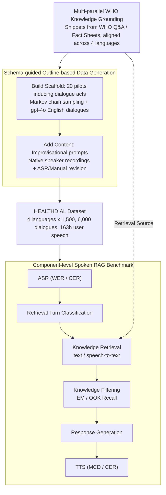

# Dial HEALTHDIAL for Advice: A Multilingual and Multi-Parallel Spoken Dialogue Dataset for Knowledge-Grounded Information Seeking

**Conference**: ACL2026 Findings  
**arXiv**: [2605.30107](https://arxiv.org/abs/2605.30107)  
**Code**: https://github.com/cambridgeltl/healthdial  
**Area**: Spoken Dialogue / Multilingual RAG  
**Keywords**: spoken dialogue, multilingual benchmark, health RAG, WHO knowledge, ASR

## TL;DR
HEALTHDIAL introduces a dataset comprising 6,000 multi-parallel health information-seeking dialogues across 4 official WHO languages, featuring 163 hours of authentic user speech. It establishes a multilingual spoken RAG benchmark encompassing ASR, TTS, retrieval, knowledge filtering, and user studies.

## Background & Motivation
**Background**: Most dialogue system research remains text-centric. Even systems supporting voice often adopt a modular pipeline (ASR → Text Dialogue Model → TTS). Existing multilingual dialogue datasets typically cover tourism, casual conversation, or task-oriented text, lacking support for authentic speech, knowledge grounding, multi-parallel structures, and speaker metadata.

**Limitations of Prior Work**: While speech is the most natural form of communication, constructing speech-first dialogue datasets entails high costs and privacy risks. Authentic patient consultations contain personal health information (PHI), making direct collection risky. Without high-quality spoken dialogue data, evaluating future speech-native or multilingual RAG systems is challenging.

**Key Challenge**: The research community requires authentic and natural multilingual spoken dialogues, but real health consultation data cannot be public. Fully machine-generated dialogues tend to be repetitive and lack natural oral variation, while purely translated data produces "translationese," undermining the naturalness of each language.

**Goal**: The authors aim to construct a dataset that is multilingual, multi-parallel, and knowledge-grounded, containing authentic user speech and sociolinguistic speaker variables. Additionally, they provide baselines, a prototype system, and a reusable data collection toolkit.

**Key Insight**: This paper adopts a bottom-up, outline-based data collection approach. It constructs a controlled knowledge base from WHO resources, derives dialogue schemas via pilot dialogues and Markov chains, and then allows native speakers to naturally implement user utterances based on improvisational prompts rather than simple reading or translation of LLM outputs.

**Core Idea**: Content control and linguistic naturalness are decoupled: LLMs and schemas control dialogue structure and knowledge grounding, while native speakers provide natural oral expressions and recordings.

## Method

### Overall Architecture
HEALTHDIAL is both a dataset and a benchmark. It addresses the challenge of creating a knowledge-grounded, multilingual, and multi-parallel resource with authentic user speech when real health data is restricted. The core mechanism separates "content control" from "linguistic naturalness"—using WHO knowledge and dialogue schemas to control structure while native speakers flesh out the "skeleton" into natural oral speech. Data collection follows four steps: extracting knowledge snippets with parallel tags from WHO Q&A and Fact Sheets, inducing dialogue acts from 20 pilot text consultations, sampling dialogue skeletons via Markov chains filled by GPT-4o, and finally delivering improvisational prompts to native speakers for recording and transcription. It covers Arabic, Chinese, English, and Spanish (1,500 dialogues each), totaling 6,000 dialogues, 41,988 turns, ~163 hours of user speech, and 208 hours of system speech. Each system turn is explicitly linked to a WHO knowledge snippet. The benchmark evaluates ASR, retrieval turn classification, knowledge retrieval, knowledge filtering, response generation, and TTS components individually.

### Key Designs

**1. Multi-parallel WHO Knowledge Grounding: Anchoring Responses to Verifiable Knowledge**
Health dialogues risk hallucinations if models rely on unconstrained parametric knowledge. HEALTHDIAL constrains all system responses to a controlled knowledge base of 12,045 snippets (Arabic: 2,317, Chinese: 2,431, English: 4,785, Spanish: 2,512) sourced from WHO Q&A and Fact Sheets. 1,618 snippets are fully parallel across all four languages, aligned via parallel identifiers. This allows for an operational definition of hallucinations—any response not supported by the KB is an extrinsic hallucination—and enables the evaluation of out-of-knowledge (OOK) scenarios.

**2. Schema-guided Outline-based Data Generation: Building the Scaffold Before Adding Content**
End-to-end LLM generation often lacks variety, while machine translation introduces translationese. The authors use a bottom-up outline method: inducing 11 types of dialogue acts from 20 pilot dialogues, sampling 1,500 act sequences using a first-order Markov chain, and generating hypothetical English dialogues using GPT-4o and WHO snippets. Crucially, user utterances are converted into improvisational prompts, which native speakers then record as natural speech. This ensures cross-lingual comparability while preserving natural oral morphology.

**3. Component-level Spoken RAG Benchmark: Diagnosing Modular Failures**
Since current speech-native models are not yet robust, end-to-end scores fail to explain specific failure points. HEALTHDIAL provides customized metrics for each pipeline stage: WER/CER for ASR, MCD and ASR-based CER for TTS, accuracy for retrieval turn classification, and both text-to-text and speech-to-text metrics for knowledge retrieval. Knowledge filtering is evaluated using Exact Match (EM) and OOK Recall, identifying whether the bottleneck lies in ASR accuracy, cross-modal retrieval, or deductive filtering.

### Loss & Training
The paper focuses on the dataset and benchmark rather than new loss functions. Baselines for components include fine-tuned XLM-R_large and LLaMA3.1-8B-Inst for turn classification. Knowledge retrieval baselines include text-embedding-3L, gte-multilingual-B, MiniLM-L12-v2, NV-Embed-v2, and BM25, along with CLAP and SpeechT5 for speech-to-text. Knowledge filtering compares fixed thresholds, GPT-4o versions, and LLaMA3.1. TTS uses gpt-4o-mini-tts conditioned on speaker variables like age and primary language.

## Key Experimental Results

### Main Results

| Language | ASR WER ↓ | ASR CER ↓ | TTS MCD ↓ | TTS CER ↓ | Turn Cls. Acc. ↑ | R@10 (Text) ↑ | R@10 (Speech) ↑ | Filtering EM ↑ | OOK Recall ↑ |
|:---|:---:|:---:|:---:|:---:|:---:|:---:|:---:|:---:|:---:|
| Arabic | 0.23 | 0.07 | 12.08 | 0.10 | 95.39 | 65.88 | 0.20 | 34.27 | 0.00 |
| Chinese | 0.24 | 0.14 | 11.46 | 0.17 | 95.23 | 70.63 | 0.23 | 39.19 | 14.29 |
| English | 0.03 | 0.01 | 11.44 | 0.06 | 96.30 | 75.72 | 0.52 | 44.29 | 42.86 |
| Spanish | 0.02 | 0.01 | 10.84 | 0.07 | 95.93 | 71.82 | 0.42 | 39.54 | 14.29 |
| **Average** | 0.13 | 0.06 | 11.46 | 0.10 | 95.71 | 71.01 | 0.34 | 39.32 | 17.36 |

### Ablation Study

| Knowledge Filtering Method | Arabic EM | Chinese EM | English EM | Spanish EM | Average EM | Note |
|:---|:---:|:---:|:---:|:---:|:---:|:---|
| Threshold | 6.26 | 6.61 | 6.88 | 6.46 | 6.55 | Fixed similarity threshold; poor performance |
| LLM @ Top-5 | 19.96 | 19.86 | 23.02 | 21.09 | 21.05 | gpt-4.1-nano filtering; best average |
| LLM @ Top-10 | 12.58 | 17.15 | 23.33 | 19.55 | 18.15 | More distractors; performance drop |
| LLM @ Top-50 | 10.85 | 12.28 | 18.72 | 11.03 | 13.72 | Long candidate lists significantly hurt EM |

### Key Findings
- ASR is robust for English and Spanish but significantly more difficult for Arabic and Chinese (WER $0.23$-$0.24$ vs $0.02$-$0.03$).
- Text-to-text retrieval far outperforms speech-to-text retrieval. The average R@10 (Speech) is only $0.34$, indicating that current cross-modal speech-text retrieval is nearly unusable.
- Retrieval turn classification is relatively straightforward, with accuracy around $95\%$ across languages, partly because $75.5\%$ of turns require retrieval.
- Knowledge filtering is a high-value bottleneck. Even using GPT-4.1-nano on top-5 candidates yields only $21.05$ EM; expanding to top-50 reduces this further.
- English consistently performs best across components while Arabic is the weakest. This gap persists in a fully parallel setting, suggesting systemic issues in model representation rather than data inconsistency.

## Highlights & Insights
- HEALTHDIAL's data design is meticulous, satisfying multilingual, multi-parallel, knowledge-grounded, and speaker metadata requirements simultaneously.
- The outline-based collection method is a methodological highlight, bypassing PHI concerns while avoiding the robotic nature of pure LLM dialogues.
- The component-level benchmark is pragmatic, acknowledging the instability of speech-native models by isolating failures in ASR, retrieval, filtering, and TTS.
- A critical insight from the filtering experiments is that "more is not better"—providing more retrieved snippets to the LLM introduces distractors that sharply decrease filtering accuracy.

## Limitations & Future Work
- Content is LLM-assisted and not validated by medical professionals; it remains a linguistic resource for dialogue research rather than a source of clinical advice.
- While the WHO KB ensures authority and parallelism, it lacks local cultural adaptation (e.g., traditional medicine or regional health practices).
- The current benchmark still uses a pipeline architecture, which might not fully represent future end-to-end speech-native systems.
- User studies were limited to 25 English speakers; large-scale multilingual evaluations for usability and trust are needed.

## Related Work & Insights
- **vs. MultiWOZ / Multi3WOZ**: These are primarily text-based; HEALTHDIAL adds authentic user speech, health grounding, and sociolinguistic variables.
- **vs. MedDialog**: Medical forums are realistic but noisy with high PHI risk. HEALTHDIAL trades clinical realism for public, multi-parallel, and controllable grounding.
- **vs. Common Voice**: These provide speaker metadata but lack multi-turn knowledge-grounded dialogue tasks.
- **vs. RAG Benchmarks**: Traditional RAG focuses on text; HEALTHDIAL integrates spoken input, turn classification, and knowledge filtering into the evaluation system.

## Rating
- Novelty: ⭐⭐⭐⭐⭐ 
- Experimental Thoroughness: ⭐⭐⭐⭐☆ 
- Writing Quality: ⭐⭐⭐⭐⭐ 
- Value: ⭐⭐⭐⭐⭐ 

<!-- RELATED:START -->

## Related Papers

- [\[ACL 2026\] VoxMind: An End-to-End Agentic Spoken Dialogue System](voxmind_an_end-to-end_agentic_spoken_dialogue_system.md)
- [\[ACL 2026\] SDiaReward: Modeling and Benchmarking Spoken Dialogue Rewards with Modality and Colloquialness](sdiareward_modeling_and_benchmarking_spoken_dialogue_rewards_with_modality_and_c.md)
- [\[ACL 2026\] ZipVoice-Dialog: Non-Autoregressive Spoken Dialogue Generation with Flow Matching](zipvoice-dialog_non-autoregressive_spoken_dialogue_generation_with_flow_matching.md)
- [\[ICML 2025\] Aligning Spoken Dialogue Models from User Interactions](../../ICML2025/audio_speech/aligning_spoken_dialogue_models_from_user_interactions.md)
- [\[ACL 2026\] Full-Duplex-Bench-v2: A Multi-Turn Evaluation Framework for Duplex Dialogue Systems with an Automated Examiner](full-duplex-bench-v2_a_multi-turn_evaluation_framework_for_duplex_dialogue_syste.md)

<!-- RELATED:END -->
