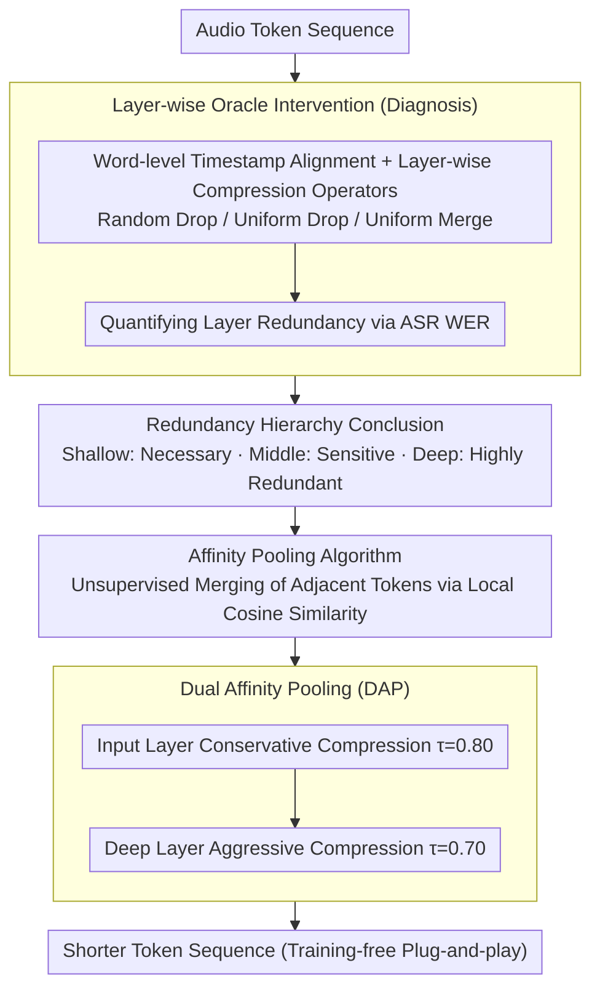

# Do We Need Distinct Representations for Every Speech Token? Unveiling and Exploiting Redundancy in Large Speech Language Models

**Conference**: ACL 2026 Findings  
**arXiv**: [2604.06871](https://arxiv.org/abs/2604.06871)  
**Code**: [https://xchen-zero.github.io/speech-token-redundancy/](https://xchen-zero.github.io/speech-token-redundancy/)  
**Area**: Audio & Speech / LLM Efficiency  
**Keywords**: Large Speech Language Models, token redundancy, token compression, Affinity Pooling, inference acceleration

## TL;DR
This paper reveals the structured redundancy hierarchy of speech token representations in Large Speech Language Models (LSLMs) through layer-wise oracle intervention experiments—where shallow layers encode essential acoustic details while deep layers are extremely redundant—and proposes Affinity Pooling, a training-free similarity-based token merging mechanism that reduces FLOPs by 27.48% while maintaining competitive accuracy.

## Background & Motivation

**Background**: LSLMs (e.g., Qwen2-Audio, Kimi-Audio) handle audio through high token rates (12.5-25 tokens/s) to ensure acoustic fidelity, but the resulting sequences are significantly longer than their semantic content. While the Vision-Language Model (VLM) community has extensively studied token compression, compression in LSLMs remains under-explored.

**Limitations of Prior Work**: High token rates force the LLM backbone to process a large volume of redundant tokens, leading to significant and unnecessary computational overhead. Most existing speech compression methods are either directly borrowed from VLMs (e.g., operations on spectrograms) or applied to specific architectures, lacking a systematic understanding of the internal redundancy distribution in LSLMs.

**Key Challenge**: The information density of speech is highly non-uniform over time—meaningful semantic changes occur much slower than the token rate—yet existing methods treat all tokens across all layers uniformly. More importantly, it remains unclear how redundancy is distributed across different layers, which hinders the design of principled compression strategies.

**Goal**: (1) Systematically dissect the redundancy distribution across LSLM layers through controlled experiments; (2) Design a principled, training-free token compression algorithm based on these findings.

**Key Insight**: Using word-level timestamps as an Oracle, align audio token streams with semantic units and perform dropout/merging interventions at specific layers. The degree of redundancy is quantified by measuring the change in Word Error Rate (WER) on ASR tasks. This provides an experimental foundation for compression decisions rather than relying on purely empirical design.

**Core Idea**: Preserve shallow layers, keep middle layers intact, and aggressively compress deep layers—leveraging cosine similarity between tokens for adaptive merging (Affinity Pooling), enabling significant reductions in inference cost without training.

## Method

### Overall Architecture
The problem addressed is that LSLMs utilize high token rates for acoustic fidelity, resulting in sequences much longer than their semantic content, yet where this redundancy is hidden and how much can be compressed has not been systematically quantified. The authors adopt a two-step "diagnose then compress" approach. In the diagnosis phase, the audio token stream is aligned to semantic units using word-level timestamps, and layer-wise oracle interventions are performed to quantify the hierarchical structure of redundancy—shallow layers encode essential acoustic details, middle layers are critical acoustic-to-semantic transition zones (sensitive), and deep layers are extremely redundant. In the application phase, Dual Affinity Pooling is designed based on these findings: using training-free merging operators based on cosine similarity to compress at the input layer and deep layers, both of which were identified as safe during diagnosis. The input is an audio token sequence, and the output is a shorter token sequence, operating as a plug-and-play module without modifying model parameters.

### Key Designs

**1. Layer-wise Oracle Intervention: Turning "which layer can be compressed" into a measurable problem**

To achieve principled compression, one cannot simply apply VLM schemes that treat all layers equally—speech has its own temporal locality and acoustic-semantic transitions. The authors first utilize the Montreal Forced Aligner to obtain word-level timestamps, aligning audio tokens to semantic units. Interventions are then performed every 5 layers by applying three compression operators (random drop, uniform drop, uniform merge) to each semantic unit, compressing them to $R$ tokens. The redundancy is measured by the WER in ASR tasks. The comparison of these three operators not only shows "how much" can be compressed but also reveals the structural nature of the redundancy. These controlled experiments provide empirical evidence for the compression strategy.

**2. Affinity Pooling Algorithm: Unsupervised merging of adjacent redundant tokens via local cosine similarity**

The information density of speech is extremely non-uniform, and adjacent tokens are often nearly identical. Affinity Pooling maintains a current group $\mathcal{G}_{curr}$ along the token sequence. For each new token $h_t$, it calculates the maximum cosine similarity $s_{\max}$ between $h_t$ and the most recent $\omega$ tokens in the group. If $s_{\max} \geq \tau$, $h_t$ is merged into the current group; otherwise, the current group is mean-pooled into a single token, and a new group begins. Key hyperparameters include the lookback window $\omega$ (default 3) and the threshold $\tau$. Unlike global bipartite matching in ToMe for vision, speech has strict temporal locality, so comparisons are restricted to a local window. Setting $\omega > 1$ (rather than just the immediate neighbor) improves robustness against high-frequency acoustic jitter. Notably, this unsupervised merging outperforms Oracle merging based on supervised word boundaries, suggesting that the model's internal similarity structure is more aligned with the essence of compression than linguistic boundaries.

**3. Dual Affinity Pooling (DAP): Stacking gains by compressing at two safe windows**

The diagnosis experiments conclude that middle layers should not be touched, but the input and deep layers are safe. Since single-point compression offers limited gains, DAP applies compression at two locations: the input layer $l_{\text{in}}$ with a conservative threshold (e.g., $\tau=0.80$, where some redundancy exists) and a deep layer $l_{\text{deep}}$ with an aggressive threshold (e.g., $\tau=0.70$, where redundancy is extreme). By bypassing sensitive middle layers and compressing in two safe zones, the overall compression rate is higher than any single-point scheme.

### Loss & Training
Completely training-free. Affinity Pooling acts as a plug-and-play module inserted into specific layers during inference without modifying any model parameters.

## Key Experimental Results

### Main Results (Qwen2-Audio)

| Method | Final Retention Rate | FLOPs Ratio | ASR WER↓ | QA Acc↑ | ST BLEU↑ |
|------|-----------|----------|----------|---------|----------|
| Vanilla | 100% | 100% | 2.94 | 30.41 | 32.91 |
| AP_in only | 78.64% | 78.49% | 2.94 | 30.31 | 32.52 |
| DAP (Conservative) | — | 72.52% | 2.91 | 30.89 | 32.33 |
| DAP (Aggressive) | — | — | 3.07 | 29.98 | 32.15 |

### Ablation Study

| Compression Position | Retention Rate | WER | Description |
|---------|--------|-----|------|
| Input Layer only (τ=0.80) | 78.64% | 2.94 | Lossless |
| Deep Layer only l=30 (τ=0.70) | 14.30% | — | Deep layers highly redundant |
| Deep Layer only l=30 (τ=0.60) | 5.18% | 1.64 | Compressing to 5% still below baseline WER |
| Middle Layer l=5 (τ=0.60) | — | High | Middle layers sensitive, unsuitable for compression |

### Key Findings
- Redundancy is hierarchically distributed: shallow layers encode fine-grained acoustic details, middle layers undergo critical acoustic-to-semantic transitions (high sensitivity), and deep layers are extremely redundant.
- At layer $l=30$ of Qwen2-Audio ($\tau=0.60$), the sequence can be compressed to only 5.18% while still achieving a WER of 1.64% (better than the baseline 1.65%), proving extreme redundancy in deep layer tokens.
- Affinity Pooling at the input layer outperforms Oracle methods (1.99% vs 2.50% WER), indicating that intrinsic similarity captures essential information better than supervised alignment.
- Actual deployment achieves approximately 1.7× memory savings and 1.1× TTFT acceleration on long audio.

## Highlights & Insights
- **Diagnosis-driven Method Design**: The compression strategy is designed after understanding the redundancy structure through systematic controlled experiments. This "understand first, act later" methodology is more convincing than directly testing various compression schemes and reveals generalizable insights.
- **Discovery of Lossless 5% Retention in Deep Layers**: This extreme result suggests that the information capacity of LLM embeddings is far from fully utilized; a single vector could theoretically encode information from over 1500 tokens. This provides theoretical space for more aggressive compression strategies.
- **Unsupervised Better than Supervised**: The fact that Affinity Pooling based on intrinsic similarity outperforms Oracle merging based on word boundaries suggests that internal semantic grouping of the model may be more suitable for compression than linguistically defined groupings.

## Limitations & Future Work
- Only validated on semantic understanding tasks (ASR, QA, translation); tasks with high acoustic fidelity requirements (e.g., speaker identification, emotion detection) were not tested.
- Threshold $\tau$ and window $\omega$ require manual adjustment based on the model and task.
- Validated only on Qwen2-Audio and Kimi-Audio; applicability to other LSLM architectures remains unknown.
- Possibility of integrating compression awareness into the training process (e.g., compression-aware fine-tuning) was not explored.

## Related Work & Insights
- **vs ToMe (Token Merging)**: ToMe uses global bipartite graph matching, which is suitable for the spatial distribution of vision tokens; Affinity Pooling strictly maintains temporal locality, making it more suitable for the sequential structure of speech.
- **vs SpeechPrune**: SpeechPrune uses attention-guided pruning based on empirical design; this paper provides a theoretical basis through diagnostic experiments and uses a simpler method (cosine similarity).
- **vs VLM Token Compression**: VLM methods primarily compress visual tokens at the input layer; this paper reveals that the deep layer is also an important compression point with even greater returns.

## Rating
- Novelty: ⭐⭐⭐⭐ First systematic dissection of layer-wise redundancy in LSLMs; the diagnosis-driven design methodology is highly commendable.
- Experimental Thoroughness: ⭐⭐⭐⭐⭐ Layer-wise interventions, multiple compression operators, multi-model validation, and real-world deployment measurements make the experimental design very systematic.
- Writing Quality: ⭐⭐⭐⭐⭐ A complete narrative from diagnosis to method to validation with highly informative charts.
- Value: ⭐⭐⭐⭐ High practical value with a 27%+ reduction in FLOPs without training; findings on redundancy hierarchy provide broad inspiration for the community.

<!-- RELATED:START -->

## Related Papers

- [\[ACL 2026\] Closing the Modality Reasoning Gap for Speech Large Language Models](closing_the_modality_reasoning_gap_for_speech_large_language_models.md)
- [\[ACL 2026\] VAPO: End-to-end Slide-Enhanced Speech Recognition with Omni-modal Large Language Models](vapo_end-to-end_slide-enhanced_speech_recognition_with_omni-modal_large_language.md)
- [\[ACL 2026\] Temporal Contrastive Decoding: A Training-Free Method for Large Audio-Language Models](temporal_contrastive_decoding_a_training-free_method_for_large_audio-language_mo.md)
- [\[ACL 2026\] MTR-DuplexBench: Towards a Comprehensive Evaluation of Multi-Round Conversations for Full-Duplex Speech Language Models](mtr-duplexbench_towards_a_comprehensive_evaluation_of_multi-round_conversations_.md)
- [\[ACL 2026\] FC-TTS: Style and Timbre Control in Zero-Shot Text-to-Speech with Disentangled Speech Representations](fc-tts_style_and_timbre_control_in_zero-shot_text-to-speech_with_disentangled_sp.md)

<!-- RELATED:END -->
