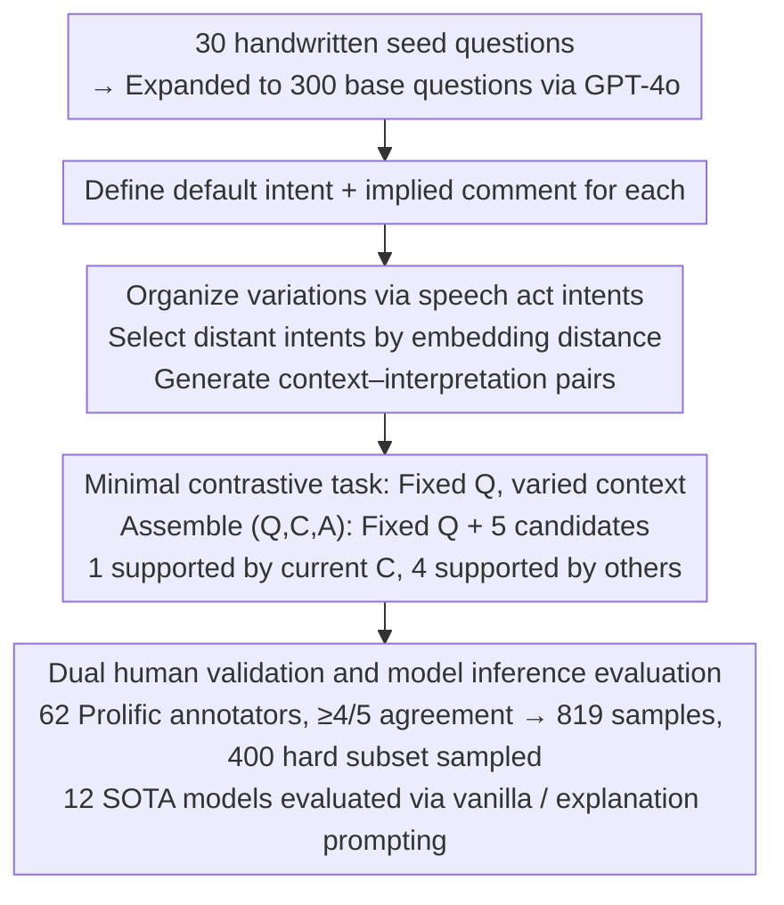

# DRInQ: Evaluating Conversational Implicature with Controlled Context Variation

**Conference**: ACL 2026  
**arXiv**: [2605.24267](https://arxiv.org/abs/2605.24267)  
**Code**: https://github.com/hjarai/drinq  
**Area**: Pragmatic Inference / LLM Evaluation  
**Keywords**: Conversational implicature, pragmatic inference, context control, speech acts, LLM evaluation

## TL;DR
DRInQ constructs a conversational implicature evaluation set by fixing question surface forms and systematically varying contexts. It discovers that while LLMs can generate plausible pragmatic scenarios, they often over-interpret context during inference, resulting in lower consistency compared to human judgment.

## Background & Motivation
**Background**: Human conversation relies heavily on conversational implicature—implicit meanings not explicitly stated but triggered by context, politeness principles, social relationships, and shared knowledge. Existing LLMs are proficient in surface semantics, social common sense, and fluent dialogue, yet remain unstable in determining exactly what an utterance implies in a specific scenario.

**Limitations of Prior Work**: Existing pragmatic benchmarks often use coarse-grained labels (e.g., literal vs. non-literal) or focus on explicit phenomena like irony, metaphor, presuppositions, or scalar implicature. These resources struggle to isolate variations where the "same question yields different meanings due to different contexts," making it difficult to discern whether model errors stem from misunderstanding the question, ignoring context, or over-extending contextual details.

**Key Challenge**: Conversational implicature must depend on context without the context explicitly stating the answer. Data construction must simultaneously satisfy three criteria: the context must support a unique interpretation, distractors must be plausible in other contexts, and variation factors must be pragmatically relevant rather than random paraphrasing. This makes large-scale manual construction costly.

**Goal**: The authors propose DRInQ, a multiple-choice task involving question-context-interpretation to evaluate whether models can recover the implicit intent of a question utterance from context. They also compare model-generated data with human-written data to analyze the discrepancy in LLM capabilities between pragmatic scenario construction and pragmatic inference.

**Key Insight**: The paper focuses on question utterances because questions frequently serve non-literal functions, such as requests, rebukes, invitations, comfort, or irony. The authors use speech acts as intent labels to organize contextual changes into controllable dimensions rather than relying solely on free-form generation.

**Core Idea**: By keeping the question $Q$ constant and only varying the context $C$, and designing each candidate interpretation to be a plausible meaning for the same question in a different context, the task specifically tests the model's ability to calibrate "which implicit meaning the context actually supports."

## Method

### Overall Architecture
DRInQ does not test whether models understand common sense, but whether they can calibrate "what this sentence actually implies" within a context. To isolate pragmatic inference from confounding factors, each sample fixes a question, provides a context, and offers five candidate implied comments. Only one is supported by the current context; the other four are valid interpretations of the same question in different contexts. Thus, the model cannot succeed via surface heuristics of the question or options but must weigh the strength of contextual evidence. The construction pipeline starts with 30 manual seed questions, expanded to 300 base questions using GPT-4o. For each, a default intent and comment are defined, then distinct intents are selected from 23 speech act labels to generate context-interpretation pairs. These are converted into multiple-choice questions for Prolific annotators, retaining samples with at least 4/5 agreement to form a final benchmark of 400 hard samples.

### Key Designs

**1. Organizing Pragmatic Variation via Speech Act Intents: Ensuring Differences Represent "Doing Different Things" Rather Than Random Paraphrasing**

If contexts are merely arbitrary paraphrases, coverage is neither controllable nor granular enough to ensure variations fall along the "pragmatic" dimension. The authors utilize 23 representative act verbs based on Searle’s speech act theory (Directive, Assertive, Commissive, Expressive) as intent labels. For each question, they rank other intents by embedding distance from the default interpretation and select those with large semantic gaps to generate new contexts. Consequently, each variation corresponds to the speaker performing a different communicative act (requesting, rebuking, inviting, warning, etc.), making generation controllable while systematically covering fine-grained pragmatic functions.

**2. Minimal Contrastive Task with Fixed Questions and Varied Contexts: Making Context the Sole Variable**

The difficulty in evaluating conversational implicature lies in its contextual dependence without being explicitly stated. In standard multiple-choice formats, models often guess correctly based on option saliency or question templates. DRInQ formats each instance as $(Q,C,A)$—where $Q$ is a fixed question, $C$ is the current context, and $A$ consists of five candidate interpretations. Crucially, incorrect options are not random distractors but implied comments of the same $Q$ in other contexts. Since all candidates are pragmatically plausible for $Q$, the model must rely entirely on contextual evidence strength, mimicking real-world pragmatic disambiguation and allowing errors to be attributed to misjudging contextual force.

**3. Dual Evaluation via Human Validation and Model Inference: Filtering Unreliable Samples and Exposing Generation-Inference Asymmetry**

Pragmatic meanings are naturally ambiguous; a single gold label can be over-determined, and data purely generated and evaluated by models lacks credibility. The authors engaged 62 pre-screened Prolific annotators, retaining 819 samples with at least 4/5 agreement and constructing a 400-sample "hard subset." Twelve SOTA models were evaluated, comparing vanilla few-shot to explanation prompting. Additionally, a human-writing study involved 16 authors and GPT-4o to provide a quality control comparison. Human consensus filters out unreliable samples while exposing a systematic asymmetry: LLMs can "generate a decent pragmatic scenario" but fail to "recover the appropriate meaning in scenarios written by others."

### Loss & Training
The paper does not train new models; the core involves data generation, human validation, and prompting evaluation. During generation, GPT-4o produces context-interpretation pairs and is instructed to abstain from unreasonable question-intent combinations. Inference evaluation uses few-shot prompts: the vanilla condition provides 3 in-context examples, while the explanation condition requires a short justification before selecting an answer. Four prompt interventions—conservative, charitable, reasoning, and all—were designed to suppress over-inference and malicious intent attribution.

## Key Experimental Results

### Main Results

| Dataset / Setting | Metric | Ours | Comparison | Note |
|--------|------|------|----------|------|
| DRInQ Construction | base questions / intents | 300 / 23 | 30 seed questions | Each question linked to ≥5 intents |
| Human Validation | Retained samples | 819 | ≥4/5 annotator agreement | Forms the validated pool |
| Benchmark | hard subset | 400 | Low model consistency/disputed | Primary evaluation set |
| hard subset | Human Avg | 0.88 ± 0.10 | SOTA LLM ~0.56-0.67 | Humans significantly lead |
| hard subset | Best Model | OpenAI-o3: 0.67 ± 0.02/0.03 | GPT-4o: 0.62/0.63 | Explanations yield limited gain for large models |

### Ablation Study

| Configuration | Key Metric | Note |
|------|---------|------|
| GPT-5-Nano prompting | 41% -> 73% | Structural prompts help small models most |
| GPT-5-Mini prompting | 71% -> 81% | Reasoning scaffold narrows gap with strong models |
| GPT-4o prompting | ~82% ceiling | Large models are less sensitive to prompt intervention |
| LLM Gen vs Human Writing | LLM novelty 37%, human 22%, tie 40% | LLMs generate more novel scenarios; humans are conservative |
| Human consensus vs generated label | Standard sample 81%, validated 67%, hard baseline 27% | Hard samples capture more model/human disagreement |

### Key Findings
- The primary error of LLMs is not a total lack of semantic understanding, but poor calibration of inference strength. They tend to amplify negative details into malicious intents or mistake a possible interpretation for the only interpretation.
- Human annotators tend to provide more charitable interpretations unless context explicitly supports malice or rebuke; models are more likely to select overly strong or negative options.
- Prompt interventions are effective for small models, suggesting some errors can be mitigated by reasoning constraints; however, gains for strong models are limited, indicating pragmatic calibration is not just a formatting issue.
- Regarding data generation, LLM-generated scenarios exhibit more variation and novelty, but sometimes produce implied comments that are too explicit or exceed contextual support. Human contexts are safer and more predictable but can be underspecified.

## Highlights & Insights
- The task design is clever: by fixing the question and varying only the context, it locates whether a model truly understands the scenario better than standard pragmatic multiple-choice tests.
- The paper operationalizes "conversational implicature" from an abstract linguistic concept into a scalable generation pipeline; speech act labels serve as practical tools for controlling diversity.
- "Generation-inference asymmetry" is a significant observation. A model's ability to generate a plausible pragmatic scenario does not guarantee the ability to recover appropriate meanings in scenarios created by others.
- Error analysis provides insights for safety evaluation: model over-attribution of malice or hidden intents could impact scenarios like customer service, psychological support, or content moderation where cautious intent understanding is required.

## Limitations & Future Work
- The multiple-choice format is a diagnostic proxy and does not fully measure real-world dialogue capability. True pragmatic understanding should involve generating appropriate responses or maintaining uncertainty.
- Fixed candidate interpretations may obscure other valid meanings. 4/5 agreement does not mean the remaining interpretation is strictly "wrong."
- The data is English-centric and reflects the cultural/linguistic backgrounds of Prolific annotators. Generalization to low/high-context cultures or non-English communities is limited.
- Intent-conditioned generation places GPT-4o in the production chain, potentially introducing model-specific stylistic biases. Future work could include uncertainty modeling, open-ended evaluation, and cross-cultural annotation.

## Related Work & Insights
- **vs IMPRES / GRICE**: These datasets also focus on implicature or presupposition but lean toward linguistic phenomena and rule-based control; DRInQ emphasizes fine-grained pragmatic differences for the same question under varying contexts.
- **vs FLUTE**: FLUTE covers irony, metaphor, and idioms; DRInQ focuses on the communicative function of interrogative sentences, making it closer to indirect expressions in daily conversation.
- **vs Social Common Sense Benchmarks**: Social common sense tasks often ask "what happens next" or "how does the character feel," whereas DRInQ asks what communicative act the speaker is performing via a question.
- **Insights for LLM Evaluation**: Future evaluations should look not just at whether a model provides a plausible interpretation, but whether it recognizes when an interpretation is "insufficiently supported by evidence."

## Rating
- Novelty: ⭐⭐⭐⭐☆ The fixed-question, context-controlled design is highly distinctive, and speech-act-organized generation is practical.
- Experimental Thoroughness: ⭐⭐⭐⭐☆ Includes data validation, 12 models, prompt interventions, human-machine writing comparisons, and error analysis, though limited by the multiple-choice format.
- Writing Quality: ⭐⭐⭐⭐☆ Motivation and error patterns are clearly articulated, though some summary statistics may require careful reading to match specific table splits.
- Value: ⭐⭐⭐⭐☆ Direct reference value for pragmatic inference, LLM dialogue evaluation, and intent calibration in safety-critical scenarios.

<!-- RELATED:START -->

## Related Papers

- [\[ACL 2025\] Does Your Voice Assistant Remember? Analyzing Conversational Context Recall and Utilization in Voice Interaction Models](../../ACL2025/audio_speech/does_your_voice_assistant_remember_analyzing_conversational_context_recall_and_u.md)
- [\[ACL 2026\] Multimodal In-Context Learning for ASR of Low-Resource Languages](multimodal_in-context_learning_for_asr_of_low-resource_languages.md)
- [\[ACL 2026\] Still Between Us? Evaluating and Improving Voice Assistant Robustness to Third-Party Interruptions](still_between_us_evaluating_and_improving_voice_assistant_robustness_to_third-pa.md)
- [\[ICML 2026\] Algorithmic Recourse of In-Context Learning for Tabular Data](../../ICML2026/audio_speech/algorithmic_recourse_of_in-context_learning_for_tabular_data.md)
- [\[ACL 2026\] S2S-Arena: Evaluating Paralinguistic Instruction Following in Speech-to-Speech Models](s2s-arena_evaluating_paralinguistic_instruction_following_in_speech-to-speech_mo.md)

<!-- RELATED:END -->
