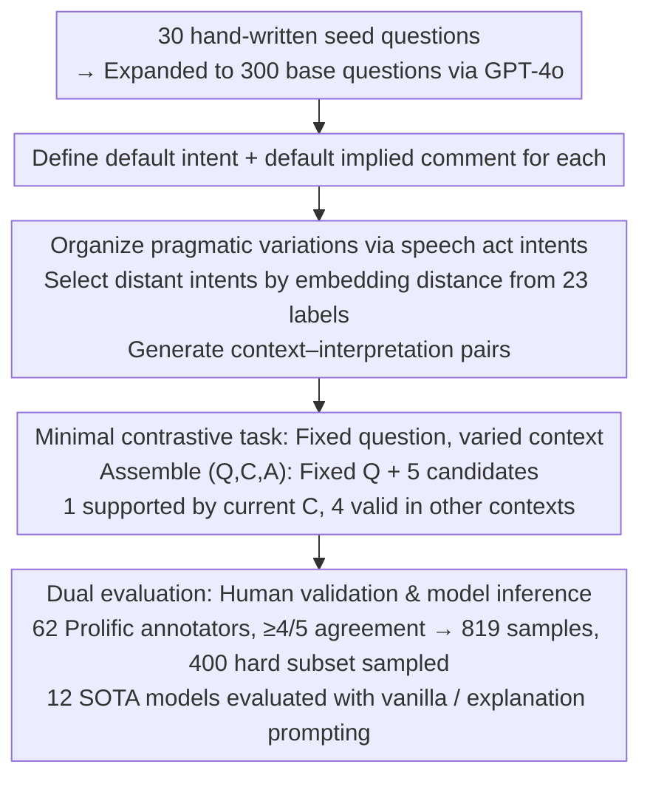

# DRInQ: Evaluating Conversational Implicature with Controlled Context Variation

**Conference**: ACL 2026  
**arXiv**: [2605.24267](https://arxiv.org/abs/2605.24267)  
**Code**: https://github.com/hjarai/drinq  
**Area**: Pragmatic Inference / LLM Evaluation  
**Keywords**: Conversational Implicature, Pragmatic Inference, Context Control, Speech Acts, LLM Evaluation

## TL;DR
DRInQ constructs a conversational implicature evaluation set by fixing question surface forms and systematically varying contexts; it finds that while LLMs can generate plausible pragmatic scenarios, they often over-interpret context during inference, performing below human judgment consistency.

## Background & Motivation
**Background**: Human conversation relies heavily on conversational implicature—implicit meanings not explicitly stated but triggered by context, politeness principles, social relationships, and common knowledge. Existing LLMs are already strong in surface semantics, social common sense, and fluent dialogue, but remains unstable regarding "what this sentence actually implies in this specific scenario."

**Limitations of Prior Work**: Existing pragmatic benchmarks often use coarse-grained labels (e.g., literal / non-literal) or focus on explicit phenomena like irony, metaphor, presupposition, or scalar implicature. These resources struggle to isolate variations where "the same question yields different meanings due to different contexts," making it difficult to determine if model errors stem from misunderstanding the question, ignoring the context, or over-extending contextual details.

**Key Challenge**: Conversational implicature depends on context, yet the context must not explicitly state the answer. Data construction must simultaneously satisfy three conditions: the context sufficiently supports a unique interpretation, distractors are plausible in other contexts, and the variation factors are truly pragmatically relevant rather than random paraphrasing. This makes large-scale manual construction costly.

**Goal**: The authors propose DRInQ, a multiple-choice task using question-context-interpretation to evaluate whether models can recover the implicit intent of a question utterance from context. It also compares model-generated data with human-written data to analyze the differing capabilities of LLMs in pragmatic scenario construction versus pragmatic inference.

**Key Insight**: The paper focuses on question utterances because question forms frequently serve non-literal functions, such as requests, blame, invitations, comfort, or sarcasm. The authors use speech acts as intent labels to organize contextual variations into controllable dimensions rather than relying solely on free generation.

**Core Idea**: By keeping the question $Q$ constant and only varying the context $C$, and designing each candidate interpretation to be a plausible meaning of the same question in a different context, the task specifically tests the model's ability to calibrate "which implicit meaning the context actually supports."

## Method

### Overall Architecture
DRInQ does not test whether a model understands common sense, but whether it can calibrate "what this sentence actually implies" within a context. To isolate pragmatic inference from other confounding factors, each sample consists of a fixed question, a context, and 5 candidate implied comments. Only one is supported by the current context; the other four are valid interpretations of the same question in different contexts. This prevents models from taking shortcuts based on the question itself or option surface forms, forcing them to weigh the strength of contextual evidence. The data construction pipeline starts with 30 hand-written daily questions, expanded to 300 base questions by GPT-4o. For each question, a default intent and implied comment are established, then multi-set context-interpretation pairs are generated by selecting distant intents from 23 speech act labels. These are converted into multiple-choice questions validated by Prolific annotators (requiring $\ge 4/5$ agreement), finally sampling 400 hard instances as the benchmark.

### Key Designs

**1. Organizing Pragmatic Variation with Speech Act Intents: Ensuring differences are "doing different things"**
Arbitrary paraphrasing of context is neither controllable nor fine-grained enough to guarantee variations fall on the "pragmatic" dimension. The authors select 23 representative act verbs from Searle’s Speech Act Theory across four categories: Directive, Assertive, Commissive, and Expressive. For each question, they generate new contexts by picking intents with large embedding distances from the default. This ensures each variation corresponds to the speaker performing a different communicative act (request, blame, invitation, warning, complaint, etc.), making generation controllable and systematically covering fine-grained pragmatic functions.

**2. Minimal Contrastive Task with Fixed Question and Varied Context: Context as the sole variable**
The difficulty in evaluating conversational implicature lies in its contextual dependence without the context "spoiling" the answer. In standard multiple-choice sets, models often guess correctly based on option salience. DRInQ formats each instance as $(Q,C,A)$—where $Q$ is fixed, $C$ is the context, and $A$ consists of 5 candidate interpretations. Incorrect options are not random distractors but implied comments that would be correct for the same $Q$ in other contexts. Since all candidates are pragmatically plausible, the model must rely solely on the strength of contextual evidence, mimicking real-world pragmatic disambiguation.

**3. Dual Evaluation via Human Validation and Model Inference: Filtering unreliable samples and exposing generation-recognition asymmetry**
Pragmatic meaning is inherently ambiguous; a single gold label can be over-determined, and data generated and answered solely by models lacks credibility. 62 pre-screened Prolific annotators participated in validation, retaining 819 samples with at least 4/5 agreement to form a hard subset of 400. On the model side, 12 SOTA models were tested, comparing vanilla few-shot with explanation prompting. A separate human-authoring study with 16 participants compared human-written contexts with GPT-4o's. Human consensus filters unreliable samples while revealing a systematic asymmetry: LLMs can "generate a decent pragmatic scenario" but may not "recover the appropriate meaning in scenarios created by others."

### Loss & Training
The paper does not train new models; the core involves data generation, human validation, and prompting evaluation. During generation, GPT-4o produces context-interpretation pairs and is instructed to abstain on implausible question-intent combinations. Inference evaluation uses few-shot prompts: the vanilla condition provides 3 in-context examples, while the explanation condition requires a brief rationale before selecting an answer. Four prompt interventions (conservative, charitable, reasoning, all) were designed to suppress model over-inference and malicious intent attribution.

## Key Experimental Results

### Main Results

| Dataset / Setting | Metric | Ours | Comparison | Description |
|-----------|--------|------|------------|-------------|
| DRInQ Construction | base questions / intents | 300 / 23 | 30 hand-written seed questions | Each question linked to at least 5 different intents |
| Human Validation | Retained samples | 819 | At least 4/5 annotator agreement | Used to form validated pool |
| Benchmark | hard subset | 400 | Low model consensus or controversial samples | Used for main model evaluation |
| hard subset | Human Avg | $0.88 \pm 0.10$ | SOTA LLM approx. 0.56-0.67 | Humans still lead significantly |
| hard subset | Best Model | OpenAI-o3: $0.67 \pm 0.02/0.03$ | GPT-4o: 0.62/0.63 | Explanation yields limited gains for large models |

### Ablation Study

| Configuration | Key Metric | Description |
|---------------|------------|-------------|
| GPT-5-Nano prompting | 41% -> 73% | Structured prompts help small models most |
| GPT-5-Mini prompting | 71% -> 81% | Reasoning scaffold closes the gap with strong models |
| GPT-4o prompting | ~82% ceiling | Large models are less sensitive to prompt interventions |
| LLM Gen vs. Human Writing | LLM novelty 37%, human 22%, tie 40% | LLMs prefer novel scenarios; humans are more conservative |
| Human consensus vs. Gen label | Standard sample 81%, validated overall 67%, hard baseline 27% | Hard samples deliberately retain more model/human disagreement |

### Key Findings
- The primary error of LLMs is not a total lack of semantic understanding, but poor calibration of inference strength. They tend to amplify negative details in context into malicious intent or treat a possible explanation as the only explanation.
- Human annotators tend toward more "charitable" interpretations unless the context explicitly supports malice or blame; models are more likely to choose overly strong or negative options.
- Prompt interventions are effective for small models, suggesting some errors can be mitigated by reasoning constraints; however, gains for strong models are limited, indicating pragmatic calibration is not just a prompting format issue.
- In data generation, LLM-generated scenarios show more variety and novelty, but sometimes write implied comments that are too explicit or exceed contextual support. Human contexts are safer and more predictable but can be underspecified.

## Highlights & Insights
- Clever task design: Fixing the question and making context the sole variable allows for clearer localization of whether a model truly understands a scenario compared to standard pragmatic MCQ.
- The paper translates "conversational implicature" from an abstract linguistic concept into a scalable generation pipeline; speech act labels serve as practical tools for controlling data diversity rather than just theoretical decoration.
- The "generation-inference asymmetry" is a significant observation. A model's ability to generate a plausible pragmatic scenario does not imply it can recover appropriate meanings in others' scenarios like a human.
- Error analysis provides insights for safety evaluation: models over-attributing malice or over-reading hidden intents could impact scenarios like customer service, psychological support, or content moderation where cautious intent understanding is required.

## Limitations & Future Work
- The multiple-choice format serves only as a diagnostic proxy and does not fully measure real-world conversational competence. True pragmatic understanding should manifest in generating appropriate responses or maintaining uncertainty.
- Fixed candidate interpretations may overshadow other valid meanings. Even with 4/5 agreement, it does not mean the remaining interpretations are strictly incorrect.
- The data is English-centric and reflects the cultural/linguistic backgrounds of Prolific annotators. Conversational implicature depends heavily on cultural norms, limiting generalization to low/high-context cultures or non-English communities.
- Intent-conditioned generation places GPT-4o in the production chain, which may introduce model-specific stylistic biases. Future work could include stronger uncertainty modeling, open-ended generation evaluation, and cross-cultural annotation.

## Related Work & Insights
- **vs. IMPRES / GRICE**: These datasets also focus on implicature or presupposition but lean more toward linguistic phenomena and rule-based control; DRInQ emphasizes fine-grained pragmatic differences under contextual variation of the same question.
- **vs. FLUTE**: FLUTE covers figurative language like irony and metaphor; DRInQ focuses on the communicative function of interrogative sentences, closer to indirect expressions in daily dialogue.
- **vs. Social Commonsense benchmarks**: Social commonsense tasks often ask "what happens next" or "how does the character feel," whereas DRInQ requires judging what communicative act the speaker is performing via a question.
- **Insight for LLM Evaluation**: Future evaluation should not just check if a model provides a plausible interpretation, but whether it knows which interpretations are "insufficiently supported by evidence."

## Rating
- **Novelty**: ⭐⭐⭐⭐☆ The design of evaluating conversational implicature with fixed questions and controlled context is highly distinctive.
- **Experimental Thoroughness**: ⭐⭐⭐⭐☆ Includes data validation, 12 models, prompt interventions, human-AI writing comparisons, and error analysis, though limited by the MCQ format.
- **Writing Quality**: ⭐⭐⭐⭐☆ Task motivation and error patterns are clearly explained.
- **Value**: ⭐⭐⭐⭐☆ Directly relevant for pragmatic inference, LLM dialogue evaluation, and intent calibration in safety-critical scenarios.

<!-- RELATED:START -->

## Related Papers

- [\[ACL 2025\] Does Your Voice Assistant Remember? Analyzing Conversational Context Recall and Utilization in Voice Interaction Models](../../ACL2025/audio_speech/does_your_voice_assistant_remember_analyzing_conversational_context_recall_and_u.md)
- [\[ACL 2026\] Still Between Us? Evaluating and Improving Voice Assistant Robustness to Third-Party Interruptions](still_between_us_evaluating_and_improving_voice_assistant_robustness_to_third-pa.md)
- [\[ACL 2026\] Multimodal In-Context Learning for ASR of Low-Resource Languages](multimodal_in-context_learning_for_asr_of_low-resource_languages.md)
- [\[ACL 2026\] S2S-Arena: Evaluating Paralinguistic Instruction Following in Speech-to-Speech Models](s2s-arena_evaluating_paralinguistic_instruction_following_in_speech-to-speech_mo.md)
- [\[ICML 2026\] Algorithmic Recourse of In-Context Learning for Tabular Data](../../ICML2026/audio_speech/algorithmic_recourse_of_in-context_learning_for_tabular_data.md)

<!-- RELATED:END -->
