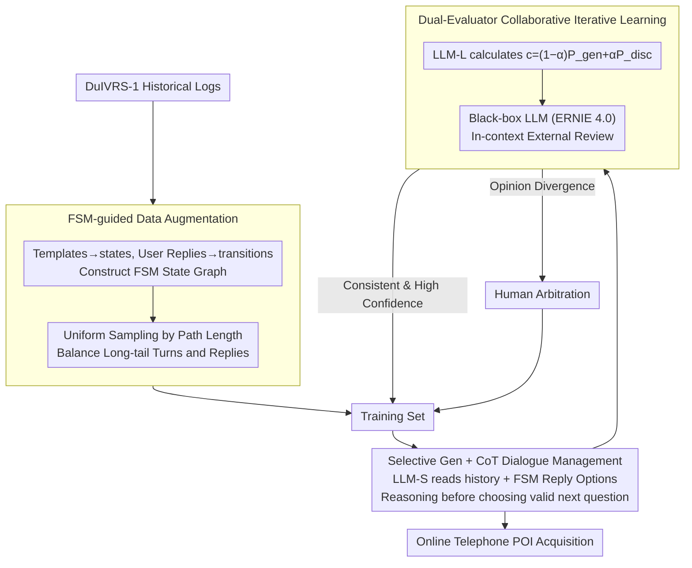

# DuIVRS-2: An LLM-based Interactive Voice Response System for Large-scale POI Attribute Acquisition

**Conference**: ACL 2026  
**arXiv**: [2605.17900](https://arxiv.org/abs/2605.17900)  
**Code**: No public code (project code link not provided in cache)  
**Area**: Voice Dialogue Systems / Industrial LLM Agent  
**Keywords**: IVR, POI Attribute Acquisition, Task-oriented Dialogue, Selective Generation, Collaborative Iterative Learning

## TL;DR
DuIVRS-2 transforms the modularized telephone IVR system for large-scale POI attribute acquisition in Baidu Maps into an LLM-driven end-to-end dialogue system. Through FSM-guided data augmentation, selective generation, and dual-evaluator iterative learning, it achieves 83.9% TSR, 130ms average response, and a capacity of 0.4M calls per day in production.

## Background & Motivation
**Background**: Map services require continuous updates of POI attributes such as names, addresses, business status, and business hours. Web pages, street views, and user contributions provide partial information, but coverage, timeliness, and extraction costs are limited. DuIVRS-1, a long-deployed system in Baidu Maps, utilizes telephone IVR to proactively call POI operators via a modular pipeline including NLU, Dialogue Management (DM), and NLG.

**Limitations of Prior Work**: Modular IVR suffers from error propagation across stages, where NLU misjudgments affect DST/DM, and NLG templates require constant maintenance. Directly integrating general-purpose LLMs into industrial IVR is impractical due to high costs, slow inference, and insufficient stability and hallucination control, failing to meet the <200ms response requirement of telephone scenarios.

**Key Challenge**: Industrial telephone dialogues require the semantic understanding capabilities of LLMs while maintaining the controllability, low latency, and safety boundaries of rule-based systems. Open-ended generation is flexible but prone to off-track inquiries; fixed templates are stable but struggle with long-tail user responses.

**Goal**: The authors aim to upgrade DuIVRS from a traditional modular system to an LLM-based end-to-end agent for large-scale POI attribute acquisition without sacrificing production availability, demonstrating its viability regarding offline CR, online TSR, cost, latency, and throughput.

**Key Insight**: Instead of allowing the LLM to generate the next response freely, the paper combines the selectable responses from a historical FSM with LLM understanding. LLM-S selects the most appropriate next question from candidate actions, while LLM-L and a black-box LLM jointly evaluate samples, creating a low-human-cost iterative data flywheel.

**Core Idea**: Use FSM to constrain the LLM action space, employ CoT to enhance selection stability, and utilize a collaborative iterative learning framework (LLM-L + black-box LLM + human arbitration) to gradually adapt a small model to real-world long-tail telephone dialogues.

## Method

### Overall Architecture
DuIVRS-2 addresses industrial POI attribute acquisition via telephone: it keeps mature voice infrastructure (ASR/TTS) intact and replaces the error-prone dialogue management module with a controlled LLM selector. The system consists of three phases: first, constructing an FSM from DuIVRS-1 historical logs and balancing long-tail data via uniform sampling; second, using the LLM-S to read history and FSM candidate replies to select the next question after brief reasoning; third, having LLM-L and an independent black-box LLM jointly score LLM-S outputs. High-confidence samples are automatically fed back into the training set, while divergent samples undergo human arbitration to form a self-cleaning data flywheel.

### Key Designs

**1. FSM-guided data augmentation: Business logic as a sampling skeleton**

Production logs often suffer from skewed distributions—high-frequency simple dialogues dominate. Direct SFT would cause the model to ignore rare but critical edge cases as noise. The authors map DuIVRS-1 fixed templates to FSM states and user replies to transitions, turning the business logic into a traversable state graph. Sampling is based on dialogue path length (uniform path sampling) rather than log frequency, with various historical user reply variants sampled uniformly for each transition. This ensures business logic validity while systematically covering unpopular states.

**2. Selective Generation + CoT dialogue management: Downgrading "writing" to "selecting"**

Telephone IVR has minimal tolerance for error or latency. Pure LLM generation is slow and risks off-scope questions. The output space is restricted: the input prompt contains truncated dialogue history and current FSM-allowed candidate Reply Options. The model performs a reasoning step (CoT) before selecting a candidate. This makes decisions interpretable and reduces hallucination. Removing CoT caused the average CR to drop from 77.18% to 39.00% in ablations, highlighting its role in stability.

**3. Dual-evaluator collaborative iterative learning: Heterogeneous review to prevent inbreeding**

To maintain a data flywheel, noisy logs must be cleaned at low cost. Using the same model family as the evaluator causes inbreeding (inheriting shared biases and ASR noise). The authors use LLM-L to calculate confidence from both generative (conditional likelihood) and discriminative (judgment of input-output pairs) perspectives using $c=(1-\alpha)P_{gen}+\alpha P_{disc}$. A completely independent black-box LLM (ERNIE 4.0) provides external review via in-context reasoning. Only samples with high-confidence agreement are auto-adopted; others proceed to human arbitration.

### Loss & Training
The initial offline training set contains 5,000 dialogues, with 5,000 samples added per fine-tuning iteration. LLM-S uses ERNIE-Bot-tiny, LLM-L uses ERNIE-Bot-turbo, and the black-box evaluator is ERNIE 4.0. Training is conducted on 8 A100-80G GPUs via Baidu PaddleCloud. AdamW parameters are $\beta_1=0.9$, $\beta_2=0.95$, $eps=1e-5$, with a batch size of 128, sequence length of 1024, and 3% warm-up. Maximum learning rates are $2\times10^{-5}$ for EB-turbo and $1\times10^{-4}$ for EB-tiny. EB-tiny uses bf16 full-parameter fine-tuning, while EB-turbo uses LoRA, both for 2 epochs.

## Key Experimental Results

### Main Results
| Dataset / Scenario | Metric | DuIVRS-2 | Comparison | Gain / Description |
|--------|------|------|----------|------|
| Offline Deffect | CR | 81.62% | DuIVRS-1: 72.20% | Significant gain in high-frequency natural distribution |
| Offline Dgeneral| CR | 73.70% | DuIVRS-1: 62.99% | Better generalization under uniform sampling |
| Offline Drobust | CR | 76.22% | DuIVRS-1: 69.05% | More stable for long text/complex semantics |
| Offline Average | CR | 77.18% | DuIVRS-1: 68.08%, GPT-4o: 66.68%, DeepSeek-V3: 67.20% | 13.37% higher than DuIVRS-1, 15.74% higher than GPT-4o |
| Online A/B | TSR | 83.9% | DuIVRS-1: 79.9%, Human: 89.6% | 4% increase over legacy, reaching 93.64% of human level |

### Ablation Study
| Configuration | Avg CR | Description |
|------|---------|------|
| DuIVRS-2 | 77.18% | Full FSM Augmentation, CoT, Collaborative Iterative Learning |
| HybridLLMs | 77.03% | Replaced with Qwen2.5/GPT-4o; framework is model-agnostic |
| LLM-DM | 68.35% | Without iterative learning; already close to DuIVRS-1 |
| Direct-SFT | 60.80% | Direct generation of next question; insufficient stability |
| w/o-CoT | 39.00% | Severe degradation without reasoning step |
| w/o-DA | 64.33% | Poor long-tail generalization without data augmentation |

### Key Findings
- Online deployment meets industrial constraints: Cost < 0.2 CNY/call (similar to DuIVRS-1), significantly lower than human (1.5 CNY/call). Reaction time is 130ms, below the 200ms human perception threshold.
- Throughput reaches 0.4 million calls/day, whereas human operators handle <200 calls/day. A/B testing allocated 3,000 calls/hour for stability verification.
- Selective generation effectively suppresses hallucinations. Manual evaluation shows 0% hallucination for DuIVRS-2 vs 1.30% for Direct-SFT.
- Deployment optimization: 8-bit quantization uses ~22GB VRAM on A10 GPUs, reaching 61.5 QPS/GPU.

## Highlights & Insights
- The value lies in "industrial deployability" rather than just model performance. It covers data, strategy, evaluation, deployment, cost, and A/B testing.
- The most critical design is constraining the LLM within FSM candidate actions, leveraging semantic understanding without surrendering the system to open-ended text generation.
- The dual-evaluator mechanism is highly practical: combining domain-specific LLM-L business knowledge with independent black-box LLM judgment.
- HybridLLM results prove that gains stem from framework design rather than the specific model family used.

## Limitations & Future Work
- Highly dependent on existing FSM and action spaces. Cold-starting open-domain tasks still requires manual definition of states and replies.
- Use of internal Baidu Maps logs and ERNIE ecosystem makes full reproduction difficult for external researchers.
- 130ms latency, while acceptable, is still slower than the 15ms of DuIVRS-1, potential bottlenecks in extreme concurrency.
- Legacy ASR/TTS modules remain; failures may stem from voice recognition issues or noisy environments rather than DM.

## Related Work & Insights
- **vs DuIVRS-1**: DuIVRS-1 used a modular NLU-DM-NLG pipeline; DuIVRS-2 adopts LLM-based end-to-end DM to reduce error propagation while retaining control.
- **vs Generic GPT-4o / DeepSeek-V3**: General models score lower on offline CR, suggesting industrial tasks require domain data and action space constraints.
- **vs Traditional TOD**: Traditional systems require separate maintenance for DST, Policy, and NLG. DuIVRS-2 integrates these into selective generation.
- **Inspiration for Voice Agents**: Production LLM Agents should embed model capabilities into verifiable action spaces rather than pursuing absolute freedom of generation.

## Rating
- Novelty: ⭐⭐⭐⭐☆ Pragmatic industrial integration of LLM into IVR; combination design over fundamentally new theory.
- Experimental Thoroughness: ⭐⭐⭐⭐⭐ Comprehensive coverage of offline/online metrics, ablation, cost, latency, throughput, and resources.
- Writing Quality: ⭐⭐⭐⭐☆ Clear engineering flow; requires some background on DuIVRS business logic.
- Value: ⭐⭐⭐⭐⭐ High reference value for industrial LLM Agents and low-latency voice systems.

<!-- RELATED:START -->

## Related Papers

- [\[CVPR 2026\] Pushing the Frontier of Audiovisual Perception with Large-Scale Multimodal Correspondence Learning](../../CVPR2026/audio_speech/pushing_the_frontier_of_audiovisual_perception_with_large-scale_multimodal_corre.md)
- [\[ACL 2026\] VoxMind: An End-to-End Agentic Spoken Dialogue System](voxmind_an_end-to-end_agentic_spoken_dialogue_system.md)
- [\[CVPR 2025\] LiveCC: Learning Video LLM with Streaming Speech Transcription at Scale](../../CVPR2025/audio_speech/livecc_learning_video_llm_with_streaming_speech_transcription_at_scale.md)
- [\[NeurIPS 2025\] Sensorium Arc: AI Agent System for Oceanic Data Exploration and Interactive Eco-Art](../../NeurIPS2025/audio_speech/sensorium_arc_ai_agent_system_for_oceanic_data_exploration_and_interactive_eco-a.md)
- [\[ACL 2025\] Mind the Gap! Static and Interactive Evaluations of Large Audio Models](../../ACL2025/audio_speech/mind_the_gap_static_and_interactive_evaluations_of_large_audio_models.md)

<!-- RELATED:END -->
