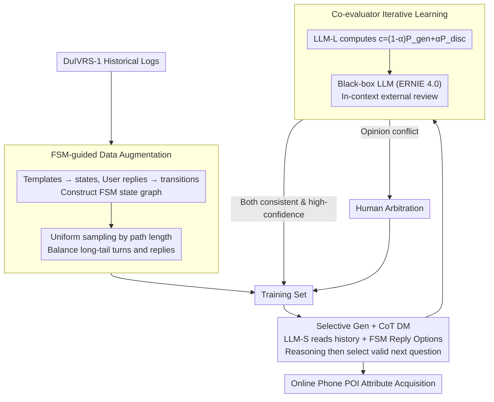

# DuIVRS-2: An LLM-based Interactive Voice Response System for Large-scale POI Attribute Acquisition

**Conference**: ACL 2026  
**arXiv**: [2605.17900](https://arxiv.org/abs/2605.17900)  
**Code**: No public code (project link not provided in cache)  
**Area**: Spoken Dialogue Systems / Industrial LLM Agents  
**Keywords**: IVR, POI Attribute Acquisition, Task-oriented Dialogue, Selective Generation, Co-iterative Learning

## TL;DR
DuIVRS-2 transforms the modular telephone IVR system used for Baidu Maps' large-scale POI attribute acquisition into an LLM-driven end-to-end dialogue system. Through FSM-guided data augmentation, selective generation, and co-evaluator iterative learning, it achieves 83.9% TSR, 130ms average response latency, and a capacity of 0.4M calls per day in production.

## Background & Motivation
**Background**: Map services require continuous updates for POI names, addresses, business status, and business hours. While web pages, street view, and user contributions provide partial information, their coverage, timeliness, and extraction costs are limited. DuIVRS-1 utilized a telephone IVR to actively call POI operators via a modular pipeline (NLU, DST/DM, NLG), long-standingly deployed in Baidu Maps.

**Limitations of Prior Work**: Modular IVR systems suffer from error propagation; NLU misjudgments affect DST/DM, and NLG templates require continuous maintenance. Directly integrating general LLMs into industrial IVR is impractical due to high costs, slow inference, and insufficient stability or hallucination control, failing the typical response requirement of under 200ms in telephone scenarios.

**Key Challenge**: Industrial telephone dialogues require the semantic understanding of LLMs while maintaining the controllability, low latency, and safety boundaries of rule-based systems. Open-ended generation is flexible but prone to out-of-process inquiries; fixed templates are stable but struggle with long-tail user responses.

**Goal**: The authors aim to upgrade DuIVRS from a traditional modular system to an LLM-based end-to-end agent for large-scale POI attribute acquisition without sacrificing production availability, demonstrating deployability in terms of offline CR, online TSR, cost, latency, and throughput.

**Key Insight**: Instead of allowing LLMs to freely generate the next response, the system combines the candidate responses from historical FSMs with the understanding capabilities of the LLM. LLM-S selects the most appropriate next question from candidate actions, while LLM-L and a black-box LLM jointly evaluate samples, creating a low-cost iterative data flywheel.

**Core Idea**: Utilize FSMs to constrain the LLM's action space, employ CoT to improve candidate selection stability, and establish a co-iterative learning framework consisting of LLM-L, a black-box LLM, and human arbitration to gradually adapt small models to real-world long-tail telephone dialogues.

## Method

### Overall Architecture
DuIVRS-2 addresses industrial telephone POI attribute acquisition by keeping mature speech infrastructure (ASR/TTS) intact while replacing the error-prone dialogue management module with a controlled LLM selector. The system involves three layers: first, constructing an FSM from DuIVRS-1 historical logs and using uniform sampling to balance long-tail data; second, having a small model (LLM-S) read dialogue history and FSM-provided candidate replies to select the next question after brief reasoning; finally, having LLM-L and an independent black-box LLM jointly score LLM-S outputs, where high-confidence samples flow back into training and disputed samples go to human arbitration, forming a continuous self-cleaning data flywheel.

### Key Designs

**1. FSM-guided Data Augmentation: Business Processes as Sampling Skeletons**

Real production logs suffer from highly skewed distributions where high-frequency simple dialogues dominate. Direct SFT would cause the model to ignore rare but critical boundary scenarios as noise. The authors map fixed response templates from DuIVRS-1 to FSM states and user replies to transitions, turning the business process into a traversable state graph. Sampling is no longer based on log frequency but utilizes uniform path sampling based on dialogue path length, followed by uniform extraction of historical user reply variants for each transition. This ensures business logic validity while systematically covering unpopular states, providing sufficient exposure to long-tail turns and replies.

**2. Selective Generation + CoT Dialogue Management: Downgrading "Writing" to "Selecting"**

Telephone IVR has minimal tolerance for error or latency. Free-form generation is slow and risks asking out-of-process questions. The key design locks the output space: the input prompt includes truncated dialogue history plus Reply Options allowed by the current FSM. The output is not arbitrary text but a short reasoning step followed by the selection of a candidate. This CoT step makes decisions interpretable and transforms a high-risk generation task into a "understand-then-select" task, significantly reducing hallucinations and maintenance costs. Ablations show average CR drops from 77.18% to 39.00% without CoT, proving its necessity for stability.

**3. Co-evaluator Iterative Learning: Heterogeneous Review to Prevent Inbreeding**

To maintain a data flywheel, noisy logs must be cleaned at low cost. However, using the same model family as an evaluator leads to inbreeding, where models inherit the same ASR noise and business biases. The authors use LLM-L to compute conditional likelihood from a generative perspective and determine pair correctness from a discriminative perspective, merging them into a confidence score $c=(1-\alpha)P_{gen}+\alpha P_{disc}$. A completely independent black-box LLM (ERNIE 4.0) is introduced for external review via in-context reasoning. Only samples where both evaluators are consistent and highly confident are automatically added to the training set; others go to human arbitration. This dual-source review plus human oversight ensures automatic cleaning without self-reinforcing errors.

### Loss & Training
The initial offline training set contains 5,000 dialogues, with 5,000 additional samples added per fine-tuning round. LLM-S uses ERNIE-Bot-tiny, LLM-L uses ERNIE-Bot-turbo, and the black-box evaluator is ERNIE 4.0. Training was conducted on 8 A100-80G GPUs via Baidu PaddleCloud. AdamW parameters were set to $\beta_1=0.9$, $\beta_2=0.95$, $eps=1e-5$, with a batch size of 128 and sequence length of 1024. Warm-up accounted for 3%. Maximum learning rates were $2\times10^{-5}$ for EB-turbo (LoRA) and $1\times10^{-4}$ for EB-tiny (full parameter fine-tuning), both for 2 epochs in bf16.

## Key Experimental Results

### Main Results

| Dataset / Scenario | Metric | DuIVRS-2 | Comparison | Gain / Description |
| :--- | :--- | :--- | :--- | :--- |
| Offline Deffect | CR | 81.62% | DuIVRS-1: 72.20% | Significant improvement in high-frequency natural distribution |
| Offline Dgeneral | CR | 73.70% | DuIVRS-1: 62.99% | Better generalization under uniform reply sampling |
| Offline Drobust | CR | 76.22% | DuIVRS-1: 69.05% | More stable with long text/complex semantics |
| Offline Average | CR | 77.18% | DuIVRS-1: 68.08%, GPT-4o: 66.68%, DeepSeek-V3: 67.20% | +13.37% vs DuIVRS-1, +15.74% vs GPT-4o |
| Online A/B | TSR | 83.9% | DuIVRS-1: 79.9%, Human: 89.6% | 4% higher than old system, reaching 93.64% of human level |

### Ablation Study

| Configuration | Avg CR | Description |
| :--- | :--- | :--- |
| DuIVRS-2 | 77.18% | Full FSM Augmentation, CoT, Co-iterative Learning |
| HybridLLMs | 77.03% | Replacing ERNIE with Qwen2.5-1.5B/7B or GPT-4o; shows framework independence |
| LLM-DM | 68.35% | Without co-iterative learning; already close to DuIVRS-1 |
| Direct-SFT | 60.80% | Direct generation of next question; lacks stability |
| w/o-CoT | 39.00% | Severe degradation without reasoning |
| w/o-DA | 64.33% | Poor long-tail generalization without data augmentation |

### Key Findings
- **Industrial Deployment Compliance**: DuIVRS-2 cost is under ¥0.2/call, comparable to DuIVRS-1 and significantly lower than human costs (¥1.5/call). The average reaction time is 130ms, below the 200ms human perception threshold.
- **Throughput**: Reaches 0.4 million calls/day, whereas humans manage at most 200/day. During A/B testing, DuIVRS-2 handled ~3,000 calls/hour for stability verification.
- **Hallucination Suppression**: Selective generation significantly inhibits hallucinations. Human evaluation in the appendix shows a 0% hallucination rate for DuIVRS-2, vs 1.30% for Direct-SFT and 2.08% for w/o-CoT.
- **Performance Optimization**: Under 8-bit quantization, it utilizes ~22GB VRAM on an A10 GPU, achieving 130ms/query and a throughput of ~61.5 QPS/GPU.

## Highlights & Insights
- The value of this paper lies in "industrial deployability" rather than specific model architecture. It provides a complete engineering loop covering data, strategy, evaluation, deployment, cost, throughput, and online A/B testing.
- The most critical design is constraining the LLM within FSM candidate actions. This leverages semantic understanding without handing over the business system to open-ended generation, which is vital for low-tolerance telephone scenarios.
- The co-evaluator mechanism is highly practical: domain-specific LLM-L holds business knowledge, while the black-box LLM provides independent judgment, leaving only uncertain samples for humans.
- HybridLLMs results are convincing, indicating that gains stem from framework design rather than the specific advantages of the ERNIE model family.

## Limitations & Future Work
- The system is highly dependent on existing FSMs and candidate action spaces. Cold-starting open-domain telephone tasks without established processes still requires manual definition of states and replies.
- Use of internal Baidu Maps logs and the ERNIE ecosystem makes it difficult for external researchers to replicate exact online data, ASR noise distributions, and business constraints.
- While 130ms satisfies interaction, it is notably slower than DuIVRS-1's 15ms; extreme concurrency or more complex models may require further inference optimization.
- The system retains legacy ASR/TTS modules. Real-world failures may still stem from speech recognition, noisy environments, or user interruptions, whereas the paper focuses primarily on dialogue management.

## Related Work & Insights
- **vs DuIVRS-1**: DuIVRS-1 used a modular NLU-DM-NLG pipeline. DuIVRS-2 adopts LLM-based end-to-end dialogue management, reducing error propagation while retaining FSM controllability.
- **vs General Models (GPT-4o/DeepSeek-V3)**: General models achieved lower offline CR than DuIVRS-2, highlighting the need for domain data, action constraints, and business evaluation loops in industrial tasks.
- **vs Traditional TOD**: Traditional Task-oriented Dialogue (TOD) systems require maintenance of DST, Policy, and NLG. DuIVRS-2 integrates policy into selective generation, making it easier to update business processes.
- **Insights for Voice Agents**: Production-oriented LLM Agents should not pursue completely free generation but should embed model capabilities within verifiable action spaces, using online data for continuous correction.

## Rating
- Novelty: ⭐⭐⭐⭐☆ The framework for industrializing LLMs in IVR is complete and pragmatic; components are established theories, but the combinatorial design is valuable.
- Experimental Thoroughness: ⭐⭐⭐⭐⭐ Covers offline, ablation, online A/B, cost, latency, throughput, hallucinations, and resource analysis.
- Writing Quality: ⭐⭐⭐⭐☆ Engineering workflows and metrics are clear, though some figures depend on internal system context.
- Value: ⭐⭐⭐⭐⭐ Highly relevant for industrial LLM Agents, low-latency voice systems, and controllable dialogue generation.

<!-- RELATED:START -->

## Related Papers

- [\[ACL 2026\] VoxMind: An End-to-End Agentic Spoken Dialogue System](voxmind_an_end-to-end_agentic_spoken_dialogue_system.md)
- [\[CVPR 2026\] Pushing the Frontier of Audiovisual Perception with Large-Scale Multimodal Correspondence Learning](../../CVPR2026/audio_speech/pushing_the_frontier_of_audiovisual_perception_with_large-scale_multimodal_corre.md)
- [\[CVPR 2025\] LiveCC: Learning Video LLM with Streaming Speech Transcription at Scale](../../CVPR2025/audio_speech/livecc_learning_video_llm_with_streaming_speech_transcription_at_scale.md)
- [\[NeurIPS 2025\] Sensorium Arc: AI Agent System for Oceanic Data Exploration and Interactive Eco-Art](../../NeurIPS2025/audio_speech/sensorium_arc_ai_agent_system_for_oceanic_data_exploration_and_interactive_eco-a.md)
- [\[ACL 2025\] Mind the Gap! Static and Interactive Evaluations of Large Audio Models](../../ACL2025/audio_speech/mind_the_gap_static_and_interactive_evaluations_of_large_audio_models.md)

<!-- RELATED:END -->
