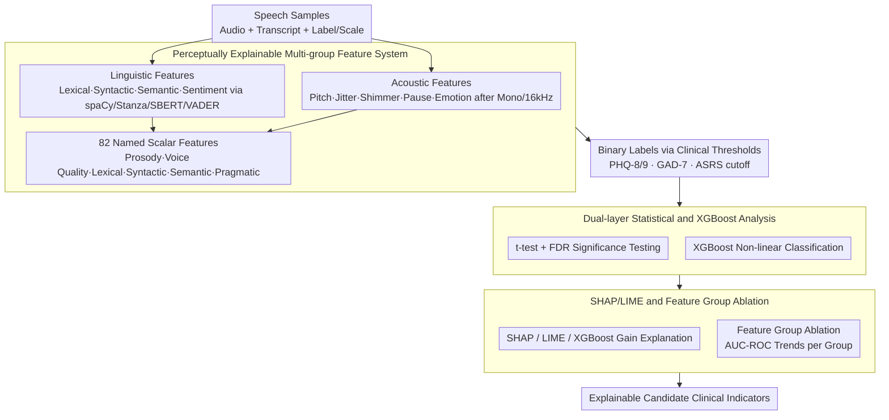

# Exploration of Perceptual Speech Features for Clinical Decision-Support in Mental Health Care

**Conference**: ACL2026  
**arXiv**: [2605.24678](https://arxiv.org/abs/2605.24678)  
**Code**: No public code (source code repository not found in cache)  
**Area**: Clinical Speech Analysis / Mental Health  
**Keywords**: Vocal Mental Health, Explainable Machine Learning, Acoustic Features, Linguistic Features, SHAP/LIME  

## TL;DR
This paper proposes an explainable speech analysis framework for clinical mental health assistance. It combines perceptually understandable acoustic and linguistic features with XGBoost, statistical testing, SHAP, and LIME to identify stable behavioral vocal cues across multiple datasets (stress, depression, anxiety, ADHD), rather than pursuing black-box end-to-end diagnosis.

## Background & Motivation
**Background**: Speech and language have been widely used in mental health assessment as speech patterns reflect emotion, cognitive load, neurological states, and social expression. Recent systems often utilize large-scale speech models, end-to-end acoustic representations, or multimodal deep models to achieve impressive classification performance on tasks such as depression, anxiety, stress, insomnia, and fatigue.

**Limitations of Prior Work**: In clinical scenarios, providing only a classification result is far from sufficient. Even if black-box models exhibit high accuracy, it is difficult to inform clinicians of the reasoning behind a decision or to distinguish whether the model captures symptomatic cues or confounding factors like recording equipment, linguistic background, noise, or fatigue. Since mental health assessment is a high-risk scenario, incorrect labels can lead to stigmatization and inappropriate interventions; thus, explainability and clinical readability are more critical than pure leaderboard metrics.

**Key Challenge**: End-to-end representations are generally more robust but their learned dimensions do not necessarily map to clinical phenomena; manual features are more explainable, yet a single feature set is often insufficient to cover the complexity of mental health expression. This paper seeks a compromise between "explainable features" and "non-linear modeling": features must be understandable by clinicians, while the model must be capable of capturing interactions across features.

**Goal**: The authors aim to construct a reusable analysis pipeline across datasets to systematically compare the relationships between acoustic, linguistic, emotional, semantic coherence, and pragmatic cues with mental health scales or diagnostic labels. The objective is not to replace clinical diagnosis but to provide auditable, explainable candidate indicators for clinical decision support.

**Key Insight**: The paper starts from "perceptual features": speech rate, pauses, jitter, shimmer, pitch variation, syntactic complexity, lexical richness, semantic coherence, emotional polarity, and sarcasm probability can all be interpreted as specific speaking behaviors. XGBoost—suitable for tabular features—is then used to handle non-linear relationships, with SHAP/LIME utilized to track which features drive the judgment.

**Core Idea**: Replace pure black-box embeddings with perceptible and explainable acoustic and linguistic features, and verify whether these features are stably associated with mental health states through a combination of statistical testing and explainable machine learning.

## Method
The methodology functions more as a clinical analysis pipeline than a single neural network. It first transforms each speech segment and its transcript into 82 scalar features, constructs binary classification labels based on clinical tasks, and subsequently uses statistical testing, XGBoost, SHAP, LIME, and feature group ablation to determine which cues possess explanatory value.

### Overall Architecture
Input consists of speech samples with audio, transcripts, and mental health labels or scale scores. The system first performs audio preprocessing: converting to mono, resampling to 16 kHz, amplitude normalization, and extracting acoustic metrics from voiced segments. On the text side, spaCy and Stanza are used for tokenization, POS tagging, dependency parsing, and constituency parsing, while Sentence-BERT estimates semantic coherence and VADER extracts emotional polarity.

Subsequently, all features are organized into several explainable groups: prosodic/fluency, voice quality, lexical, syntactic, semantic, psycholinguistic, etc. Binary classification tasks are formed for each dataset based on existing labels or scale thresholds, such as stress/non-stress in STRESSID, PHQ-8 depression thresholds in DAIC-WOZ, and PHQ-9/GAD-7/ASRS clinical cutoffs in the REAL dataset.

The analysis phase proceeds via three routes: first, independent sample t-tests with FDR control for multiple comparisons to observe feature differences between groups; second, an XGBoost classifier to capture non-linear combinations; third, SHAP, LIME, and feature importance to explain the vocal and linguistic cues the model relies upon. Finally, the authors use feature group ablation to check the independent contribution of single feature groups.

### Key Designs

**1. Perceptually Explainable Multi-group Feature System: Deconstructing "how it is said" and "what is said" into readable behavioral dimensions**

Mental health-related expressions may be hidden simultaneously in prosodic pauses and semantic content—looking only at text misses pauses, voice quality, and intonation, while looking only at audio misses semantic coherence, self-reference, negative words, and syntactic complexity. Therefore, Ours avoids unexplainable embeddings and instead extracts 82 named scalar features from each speech/transcript. Acoustic features include pitch, intensity, jitter, shimmer, HNR, ZCR, pause, phonation/articulation rate, rhythm, and entropy, supplemented by emotion features from a HuBERT emotion model. Linguistic features include TTR, MATTR, Brunet, Honore, POS/morphological diversity, syntactic depth, dependency graph metrics, Sentence-BERT coherence, VADER sentiment polarity, and sarcasm probability. Each feature corresponds to a specific speaking behavior; for a clinician, seeing "high shimmer and increased pauses" is far more meaningful than seeing "dimension 37 activation."

**2. Dual-layer Statistical and XGBoost Analysis: Addressing both group significance and non-linear predictability**

Significance testing alone misses interactions between features, whereas focusing solely on classification accuracy fails to clarify the model's underlying logic. Ours uses both layering. The first layer divides samples into two groups based on clinical thresholds (stress/non-stress in STRESSID, PHQ-8 in DAIC-WOZ, PHQ-9/GAD-7/ASRS cutoffs in REAL) to perform independent t-tests with Benjamini-Hochberg FDR correction. The second layer trains an XGBoost model to capture non-linear combinations but treats it as a "feature-level analysis tool" rather than a black-box diagnoser. This preserves the statistical readability of p-values while revealing combined patterns that single tests cannot capture.

**3. SHAP/LIME and Feature Group Ablation: Cross-verifying candidate indicators with multiple explanation methods**

In medical contexts, "why the model decided" is as important as "accuracy." This paper ranks features using a combination of XGBoost gain, SHAP summary, and aggregated LIME, then performs group ablation—retaining only one group (prosodic/fluency, voice quality, lexical, syntactic, semantic, or psycholinguistic) at a time to compare AUC-ROC trends across datasets. If several independent explanation methods point to similar cues—such as jitter, shimmer, pauses, negative affect, or repetitive graph structures—these cues gain credibility as candidate clinical indicators and are more robust under auditing.

### Loss & Training
This is not an end-to-end deep training paper; the core training targets are XGBoost classifiers. Training strategies include: constructing binary classification tasks per dataset; performing subject-level feature aggregation (using the median per participant for audio files in the REAL dataset); using 4-fold subject-independent cross-validation in REAL to avoid speaker leakage; and running 10 random seeds for STRESSID per the original paper's settings. Sarcasm detection was used as an auxiliary model trained on MUStARD with reported accuracy of ~70%, after which sarcasm probability was used purely as an additional feature.

## Key Experimental Results

### Main Results

| Dataset / Task | Evaluation Setting | Ours | Baseline Result | Observations |
| :--- | :--- | :--- | :--- | :--- |
| STRESSID Stress ID | 10 Random Runs | Accuracy 0.70, F1 0.81 | Original Wav2Vec+LR: Acc 0.66, F1 0.70 | Perceptual features + XGBoost performed better on this task. |
| DAIC-WOZ Depression | Participant speech + XGBoost | Acc 0.66, F1 0.56, AUC 0.63 | LSTM F1 0.64 | Moderate performance, but explanations showed reasonable cues like pauses and low pitch variation. |
| ANDROIDS Depression | Participant-level aggregation | Acc 75.6%, F1 77.1%, AUC 87.6% | Original LSTM F1 0.83 | Strong AUC, but F1 lower than LSTM. |
| EATD (Chinese) Depression | Acoustic + Linguistic | Acc 82.1%, F1 53.9%, AUC 73.4% | GRU F1 0.71 | Performance unstable under certain categories or languages. |
| REAL ASRS / PHQ-9 / GAD-7 | 4-fold speaker-disjoint CV | AUC 0.67 / 0.63 / 0.59 | N/A in cache | Real clinical intake scenarios are significantly more difficult. |

### Significant Features & Analysis

| Scenario | Significant or Important Feature | Value / Trend | Explanation |
| :--- | :--- | :--- | :--- |
| STRESSID | Shimmer_local | Non-stressed 0.343, Stressed -0.142, p=1.27e-5 | Vocal fold amplitude perturbation correlates with stress. |
| STRESSID | Jitter_local | Non-stressed 0.368, Stressed -0.152, p=4.14e-4 | Cycle-to-cycle frequency perturbations are primary cues. |
| REAL-PHQ-9 | vader_negative | Non-Dep 0.030, Dep 0.050, p=1.22e-4 | Higher negative textual sentiment in the depressed group, remains significant after FDR. |
| REAL-ASRS | Tense=Pres | Non-ADHD 6.22, ADHD 7.81, p=2.28e-4 | Verb tense and repetitive graph structures are important in ADHD tasks. |
| REAL-GAD-7 | vader_negative, Shimmer_local | p=6.81e-3 / 2.17e-2 | Anxiety signals show trends but lack statistical robustness after FDR. |

### Key Findings
- Single feature groups are insufficient for all tasks; Figure 1 shows prosodic features have the highest single-group average AUC-ROC, followed by psycholinguistic language and acoustic features, though specific values are not fully detailed in the text.
- In stress and anxiety analyses, shimmer/voice quality appeared repeatedly, suggesting amplitude perturbation as a potential reusable candidate indicator, though the authors caution that directions may vary across studies.
- In the ADHD-related ASRS task, linguistic organization features like repetitive graph structures, verb tense switches, and filler counts are more explanatory than simple affective words.
- AUC on real-world datasets is lower than on controlled datasets, indicating that difficulties in clinical deployment stem mainly from recording conditions, cultural-linguistic backgrounds, questionnaire cutoffs, and sample dynamics.

## Highlights & Insights
- **Prioritizing Interpretability**: Rather than pursuing the largest model, the authors chose acoustic and linguistic behaviors that clinicians can understand. This makes the results more suitable for clinical assistance rather than acting as another opaque screener.
- **Testing the Pipeline Across 5 Datasets**: STRESSID, DAIC-WOZ, ANDROIDS, EATD, and REAL cover stress, depression, anxiety, ADHD, multiple languages, and real intake scenarios. While results are not all perfect, this heterogeneity is closer to real deployment pressures.
- **Cross-verifying Statistical Significance and Model Explanation**: t-test, FDR, XGBoost, SHAP, and LIME are not just a collection of methods but are used to confirm from different angles which cues are worth considering as candidate clinical indicators.
- **Value of Negative Results**: Performance on EATD and REAL exposes fragility across languages, devices, and clinical scales, serving as a better reminder than high scores on a single dataset that research should not over-promise.

## Limitations & Future Work
- The authors explicitly state that speech is affected by fatigue, background noise, equipment, linguistic-cultural background, and annotation protocols; many so-called "mental health signals" may be weakened or distorted by confounding factors.
- Some tasks utilize cutoff scores from PHQ-8/9, GAD-7, or ASRS as labels, which are common but not equivalent to clinical ground truth; model errors may stem from the cutoffs themselves.
- Current analysis mainly uses short speech segments and static aggregated features, possibly ignoring symptomatic trajectories over time. Future work could introduce longitudinal modeling, domain-invariant preprocessing, and more natural long-term speech data.
- The sarcasm detection model has ~70% accuracy and contains bias, so sarcasm probability should be interpreted cautiously rather than as strong clinical evidence.
- Differences in labels, languages, tasks, and recording settings between datasets suggest a need for more cross-site, cross-device, and cross-cultural validation rather than hyperparameter tuning on public benchmarks.

## Related Work & Insights
- **vs. End-to-end Wav2Vec / HuBERT models**: These models generally learn stronger representations but have high clinical interpretation costs; Ours uses HuBERT only for auxiliary emotional features, while the main framework remains explainable at the feature level.
- **vs. LSTM Depression Detection on DAIC-WOZ**: LSTM achieved higher F1, but this paper clearly identifies how pauses, pitch variation, intensity, and jitter/shimmer contribute to the decision, which is better for hypothesis generation.
- **vs. Text-only Mental Health Analysis**: Focusing solely on text misses prosody, pause, and voice quality; Ours suggests that mental health speech analysis should simultaneously model content, delivery, and pragmatic cues.
- **Insight**: For clinical NLP/speech screening, the most reliable direction may not be "larger models for direct diagnosis" but "explainable candidate indicators + explicit uncertainty + clinical review."

## Rating
- Novelty: ⭐⭐⭐⭐☆ The combination of features and XAI components is not entirely new, but organizing them into an explainable clinical analysis framework across multiple mental health tasks has practical value.
- Experimental Thoroughness: ⭐⭐⭐⭐☆ Dataset coverage is broad with extensive tables and explanations; the limitation lies in the cross-dataset consistency and limited external clinical validation.
- Writing Quality: ⭐⭐⭐⭐☆ Motivation is clear, methods and results are readable; some appendix feature tables are long, and ablation values in the text are slightly incomplete.
- Value: ⭐⭐⭐⭐☆ Highly relevant for clinical explainable speech analysis, especially for building auditable mental health support systems.

<!-- RELATED:START -->

## Related Papers

- [\[ACL 2026\] An Exploration of Mamba for Speech Self-Supervised Models](an_exploration_of_mamba_for_speech_self-supervised_models.md)
- [\[ICLR 2026\] MAPSS: Manifold-Based Assessment of Perceptual Source Separation](../../ICLR2026/audio_speech/mapss_manifold-based_assessment_of_perceptual_source_separation.md)
- [\[ACL 2026\] S2S-Arena: Evaluating Paralinguistic Instruction Following in Speech-to-Speech Models](s2s-arena_evaluating_paralinguistic_instruction_following_in_speech-to-speech_mo.md)
- [\[ACL 2026\] FC-TTS: Style and Timbre Control in Zero-Shot Text-to-Speech with Disentangled Speech Representations](fc-tts_style_and_timbre_control_in_zero-shot_text-to-speech_with_disentangled_sp.md)
- [\[ACL 2026\] RTCFake: Speech Deepfake Detection in Real-Time Communication](rtcfake_speech_deepfake_detection_in_real-time_communication.md)

<!-- RELATED:END -->
