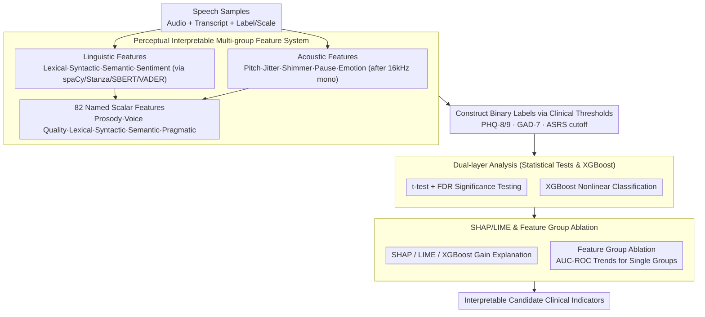

# Exploration of Perceptual Speech Features for Clinical Decision-Support in Mental Health Care

**Conference**: ACL2026  
**arXiv**: [2605.24678](https://arxiv.org/abs/2605.24678)  
**Code**: No public code (source code repository not found in cache)  
**Area**: Clinical Speech Analysis / Mental Health  
**Keywords**: Speech Mental Health, Explainable Machine Learning, Acoustic Features, Linguistic Features, SHAP/LIME  

## TL;DR
This paper proposes an interpretable speech analysis framework for clinical mental health support. By combining perceptually understandable acoustic and linguistic features with XGBoost, statistical testing, SHAP, and LIME, it identifies stable speech behavior cues across multiple datasets (stress, depression, anxiety, ADHD) rather than pursuing black-box end-to-end diagnosis.

## Background & Motivation
**Background**: Speech and language have been widely utilized for mental health assessment, as speaking styles reflect emotion, cognitive load, neurological states, and social expression. Recent systems often employ large-scale speech models, end-to-end acoustic representations, or multimodal deep models, achieving respectable classification performance in tasks involving depression, anxiety, stress, insomnia, and fatigue.

**Limitations of Prior Work**: In clinical scenarios, providing only a classification result is insufficient. Even with high accuracy, black-box models struggle to explain to clinicians "where this judgment comes from," making it difficult to distinguish whether the model captures symptomatic cues or confounding factors like recording equipment, linguistic background, noise, or fatigue. Since mental health assessment is a high-risk scenario, incorrect labels can lead to stigmatization and inappropriate interventions; thus, interpretability and clinical readability are more critical than pure leaderboard metrics.

**Key Challenge**: End-to-end representations are typically more powerful, but their learned dimensions do not necessarily map to clinical phenomena. Conversely, handcrafted features are more interpretable, but a single feature group is often insufficient to cover the complexity of mental health expressions. This paper attempts a compromise between "interpretable features" and "non-linear modeling": features must be understandable by clinicians, and the model must be capable of capturing cross-feature interactions.

**Goal**: The authors aim to construct a reusable analysis pipeline across datasets to systematically compare the relationships between acoustic, linguistic, emotional, semantic coherence, and pragmatic cues with mental health scales or diagnostic labels. The goal is not to claim a replacement for physician diagnosis but to provide auditable, interpretable candidate indicators for clinical decision support.

**Key Insight**: The paper starts from "perceptual features": speech rate, pauses, jitter, shimmer, pitch variation, syntactic complexity, lexical richness, semantic coherence, emotional polarity, and sarcasm probability can all be interpreted as specific speaking behaviors. XGBoost—a model suited for tabular features—is then used to handle non-linear relationships, with SHAP/LIME employed to track which features drive the judgment.

**Core Idea**: Replace pure black-box embeddings with perceptible and interpretable acoustic and linguistic features, and validate whether these features are stably associated with mental health states through a combination of statistical tests and explainable machine learning.

## Method
The methodology serves as a clinical analysis pipeline rather than a single neural network. It first converts each speech segment and transcript into 82 scalar features, constructs binary classification labels based on clinical tasks, and subsequently employs statistical tests, XGBoost, SHAP, LIME, and feature group ablation to determine which cues possess explanatory value.

### Overall Architecture
The input consists of speech samples with audio, transcripts, and mental health labels or scale scores. The system first performs audio preprocessing: converting to mono, resampling to 16 kHz, amplitude normalization, and extracting acoustic metrics from voiced segments. On the text side, it uses spaCy and Stanza for tokenization, POS tagging, dependency parsing, and constituency parsing, while estimating semantic coherence with Sentence-BERT and extracting emotional polarity with VADER.

Subsequently, all features are organized into several interpretable groups: prosodic/fluency, voice quality, lexical, syntactic, semantic, and psycholinguistic. Each dataset forms a binary classification task based on existing labels or scale thresholds, such as stress/non-stress in STRESSID, PHQ-8 depression thresholds in DAIC-WOZ, and clinical cutoffs for PHQ-9/GAD-7/ASRS in the REAL dataset.

The analysis is conducted through three paths: the first involves independent sample t-tests with FDR control for multiple comparisons to observe feature differences between groups; the second uses an XGBoost classifier to capture non-linear combinations; the third utilizes SHAP, LIME, and feature importance to explain the speech and language cues the model relies on. Finally, the authors check the independent contribution of individual feature groups via feature group ablation.

### Key Designs

**1. Perceptual Interpretable Multi-group Feature System: Decoupling "How it’s said" and "What’s said" into clinical behavioral dimensions**

Expressions related to mental health may simultaneously hide within prosodic pauses and semantic content—looking only at text misses pauses, voice quality, and intonation, while looking only at audio misses semantic coherence, self-reference, negative words, and syntactic complexity. Therefore, instead of using uninterpretable embeddings, this paper extracts 82 named scalar features from each speech/transcript. The acoustic side includes pitch, intensity, jitter, shimmer, HNR, ZCR, pause, phonation/articulation rate, rhythm, and entropy, plus emotion features from a HuBERT model. The text side covers TTR, MATTR, Brunet, Honore, POS/morphological diversity, syntactic depth, dependency graph metrics, Sentence-BERT coherence, VADER sentiment, and sarcasm probability. Each feature corresponds to a specific speaking behavior; a clinician seeing "high shimmer, increased pauses" is far more clinically meaningful than seeing "dimension 37 activation."

**2. Dual-layer Analysis: Simultaneously addressing "which features differ significantly" and "which features are non-linearly predictive"**

Significance testing alone misses feature interactions, while classification accuracy alone fails to clarify what the model is based on. This paper stacks both. The first layer splits samples into two groups based on clinical thresholds (stress/non-stress for STRESSID, PHQ-8 for DAIC-WOZ, PHQ-9/GAD-7/ASRS for REAL) and performs independent sample t-tests with Benjamini-Hochberg FDR correction. The second layer trains XGBoost to capture non-linear combinations but treats it as a "feature-level analysis tool" rather than a black-box diagnostician. This maintains the statistical readability of p-values while observing combinatorial patterns that single tests cannot capture.

**3. SHAP/LIME & Feature Group Ablation: Cross-validating candidate indicators via multiple explanation methods**

In medical contexts, "why the model made this judgment" is as important as "how accurate the judgment is." This paper uses three sets of explanations—XGBoost gain, SHAP summary, and aggregated LIME—to rank features, followed by feature group ablation. By retaining only one group (prosodic/fluency, voice quality, lexical, syntactic, semantic, or psycholinguistic) at a time, the authors compare AUC-ROC trends across datasets. If multiple independent explanation methods point to similar cues like jitter, shimmer, pauses, negative affect, or repetitive graph structures, the credibility of these cues as candidate clinical indicators is higher and more resilient to auditing.

### Loss & Training
This paper is not an end-to-end deep training paper; the core training target is the XGBoost classifier. Training strategies include: constructing binary classification tasks per dataset; performing subject-level feature aggregation (e.g., taking the median across audio files per participant in the REAL dataset); using 4-fold subject-independent cross-validation in REAL to avoid speaker leakage; and following the original paper's setup for STRESSID with 10 random runs. Sarcasm detection is trained as an auxiliary model on MUStARD (reported accuracy ~70% in cache), and only the sarcasm probability is used as an additional feature.

## Key Experimental Results

### Main Results

| Dataset / Task | Evaluation Setting | Ours | Baseline Result | Observation |
|:---|:---|:---|:---|:---|
| STRESSID (Stress) | 10 Random Runs | Accuracy 0.70, F1 0.81 | Wav2Vec+LR: Acc 0.66, F1 0.70 | Perceptual features + XGBoost performed better here |
| DAIC-WOZ (Depression) | Participant speech + XGBoost | Accuracy 0.66, F1 0.56, AUC 0.63 | LSTM F1 0.64 | Moderate performance; explanations show reasonable cues like pauses |
| ANDROIDS (Depression) | Participant-level aggregation | Acc 75.6%, F1 77.1%, AUC 87.6% | Original LSTM F1 0.83 | Strong AUC, but F1 is lower than LSTM |
| EATD (Mandarin Dep) | Acoustic + Linguistic | Accuracy 82.1%, F1 53.9%, AUC 73.4% | GRU F1 0.71 | Performance unstable across categories or languages |
| REAL ASRS/PHQ-9/GAD-7 | 4-fold speaker-disjoint CV | AUC 0.67 / 0.63 / 0.59 | N/A (External SOTA not in cache) | Real-world clinical intake is significantly more difficult |

### Significant Features & Analysis

| Scenario | Significant/Important Feature | Value / Trend | Interpretation |
|:---|:---|:---|:---|
| STRESSID | Shimmer_local | Non-stressed 0.343, Stressed -0.142, p=1.27e-5 | Vocal fold amplitude perturbation correlates with stress |
| STRESSID | Jitter_local | Non-stressed 0.368, Stressed -0.152, p=4.14e-4 | Fundamental frequency cycle perturbation is a key cue |
| REAL-PHQ-9 | vader_negative | Non-Dep 0.030, Dep 0.050, p=1.22e-4 | Depressed group has higher negative text sentiment (FDR significant) |
| REAL-ASRS | Tense=Pres | Non-ADHD 6.22, ADHD 7.81, p=2.28e-4 | Verb tense and repetition graph structure are important in ADHD tasks |
| REAL-GAD-7 | vader_negative, Shimmer_local | p=6.81e-3 / 2.17e-2 (Not FDR sig) | Anxiety signals exist but lack statistical robustness |

### Key Findings
- A single feature group is insufficient for all tasks. Prosodic features typically have the highest average AUC-ROC for single groups, followed by psycholinguistic and acoustic features.
- Shimmer and voice quality appear repeatedly in stress and anxiety analyses, suggesting amplitude perturbation is a reusable candidate indicator, though directions may vary between studies.
- In ADHD tasks (ASRS), linguistic organization features like repetition graph structures, verb tense switches, and filler counts are more explanatory than simple affective words.
- AUC on real-world datasets is lower than on controlled datasets, indicating that clinical deployment challenges lie in recording conditions, cultural/linguistic backgrounds, questionnaire cutoffs, and sample dynamics.

## Highlights & Insights
- **Prioritizing Interpretability**: Instead of pursuing the largest models, the paper chooses acoustic and linguistic behaviors that clinicians can understand. This makes the results suitable for clinical assistance rather than acting as another opaque screener.
- **Validating Pipeline Across 5 Datasets**: STRESSID, DAIC-WOZ, ANDROIDS, EATD, and REAL cover stress, depression, anxiety, ADHD, multiple languages, and real-world intake scenarios. While results are not always perfect, such heterogeneity is closer to real deployment pressures.
- **Mutual Verification of Statistics and XAI**: t-test, FDR, XGBoost, SHAP, and LIME are used strategically to confirm which cues are worth considering as candidate clinical indicators.
- **Value of Negative Results**: Performance on EATD and REAL exposes vulnerabilities across languages, devices, and clinical scales, serving as a reminder not to over-promise in mental health tech.

## Limitations & Future Work
- Speech is influenced by fatigue, background noise, equipment, language/culture, and labeling protocols. Many "mental health signals" might be weakened or distorted by confounding factors.
- Some tasks rely on PHQ-8/9, GAD-7, or ASRS cutoffs as labels; these scales are common but do not equal clinical ground truth. Performance errors might stem from the cutoffs rather than the model.
- Current work uses short speech segments and static features, potentially ignoring the trajectory of symptoms over time. Future work could introduce longitudinal modeling and domain-invariant preprocessing.
- The sarcasm detection model has a ~70% accuracy, meaning its outputs should be interpreted cautiously and not as strong clinical evidence.
- Differences in labels, languages, tasks, and recording settings across datasets remain large; cross-site and cross-cultural validation is needed beyond parameter tuning on public benchmarks.

## Related Work & Insights
- **vs. End-to-end Wav2Vec / HuBERT**: These models learn strong representations but have high clinical interpretation costs. This paper uses HuBERT only for auxiliary emotion features, keeping the main framework feature-level interpretable.
- **vs. LSTM Depression Detection on DAIC-WOZ**: While LSTMs might achieve higher F1, the current approach identifies how pauses, pitch variations, intensity, and jitter/shimmer contribute to judgments, facilitating hypothesis generation.
- **vs. Text-only Mental Health Analysis**: Text alone misses prosody, pauses, and voice quality. This paper suggests that mental health speech analysis should simultaneously model content, delivery, and pragmatic cues.
- **Insight**: For clinical NLP/speech screening, the most viable direction may not be "larger models for direct diagnosis" but "interpretable candidate indicators + explicit uncertainty + physician review."

## Rating
- Novelty: ⭐⭐⭐⭐☆ Multi-feature and XAI components are not new, but organizing them into an interpretable clinical analysis framework across diverse mental health tasks has high practical value.
- Experimental Thoroughness: ⭐⭐⭐⭐☆ Extensive dataset coverage and detailed explanations; however, cross-dataset consistency and external clinical validation remain limited.
- Writing Quality: ⭐⭐⭐⭐☆ Clear motivation, readable methods and results, though some ablation values could be more completely reported in the main text.
- Value: ⭐⭐⭐⭐☆ Highly relevant for clinical interpretable speech analysis, particularly for building auditable mental health support systems.

<!-- RELATED:START -->

## Related Papers

- [\[ACL 2026\] An Exploration of Mamba for Speech Self-Supervised Models](an_exploration_of_mamba_for_speech_self-supervised_models.md)
- [\[ICLR 2026\] MAPSS: Manifold-Based Assessment of Perceptual Source Separation](../../ICLR2026/audio_speech/mapss_manifold-based_assessment_of_perceptual_source_separation.md)
- [\[ACL 2026\] S2S-Arena: Evaluating Paralinguistic Instruction Following in Speech-to-Speech Models](s2s-arena_evaluating_paralinguistic_instruction_following_in_speech-to-speech_mo.md)
- [\[ACL 2026\] FC-TTS: Style and Timbre Control in Zero-Shot Text-to-Speech with Disentangled Speech Representations](fc-tts_style_and_timbre_control_in_zero-shot_text-to-speech_with_disentangled_sp.md)
- [\[ACL 2026\] RTCFake: Speech Deepfake Detection in Real-Time Communication](rtcfake_speech_deepfake_detection_in_real-time_communication.md)

<!-- RELATED:END -->
