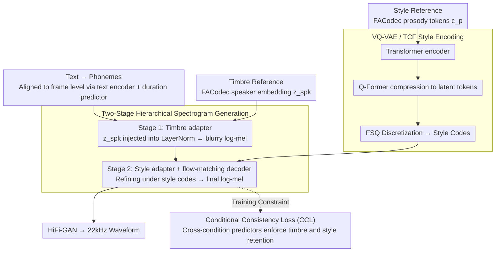

# FC-TTS: Style and Timbre Control in Zero-Shot Text-to-Speech with Disentangled Speech Representations

**Conference**: ACL2026  
**arXiv**: [2605.24618](https://arxiv.org/abs/2605.24618)  
**Code**: Audio demo: https://qualcomm-ai-research.github.io/fc-tts  
**Area**: Speech Synthesis / Controllable TTS  
**Keywords**: Zero-shot TTS, Timbre control, Style control, FACodec, flow matching  

## TL;DR
FC-TTS utilizes disentangled speech representations from FACodec as conditioning sources. Through two-stage spectrogram generation, VQ-VAE style encoding, and conditional consistency loss, it separates speaker timbre and speaking style—originally entangled in a single reference—into two independently controllable inputs for zero-shot TTS.

## Background & Motivation
**Background**: Zero-shot text-to-speech (TTS) systems have demonstrated the ability to mimic speaker timbre and expression from a reference audio clip. Systems such as F5-TTS, NaturalSpeech 3, DiTTo-TTS, and CLaM-TTS continue to advance naturalness, intelligibility, and speaker similarity. Concurrently, practical applications increasingly require fine-grained control, such as maintaining a specific speaker's timbre while adopting the emotion, rhythm, or intonation of a different reference audio.

**Limitations of Prior Work**: Most reference-based TTS models entangle style and timbre within the same reference audio. When a user intends to "use Speaker A's voice with Speaker B's emotion," the model often fails to distinguish which information belongs to the speaker identity and which belongs to the prosodic style. Even though representation learning methods like FACodec or NANSY++ attempt to decompose speech into prosody, content, detail, and speaker embeddings, directly reusing their decoders does not guarantee the ability to handle style-timbre combinations unseen during training.

**Key Challenge**: High generation quality typically results from joint modeling of all attributes, which leads to attribute leakage. Conversely, strong disentanglement often relies on information bottlenecks, which may sacrifice naturalness and detail. This paper addresses how to synthesize natural, clear, and controllable speech without content or detail leakage.

**Goal**: FC-TTS aims to support two independent references: one providing speaker timbre and another providing style/prosody. The model must maintain competitive zero-shot TTS performance on datasets like LibriSpeech while demonstrating independent control of timbre and style on prosody-rich data like RAVDESS.

**Key Insight**: The authors acknowledge that FACodec disentanglement is imperfect and introduce structural and training constraints at the TTS end. The core mechanism involves using the timbre to determine a coarse acoustic space first, followed by a second stage where the style refines the spectrogram, thereby reducing cross-contamination between the two conditions.

**Core Idea**: Split "timbre anchoring" and "style refinement" into two distinct generation stages, complemented by quantized style encoding and a conditional consistency loss to force the generated speech to match two independent references simultaneously.

## Method
FC-TTS is built upon FACodec and conditional flow matching. It utilizes prosody tokens $c_p$ and speaker embeddings $z_{spk}$ from FACodec. Content and detail tokens are intentionally discarded to minimize the leakage of text content and low-level acoustic details into the control path.

### Overall Architecture
During training, the target speech provides both timbre and style conditions; during inference, these can originate from different utterances. Input text is converted into a phoneme sequence, which is aligned to the frame level via a text encoder and duration predictor. The first stage uses a timbre adapter to inject the speaker embedding into layer normalization, generating a blurry log-mel spectrogram anchored by the timbre condition. The second stage utilizes a style adapter and a flow-matching decoder to refine the blurry spectrogram into the final log-mel spectrogram under the style embedding condition. Finally, HiFi-GAN converts the log-mel spectrogram into a 22 kHz waveform.

The style embedding is derived from a TCF (Token-based Condition Factorization) module: prosody tokens pass through a Transformer encoder and are compressed into a fixed number of latent tokens via a Q-Former style cross-attention mechanism, followed by discretization using finite scalar quantization (FSQ). TCF modules are placed at both phoneme and frame levels to capture intra-utterance stylistic variations.

### Key Designs

**1. Two-Stage Hierarchical Spectrogram Generation: Anchoring timbre before refining style to prevent cross-contamination.**

Directly reusing the FACodec decoder to handle unseen style-timbre combinations is unstable because attributes entangled in a single generation step leak easily. FC-TTS splits generation into two steps: Stage 1 uses only the speaker embedding $z_{spk}$ to generate an over-smoothed blurry log-mel $h$, trained with an MAE loss $L_{blur}=E[\|h-x_0\|]$. This anchors the timbre and recording conditions in a reasonable acoustic space. Stage 2 then uses conditional flow matching under the prosody condition $c_p$ to refine the blurry spectrogram. Timbre defines the "vocal foundation," while style handles "fine-grained prosody," physically isolating the references to improve stability for unseen combinations.

**2. VQ-VAE / TCF Style Encoder: Extracting high-level style from prosody tokens instead of copying low-level details.**

Traditional in-context TTS often assumes a consistent style throughout a reference, but intonation and emotion naturally vary within an utterance. The TCF module uses a Transformer encoder, a Q-Former-style cross-attention query bottleneck, and finite scalar quantization (FSQ). The Q-Former query compresses variable-length prosody into fixed latent tokens, which FSQ discretizes into style codes. An auxiliary ResNet reconstruction loss prevents FSQ collapse. This quantization bottleneck suppresses acoustic residuals and forces the representation to focus on transferable styles like rhythm and intonation rather than specific timbre.

**3. Conditional Consistency Loss (CCL): Enforcing attribute retention via cross-condition predictors.**

Standard consistency losses focusing on single attributes provide ambiguous gradients in dual-condition scenarios. CCL trains two attribute predictors: one reconstructs prosody tokens from the generated spectrogram and $z_{spk}$, while the other reconstructs the speaker embedding from the generated spectrogram and $c_p$. The loss is a weighted sum of prosody cross-entropy and speaker negative cosine similarity:

$$L_{CCL}=\lambda_{pro}E[CE(c_p,f(\hat{x},z_{spk}))]-\lambda_{spk}E[cos(z_{spk},g(\hat{x},c_p))]$$

Crucially, "non-target attributes" are fed into the predictors—providing the ground-truth $z_{spk}$ when predicting prosody and ground-truth $c_p$ when predicting speaker—resulting in a sharper posterior and increased stability during early denoising.

### Loss & Training
The total training objective includes CFM loss, blurry spectrogram MAE, prosody CE, speaker cosine consistency, mel reconstruction, aligner forward-sum, binary alignment, and duration CFM. Loss weights are: $\lambda_{CFM}=5.0$, $\lambda_{blur}=1.0$, $\lambda_{ccl-pro}=0.2$, $\lambda_{ccl-spk}=0.5$, $\lambda_{mel-recon}=1.0$, $\lambda_{dur}=1.0$, $\lambda_{forwardsum}=0.1$, and $\lambda_{bin}=0.1$.

The model is trained on LibriHeavy for 200k iterations using AdamW, with a batch size of 64 and a learning rate of 0.0002. Training took 116 hours on 8 V100 GPUs. Inference uses 8 NFEs for duration prediction and 32 NFEs for log-mel synthesis with a CFG scale of 4.0.

## Key Experimental Results

### Main Results

| Task / Dataset | Metrics | FC-TTS | Comparison | Conclusion |
|--------|------|------|----------|------|
| LibriSpeech test-clean (Zero-Shot) | UTMOS / WER / SPK / Params | 4.22 / 1.88 / 0.60 / 204M | NaturalSpeech 3: 4.30 / 1.81 / 0.67 / 500M；F5-TTS†: 4.03 / 3.30 / 0.67 / 205M | Naturalness and WER are competitive; SPK is lower than some SOTA. |
| RAVDESS Timbre Control | UTMOS / SPK / WER / Win | 4.03 / 0.48 / 0.18 / 66.1% | FACodec-VC: 3.19 / 0.27 / 8.40 / 10.7% | Significantly more stable under prosody-rich mismatch conditions. |
| RAVDESS Style Control | UTMOS / SPK / WER / MCD / Win | 3.95 / 0.47 / 0.30 / 3.21 / 65.5% | F5-TTS: 3.40 / 0.57 / 4.39 / 3.43 / 8.9% | Stronger style matching and intelligibility, though speaker similarity is sacrificed. |
| AudioLLM-as-a-Judge Style Eval | Win Ratio / Style-MOS | 91.7% / 3.92 | F5-TTS: 8.3% / 1.50 | Gemini 1.5 Pro strongly favors FC-TTS. |

### Ablation Study

| Configuration | LibriSpeech UTMOS / WER / SPK / MCD | RAVDESS Style UTMOS / WER / SPK / MCD | Description |
|------|---------|------|------|
| FC-TTS | 4.22 / 1.88 / 0.60 / 5.60 | 3.91 / 0.30 / 0.37 / 3.33 | Full Model |
| w/o two-stage generation | 4.15 / 1.93 / 0.60 / 5.83 | 3.57 / 0.30 / 0.37 / 3.26 | Acoustic stability drops; spectrograms overly influenced by prosody. |
| w/o VQ-VAE style encoding | 4.25 / 2.00 / 0.57 / 5.62 | 3.99 / 0.25 / 0.34 / 3.47 | Slight rise in naturalness, but style control and F0 following weaken. |
| w/o conditioning in CCL | 4.21 / 1.92 / 0.59 / 5.67 | 3.79 / 0.35 / 0.36 / 3.36 | Alignment and intelligibility drop slightly without cross-conditioning. |
| w/o entire consistency loss | 3.95 / 5.88 / 0.48 / 6.34 | 3.70 / 9.36 / 0.21 / 3.75 | Most significant degradation, confirming CCL as the critical component. |

### Key Findings
- FC-TTS does not prioritize ranking first in all zero-shot benchmarks; instead, it trades absolute performance for independent control capabilities while maintaining high audio quality.
- The two-stage generation constraint limits the upper bound of naturalness but significantly enhances stability for unseen style-timbre combinations.
- Removing the consistency loss causes LibriSpeech WER to collapse from 1.88 to 5.88, proving its necessity.
- In style control experiments, SPK is lower than F5-TTS, indicating a persistent trade-off between style disentanglement and timbre preservation.

## Highlights & Insights
- **Beyond "using FACodec"**: The actual contribution lies in acknowledging the imperfections of FACodec and imposing flow constraints on attributes through the TTS generation process and losses.
- **Effective Engineering in Two-Stage Design**: Generating a blurry spectrogram first acts as a timbre anchor, which proves more controllable than feeding all conditions into a single decoder.
- **Handling Intra-utterance Variation**: While many methods assume style is uniform across a reference, the TCF module's dual-level encoding (phoneme and frame) better captures realistic expressive variations.
- **AudioLLM-as-a-Judge**: Although not a replacement for human evaluation, it provides a scalable automated metric for style similarity.

## Limitations & Future Work
- The authors acknowledge that training and evaluation are currently restricted to English, leaving the model's generalization to multilingual or cross-lingual scenarios unproven.
- The model remains dependent on FACodec representations. Residual timbre or acoustic details in the prosody tokens can lead to control leakage.
- The boundary between "timbre" and "style" remains ambiguous (e.g., whether a "husky voice" is a vocal trait or a style), complicating quantitative scientific comparison.
- Potential risks of deepfakes and identity theft exist. Deployment requires consideration of authorization, watermarking, and synthesis detection.
- A trade-off between naturalness and disentanglement persists. Future work may explore codec-free disentanglement and explicit style taxonomies.

## Related Work & Insights
- **vs NaturalSpeech 3 / FACodec-based TTS**: While NaturalSpeech 3 leverages FACodec for strong reconstruction, it does not demonstrate stability under mismatched style-timbre references. FC-TTS trades some performance for explicit independent control.
- **vs F5-TTS**: F5-TTS has strong in-context learning, but its single-reference approach makes it difficult to isolate timbre from style; FC-TTS outperforms it on RAVDESS in terms of WER, MCD, and style similarity.
- **Inspiration**: Multi-attribute generation does not necessarily require larger unified models. Physically separating the attribute injection paths and using attribute-specific secondary verifiers can lead to more reliable control.

## Rating
- Novelty: ⭐⭐⭐⭐☆ The combination of two-stage generation, TCF, and CCL is highly targeted, though it relies on existing FACodec/CFM foundations.
- Experimental Thoroughness: ⭐⭐⭐⭐☆ Evaluation covers standard TTS benchmarks and specific control tasks, though the lack of multilinguality is a limitation.
- Writing Quality: ⭐⭐⭐⭐☆ Components and methods are clearly defined; the logic is cohesive.
- Value: ⭐⭐⭐⭐⭐ High potential for practical applications in games, audiobooks, and assistive communication.

<!-- RELATED:START -->

## Related Papers

- [\[ACL 2026\] ReStyle-TTS: Relative and Continuous Style Control for Zero-Shot Speech Synthesis](restyle-tts_relative_and_continuous_style_control_for_zero-shot_speech_synthesis.md)
- [\[ACL 2026\] ImmersiveTTS: Environment-Aware Text-to-Speech with Multimodal Diffusion Transformer and Domain-Specific Representation Alignment](immersivetts_environment-aware_text-to-speech_with_multimodal_diffusion_transfor.md)
- [\[ACL 2025\] ControlSpeech: Towards Simultaneous and Independent Zero-shot Speaker Cloning and Zero-shot Language Style Control](../../ACL2025/audio_speech/controlspeech_zero_shot.md)
- [\[ACL 2025\] Zero-Shot Text-to-Speech for Vietnamese](../../ACL2025/audio_speech/zero-shot_text-to-speech_for_vietnamese.md)
- [\[ICML 2026\] Polyphonia: Zero-Shot Timbre Transfer in Polyphonic Music with Acoustic-Informed Attention Calibration](../../ICML2026/audio_speech/polyphonia_zero-shot_timbre_transfer_in_polyphonic_music_with_acoustic-informed_.md)

<!-- RELATED:END -->
