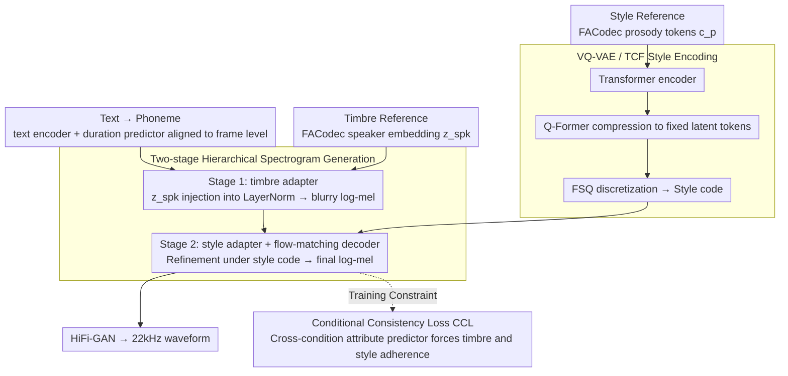

# FC-TTS: Style and Timbre Control in Zero-Shot Text-to-Speech with Disentangled Speech Representations

**Conference**: ACL2026  
**arXiv**: [2605.24618](https://arxiv.org/abs/2605.24618)  
**Code**: Audio demo: https://qualcomm-ai-research.github.io/fc-tts  
**Area**: Speech Synthesis / Controllable TTS  
**Keywords**: Zero-shot TTS, Timbre control, Style control, FACodec, flow matching  

## TL;DR
FC-TTS utilizes disentangled speech representations from FACodec as conditioning sources. Through two-stage spectrogram generation, a VQ-VAE style encoder, and a conditional consistency loss, it separates timbre and speaking style—originally entangled within a single reference in zero-shot TTS—into two independently controllable inputs.

## Background & Motivation
**Background**: Zero-shot text-to-speech has advanced significantly in mimicking speaker timbre and expression from a reference audio. Systems like F5-TTS, NaturalSpeech 3, DiTTo-TTS, and CLaM-TTS continue to improve naturalness, intelligibility, and speaker similarity. Simultaneously, practical applications increasingly require fine-grained control: for instance, maintaining a specific speaker's timbre while adopting the emotion, rhythm, or intonation of another reference audio.

**Limitations of Prior Work**: Most reference-based TTS systems conflate style and timbre within the same reference audio. When a user wants to "speak with Person A's voice but Person B's emotion," models often fail to distinguish between speaker identity and prosodic style. Even if representation learning methods like FACodec or NANSY++ attempt to decompose speech into prosody, content, detail, and speaker embeddings, directly reusing their decoders does not guarantee the ability to handle unseen style-timbre combinations during training.

**Key Challenge**: High generation quality typically results from joint modeling of all attributes, but joint modeling leads to attribute leakage; strong disentanglement usually relies on information bottlenecks, which may sacrifice naturalness and detail. The problem to be solved is: how to synthesize natural, clear, and controllable speech without letting content or detail leak.

**Goal**: FC-TTS aims to support two references: one providing speaker timbre and another providing style/prosody. The model must not only maintain competitive zero-shot TTS performance on LibriSpeech but also demonstrate independent control of timbre and style on emotion-rich data like RAVDESS.

**Key Insight**: Instead of retraining a brand-new speech representation model, the authors acknowledge that FACodec disentanglement is imperfect and introduce structural and training constraints on the TTS side. The mechanism is to let timbre determine a coarse acoustic space first, then allow style to refine the spectrogram in a second stage, reducing contamination between the two conditions through the workflow.

**Core Idea**: Splitting "timbre anchoring" and "style refinement" into two generation stages, and using a quantized style encoder and conditional consistency loss to force the generated speech to match both independent references simultaneously.

## Method
FC-TTS is built upon FACodec and conditional flow matching. FACodec provides prosody tokens $c_p$, content tokens $c_c$, detail tokens $c_d$, and speaker embeddings $z_{spk}$. FC-TTS specifically uses $z_{spk}$ and $c_p$ while intentionally discarding content and detail tokens to minimize the leakage of text content and low-level acoustic details into the control path.

### Overall Architecture
During training, the target speech provides both timbre and style conditions; during inference, these can come from different utterances. Input text is first converted into a phoneme sequence, aligned to the frame level via a text encoder and duration predictor. The first stage employs a timbre adapter that injects the speaker embedding into layer normalization to generate an over-smoothed, blurry log-mel spectrogram anchored by the timbre condition. The second stage uses a style adapter and a flow-matching decoder to refine the blurry spectrogram into the final log-mel spectrogram under the style embedding condition. Finally, HiFi-GAN converts the log-mel spectrogram into a 22 kHz waveform.

The style embedding is derived from the TCF module: prosody tokens pass through a Transformer encoder, are compressed into a fixed number of latent tokens via a Q-Former style cross-attention, and are then discretized using finite scalar quantization (FSQ). The authors place a TCF at both the phoneme and frame levels to capture intra-utterance style variations.

### Key Designs

**1. Two-stage Hierarchical Spectrogram Generation: Anchoring timbre before refining style to prevent reference contamination.**

Directly reusing the FACodec decoder to handle unseen style-timbre combinations is unstable because all attributes crowded into a single generation step easily leak. FC-TTS splits generation: Stage 1 uses only $z_{spk}$ to generate a blurry log-mel $h$, trained with MAE loss $L_{blur}=E[\|h-x_0\|]$, anchoring the timbre and recording conditions in a reasonable acoustic space. Stage 2 then uses conditional flow matching under the prosody condition $c_p$ to refine the blurry spectrogram. Timbre handles the "voice foundation," while style handles "fine-grained prosody," physically isolating the influences of the two references.

**2. VQ-VAE / TCF Style Encoder: Extracting high-level style from prosody tokens rather than copying low-level details.**

Traditional in-context TTS assumes consistent style across a reference, but intonation and emotion fluctuate within long speech; copying everything might include acoustic residuals. The TCF module uses a Transformer encoder + Q-Former cross-attention bottleneck + finite scalar quantization: the Q-Former compresses variable-length prosody into fixed latent tokens, and FSQ discretizes them into style codes, using an auxiliary ResNet reconstruction loss to prevent FSQ collapse. The quantization bottleneck discards acoustic residuals, forcing the representation towards transferable styles like rhythm and intonation rather than specific timbre.

**3. Conditional Consistency Loss (CCL): Using cross-conditional predictors to enforce style and timbre adherence.**

Standard consistency losses targeting single attributes provide ambiguous gradients in dual-condition scenarios. CCL trains two attribute predictors: one infers prosody tokens from the generated spectrogram plus $z_{spk}$, and the other infers the speaker embedding from the generated spectrogram plus $c_p$. The loss is a weighted sum of prosody cross-entropy and speaker negative cosine similarity:

$$L_{CCL}=\lambda_{pro}E[CE(c_p,f(\hat{x},z_{spk}))]-\lambda_{spk}E[cos(z_{spk},g(\hat{x},c_p))]$$

Crucially, feeding the "non-target attribute" into the predictor—providing the real $z_{spk}$ when predicting prosody—sharpens the posterior and stabilizes early denoising stages. Removing CCL causes LibriSpeech WER to degrade from 1.88 to 5.88, making it the most critical component.

### Loss & Training
The total training objective includes CFM loss, blurry spectrogram MAE, prosody CE, speaker cosine consistency, mel reconstruction, aligner forward-sum, binary alignment, and duration CFM. Coefficients include $\lambda_{CFM}=5.0$, $\lambda_{blur}=1.0$, $\lambda_{ccl-pro}=0.2$, $\lambda_{ccl-spk}=0.5$, $\lambda_{mel-recon}=1.0$, $\lambda_{dur}=1.0$, $\lambda_{forwardsum}=0.1$, and $\lambda_{bin}=0.1$.

Training uses LibriHeavy for 200k iterations with AdamW, batch size 64, and learning rate 0.0002 on 8 V100 GPUs (116 hours). Inference uses 8 NFEs for duration prediction (no CFG) and 32 NFEs for log-mel synthesis (CFG scale 4.0). Conditioning is randomly dropped during training with a 15% probability.

## Key Experimental Results

### Main Results

| Task / Dataset | Metric | FC-TTS | Comparison | Conclusion |
|--------|------|------|----------|------|
| LibriSpeech test-clean zero-shot TTS | UTMOS / WER / SPK / Params | 4.22 / 1.88 / 0.60 / 204M | NaturalSpeech 3: 4.30 / 1.81 / 0.67 / 500M; F5-TTS†: 4.03 / 3.30 / 0.67 / 205M | Naturalness and WER are competitive, but SPK is lower than some SOTA |
| RAVDESS Timbre Control | UTMOS / SPK / WER / Win | 4.03 / 0.48 / 0.18 / 66.1% | FACodec-VC: 3.19 / 0.27 / 8.40 / 10.7% | Significantly more stable under prosody-rich mismatch conditions |
| RAVDESS Style Control | UTMOS / SPK / WER / MCD / Win | 3.95 / 0.47 / 0.30 / 3.21 / 65.5% | F5-TTS: 3.40 / 0.57 / 4.39 / 3.43 / 8.9% | Stronger style matching and intelligibility, though speaker similarity is sacrificed |
| AudioLLM-as-a-Judge Style Evaluation | Win Ratio / Style-MOS | 91.7% / 3.92 | F5-TTS: 8.3% / 1.50 | Gemini 2.5 Pro strongly prefers FC-TTS |

### Ablation Study

| Configuration | LibriSpeech UTMOS / WER / SPK / MCD | RAVDESS Style UTMOS / WER / SPK / MCD | Description |
|------|---------|------|------|
| FC-TTS | 4.22 / 1.88 / 0.60 / 5.60 | 3.91 / 0.30 / 0.37 / 3.33 | Full model |
| w/o two-stage generation | 4.15 / 1.93 / 0.60 / 5.83 | 3.57 / 0.30 / 0.37 / 3.26 | Acoustic stability drops; spectrograms easily over-influenced by prosody |
| w/o VQ-VAE style encoding | 4.25 / 2.00 / 0.57 / 5.62 | 3.99 / 0.25 / 0.34 / 3.47 | Naturalness rises slightly, but style control/F0 following weakens |
| w/o conditioning in consistency loss | 4.21 / 1.92 / 0.59 / 5.67 | 3.79 / 0.35 / 0.36 / 3.36 | Alignment and intelligibility drop slightly without cross-conditioning |
| w/o entire consistency loss | 3.95 / 5.88 / 0.48 / 6.34 | 3.70 / 9.36 / 0.21 / 3.75 | Most severe degradation, identifying CCL as the most critical component |

### Key Findings
- FC-TTS does not prioritize ranking first in all zero-shot TTS metrics but trades naturalness for independent control capability.
- The two-stage constraint limits the upper bound of naturalness but significantly improves stability for unseen style-timbre combinations.
- Removing the consistency loss causes LibriSpeech WER to drop from 1.88 to 5.88 and RAVDESS WER from 0.30 to 9.36, providing strong evidence for the component.
- In style control experiments, SPK is lower than F5-TTS, indicating that style disentanglement still involves a trade-off with speaker preservation.

## Highlights & Insights
- **Beyond just "using FACodec"**: The actual contribution of Ours lies in acknowledging imperfect FACodec disentanglement and re-constraining attribute flow via generation pipelines and losses.
- **Engineered two-stage efficiency**: Generating a blurry spectrogram first seems indirect but effectively sets an acoustic anchor for timbre, which is more controllable than packing all conditions into one decoder.
- **Handling intra-utterance variance**: Many TTS methods assume uniform style across a reference; Ours notes that long speech contains diverse expressions. TCF's phoneme/frame level encoding aligns better with real delivery.
- **AudioLLM-as-a-Judge is a useful supplement**: While not replacing human evaluation, it provides a scalable automatic metric for style similarity, aiding future large-scale controllability benchmarks.

## Limitations & Future Work
- Authors acknowledge training and evaluation are limited to English, leaving cross-lingual, dialectal, and cross-accent generalization unproven.
- The model still relies on FACodec representations. Residual timbre or acoustic details in FACodec's content/prosody streams can lead to control leakage.
- The boundary between "timbre" and "style" (e.g., a husky voice) lacks a unified definition. Missing reliable quantitative metrics limits scientific comparison.
- Zero-shot TTS poses deepfake and identity theft risks. Since FC-TTS can fix timbre while changing emotion, considerations for speaker authorization, detection, and watermarking are necessary.
- The trade-off between naturalness and disentanglement remains. Future work may explore codec-free disentanglement and explicit style taxonomies.

## Related Work & Insights
- **vs NaturalSpeech 3 / FACodec-based TTS**: NaturalSpeech 3 utilizes FACodec's reconstruction power but hasn't proven stability under mismatched style-timbre references; FC-TTS sacrifices some upper-bound performance for explicit control.
- **vs F5-TTS**: F5-TTS has strong in-context learning, but a single reference makes separating timbre from style difficult; FC-TTS significantly outperforms it in RAVDESS style control metrics.
- **vs EmoSphere++ / IndexTTS 2**: These methods also pursue control but may rely on specialized emotion encoders; FC-TTS systematically combines factorized codecs, hierarchical structure, and conditional consistency.
- **Insight**: Multi-attribute generation doesn't always require larger unified models; physically separating attribute injection paths and constraining outputs with attribute-specific verifiers can be more reliable.

## Rating
- Novelty: ⭐⭐⭐⭐☆ The combination of two-stage generation + TCF + CCL is targeted for controllable TTS, though the foundation relies on existing FACodec/CFM.
- Experimental Thoroughness: ⭐⭐⭐⭐☆ LibriSpeech, RAVDESS, objective metrics, human eval, and AudioLLM are complete; the primary gap is the lack of multi-lingual support.
- Writing Quality: ⭐⭐⭐⭐☆ Method diagrams and component explanations are clear; ablation discussions are thorough.
- Value: ⭐⭐⭐⭐⭐ Highly practical for controllable voice needs in gaming, audiobooks, and assistive communication; reveals the core trade-off of controllable TTS.

<!-- RELATED:START -->

## Related Papers

- [\[ACL 2026\] ReStyle-TTS: Relative and Continuous Style Control for Zero-Shot Speech Synthesis](restyle-tts_relative_and_continuous_style_control_for_zero-shot_speech_synthesis.md)
- [\[ICLR 2026\] FlexiVoice: Enabling Flexible Style Control in Zero-Shot TTS with Natural Language Instructions](../../ICLR2026/audio_speech/flexivoice_enabling_flexible_style_control_in_zero-shot_tts_with_natural_languag.md)
- [\[ACL 2025\] Zero-Shot Text-to-Speech for Vietnamese](../../ACL2025/audio_speech/zero-shot_text-to-speech_for_vietnamese.md)
- [\[ACL 2026\] ImmersiveTTS: Environment-Aware Text-to-Speech with Multimodal Diffusion Transformer and Domain-Specific Representation Alignment](immersivetts_environment-aware_text-to-speech_with_multimodal_diffusion_transfor.md)
- [\[ACL 2025\] ControlSpeech: Towards Simultaneous and Independent Zero-shot Speaker Cloning and Zero-shot Language Style Control](../../ACL2025/audio_speech/controlspeech_zero_shot.md)

<!-- RELATED:END -->
