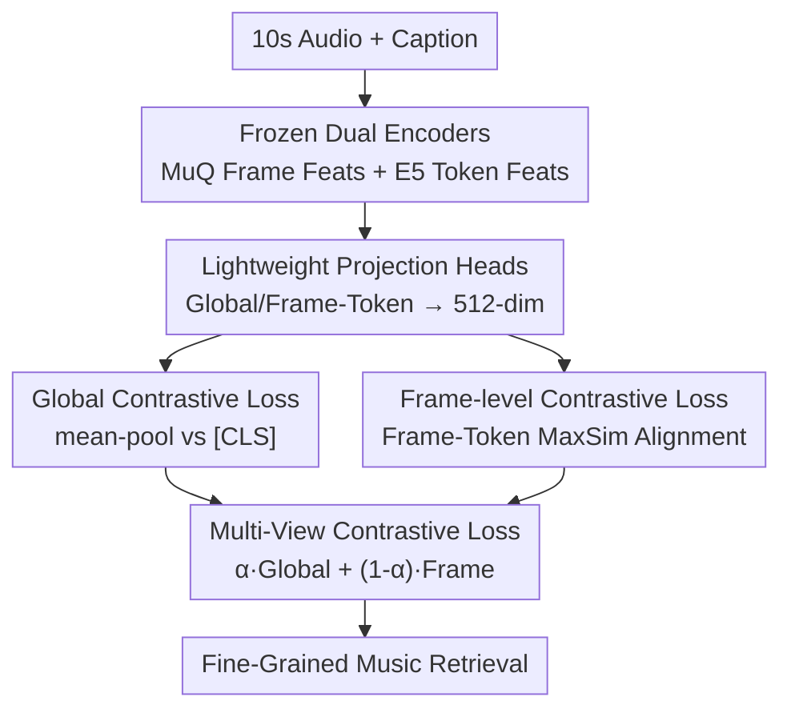

# FIGMA: Towards Fine-Grained Music Retrieval

**Conference**: ACL 2026  
**arXiv**: [2606.06615](https://arxiv.org/abs/2606.06615)  
**Code**: Project Page https://nishitanand.github.io/figma-website  
**Area**: Audio & Speech / Cross-Modal Retrieval  
**Keywords**: Fine-grained music retrieval, Contrastive learning, Frame-level alignment, Multi-view loss, Dataset construction

## TL;DR
To address the issue where CLAP-like music retrieval models "only utilize the first 40–50 tokens of a caption and collapse long descriptions into a bag-of-words," FIGMA introduces a frame-token level fine-grained contrastive loss (multi-view contrast) alongside the standard global contrastive loss. It also includes the FGMCaps dataset featuring 380k pairs with music theory annotations, enabling the model to retrieve music based on precise attributes like tempo, key, chords, and time signature, achieving a maximum relative improvement of 73.3%.

## Background & Motivation

**Background**: The dominant paradigm in music retrieval maps text queries and audio segments into the same representation space and aligns them using a contrastive objective—essentially an extension of CLIP to audio, known as CLAP. To address shortcomings in the music domain, specialized models such as MuLaN, CLAMP, and MuQ-MuLaN have been trained exclusively on music-text pairs.

**Limitations of Prior Work**: When queries are highly detailed (e.g., "a piece in F major, 110 BPM, 4/4 time"), these models often fail to retrieve the correct audio. The authors conducted a token truncation experiment: truncating captions to the first $k$ tokens ($k$ starting from 5, incrementing by 5) before retrieval. They found that Retrieval@1/5/10 saturated after $k$ exceeded approximately 40–50 tokens, meaning the fine-grained music theory information in longer descriptions was almost entirely ignored by the model. Furthermore, directly continuing the training of LAION-CLAP on the detail-rich FGMCaps dataset yielded extremely limited improvements.

**Key Challenge**: The problem lies within the standard contrastive learning objective itself. Existing architectures mean-pool audio along the temporal axis into a single $d$-dimensional vector and summarize text using a single `[CLS]` token, with the contrastive loss applied only between these two global vectors. This global aggregation discards the temporal structure of audio and the token-level distinctions in text. Consequently, long captions degenerate into a "bag-of-words"; even if attribute words are present, the model lacks a mechanism to align them with the corresponding acoustic segments in the audio.

**Core Idea**: In addition to global contrast, a **frame-level and token-level** contrastive loss is added to explicitly align each audio frame with tokens in the caption. This ensures that coarse-grained semantics and fine-grained music theory are simultaneously preserved within the same representation space.

## Method

### Overall Architecture
FIGMA utilizes two **frozen** pre-trained encoders as a backbone: the MuQ audio encoder (self-supervised pre-training) outputs frame-level features $H^{a}=f_{\mathrm{MuQ}}(A)\in\mathbb{R}^{B\times T\times 1024}$ ($T=250$ frames, corresponding to 10s of 24kHz audio), and the Microsoft multilingual E5-Large-Instruct text encoder outputs token-level features $H^{t}=g_{\mathrm{E5}}(T)\in\mathbb{R}^{B\times L\times 1024}$ ($L=128$). Global representations are extracted from these matrices (audio via mean-pooling to $\bar{h}^{a}$, text via the `[CLS]` token $\bar{h}^{t}$), while the full frame/token matrices are retained for fine-grained learning. Both sets of features are mapped to a shared 512-dimensional space via lightweight projection heads, followed by the application of a **multi-view contrastive loss** = global contrastive loss + frame-level contrastive loss. The entire training process only updates the projection heads (approx. 22M parameters), while the underlying encoders (approx. 800M parameters) remain frozen.

### Key Designs

**1. Frame-token contrastive loss: Grounding music theory details from long captions into acoustic frames**

This is the core of FIGMA's solution to "bag-of-words collapse." Beyond the standard global InfoNCE (which pulls paired audio-text mean-pool/`[CLS]` closer and pushes others in a batch away), the authors introduce a fine-grained loss calculated directly between the frame matrix $Z^{a}_{\mathrm{frame}}=[\mathbf{z}^{a}_{1},\dots,\mathbf{z}^{a}_{T}]$ and the token matrix $Z^{t}_{\mathrm{token}}=[\mathbf{z}^{t}_{1},\dots,\mathbf{z}^{t}_{L}]$. For each audio frame $t$, the **maximum similarity** (MaxSim, similar to ColBERT's late interaction) with all tokens of sample $j$ is calculated:

$$s_{i,t;j}=\max_{1\leq \ell\leq L}\mathrm{sim}\bigl(\mathbf{z}^{a}_{i,t},\,\mathbf{z}^{t}_{j,\ell}\bigr)$$

The frame-level similarity is then averaged across all frames $S_{\mathrm{frame\text{-}level}}(i,j)=\frac{1}{T}\sum_{t=1}^{T}s_{i,t;j}$, which is finally fed into a bidirectional InfoNCE (calculated for both audio→text and text→audio). The key to the max operation is that it automatically selects the best-matching token for each frame, mapping specific words like "110 BPM" or "F major" to the corresponding rhythmic or tonal frames in the audio—a fine-grained correspondence that mean-pooled global representations cannot achieve.

**2. Multi-view loss weighting: Global for semantics, frame-level for details**

Using frame-level loss alone would sacrifice overall semantic understanding (style, mood), while using global loss alone leads back to the bag-of-words problem. FIGMA linearly fuses the two using a hyperparameter $\alpha$:

$$\mathcal{L}_{\mathrm{Multi\text{-}View}}=\alpha\,\mathcal{L}_{\mathrm{global}}+(1-\alpha)\,\mathcal{L}_{\mathrm{frame}}$$

The authors explain that these two losses are complementary and necessary: the global loss provides an overall representation of the caption via `[CLS]`, helping the model learn that "this text overall corresponds to this audio"; the frame-level loss handles the alignment of fine-grained music-specific attributes. Empirically, $\alpha=0.6$ performs best—leaning slightly towards global but retaining enough weight for fine-grained details. The temperature $\tau$ is set to $0.07$. This "coarse + fine dual view" design allows the same representation space to contain both high-level semantics and frame-by-frame correspondences.

**3. Frozen dual encoders + lightweight projection heads: 22M parameters leveraging an 800M base**

FIGMA does not perform end-to-end pre-training. Instead, it freezes MuQ and E5 (totaling ~800M parameters) and trains only about 22M parameters in the projection heads. The audio and text projection heads each consist of two Transformer encoder layers (8 heads, FFN dimension 512) and a linear layer, mapping to 512 dimensions. Transformers are used instead of simple linear projections because the frame-level contrastive objective requires modeling the sequential dependencies of audio frames and text tokens. This contrasts with parallel work like FLAM, which uses a SigLIP-style BCE loss (requiring careful initialization of logit bias $\beta$ to counteract extreme 1:(B-1) positive/negative imbalance) and full model pre-training. FIGMA avoids this imbalance by using InfoNCE with implicit softmax normalization, leading to more stable training, robustness to hyperparameters, and significantly lower computational costs.

### Loss & Training
The global loss is a symmetric InfoNCE $\mathcal{L}_{\mathrm{global}}=\frac{1}{B}\sum_i \ell^{\mathrm{global}}_i$; the frame-level loss is a bidirectional InfoNCE $\mathcal{L}_{\mathrm{frame}}=\frac{1}{2B}\sum_i(\ell^{a\to t}_{i}+\ell^{t\to a}_{i})$; the total loss is weighted with $\alpha=0.6$. Training involves 15 epochs, batch size 256, Adam optimizer (lr $1\times10^{-4}$), early stopping, and $\tau=0.07$.

## Key Experimental Results

### Main Results
On the MusicBench test set, performing bidirectional retrieval (T2A text-to-audio, A2T audio-to-text), FIGMA achieves new SOTA results across all R@K metrics:

| Model | T2A R@1 | T2A R@10 | A2T R@1 | A2T R@10 |
|------|---------|----------|---------|----------|
| MuQ-MuLaN | 20.81 | 62.94 | 17.76 | 57.86 |
| M2D-CLAP | 25.38 | 70.05 | 36.55 (Second) | 75.63 |
| CLAMP 3 | 28.43 (Second) | 74.62 | 05.08 | 34.01 |
| LAION-CLAP (cont. train FGMCaps) | 10.66 | 48.73 | 13.71 | 52.79 |
| **FIGMA** | **34.52** | **81.73** | **39.09** | **80.71** |

In out-of-domain evaluation on the distribution-shifted FMACaps-Eval (from Free Music Archive), FIGMA's advantage is even more pronounced, which is the source of the claimed "maximum relative improvement of 73.3%":

| Model | T2A R@1 | T2A R@10 | A2T R@1 | A2T R@10 |
|------|---------|----------|---------|----------|
| MuQ-MuLaN | 04.10 | 17.80 | 03.90 | 19.10 |
| CLAMP 3 | 07.50 (Second) | 30.80 | 01.10 | 06.40 |
| LAION-CLAP (cont. train FGMCaps) | 06.10 | 26.50 | 06.00 (Second) | 30.10 |
| **FIGMA** | **13.00** | **37.60** | **13.20** | **42.90** |

Notably, continuing the training of LAION-CLAP on FGMCaps actually led to a regression in performance (MusicBench T2A R@1 of only 10.66), confirming that "having fine-grained data without a fine-grained alignment mechanism" is insufficient.

### Dataset Comparison
FGMCaps is the only music retrieval dataset at the 380k scale that simultaneously annotates chords, tempo, time signature, and key:

| Dataset | Training/Testing Samples | Chords | Tempo | Time Sig. | Key |
|--------|--------------|------|-------|------|------|
| MusicBench | 52,768 / 400 | ✓ | ✓ | ✓ | ✓ |
| Music4All | 108,042 / 0 | ✗ | ✓ | ✗ | ✓ |
| MTG-Jamendo | 48,709 / 2,707 | ✗ | ✗ | ✗ | ✗ |
| **FGMCaps** | **380,878 / 10,000** | ✓ | ✓ | ✓ | ✓ |

### Key Findings
- **Frame-level loss is the primary performance driver**: Removing it reverts the model to pure global contrastive learning, matching the baselines that saturate at 40–50 tokens. Adding it allows fine-grained queries to be truly utilized.
- **$\alpha=0.6$ is optimal**: It leans slightly towards global representation while retaining fine-grained details; pure frame-level loss loses high-level semantics.
- **Data $\neq$ Alignment Mechanism**: Continuing the training of LAION-CLAP on FGMCaps resulted in a performance drop, indicating that the bottleneck is the loss design rather than data volume.
- **Out-of-domain evaluation highlights the gap**: The 73.3% relative improvement on FMACaps-Eval suggests that frame-token alignment learns transferable attribute correspondences rather than dataset biases.

## Highlights & Insights
- The phenomenon of "long captions being underutilized" was quantified using token truncation curves, identifying information collapse in global mean-pool/`[CLS]` representations. This provides solid diagnosis and specific motivation.
- Adapting the ColBERT-style MaxSim late interaction for frame-token alignment is an elegant migration of mature fine-grained matching concepts from the retrieval field to the audio-text domain. This can be reused for other cross-modal retrieval tasks requiring fine-grained alignment.
- Using InfoNCE instead of FLAM's SigLIP-BCE avoids positive/negative sample imbalance, ensuring stability and reducing hyperparameter tuning—a noteworthy engineering trade-off.
- Training only a 22M projection head while freezing the 800M backbone demonstrates that "fine-grained capabilities can be appended to frozen representations," which is highly beneficial for compute-constrained scenarios.

## Limitations & Future Work
- Frame-level MaxSim requires calculating similarity across all tokens for every frame, resulting in $O(T\times L)$ complexity that grows with the number of frames or tokens, increasing costs for long audio or text.
- Music theory labels in FGMCaps were automatically extracted using BeatNet/Omnizart/Essentia. These tools have inherent errors (the paper notes <0.5% extraction failure and a requirement for key confidence >0.5), and label noise may propagate to training.
- Captions are generated by Qwen3-Next-80B and were required to be "objective without subjective descriptions," resulting in a relatively uniform style. The diversity of real-world user queries (colloquialisms, vague expressions) is limited.
- Evaluation remains focused on 10-second segments; retrieval of full tracks or structures that change over time has not yet been addressed.

## Related Work & Insights
- **vs CLAP / MuQ-MuLaN**: These models perform contrast only on global mean-pool/`[CLS]`, causing long captions to collapse into a bag-of-words. FIGMA adds frame-token alignment to preserve fine-grained details, distinguished by the existence of a fine-grained alignment pathway.
- **vs FLAM**: While both combine global and frame-level alignment, FLAM uses SigLIP-BCE (requiring logit bias $\beta$ tuning) and full model pre-training. FIGMA uses InfoNCE and trains only projection heads, making it more stable and efficient.
- **vs LAION-CLAP Finetuning**: This proved that finetuning on fine-grained data alone does not solve the problem; the mechanism (loss design) is more critical than the data itself.

## Rating
- Novelty: ⭐⭐⭐⭐ Frame-token MaxSim alignment is systematized for the first time in music retrieval, though the late interaction concept is borrowed from the general retrieval literature.
- Experimental Thoroughness: ⭐⭐⭐⭐ Multiple baselines, bidirectional retrieval, in-domain and out-of-domain evaluation, plus a new dataset; ablation could be further detailed.
- Writing Quality: ⭐⭐⭐⭐ Clear chain of diagnosis—motivation—methodology; the token truncation experiment is highly persuasive.
- Value: ⭐⭐⭐⭐ Task formalization + 380k scale dataset + reusable alignment mechanism; a substantial contribution to the music retrieval community.

<!-- RELATED:START -->

## Related Papers

- [\[ACL 2026\] SegTune: Structured and Fine-Grained Control for Song Generation](segtune_structured_and_fine-grained_control_for_song_generation.md)
- [\[ACL 2026\] Towards Fine-Grained and Multi-Granular Contrastive Language-Speech Pre-training](towards_fine-grained_and_multi-granular_contrastive_language-speech_pre-training.md)
- [\[ICML 2026\] MECAT: A Multi-Experts Constructed Benchmark for Fine-Grained Audio Understanding Tasks](../../ICML2026/audio_speech/mecat_a_multi-experts_constructed_benchmark_for_fine-grained_audio_understanding.md)
- [\[CVPR 2026\] FoleyDirector: Fine-Grained Temporal Steering for Video-to-Audio Generation via Structured Scripts](../../CVPR2026/audio_speech/foleydirector_fine-grained_temporal_steering_for_video-to-audio_generation_via_s.md)
- [\[AAAI 2026\] MF-Speech: Achieving Fine-Grained and Compositional Control in Speech Generation via Factor Disentanglement](../../AAAI2026/audio_speech/mf-speech_achieving_fine-grained_and_compositional_control_in_speech_generation_.md)

<!-- RELATED:END -->
