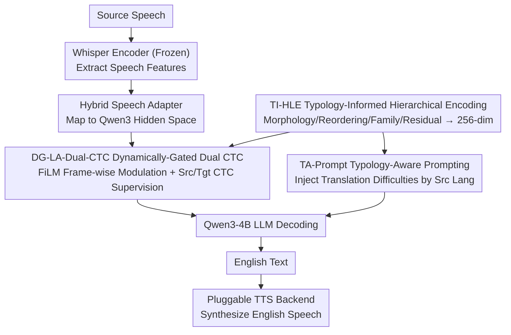

# From Flat Language Labels to Typological Priors: Structured Language Conditioning for Multilingual Speech-to-Speech Translation

**Conference**: ACL2026 Findings  
**arXiv**: [2605.16026](https://arxiv.org/abs/2605.16026)  
**Code**: No public code (repository not provided in cache)  
**Area**: Speech Translation / Multilingual S2ST / SpeechLLM  
**Keywords**: Speech-to-Speech Translation, Typological Priors, Multilingual Conditioning, Dual-CTC, Low-resource Adaptation  

## TL;DR
This paper introduces S2ST-Omni 2, which replaces flat language labels in multilingual speech translation with structured typological priors. These priors are injected across three levels: representation, acoustic modulation, and LLM decoding. The approach achieves improvements in BLEU, ASR-BLEU, COMET, and BLASER 2.0 on CVSS-C, with significant gains for low-resource languages and those with high typological divergence.

## Background & Motivation
**Background**: Multilingual speech-to-speech translation (S2ST) can be implemented via ASR-MT-TTS cascade systems or end-to-end/compositional S2ST. Recent SpeechLLMs have made compositional S2ST more attractive: the front-end converts source speech to target text, and a back-end TTS synthesizes the target speech, enabling modularity and resource reuse across speech and text.

**Limitations of Prior Work**: Existing systems like S2ST-Omni typically treat the source language as a flat label or an independent embedding. This informs the model of the specific language identity (e.g., "German/French/Spanish") but fails to explicitly represent shared structural patterns such as morphology, word order, or genealogical links. In low-resource S2ST, models struggle to learn these patterns from limited supervised data alone.

**Key Challenge**: Multilingual models must both distinguish specific languages and share cross-lingual structures. Flat labels provide identity without transferable typological structure, while relying entirely on data-driven learning is unreliable in low-resource scenarios.

**Goal**: The authors aim to reconstruct the language conditioning pathway without major changes to the S2ST-Omni backbone, representing the source language as interpretable typological priors to verify if these priors enhance data efficiency and translation quality.

**Key Insight**: Language conditioning is divided into three layers: a typology-informed hierarchical language encoding at the representation layer, a dynamically-gated language-aware Dual-CTC at the acoustic layer, and typology-aware LLM prompting at the decoding layer.

**Core Idea**: The source language is represented by a combination of morphology, reordering requirements, genealogical lineage, and residual language features. These structured conditions influence intermediate acoustic features, auxiliary CTC alignment, and LLM translation prompts.

## Method
S2ST-Omni 2 retains the compositional framework of S2ST-Omni: a Whisper encoder extracts source speech features, a hybrid speech adapter maps them to the hidden space of Qwen3 LLM, Qwen3-4B decodes them into English text, and a pluggable TTS backend synthesizes English speech. The modifications are concentrated on the language conditioning pathway rather than the entire system backbone.

### Overall Architecture
Input is source language speech; output is English speech. During training, source language labels are ground truth; during inference, the source language is predicted from Whisper encoder representations. Three types of typological conditions are added internally: TI-HLE generates a structured language vector, DG-LA-Dual-CTC performs language-aware modulation on adapter features with Dual-CTC supervision, and TA-Prompt adds language-level translation hints during LLM decoding. During inference, auxiliary branches of TI-HLE and DG-LA-Dual-CTC are discarded to maintain the standard acoustic forward path; the main difference is the selection of a typology-aware prompt based on the predicted source language.

### Key Designs
**1. Typology-Informed Hierarchical Language Encoding: Decomposing Language IDs into Sharable, Interpretable Vectors**

While S2ST-Omni treats the source language as a flat label, TI-HLE describes each language using four channels: a morphology profile, an English-oriented reordering profile, a genealogical family, and a language-specific residual. The embedding dimensions for these four channels are 64, 64, 64, and 128, respectively, which are concatenated into 320 dimensions and then projected to a 256-dimensional language representation. The first three channels encode transferable structural priors (e.g., French and Spanish sharing the Romance family and SVO order; German as Germanic and Japanese as Japonic both requiring stronger reordering hints for clause-final structures). The residual channel retains language-specific traits that do not fit into typological buckets.

**2. Dynamically-Gated Language-Aware Dual-CTC: Injecting Typological Conditions Frame-wise while Maintaining Alignment**

Static language vectors are insufficient; they must affect intermediate acoustic representations dynamically across frames. DG-LA-Dual-CTC uses a FiLM generator to produce modulation parameters $\gamma, \beta$ based on the language representation. A dynamic frame gate $g_t$ is calculated from per-frame acoustic features and the language representation to modulate the source-side adapter features: $\tilde{h}^{src}_t=(1+g_t\gamma)\odot h^{down}_t+g_t\beta$. Source-side CTC supervises these modulated features, while target-side CTC supervises unmodulated features, balancing language awareness and target alignment.

**3. Typology-Aware LLM Prompting & Progressive Fine-tuning: Explicitly Communicating Translation Challenges to the LLM**

While acoustic conditioning handles "listening and alignment," TA-Prompt addresses "natural translation" at the decoding layer. TA-Prompt provides a targeted hint for each source language: German prompts emphasize compound word decomposition and clause-final reordering; Japanese prompts highlight SOV→SVO, pro-drop, and honorific normalization; French/Spanish prompts focus on idiom and lexical usage. A two-stage progressive fine-tuning is used: first stabilizing speech-text alignment, then inserting LoRA into Qwen3 self-attention to enhance translation capabilities.

### Loss & Training
Both training stages freeze the Whisper encoder and Qwen3 base parameters while updating the hybrid adapter, TI-HLE, and DG-LA-Dual-CTC. The Stage I objective is $\mathcal{L}^{(1)}=\mathcal{L}_{CE}+\lambda^{(1)}_{src}\mathcal{L}^{src}_{CTC}+\lambda^{(1)}_{tgt}\mathcal{L}^{tgt}_{CTC}$, with source/target CTC weights set to 0.1/0.2. Stage II inserts LoRA (rank=8, $\alpha=32$) into Qwen3 query/value projections and reduces CTC weights to 0.01/0.05, treating CTC primarily as alignment regularization.

Training utilized Whisper-Large-V3 and Qwen3-4B with an effective batch size of 24 and bf16 precision on two NVIDIA A6000 GPUs. The main experiments were conducted on CVSS-C, training a many-to-one multilingual front-end covering French, German, and Spanish to English (approx. 561 hours of supervised data).

## Key Experimental Results

### Main Results

| Model | Fr→En BLEU / ASR-BLEU | De→En BLEU / ASR-BLEU | Es→En BLEU / ASR-BLEU | Avg BLEU | Avg ASR-BLEU |
|------|------------------------|------------------------|------------------------|----------|--------------|
| RosettaSpeech | 33.11 / 32.16 | 23.22 / 21.54 | 30.92 / 29.35 | 29.08 | 27.68 |
| S2ST-Omni | 35.83 / 33.20 | 33.34 / 31.25 | 37.85 / 35.90 | 35.67 | 33.45 |
| S2ST-Omni 2 (Ours) | 37.83 / 34.72 | 35.70 / 33.16 | 39.62 / 37.13 | 37.73 | 35.00 |
| Whisper-Qwen S2TT reference | 35.15 / - | 36.07 / - | 38.39 / - | 36.54 | - |

### Ablation Study

| Configuration | Avg BLEU | Avg ASR-BLEU | Description |
|------|----------|--------------|--------------------|
| S2ST-Omni 2 | 37.73 | 35.00 | Full typological conditions |
| w/o DG | 36.96 | 34.07 | Dynamic gate replaced by static gate (-0.77 BLEU) |
| w/o TA-Prompt | 36.80 | 33.96 | Typological prompt removed (-0.93 BLEU) |
| w/o TI-HLE | 36.09 | 33.68 | Structured representation replaced by 320-dim flat embedding (Largest drop) |
| w/o Morph | 36.23 | 33.75 | Morphology channel removed |
| w/o Reorder | 36.60 | 33.94 | Reordering channel removed |
| w/o Family | 36.44 | 33.87 | Family channel removed |
| w/o Residual | 36.21 | 33.74 | Language-specific residual channel removed |

### Key Findings
- Compared to S2ST-Omni, S2ST-Omni 2 improves average BLEU from 35.67 to 37.73 (+5.8% relatively) and average ASR-BLEU from 33.45 to 35.00 (+4.6% relatively).
- Average COMET increased from 82.02 to 83.31, and BLASER 2.0 improved from 4.14 to 4.24.
- Advantages are more pronounced under low-resource budgets: when training data was reduced from 561 to 30 hours, absolute BLEU gains increased from +2.06 to +3.93, a relative improvement of ~15.1%.
- In a Japanese-to-English experiment with only ~3 hours of supervision, S2ST-Omni 2 outperformed S2ST-Omni across all metrics (e.g., BLEU 22.00 vs 19.61).
- While TTS backends affect ASR-BLEU, the system demonstrated consistent gains across six different synthesizers (ASR-BLEU ranging 33.87 to 35.00).

## Highlights & Insights
- The core innovation lies in shifting the language label from a "categorical ID" to a "structural shared prior." This provides transferable bias crucial for low-resource tasks.
- The residual channel in TI-HLE is essential to avoid "over-typologization," preserving language-specific nuances that cannot be categorized into universal profiles.
- DG-LA-Dual-CTC demonstrates that typological priors should influence acoustic alignment during training, not just text generation via prompts.
- Qualitative analysis shows significant benefits for German compound words, Spanish passive structures, and French idioms.

## Limitations & Future Work
- Main experiments focus on CVSS-C (Fr/De/Es to En); Japanese was only a small-scale supplement.
- Typological profiles are manually grouped and English-centric, which may not scale perfectly to more systematic linguistic classifications.
- The current many-to-one task does not yet address many-to-many S2ST or how to design reordering profiles for non-English target languages.
- TTS backends still cause fluctuations in ASR-BLEU, suggesting that E2E speech quality remains partially constrained by synthesizer stability.
- Future work could integrate automated typological databases (e.g., WALS) and learned language similarity to reduce manual engineering.

## Related Work & Insights
- **vs S2ST-Omni**: Improves on S2ST-Omni by restructuring the conditioning path rather than the backbone, proving the value of information representation.
- **vs Cascaded ASR-MT-TTS**: While cascades are modular, S2ST-Omni 2 outperforms the Whisper-Qwen S2TT reference, mitigating error propagation while maintaining modularity.
- **vs End-to-End S2ST**: Compositional designs like this maintain TTS pluggability and allow for clearer analysis of how language conditions affect front-end features.

## Rating
- Novelty: ⭐⭐⭐⭐☆ Target-oriented typological priors for SpeechLLM S2ST are well-motivated and executed.
- Experimental Thoroughness: ⭐⭐⭐⭐☆ Covers main results, ablations, TTS variations, and low-resource data scaling.
- Writing Quality: ⭐⭐⭐⭐☆ Clear motivation and module decomposition.
- Value: ⭐⭐⭐⭐☆ Highly practical for low-resource multilingual speech translation.

<!-- RELATED:START -->

## Related Papers

- [\[ICLR 2026\] Scalable Multilingual Multimodal Machine Translation with Speech-Text Fusion](../../ICLR2026/audio_speech/scalable_multilingual_multimodal_machine_translation_with_speech-text_fusion.md)
- [\[ACL 2025\] Leveraging Unit Language Guidance to Advance Speech Modeling in Textless Speech-to-Speech Translation](../../ACL2025/audio_speech/leveraging_unit_language_guidance_to_advance_speech_modeling_in_textless_speech-.md)
- [\[ICLR 2026\] UniSS: Unified Expressive Speech-to-Speech Translation with Your Voice](../../ICLR2026/audio_speech/uniss_unified_expressive_speech-to-speech_translation_with_your_voice.md)
- [\[ACL 2026\] Closing the Modality Reasoning Gap for Speech Large Language Models](closing_the_modality_reasoning_gap_for_speech_large_language_models.md)
- [\[ACL 2026\] Towards Fine-Grained and Multi-Granular Contrastive Language-Speech Pre-training](towards_fine-grained_and_multi-granular_contrastive_language-speech_pre-training.md)

<!-- RELATED:END -->
