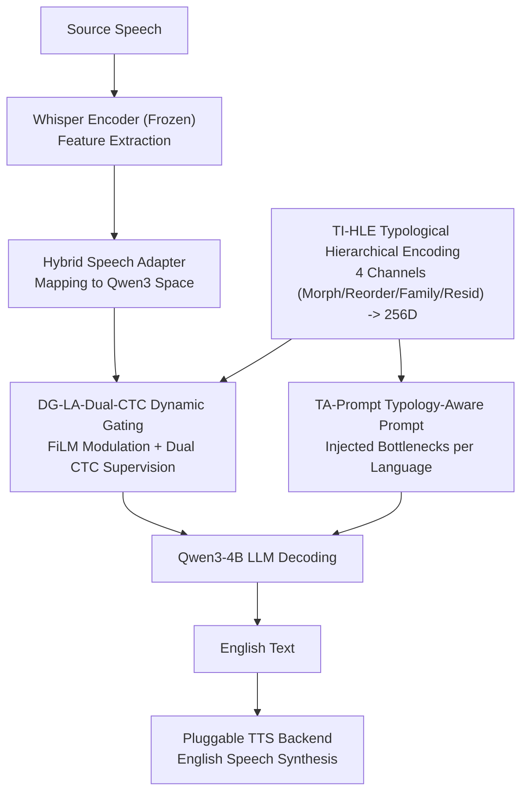

# From Flat Language Labels to Typological Priors: Structured Language Conditioning for Multilingual Speech-to-Speech Translation

**Conference**: ACL2026 Findings  
**arXiv**: [2605.16026](https://arxiv.org/abs/2605.16026)  
**Code**: No public code (repository not provided in cache)  
**Area**: Speech Translation / Multilingual S2ST / SpeechLLM  
**Keywords**: Speech-to-Speech Translation, Typological Priors, Multilingual Conditioning, Dual-CTC, Low-resource Adaptation  

## TL;DR
This paper proposes S2ST-Omni 2, which replaces flat language labels in multilingual speech translation with structured typological priors. These priors are injected across the representation, acoustic modulation, and LLM decoding layers, improving BLEU, ASR-BLEU, COMET, and BLASER 2.0 on CVSS-C, specifically for low-resource and typologically distant languages.

## Background & Motivation
**Background**: Multilingual speech-to-speech translation (S2ST) can utilize cascaded ASR-MT-TTS systems or end-to-end/compositional S2ST. Recently, SpeechLLMs have made compositional S2ST more attractive: the front end converts source speech to target text, and a back-end TTS synthesizes target speech, enabling modularity and reuse of speech/text resources.

**Limitations of Prior Work**: Existing systems like S2ST-Omni typically treat the source language as a flat label or an independent embedding. While this identifies the language (e.g., German/French/Spanish), it fails to explicitly represent shared structural regularities such as morphology, word order, and genealogy. In low-resource S2ST, models struggle to learn these patterns from sparse supervised data alone.

**Key Challenge**: Multilingual models must both distinguish specific languages and share cross-lingual structures. Flat labels provide identity without transferable typological structures, while relying entirely on data-driven learning is unreliable in low-resource scenarios.

**Goal**: The authors aim to reconstruct the language conditioning pathway—without major changes to the S2ST-Omni backbone—representing the source language as interpretable typological priors to verify improvements in data efficiency and translation quality.

**Key Insight**: The paper decomposes language conditioning into three layers: typology-informed hierarchical language encoding at the representation layer, dynamically-gated language-aware Dual-CTC at the acoustic layer, and typology-aware LLM prompting at the decoding layer.

**Core Idea**: Each source language is represented by morphology, reordering requirements, lineage, and residual features. These structured conditions influence intermediate acoustic features, auxiliary CTC alignment, and LLM translation prompts.

## Method
S2ST-Omni 2 retains the compositional framework of S2ST-Omni: a Whisper encoder extracts source speech features, a hybrid speech adapter maps them to the hidden space of Qwen3 LLM, Qwen3-4B decodes them into English text, and a pluggable TTS backend synthesizes the final English speech. The modifications focus on the language conditioning pathway.

### Overall Architecture
The input is source speech and the output is English speech. During training, source language labels are ground truth; during inference, they are predicted from Whisper encoder representations. The system adds three types of typological conditions: TI-HLE generates structured language vectors, DG-LA-Dual-CTC performs language-aware modulation on intermediate adapter features with auxiliary CTC supervision, and TA-Prompt adds language-level translation prompts during LLM decoding. During inference, auxiliary branches for TI-HLE and DG-LA-Dual-CTC are discarded to maintain the standard acoustic path; the primary difference is selecting the typology-aware prompt based on the predicted language.

### Key Designs
**1. Typology-Informed Hierarchical Language Encoding: Decomposing Language IDs into Interpretable Vectors**

Rather than a flat ID, TI-HLE describes each language via four channels: a morphological profile, an English-oriented reordering profile, genealogical family, and a language-specific residual. The embeddings (dimensions 64, 64, 64, 128) are concatenated and projected into a 256D representation. The first three channels encode transferable structural priors (e.g., French and Spanish shared Romance/SVO traits; Japanese SOV reordering needs), while the residual channel preserves unique nuances that do not fit into typological buckets.

**2. Dynamically-Gated Language-Aware Dual-CTC: Frame-level Acoustic Modulation**

To ensure typological conditions truly affect acoustic representations without being applied uniformly across the entire utterance, DG-LA-Dual-CTC uses a FiLM generator to create modulation parameters $\gamma, \beta$ based on the language vector. A dynamic frame gate $g_t$ is calculated per frame to modulate the adapter features: $\tilde{h}^{src}_t=(1+g_t\gamma)\odot h^{down}_t+g_t\beta$. Source-side CTC supervises these modulated features, while target-side CTC supervises unmodulated features, balancing language awareness with target alignment.

**3. Typology-Aware LLM Prompting & Progressive Fine-tuning**

Acoustic conditions handle "understanding and alignment," while TA-Prompt ensures natural translation at the decoding layer. Specific prompts are used for each language (e.g., German compounding and clause-final reordering; Japanese SOV-to-SVO and honorific normalization). Training follows a two-stage progressive fine-tuning: first stabilizing speech-text alignment, then inserting LoRA into Qwen3 self-attention to enhance translation.

### Loss & Training
Both stages freeze the Whisper encoder and Qwen3 base, updating the adapter, TI-HLE, and DG-LA-Dual-CTC. Stage I objective: $\mathcal{L}^{(1)}=\mathcal{L}_{CE}+\lambda^{(1)}_{src}\mathcal{L}^{src}_{CTC}+\lambda^{(1)}_{tgt}\mathcal{L}^{tgt}_{CTC}$ (weights 0.1/0.2). Stage II introduces LoRA (rank 8, $\alpha=32$) and reduces CTC weights to 0.01/0.05. The model uses Whisper-Large-V3, Qwen3-4B, and is trained on CVSS-C (many-to-one translation from Fr, De, Es to En, ~561 hours).

## Key Experimental Results

### Main Results

| Model | Fr→En BLEU / ASR-BLEU | De→En BLEU / ASR-BLEU | Es→En BLEU / ASR-BLEU | Avg BLEU | Avg ASR-BLEU |
| :--- | :--- | :--- | :--- | :--- | :--- |
| RosettaSpeech | 33.11 / 32.16 | 23.22 / 21.54 | 30.92 / 29.35 | 29.08 | 27.68 |
| S2ST-Omni | 35.83 / 33.20 | 33.34 / 31.25 | 37.85 / 35.90 | 35.67 | 33.45 |
| **S2ST-Omni 2 (Ours)** | **37.83 / 34.72** | **35.70 / 33.16** | **39.62 / 37.13** | **37.73** | **35.00** |
| Whisper-Qwen S2TT ref | 35.15 / - | 36.07 / - | 38.39 / - | 36.54 | - |

### Ablation Study

| Configuration | Avg BLEU | Avg ASR-BLEU | Description |
| :--- | :--- | :--- | :--- |
| S2ST-Omni 2 | 37.73 | 35.00 | Full typological conditions |
| w/o DG | 36.96 | 34.07 | Static instead of dynamic gating |
| w/o TA-Prompt | 36.80 | 33.96 | Removed typological prompts |
| w/o TI-HLE | 36.09 | 33.68 | Flat 320D embedding instead of hierarchy |
| w/o Morph / Reorder / Family | ~36.4 | ~33.8 | Removal of specific channels |

### Key Findings
- S2ST-Omni 2 improves average BLEU from 35.67 to 37.73 (+5.8%) and ASR-BLEU from 33.45 to 35.00 (+4.6%) compared to S2ST-Omni.
- Significant gains in low-resource scenarios: with 30-hour data budgets, the relative BLEU gain increases to ~15.1% compared to a flat label baseline.
- In a Japanese-to-English experiment (~3 hours of data), S2ST-Omni 2 outperformed S2ST-Omni across BLEU (22.00 vs 19.61) and COMET (80.31 vs 78.29).
- The system is robust across different TTS backends, with improvements not tied to a specific synthesizer.

## Highlights & Insights
- Transforming language labels from "ID categories" to "structural priors" provides a transferable bias essential for low-resource multilingual tasks.
- The residual channel in TI-HLE is crucial to prevent "over-typologization," capturing language-specific traits that fall outside standard linguistic buckets.
- Dynamic gating proves that language structure influences not just text generation but also how acoustic features are aligned and compressed.

## Limitations & Future Work
- The main experiments are limited to French, German, and Spanish; Japanese is treated as a supplementary low-resource case.
- Typological profiles are manually designed for manual English-translation; a more systematic schema is needed for broader scaling.
- The performance of E2E S2ST still fluctuates with different TTS backends (up to 1.13 ASR-BLEU variance).
- Future work could integrate automated typological databases (e.g., WALS) to reduce manual profile design.

## Related Work & Insights
- **vs. S2ST-Omni**: S2ST-Omni 2 demonstrates that representing language information structurally yields significantly better results using the same backbone.
- **vs. Cascaded ASR-MT-TTS**: While cascaded systems are modular, S2ST-Omni 2 outperforms the Whisper-Qwen S2TT reference, mitigating error propagation through a unified front-end.

## Rating
- Novelty: ⭐⭐⭐⭐☆ (Strong application of typological priors for SpeechLLM S2ST).
- Experimental Thoroughness: ⭐⭐⭐⭐☆ (Covers main results, ablations, TTS backends, and data scaling).
- Writing Quality: ⭐⭐⭐⭐☆ (Clear logic and modular breakdowns).
- Value: ⭐⭐⭐⭐☆ (Practical for low-resource multilingual speech translation).

<!-- RELATED:START -->

<!-- RELATED:END -->

## Related Papers

- [\[ICLR 2026\] Scalable Multilingual Multimodal Machine Translation with Speech-Text Fusion](../../ICLR2026/audio_speech/scalable_multilingual_multimodal_machine_translation_with_speech-text_fusion.md)
- [\[ACL 2025\] Leveraging Unit Language Guidance to Advance Speech Modeling in Textless Speech-to-Speech Translation](../../ACL2025/audio_speech/leveraging_unit_language_guidance_to_advance_speech_modeling_in_textless_speech-.md)
- [\[ACL 2026\] Closing the Modality Reasoning Gap for Speech Large Language Models](closing_the_modality_reasoning_gap_for_speech_large_language_models.md)
- [\[ACL 2026\] Towards Fine-Grained and Multi-Granular Contrastive Language-Speech Pre-training](towards_fine-grained_and_multi-granular_contrastive_language-speech_pre-training.md)
- [\[ACL 2026\] Do We Need Distinct Representations for Every Speech Token? Unveiling and Exploiting Redundancy in Large Speech Language Models](do_we_need_distinct_representations_for_every_speech_token_unveiling_and_exploit.md)

<!-- RELATED:END -->
