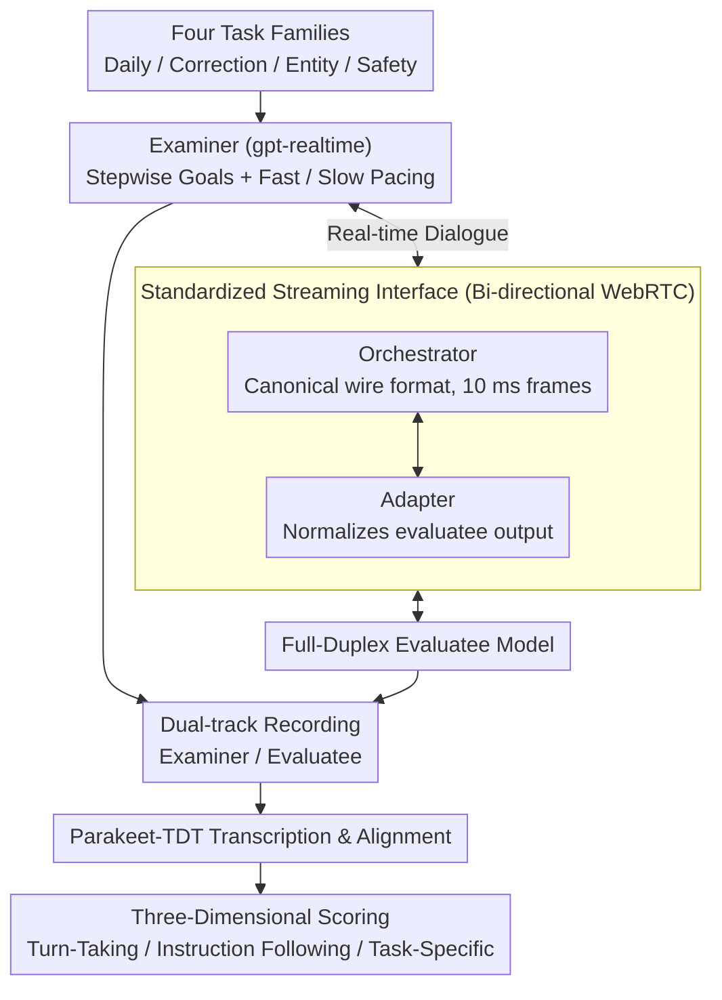

# Full-Duplex-Bench-v2: A Multi-Turn Evaluation Framework for Duplex Dialogue Systems with an Automated Examiner

**Conference**: ACL 2026  
**arXiv**: [2510.07838](https://arxiv.org/abs/2510.07838)  
**Code**: <https://github.com/DanielLin94144/Full-Duplex-Bench>  
**Area**: Dialogue / Full-Duplex Speech / Evaluation Benchmark  
**Keywords**: Full-duplex dialogue, multi-turn evaluation, LLM-as-judge, WebRTC streaming orchestration, turn-taking

## TL;DR
The authors propose Full-Duplex-Bench-v2, where a GPT-Realtime-powered Examiner interacts with full-duplex models in real-time via WebRTC across four task categories (Daily/Correction/Entity/Safety) and two pacing modes (Fast/Slow). Evaluation scores cover turn-taking, instruction-following, and task-specific dimensions. Findings reveal that performance for GPT-Realtime, Moshi, and Freeze-Omni degrades as dialogues progress, with open-source models performing particularly poorly on correction and entity tracking.

## Background & Motivation
**Background**: Traditional spoken dialogue systems are half-duplex—one person speaks only after the other finishes—which is simple but results in high latency and lack of naturalness. Recently, numerous full-duplex solutions have emerged: cascaded systems (ASR+LLM+TTS with FSM, e.g., MiniCPM-Duplex) and end-to-end models (dGSLM, SyncLLM, Moshi, NTPP, SCoT). These models claim "listen-while-speak" capabilities, theoretically approaching human conversation rhythms.

**Limitations of Prior Work**: ① Human Evaluation: Natural but expensive and non-reproducible; ② Corpus-level statistics (pause, floor-transfer offset): Scalable but lack semantic insight; ③ Classifiers (Talking Turns): Automated but limited by training data generalization; ④ Existing Full-Duplex-Bench v1/v1.5: The first streaming benchmarks, but restricted to single-turn, scripted scenarios focusing on "instantaneous" behaviors like pause, interrupt, and backchannel.

**Key Challenge**: Real human dialogue is multi-turn; success depends not just on single turn-taking events but on maintaining context consistency, task progression, and information retrieval across multiple exchanges. Existing benchmarks almost entirely stop at single turns; whether full-duplex models can sustain multi-turn interaction has not been systematically quantified.

**Goal**: ① Advance evaluation from "scripted single-turn" to "real multi-turn streaming"; ② Preserve naturalism without relying on human raters (the Examiner improvises, follows up, and adjusts based on the evaluatee's responses); ③ Propose metrics to distinguish between turn-taking, instruction-following, and task-specific competence.

**Key Insight**: The authors observe that GPT-Realtime is a stable, low-latency speech model capable of strict role-play, making it suitable as an "Automated Examiner." This bypasses the bottleneck of "human as a dialogue partner" and allows multi-turn evaluation to be mass-reproducible.

**Core Idea**: A streaming-native multi-turn full-duplex evaluation framework composed of a spoken-LM Examiner, a WebRTC orchestrator, staged multi-turn task scripts, and an LLM-as-judge scorer.

## Method

### Overall Architecture
FDB-v2 aims to answer a question that has not been systematically quantified: whether full-duplex speech models can sustain an entire multi-turn conversation rather than just responding well in a single turn. It organizes evaluation into a real-time tripartite loop: a GPT-Realtime-driven Examiner advances the dialogue based on pre-set sub-goals and interrupts proactively when necessary; a WebRTC Orchestrator maintains two peer connections, enforcing a canonical wire format for audio transmission; and the evaluatee model connects via an adapter to normalize its audio stream. Each session starts with the Examiner, follows stepwise goals, and ends with a fixed closing statement. Dual-track recordings (one for the Examiner, one for the Evaluatee) are transcribed via Parakeet-TDT and then evaluated by Gemini-2.5-flash.

### Key Designs

**1. Stepwise Semantic Goals + Two Examiner Paces: Transforming "Free Chat" into Structured Diagnostics**
Multi-turn evaluation often suffers from becoming unstructured casual chat where success is hard to define. The authors decompose each scenario into several steps, each with a clear semantic goal. The Examiner advances only when the current goal is met; otherwise, it paraphrases or asks follow-up questions. Furthermore, two pacing modes are introduced: in Fast mode, the Examiner proactively interrupts, provides backchannels, and transitions immediately after a stage; in Slow mode, it intervenes only after the evaluatee stops speaking or pauses excessively. These pacing modes separate two types of failures—Fast mode pressures turn-taking coordination (can the model handle interruptions?), while Slow mode tests the limits of memory and entity tracking (does the context drift over time?).

**2. Adapter–Orchestrator–Adapter Standardized Interface: Audio Protocols as Public Interfaces**
The primary engineering hurdle for full-duplex evaluation is the variability of audio interfaces (chunked WebSocket, RTSP, SDK callbacks). The solution is a mandatory canonical wire format enforced by the Orchestrator (48 kHz, 16-bit, mono PCM, strict 10 ms frames = 960 bytes). Evaluatee models only require an adapter to normalize their output to this format and pad silence during buffer under-runs. This decouples the transmission protocol from the task scripts, allowing the benchmark to evolve independently—akin to a unified OpenAI Gym interface for full-duplex systems.

**3. Four Task Families + Three-Dimensional LLM-as-judge Scoring: Disentangling Fluency, Obedience, and Accuracy**
Tasks cover four core multi-turn challenges: Daily (reservations, planning, troubleshooting), Correction (multi-turn self-correction, e.g., "I want a cold coffee" → "Oh, please make it hot"), Entity Tracking (switching references via ordinal/attribute/landmark, e.g., "the quieter one" → "the one near the park"), and Safety (11 policy alignment scenarios across health, privacy, illegal acts, etc.). For scoring, a Gemini judge assesses three dimensions simultaneously: Turn-Taking Fluency (1-5/event), Instruction Following (1-5/event), and Task-Specific Metric (1-5/dialogue). This decomposition distinguishes failure modes such as being "fluent but shallow" versus being "accurate but stuttering." Task-specific metrics are customized—Entity focuses on reference consistency, Correction on proper update application, and Safety on boundary maintenance under pressure.

### Loss & Training
FDB-v2 is an evaluation framework and does not involve training. Scoring utilizes Gemini-2.5-flash-preview-09-2025, following the finding by Chang et al. (2025) that Gemini scores for turn-taking correlate highly with human judgment. ASR is handled by Parakeet-TDT-0.6B-v2 for time-aligned transcription. The Examiner always uses GPT-Realtime to ensure zero variance on the examiner side across different model tests.

## Key Experimental Results

### Main Results

| Pace | System | Correction | Entity | Safety |
|------|------|-----------|--------|--------|
| Fast | Freeze-Omni | 2.74 | 2.62 | 3.94 |
| Fast | Moshi | 2.88 | 2.76 | 3.67 |
| Fast | GPT-Realtime | **4.02** | **4.51** | **4.44** |
| Slow | Freeze-Omni | 3.50 | 2.86 | 4.27 |
| Slow | Moshi | 3.46 | 3.84 | 3.51 |
| Slow | GPT-Realtime | 3.94 | 4.12 | **4.53** |

GPT-Realtime maintains $\ge 4.0$ across all Fast tasks, whereas open-source models score $< 3.0$ in Fast Correction/Entity. Slow mode provides significant breathing room for open-source models (Moshi Entity +1.08, Freeze-Omni Correction +0.76).

### Ablation Study / Human Alignment

| Metric | Krippendorff $\alpha$ | Pearson $r$ |
|------|---------------------|-------------|
| Turn-Taking Fluency | 0.6143 | 0.6137 |
| Instruction Following | 0.6833 | 0.6807 |
| Correction Handling | 0.5879 | 0.5877 |
| Entity Tracking | 0.6383 | 0.6330 |
| Safety | 0.6931 | 0.6914 |

Across 120 sessions, the correlation between the LLM judge and human raters is $r \in [0.59, 0.69]$. Correlation is strongest for Safety and Instruction Following (IF) and weakest for Turn-Taking (as human raters often disagree on "natural timing").

### Key Findings
- **Degradation over time**: Plotting TT/IF scores in 15-second bins shows that TT drifts slowly while IF often drops rapidly, rarely returning to the baseline. This indicates that long-term robustness is a common weakness in current full-duplex models.
- **Pacing as a diagnostic signal**: Slow mode allows GPT-Realtime and Moshi to "recover," improving Entity IF by 0.5-1.0. Fast mode exposes Freeze-Omni's lack of recovery capability (consistent drops in both modes). Examiner pacing proves to be an efficient probe for failure modes.
- **Task difficulty ranking**: Entity is the easiest (explicit references provide grounding), while Daily/Correction are the hardest (requiring memory and information accumulation, where small errors snowball). Safety is generally stable, though models still occasionally cross boundaries under pressure.
- **Massive gap between closed and open source**: GPT-Realtime averages 4.32 in Fast mode, while Moshi and Freeze-Omni both average 3.10. The gap narrows in Slow mode but remains significant, showing that open-source models have not yet caught up to commercial APIs in multi-turn scenarios.

## Highlights & Insights
- **Spoken-LM as Examiner is a paradigm shift**: Moving beyond scripts (unnatural) and humans (non-reproducible), using a stable speech model preserves dialogue dynamics (interruptions, follow-ups, pacing) while ensuring reproducibility. This approach can be extended to full-duplex video or embodied AI.
- **Canonical wire format + Adapter pattern**: Enforcing 10 ms frames / 48 kHz / mono PCM makes the framework model-agnostic. This is a highly replicable engineering design—similar to how OpenAI Gym standardized reinforcement learning environments.
- **Fast/Slow pacing decouples turn-taking and memory defects**: Single-pace evaluation conflates these failure modes; the dual-pace design provides a diagnostic breakdown ("is it a timing issue or a memory issue?"), which is highly valuable for industrial bug localization.
- **Three-dimensional scores**: Separating "fluency," "instruction following," and "task completion" prevents a single aggregate score from masking underlying trade-offs.

## Limitations & Future Work
- Task coverage (4 types) and pacing (2 modes) are limited. It does not include open-domain negotiation, teaching, or complex safety sub-fields.
- It does not reward audio-expressive behaviors (emotion, active-listening cues, style adaptation), which might lead to systems that are under-expressive in micro-timing and entrainment.
- English only; multi-lingual scenarios would involve code-switching and different cultural norms for overlap and pacing.
- Automated Examiner + LLM judge introduce prompt sensitivity, model bias, and calibration drift. While $r=0.59–0.69$ is moderate-to-strong, subjective dimensions like Turn-Taking are still not fully resolved.
- Small evaluatee sample size (only GPT-Realtime, Moshi, and Freeze-Omni); newer end-to-end models like NTPP and SCoT have not yet been integrated.

## Related Work & Insights
- **vs. Full-Duplex-Bench v1/v1.5 (Lin et al. 2025a/b)**: Previous versions only measured single-turn behaviors like pause/interrupt. v2 upgrades the focus to sustaining dialogues across staged goals.
- **vs. Talking Turns (Arora et al. 2025b)**: They use trained classifiers for turn changes but are limited by data; Ours uses a spoken-LM as a partner, generalizing to any task and measuring IF and task-specific logic.
- **vs. Chang et al. 2025 (Game-Time)**: That work used Gemini for turn-taking evaluation; Ours inherits that conclusion and extends it to multi-dimensional, multi-task scoring.
- **vs. MultiWOZ / Taskmaster / SLURP**: These are text-based multi-turn benchmarks; FDB-v2 is the first to merge "streaming + full-duplex + multi-turn" into a unified framework.

## Rating
- Novelty: ⭐⭐⭐⭐ First streaming multi-turn full-duplex framework; the spoken-LM Examiner paradigm is robust.
- Experimental Thoroughness: ⭐⭐⭐⭐ 3 systems × 2 paces × 4 tasks + 120-session human alignment, though more models would be ideal.
- Writing Quality: ⭐⭐⭐⭐ Clear framework presentation and honest discussion of limitations.
- Value: ⭐⭐⭐⭐⭐ Provides a reproducible testbed for the full-duplex community; the wire format standardization is a significant engineering contribution.

<!-- RELATED:START -->

## Related Papers

- [\[ACL 2026\] MTR-DuplexBench: Towards a Comprehensive Evaluation of Multi-Round Conversations for Full-Duplex Speech Language Models](mtr-duplexbench_towards_a_comprehensive_evaluation_of_multi-round_conversations_.md)
- [\[ICML 2026\] The Silent Thought: Modeling Internal Cognition in Full-Duplex Spoken Dialogue Models via Latent Reasoning](../../ICML2026/audio_speech/the_silent_thought_modeling_internal_cognition_in_full-duplex_spoken_dialogue_mo.md)
- [\[ICML 2026\] MoshiRAG: Asynchronous Knowledge Retrieval for Full-Duplex Speech Language Models](../../ICML2026/audio_speech/moshirag_asynchronous_knowledge_retrieval_for_full-duplex_speech_language_models.md)
- [\[ACL 2026\] MSU-Bench: Musical Score Understanding Benchmark](musical_score_understanding_benchmark_evaluating_large_language_models39_compreh.md)
- [\[ACL 2026\] SpeakerSleuth: Can Large Audio-Language Models Judge Speaker Consistency across Multi-turn Dialogues?](speakersleuth_can_large_audio-language_models_judge_speaker_consistency_across_m.md)

<!-- RELATED:END -->
