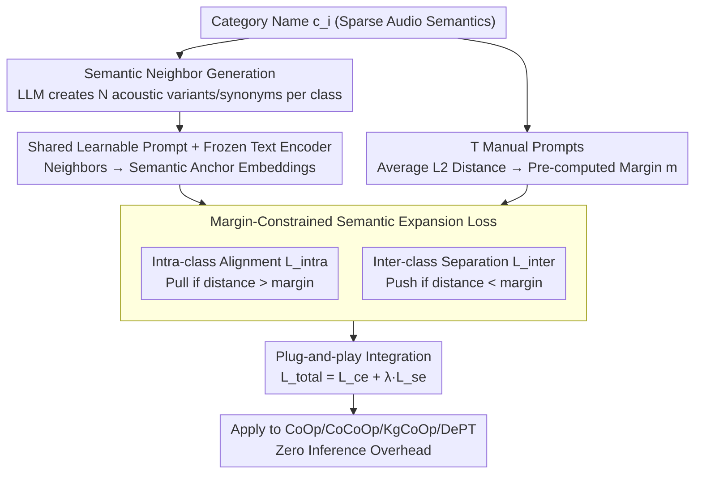

# SEPT: Semantically Expanded Prompt Tuning for Audio-Language Models

**Conference**: ACL 2026 Findings  
**arXiv**: [2601.20867](https://arxiv.org/abs/2601.20867)  
**Code**: None  
**Area**: Audio & Speech  
**Keywords**: Prompt Tuning, Audio-Language Models, Semantic Expansion, Base-New Tradeoff, Generalization

## TL;DR

SEPT significantly alleviates the Base-New Tradeoff (BNT) problem in Audio-Language Model (ALM) prompt tuning by leveraging LLMs to generate semantic neighbors and designing a margin-constrained semantic expansion loss to regularize the prompt embedding space. It establishes the first systematic evaluation benchmark for ALM prompt generalization.

## Background & Motivation

**Background**: Prompt tuning has achieved significant progress in Vision-Language Models (VLMs) and is expanding to Audio-Language Models (ALMs, such as CLAP). Methods like CoOp learn continuous prompt vectors to replace manual templates, significantly improving performance on seen categories.

**Limitations of Prior Work**: Prompt tuning in ALMs suffers from severe overfitting to base (seen) categories, leading to a sharp decline in generalization to new (unseen) categories—the Base-New Tradeoff (BNT). This issue is more pronounced in ALMs than VLMs because audio benchmarks typically contain only a few dozen categories (semantic sparsity), and learned prompts lack sufficient semantic support to maintain geometric cohesion.

**Key Challenge**: Learned prompt embeddings disrupt the semantic structure of the pre-trained text embedding space—the similarity between a category and its semantic neighbors decreases significantly after prompt tuning, preventing the model from utilizing semantic relationships to generalize to unseen categories.

**Goal**: (1) Establish the first evaluation benchmark for ALM prompt generalization; (2) Design a plug-and-play framework to mitigate BNT.

**Key Insight**: Use LLMs to generate semantic neighbors (synonyms, acoustic variants) for each category. Integrate these neighbors into the prompt tuning process to explicitly regularize the embedding space, forcing each category and its semantic neighbors into compact clusters.

**Core Idea**: Expand the semantic coverage of each category via semantic neighbors. Use a loss that pulls positive samples closer and pushes negative samples away to maintain the semantic structure of the embedding space, thereby improving base performance while maintaining generalization to new categories.

## Method

### Overall Architecture

SEPT addresses the Base-New Tradeoff in ALM prompt tuning: while learned continuous prompts improve base class performance, they destroy the semantic structure of pre-trained text embeddings, leading to a collapse in new class generalization. The solution is a plug-and-play regularization module compatible with any prompt tuning method. The workflow involves using an LLM to generate semantic neighbors as additional anchors for each category, calculating margins based on the natural distance between manual prompts, and adding a margin-constrained semantic expansion loss $\mathcal{L}_{se}$ during training to restore a reasonable semantic geometry. No additional overhead is introduced during inference.

### Key Designs

**1. Semantic Neighbor Generation: Anchoring Sparse Category Spaces with LLMs**

Audio benchmarks typically feature few categories, resulting in naturally sparse semantic spaces. Learned prompts lack sufficient support to maintain geometric cohesion, which is why BNT is more severe in ALMs than VLMs. SEPT uses an LLM to generate $N$ semantically related terms $\{p_i^1, \dots, p_i^N\}$ for each category $c_i$, specifically covering fine-grained acoustic variants and natural language expressions. These neighbors are mapped to embeddings via shared learnable prompts and a frozen text encoder, serving as additional semantic anchors to constrain each category into a compact cluster.

**2. Margin-Constrained Semantic Expansion Loss: Balancing Alignment and Hierarchy**

Simply pulling positive samples and pushing negative samples can lead to over-compression or over-separation, potentially erasing natural semantic hierarchies (e.g., "bell" and "chime" should be close, while "explosion" and "birdsong" should be far). SEPT decomposes the loss into two margin-based components: the intra-class alignment loss $\mathcal{L}_{\text{intra}}$ only pulls category embeddings $\mathbf{z}_i$ toward positive neighbors $\mathbf{p}_i^n$ if the distance exceeds a pre-computed margin $m_{i,i,n}$. The inter-class separation loss $\mathcal{L}_{\text{inter}}$ only pushes category embeddings away from other classes' neighbors if the distance is less than a margin $m_{i,j,n}$. Margins are derived from the average L2 distance of $T$ manual prompts, acting as "guardrails" to preserve pre-trained semantic distances.

**3. Plug-and-play Integration: Orthogonal Regularization**

SEPT is designed as a general regularization term: $\mathcal{L}_{\text{total}} = \mathcal{L}_{\text{ce}} + \lambda \cdot \mathcal{L}_{\text{se}}$, where $\lambda$ balances the weights. Since it only constrains the embedding space geometry and does not modify the backbone inference path, it can be added to CoOp, CoCoOp, KgCoOp, and DePT without affecting inference efficiency. Experiments show it improves new class performance with minimal impact on base classes across all baselines.

### Loss & Training

Standard Cross-Entropy + Semantic Expansion Loss (Intra-class Alignment + Inter-class Separation, both in hinge loss form). Text and audio encoders are frozen; only prompt vectors are optimized.

## Key Experimental Results

### Main Results

**Average across 11 Audio Datasets (Base-to-New Generalization)**

| Method | Base | New | H (Harmonic Mean) |
|------|------|-----|-------------|
| CoOp | 65.00 | 34.09 | 42.83 |
| **Ours (CoOp + SEPT)** | 64.36 | **42.98** | **49.70** |
| CoCoOp | 69.13 | 36.83 | 46.26 |
| **Ours (CoCoOp + SEPT)** | 68.63 | **42.59** | **50.65** |
| KgCoOp | 37.99 | 37.42 | 36.39 |
| **Ours (KgCoOp + SEPT)** | **58.92** | **45.28** | **49.79** |

### Ablation Study

| Configuration | Base | New | H | Note |
|------|------|-----|---|------|
| CoOp + SEPT (Full) | 64.36 | 42.98 | 49.70 | Optimal |
| $\mathcal{L}_{\text{intra}}$ only | — | — | Drop | Missing separation |
| $\mathcal{L}_{\text{inter}}$ only | — | — | Drop | Missing compactness |
| No Margin Constraint | — | — | Drop | Over-compression |

### Key Findings

- SEPT shows the most significant gains on New categories (CoOp: 34.09→42.98, +8.89%) with minimal Base degradation (65.00→64.36).
- KgCoOp benefits the most (H: 36.39→49.79, +13.4%), suggesting SEPT complements existing regularization methods.
- SEPT is the first work to systematically evaluate base-to-new generalization and cross-dataset transfer in ALMs.
- Margin constraints are critical to prevent over-compression; performance drops noticeably without them.

## Highlights & Insights

- The identification of "semantic sparsity" as the reason BNT is more severe in ALMs than VLMs provides clear direction for the solution.
- The margin design is elegant—using manual prompt distances as a reference for "natural distance" is simple yet effective.
- The plug-and-play design allows for immediate enhancement of various existing methods, ensuring high utility.

## Limitations & Future Work

- Semantic neighbor quality depends on the LLM; specialized domains (e.g., medical audio) might require specific domain knowledge.
- Performance only verified on audio classification; tasks like audio retrieval and captioning remain unexplored.
- Margin calculation requires $T$ manual prompts, adding a preprocessing step.
- The applicability to Vision-Language Models has not been explored.

## Related Work & Insights

- **vs CoOp/CoCoOp**: SEPT provides orthogonal regularization that can be directly overlaid.
- **vs KgCoOp**: While KgCoOp regularizes toward manual prompts using Euclidean distance, SEPT regularizes toward semantic structures using neighbors. The methods are distinct but complementary.

## Rating

- Novelty: ⭐⭐⭐⭐ Semantic expansion concepts exist in VLMs, but this is the first systematic application and evaluation in ALMs.
- Experimental Thoroughness: ⭐⭐⭐⭐⭐ 11 datasets, four baseline methods, complete ablations, and cross-dataset testing.
- Writing Quality: ⭐⭐⭐⭐ Clear motivation and methodology.
- Value: ⭐⭐⭐⭐ Establishes a benchmark and provides an effective solution for ALM prompt generalization.

<!-- RELATED:START -->

## Related Papers

- [\[ICLR 2026\] Continuous Audio Language Models](../../ICLR2026/audio_speech/continuous_audio_language_models.md)
- [\[ACL 2026\] Temporal Contrastive Decoding: A Training-Free Method for Large Audio-Language Models](temporal_contrastive_decoding_a_training-free_method_for_large_audio-language_mo.md)
- [\[AAAI 2026\] Listening Between the Frames: Bridging Temporal Gaps in Large Audio-Language Models](../../AAAI2026/audio_speech/listening_between_the_frames_bridging_temporal_gaps_in_large_audio-language_mode.md)
- [\[ICLR 2026\] JALMBench: Benchmarking Jailbreak Vulnerabilities in Audio Language Models](../../ICLR2026/audio_speech/jalmbench_benchmarking_jailbreak_vulnerabilities_in_audio_language_models.md)
- [\[NeurIPS 2025\] Brain-tuning Improves Generalizability and Efficiency of Brain Alignment in Speech Models](../../NeurIPS2025/audio_speech/brain-tuning_improves_generalizability_and_efficiency_of_brain_alignment_in_spee.md)

<!-- RELATED:END -->
