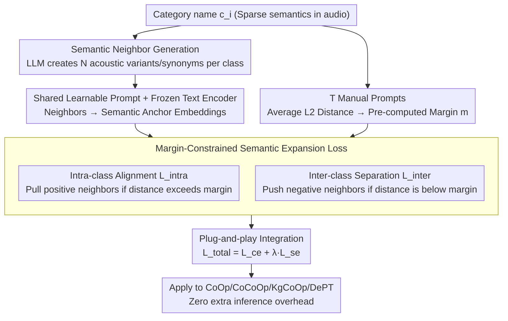

# SEPT: Semantically Expanded Prompt Tuning for Audio-Language Models

**Conference**: ACL 2026 Findings  
**arXiv**: [2601.20867](https://arxiv.org/abs/2601.20867)  
**Code**: None  
**Area**: Audio & Speech  
**Keywords**: Prompt Tuning, Audio-Language Models, Semantic Expansion, Base-New Tradeoff, Generalization

## TL;DR

SEPT significantly mitigates the Base-New Tradeoff in Audio-Language Model (ALM) prompt tuning by leveraging LLMs to generate semantic neighbors and designing a margin-constrained semantic expansion loss to regularize the prompt embedding space. It establishes the first systematic evaluation benchmark for ALM prompt generalization.

## Background & Motivation

**Background**: Prompt tuning has achieved significant progress in Vision-Language Models (VLM) and is expanding toward Audio-Language Models (ALM, e.g., CLAP). Methods like CoOp improve performance on seen categories significantly by learning continuous prompt vectors instead of using manual templates.

**Limitations of Prior Work**: Prompt tuning in ALMs suffers from severe overfitting to base (seen) categories, leading to a sharp decline in generalization to new (unseen) categories—the Base-New Tradeoff (BNT). This problem is more pronounced in ALMs than in VLMs because audio benchmarks typically contain only dozens of categories (semantic sparsity), and learned prompts lack sufficient semantic support to maintain geometric cohesion.

**Key Challenge**: Learned prompt embeddings disrupt the semantic structure of the pre-trained text embedding space. The similarity between a category and its semantic neighbors weakens significantly after prompt tuning, preventing the model from utilizing semantic relationships to generalize to unseen categories.

**Goal**: (1) Establish the first evaluation benchmark for ALM prompt generalization; (2) Design a plug-and-play framework to mitigate BNT.

**Key Insight**: Utilize LLMs to generate semantic neighbors (synonyms, acoustic variants) for each category. Incorporating these neighbors into the prompt tuning process explicitly regularizes the embedding space, ensuring each category and its semantic neighbors form a compact cluster.

**Core Idea**: Expand the semantic coverage of each category via semantic neighbors. A loss function that pulls positive samples and pushes negative samples under margin constraints maintains the semantic structure of the embedding space, improving base performance while preserving generalization to new categories.

## Method

### Overall Architecture

SEPT addresses the Base-New Tradeoff in ALM prompt tuning: where learned continuous prompts improve base class performance but destroy the semantic structure of pre-trained text embeddings, leading to a collapse in new class generalization. The solution is a plug-and-play regularization module compatible with any prompt tuning method. The workflow involves using an LLM to generate semantic neighbors for each category as extra anchors, then calculating a set of margins based on the natural distances between manual prompts. During training, a margin-constrained semantic expansion loss $\mathcal{L}_{se}$ is added to the standard cross-entropy loss to restore the embedding space to a reasonable semantic geometry. No additional overhead is introduced during inference.

### Key Designs

**1. Semantic Neighbor Generation: Filling Anchors for Sparse Category Spaces**

Audio benchmarks typically contain only dozens of categories, making the semantic space naturally sparse. Learned prompts lack sufficient support to maintain geometric cohesion, which is why BNT is more severe in ALMs than VLMs. SEPT uses an LLM to generate $N$ semantically related terms $\{p_i^1, \dots, p_i^N\}$ for each category $c_i$, deliberately covering fine-grained acoustic variants and natural language expressions. These neighbors are mapped into embeddings via shared learnable prompts and a frozen text encoder. They act as additional semantic anchors around sparse categories, providing enough support for regularization to constrain each category into a compact cluster.

**2. Margin-Constrained Semantic Expansion Loss: Balancing Alignment and Hierarchy**

Simply pulling positive samples and pushing negative samples can lead to over-compression or excessive separation, flattening the natural semantic hierarchy (e.g., "Bell" and "Chime" should be close, while "Explosion" and "Birdsong" should be distant). SEPT decomposes the loss into two margin-constrained components: the intra-class alignment loss $\mathcal{L}_{\text{intra}}$ only pulls the category embedding $\mathbf{z}_i$ and its positive neighbor $\mathbf{p}_i^n$ if their distance exceeds a pre-computed margin $m_{i,i,n}$; the inter-class separation loss $\mathcal{L}_{\text{inter}}$ only pushes them if the distance to a negative neighbor is smaller than $m_{i,j,n}$. Margins are derived from the average L2 distance of $T$ manual prompts, serving as a "guardrail" to preserve pre-existing semantic distances. Ablations show that removing margin constraints leads to significant performance drops, proving they prevent over-compression.

**3. Plug-and-play Integration: Orthogonal Regularization for Arbitrary Baselines**

SEPT is designed as a universal regularization term rather than a specific method: the total loss is defined as $\mathcal{L}_{\text{total}} = \mathcal{L}_{\text{ce}} + \lambda \cdot \mathcal{L}_{\text{se}}$, where $\lambda$ balances the weights. Since it only imposes constraints on the embedding space geometry without modifying the backbone inference path, it can be directly integrated into CoOp, CoCoOp, KgCoOp, or DePT without affecting inference efficiency. Experiments demonstrate consistent gains on new classes with minimal performance loss on base classes across all baselines.

### Loss & Training

Standard Cross-Entropy + Semantic Expansion Loss (Intra-alignment + Inter-separation, both in hinge loss form). Text and audio encoders are frozen; only prompt vectors are optimized.

## Key Experimental Results

### Main Results

**Average across 11 Audio Datasets (Base-to-New Generalization)**

| Method | Base | New | H (Harmonic Mean) |
| :--- | :--- | :--- | :--- |
| CoOp | 65.00 | 34.09 | 42.83 |
| **CoOp + SEPT** | 64.36 | **42.98** | **49.70** |
| CoCoOp | 69.13 | 36.83 | 46.26 |
| **CoCoOp + SEPT** | 68.63 | **42.59** | **50.65** |
| KgCoOp | 37.99 | 37.42 | 36.39 |
| **KgCoOp + SEPT** | **58.92** | **45.28** | **49.79** |

### Ablation Study

| Configuration | Base | New | H | Note |
| :--- | :--- | :--- | :--- | :--- |
| CoOp + SEPT (Full) | 64.36 | 42.98 | 49.70 | Optimal |
| Only $\mathcal{L}_{\text{intra}}$ | — | — | Drop | Lacks inter-class separation |
| Only $\mathcal{L}_{\text{inter}}$ | — | — | Drop | Lacks intra-class compactness |
| No Margin Constraint | — | — | Drop | Over-compression/separation |

### Key Findings

- SEPT shows the most significant improvement on New categories (CoOp: 34.09 → 42.98, +8.89%), while the drop in Base performance is minimal (65.00 → 64.36).
- KgCoOp benefits the most (H: 36.39 → 49.79, +13.4%), indicating SEPT is complementary to existing regularization methods.
- SEPT is the first work to systematically evaluate base-to-new generalization and cross-dataset transfer in ALMs.
- Margin constraints are crucial for preventing over-compression of positive samples.

## Highlights & Insights

- Identifies "semantic sparsity" as the root cause of why BNT is more severe in ALM than VLM, providing a clear and convincing analysis for the solution.
- The margin constraint design is elegant—using the distance of manual prompts as a reference for "natural distance" is simple yet effective.
- The plug-and-play design allows for the direct enhancement of various existing methods, ensuring high utility.

## Limitations & Future Work

- Semantic neighbor quality depends on the LLM; specialized domains (e.g., medical audio) may require domain-specific knowledge.
- Validation is limited to audio classification; tasks like audio retrieval and captioning are not yet covered.
- Margin calculation requires $T$ manual prompts, adding a preprocessing step.
- Potential applicability in Vision-Language Models has not been explored.

## Related Work & Insights

- **vs CoOp/CoCoOp**: SEPT provides orthogonal regularization and can be layered on top of these methods.
- **vs KgCoOp**: While KgCoOp regularizes based on Euclidean distance to manual prompts, SEPT uses semantic neighbors to regularize semantic structure. The methods are functionally different but complementary.

## Rating

- Novelty: ⭐⭐⭐⭐ Semantic expansion concepts exist in VLM, but this is the first systematic application and evaluation in ALM.
- Experimental Thoroughness: ⭐⭐⭐⭐⭐ Comprehensive evaluation across 11 datasets, four baseline methods, full ablation, and cross-dataset testing.
- Writing Quality: ⭐⭐⭐⭐ Motivation and methodology are clearly articulated.
- Value: ⭐⭐⭐⭐ Establishes a benchmark for ALM prompt generalization and provides an effective solution.

<!-- RELATED:START -->

## Related Papers

- [\[ACL 2026\] Temporal Contrastive Decoding: A Training-Free Method for Large Audio-Language Models](temporal_contrastive_decoding_a_training-free_method_for_large_audio-language_mo.md)
- [\[AAAI 2026\] Listening Between the Frames: Bridging Temporal Gaps in Large Audio-Language Models](../../AAAI2026/audio_speech/listening_between_the_frames_bridging_temporal_gaps_in_large_audio-language_mode.md)
- [\[ICML 2026\] Sparse Tokens Suffice: Jailbreaking Audio Language Models via Token-Aware Gradient Optimization](../../ICML2026/audio_speech/sparse_tokens_suffice_jailbreaking_audio_language_models_via_token-aware_gradien.md)
- [\[NeurIPS 2025\] Brain-tuning Improves Generalizability and Efficiency of Brain Alignment in Speech Models](../../NeurIPS2025/audio_speech/brain-tuning_improves_generalizability_and_efficiency_of_brain_alignment_in_spee.md)
- [\[ACL 2026\] Mind the Pause: Disfluency-Aware Objective Tuning for Multilingual Speech Correction with LLMs](mind_the_pause_disfluency-aware_objective_tuning_for_multilingual_speech_correct.md)

<!-- RELATED:END -->
