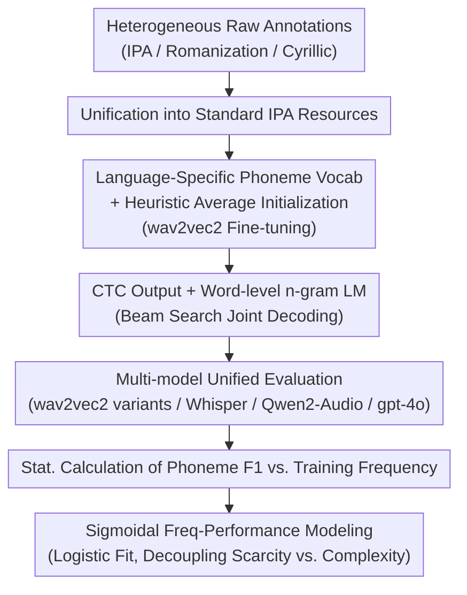

# Hard to Be Heard: Phoneme-Level ASR Analysis of Phonologically Complex, Low-Resource Endangered Languages

**Conference**: ACL 2026 Findings  
**arXiv**: [2604.18204](https://arxiv.org/abs/2604.18204)  
**Code**: [GitHub](https://github.com/mahesh-ak/north_caucasian_asr) | [Data](https://huggingface.co/datasets/mahesh27/archi_rutul_asr)  
**Area**: Speech Recognition / Low-resource Endangered Languages  
**Keywords**: ASR, Low-resource, Endangered Languages, Phoneme-level Analysis, East Caucasian, wav2vec2, Whisper, Frequency Effects

## TL;DR

This paper conducts a phoneme-level ASR analysis of two typologically extreme, low-resource endangered East Caucasian languages (Archi and Rutul). It finds that phoneme recognition accuracy follows an S-shaped learning curve relative to training frequency, suggesting that many errors attributed to phonological complexity actually stem from data scarcity.

## Background & Motivation

**Background**: ASR research is primarily concentrated on high-resource languages, with evaluations typically conducted at word and character levels. For typologically extreme languages, systematic ASR benchmarks and phoneme-level behavioral analyses are lacking. Archi possesses 16 vowels and 73-81 phonemic consonants (one of the largest consonant inventories among non-click languages), while Rutul also features a large consonant inventory and unique articulations.

**Limitations of Prior Work**: (1) Archi and Rutul lack established ASR benchmarks or standardized resources; (2) Existing ASR studies rarely analyze behavior at the phoneme level, especially for phonologically complex languages; (3) Raw annotations are a heterogeneous mix of IPA, Romanization, and Cyrillic script, making them unsuitable for direct training; (4) It remains unclear whether ASR errors originate from phonological complexity or data scarcity.

**Key Challenge**: When a language simultaneously exhibits "extreme phonological complexity" and "extreme data scarcity," to which factor should ASR failure be attributed? If it is a complexity issue, better model architectures are needed; if it is a data issue, more data collection is required.

**Goal**: Curate standardized ASR resources for Archi and Kina Rutul, systematically evaluate multiple SOTA models, and reveal the true source of errors through phoneme-level analysis.

**Key Insight**: By using phonemes as the unit of analysis, establish a quantitative functional relationship between phoneme recognition performance and training frequency.

**Core Idea**: The relationship between phoneme recognition F1 and the logarithm of training frequency follows a sigmoidal (S-shaped) function—performance is near zero for extremely low-frequency phonemes, rises sharply after a threshold, and saturates at high frequencies. This implies that data scarcity is the primary bottleneck rather than phonological complexity.

## Method

**Overall Architecture**: The pipeline consists of a sequential workflow: "robustly building data and models, then performing attribution via phoneme-level analysis." Mixed IPA/Romanization/Cyrillic raw annotations are first unified into standard IPA resources. A wav2vec2 model is fine-tuned using a **language-specific phoneme vocabulary + heuristic average initialization**, followed by a **word-level n-gram language model** at the decoding stage to reduce Word Error Rate (WER). Subsequently, a suite of models including wav2vec2 variants, Whisper, Qwen2-Audio, and gpt-4o are evaluated. The recognition F1 of each phoneme is statistically mapped to its training frequency, and the "frequency-performance" relationship is modeled using a **sigmoidal (logistic) function** to decouple "data scarcity" from "phonological complexity." While the first two steps are engineering contributions to enable low-resource ASR, the final step constitutes the analytical core of the paper.

**Key Designs**:

**1. Language-Specific Phoneme Vocabulary and Heuristic Average Initialization (w2v2l-custom-avg)**: Standard tokenizers decompose compound phonemes into sub-sequences (e.g., labialized kʷ → 'k', 'w'; similar for pharyngealized consonants), losing phonemic integrity. The large consonant inventories of Archi/Rutul rely heavily on such compound phonemes. This work customizes the output vocabulary for the target languages, mapping each compound phoneme to a single token. Output layer parameters for new tokens are not learned from scratch but initialized by averaging the pre-trained parameters of their constituent IPA symbols: $W_{*i} = \frac{1}{k}\sum_j W_{*i_j}^{old}$ and $b_i = \frac{1}{k}\sum_j b_{i_j}^{old}$. This provides a meaningful starting point "constructed" from known sub-symbols, allowing rapid convergence even with tens of minutes of data and enabling zero-shot evaluation. Ablations show that average initialization reduces Archi zero-shot CER from 0.593 to 0.544, with PER also outperforming random and copy (cpy1) initialization.

**2. Word-level n-gram Language Model Augmentation (w2v2l-custom-avg-lm)**: Under extreme data scarcity, the decoding space of CTC acoustic outputs is overly divergent, often generating non-existent words. This study integrates a word-level 3-gram language model (KenLM implementation) onto the CTC output, using beam search to jointly optimize acoustic scores, length penalties, and language model scores: $\sum_i \log p_{ctc}(x_i) + \beta\, m(X) + \alpha \sum_i \log p_{lm}(w_i\mid w_{i-1},\dots,w_{i-n})$. Unlike previous character or phoneme-level n-grams, word-level constraints more strongly pull the decoding back to legitimate words in small corpora with highly restricted morphology, further depressing WER.

**3. Sigmoidal Frequency-Performance Modeling**: This is the analytical core designed to answer whether ASR failure is due to phonological complexity or insufficient data. By plotting the recognition F1 of each phoneme against the log of its training frequency, the study discovers a logistic (S-shaped) relationship $f(x) = \frac{L}{1+\exp(-k(x-x_0))}$. Extremely low-frequency phonemes are nearly unrecognizable; F1 rises sharply after passing the midpoint $x_0$ and saturates at an asymptote $L$ at high frequencies. Parameters are fitted using the Levenberg–Marquardt algorithm, with $R^2$ measuring goodness-of-fit and the Delta method providing 95% confidence intervals. The logic is straightforward: if frequency explains most of the performance variance (high $R^2$), then phonological complexity is not the primary cause. Specific points deviating significantly from the S-curve (e.g., Whisper on Archi) suggest the model has acquired phonological knowledge beyond simple frequency through multilingual pre-training.

## Key Experimental Results

**Main Results (ASR Error Rates, lower is better)**:

| Model | Params | Archi WER/PER | Rutul WER/PER |
|------|--------|-------------|---------------|
| gpt-4o-transcribe (zero-shot) | - | 0.982/0.436 | 0.994/0.514 |
| wav2vec2-large-ipa | 0.3B | 0.559/0.135 | 0.795/0.220 |
| w2v2l-custom-avg (Ours) | 0.3B | 0.479/0.122 | 0.725/**0.195** |
| w2v2l-custom-avg-lm (Ours) | 0.3B | **0.465**/0.122 | **0.697**/0.206 |
| w2v2l-custom-cpy1 | 0.3B | 0.462/0.123 | 0.738/0.203 |
| whisper-large-v3 | 1.5B | 0.402/**0.107** | 0.778/0.251 |
| Qwen2-Audio-7B | 8.4B | 0.579/0.180 | 0.778/0.239 |
| Qwen2.5-Omni-7B | 10.8B | 0.705/0.199 | 0.852/0.257 |

**Comparison of Initialization Strategies (PER)**:

| Initialization Method | Archi | Rutul |
|-----------|-------|-------|
| Random (custom) | 0.147 | 0.222 |
| Copy (cpy1) | 0.123 | 0.203 |
| Average (avg, Ours) | **0.122** | **0.195** |

**Key Findings**:
- **Proposed method is competitive with Whisper**: w2v2l-custom-avg (0.3B parameters) achieves a PER of 0.195 on Rutul, outperforming Whisper (1.5B, PER 0.251), achieving better results with 5x fewer parameters.
- **gpt-4o fails completely in zero-shot**: WER is close to 1.0, indicating that general-purpose models without fine-tuning are unusable for extreme languages.
- **Robust S-shaped relationship**: In most model-language pairs, F1 and log training frequency exhibit a strong sigmoidal relationship.
- **Whisper's Archi Anomaly**: Whisper's performance on Archi deviates partially from the S-curve, implying that multilingual pre-training encodes phonological knowledge beyond simple frequency.
- **Weak correlation with complexity**: The Pearson correlation between phoneme category F1 and complexity is weak (mostly -0.1 to -0.5); the correlation weakens further after controlling for frequency.
- **Average initialization improves zero-shot performance**: CER dropped from 0.593 to 0.544 (Archi), suggesting that initialization itself carries useful cross-lingual information.

## Highlights & Insights

- **Breakthrough in Causal Attribution**: Gracefully decouples "phonological complexity" and "data scarcity" via sigmoidal fitting—if performance is explained by frequency, complexity is not the primary driver.
- **First ASR Benchmark for East Caucasian Languages**: Establishes a reproducible evaluation framework for two endangered languages that previously had no ASR resources.
- **Simplicity and Efficacy of Average Initialization**: Provides an effective warm-start for compound phonemes simply by averaging constituent symbol weights, requiring no additional data.
- **Practical Low-Resource Strategy**: Demonstrates that a 0.3B parameter fine-tuned model can compete with 1.5B models using only 45-75 minutes of data.

## Limitations & Future Work

- The datasets are extremely small (Archi: 45 min / 2 speakers; Rutul: 75 min / ~15 speakers), limiting statistical power.
- Archi data consists of read speech while Rutul is spontaneous, leading to significant conditional differences.
- The sigmoid relationship is descriptive rather than theoretical; other functional forms may be plausible.
- Data augmentation or semi-supervised methods were not explored.
- Future work should extend to more East Caucasian languages and other phonologically complex languages.

## Related Work & Insights

- **Taguchi et al. (2023)**: wav2vec2-large-ipa multilingual IPA pre-trained model used as a baseline.
- **Yusuyin et al. (2025)**: Phoneme initialization strategies (copying base phonemes); this paper proposes a superior average initialization.
- **Boulianne (2022)**: Minute-level data plus multilingual pre-training can yield useful phoneme recognizers.
- **Cognitive Science Frequency Effects**: The use of a logistic function to describe the log-frequency performance relationship has parallels in cognitive modeling.
- **Insights**: (1) The bottleneck in low-resource ASR is data volume, not linguistic complexity; (2) Language-specific vocabularies and intelligent initialization are key to efficient fine-tuning; (3) Phoneme-level evaluation is more diagnostic than word/character-level metrics.

## Rating

- **Novelty**: ★★★★☆ — First systematic ASR analysis for East Caucasian languages; the S-curve finding is meaningful.
- **Experimental Thoroughness**: ★★★★☆ — Broad model coverage and rich analytical dimensions, though statistical reliability is capped by data volume.
- **Writing Quality**: ★★★★☆ — Robust technical details and scientifically rigorous.
- **Value**: ★★★★☆ — Directly provides practical guidance for endangered language speech technology and low-resource ASR.

<!-- RELATED:START -->

## Related Papers

- [\[ACL 2026\] Multimodal In-Context Learning for ASR of Low-Resource Languages](multimodal_in-context_learning_for_asr_of_low-resource_languages.md)
- [\[ACL 2025\] GigaSpeech 2: An Evolving, Large-Scale and Multi-domain ASR Corpus for Low-Resource Languages](../../ACL2025/audio_speech/gigaspeech2_low_resource_asr.md)
- [\[AAAI 2026\] HQ-SVC: Towards High-Quality Zero-Shot Singing Voice Conversion in Low-Resource Scenarios](../../AAAI2026/audio_speech/hq-svc_towards_high-quality_zero-shot_singing_voice_conversion_in_low-resource_s.md)
- [\[ACL 2026\] Semi-Supervised Diseased Detection from Speech Dialogues with Multi-Level Data Modeling](semi-supervised_diseased_detection_from_speech_dialogues_with_multi-level_data_m.md)
- [\[ACL 2026\] Beyond Transcription: Unified Audio Schema for Perception-Aware AudioLLMs](beyond_transcription_unified_audio_schema_for_perception-aware_audiollms.md)

<!-- RELATED:END -->
