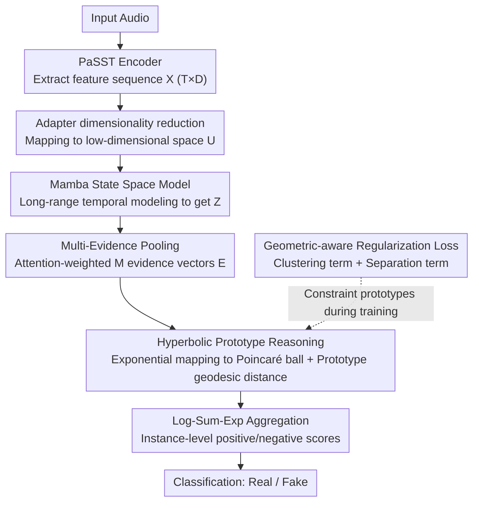

# HCFD: A Benchmark for Audio Deepfake Detection in Healthcare

**Conference**: ACL 2026  
**arXiv**: [2604.17642](https://arxiv.org/abs/2604.17642)  
**Code**: [GitHub](https://helixometry.github.io/HCFD/)  
**Area**: Audio & Speech  
**Keywords**: Audio Deepfake Detection, Pathological Speech, Neural Audio Codec, Hyperbolic Prototypes, Healthcare Security

## TL;DR

This paper proposes HCFD, a task for codec-based fake speech detection in healthcare scenarios. It constructs HCFK, the first codec-based fake speech dataset containing various clinical pathological conditions (Depression, Alzheimer's, Dysarthria), and proposes the PHOENIX-Mamba framework—which models multi-modal forgery evidence prototypes in hyperbolic space to achieve 97.04% accuracy in English depression detection.

## Background & Motivation

**Background**: Audio deepfake detection has developed rapidly, with benchmarks like ASVspoof and CodecFake advancing the field. Existing detectors are primarily trained and evaluated on healthy speech and possess certain detection capabilities for fake speech generated by neural audio codecs (NAC).

**Limitations of Prior Work**: (1) Speech in medical scenarios (e.g., teleconsultation, telephone screening) faces real risks of being replaced by codec-generated synthetic speech, yet existing detectors have never been evaluated on pathological speech; (2) Anomalies in prosody, articulation, and phonation caused by diseases systematically alter acoustic features, which may mask or confuse subtle artifacts introduced by codecs; (3) Experiments demonstrate that AASIST trained on healthy speech drops to near-random performance (~48.62% accuracy) when applied to pathological speech.

**Key Challenge**: Codec forgery detection relies on capturing subtle artifacts introduced by quantization and bandwidth compression. However, the acoustic variations of pathological speech (abnormal speech rate, altered voice quality, reduced clarity) highly overlap with these artifacts in the spectral domain, rendering detectors unable to distinguish between "disease features" and "forgery traces."

**Goal**: (1) Construct HCFK, the first pathology-aware codec fake speech dataset; (2) Systematically evaluate the failure modes of existing detectors on medical speech; (3) Design a detection framework specialized for the heterogeneity of pathological speech.

**Key Insight**: The authors observe that codec artifacts in pathological speech may appear in various heterogeneous patterns (across different disease conditions and codec families). A single vector representation cannot capture this multi-modal distribution. Therefore, a method is required that can preserve multiple local evidences and model heterogeneous forgery patterns.

**Core Idea**: Use multi-prototype clustering in hyperbolic space to model the heterogeneous patterns of codec-forged speech—preserving multiple local evidence vectors and achieving automatic pattern discovery and classification via exponential mapping and prototype distances on the Poincaré ball.

## Method

### Overall Architecture

The core challenge PHOENIX-Mamba addresses is that the spectral anomalies of pathological speech itself overlap heavily with codec artifacts, making single-vector detectors unable to distinguish "disease features" from "forgery traces." The strategy is to decompose each audio segment into multiple local evidences and place them in hyperbolic space to compare distances with a set of fake/real prototypes, thereby accommodating heterogeneous forgery patterns. The workflow is as follows: input audio is processed by a pre-trained encoder (e.g., PaSST) to extract feature sequence $X \in \mathbb{R}^{T \times D}$; an adapter maps this to a low-dimensional space $U$; a Mamba state space model performs long-range temporal modeling to obtain $Z$; learnable pooling compresses $Z$ into $M$ evidence vectors $E$, which are then embedded into the Poincaré ball via exponential mapping; finally, geodesic distances from each evidence to positive/negative prototypes are used to aggregate classification scores.

### Key Designs

**1. Multi-Evidence Pooling: Decomposing forgery clues into local evidences**

Codec artifacts are unevenly and sparsely distributed in pathological speech. Conventional global pooling into a single vector tends to smooth over critical local clues. Multi-evidence pooling uses learnable attention weights to perform weighted sums of temporal features, yielding $M$ evidence vectors $e_m = \sum_t a_{m,t} z_t$, each focusing on different local regions. This allows the model to preserve multiple discriminative features simultaneously.

**2. Hyperbolic Prototype Reasoning: Accommodating heterogeneous forgery patterns**

Different codec families and pathological conditions produce heterogeneous forgery patterns, which are difficult to separate with a single decision boundary in Euclidean space. Thus, each evidence vector is mapped to the Poincaré ball via exponential mapping $h_m = \text{Exp}_0^c(We_m)$ and then compared with $K$ parameterized positive (fake) prototypes and 1 negative (real) prototype using geodesic distances. Soft assignments $q_{m,k}$ are obtained via temperature-scaled softmax, and instance-level scores are aggregated using log-sum-exp. Hyperbolic space's volume grows exponentially with the radius, making it ideal for hierarchical tree-like structures, while multi-prototypes allow the model to discover sub-patterns within the forgery class automatically.

**3. Geometric-aware Regularization Loss: Making prototypes compact and dispersed**

If trained only with classification loss, prototypes may collapse to a single point, discarding the benefits of multiple prototypes. Geometric-aware regularization defines the total loss as $\mathcal{L} = \mathcal{L}_{cls} + \lambda \mathcal{L}_{cluster} + \beta \mathcal{L}_{sep}$. The clustering term pulls evidence points toward their assigned positive prototypes (controlled by an entropy term for sharpness), while the separation term pushes different positive prototypes and positive-negative prototypes away from each other. Together, they ensure compact clusters and maintain prototype diversity.

### Loss & Training

The model is trained using the AdamW optimizer for 20 epochs with a batch size of 32, weight decay of 0.01, and gradient clipping at 1.0. Upstream PTM parameters are frozen; only the adapter, Mamba backbone, and prototype parameters are trained, totaling 2M-5M parameters. Evaluation metrics include Accuracy, Macro F1, and EER.

## Key Experimental Results

### Main Results

| Method | En-Depression Acc | En-Alzheimer's Acc | En-Dysarthria Acc | Zh-Depression Acc |
|------|-------------|------------------|-----------------|-------------|
| AASIST (CodecFake trained) | 48.62 | 34.19 | 36.71 | 45.81 |
| AASIST (In-domain trained) | 60.84 | 52.14 | 56.07 | 58.06 |
| PaSST+CNN | 78.98 | 69.27 | 71.03 | 75.69 |
| **PHOENIX-Mamba (PaSST)** | **97.04** | **96.73** | **96.57** | **94.41** |

### Ablation Study

| Configuration | En-Depression Acc | En-Alzheimer's Acc | Description |
|------|-------------|------------------|------|
| Full PHOENIX-Mamba | 97.04 | 96.73 | Full model |
| CNN Head (w/o Mamba) | 82.26 | 75.52 | No temporal modeling |
| Single evidence (M=1) | 73.51 | 55.03 | Significant degradation |
| PHOENIX-Euc (Euclidean) | 83.62 | 79.48 | Removing hyperbolic geometry |

### Key Findings

- There is a massive domain shift when migrating from healthy speech to pathological speech; AASIST trained on CodecFake performs near random guessing on HCFK.
- Multi-evidence pooling contributes significantly—removing it (M=1) causes Alzheimer's detection accuracy to plummet from 96.73% to 55.03%, suggesting highly non-uniform distribution of forgery clues in pathological speech.
- PaSST as an upstream encoder consistently outperforms speech SSL models like WavLM or Wav2vec2, likely because its patch-based spectro-temporal representation is better suited for capturing codec artifacts.
- Cross-pathology transfer experiments show that training on Depression + Dysarthria and transferring to Alzheimer's reaches 98.53% Acc.

## Highlights & Insights

- Expanding codec deepfake detection to healthcare is a valuable new direction, as the prevalence of telemedicine and voice biometrics makes this threat increasingly real.
- The combination of multi-evidence and hyperbolic prototypes elegantly addresses the "heterogeneous forgery pattern" problem, performing much better than a single classifier in Euclidean space.
- The cross-pathology transfer results are surprisingly good (98.53%), suggesting that the core features of codec artifacts might be pathology-independent, offering hope for practical deployment.

## Limitations & Future Work

- Coverage is limited to only three clinical conditions and two languages.
- Considers only codec re-synthesis attacks; other forgery methods like TTS, VC, or diffusion models are not addressed.
- Open-set detection and uncertainty estimation were not studied.
- Construction of HCFK depends on the availability of clinical speech datasets; privacy and ethical constraints may limit expansion.

## Related Work & Insights

- **vs CodecFake (Wu et al.)**: CodecFake establishes benchmarks on healthy speech; this paper finds that detectors trained on it fail completely on pathological speech, proving the necessity of domain-specific benchmarks.
- **vs AASIST**: AASIST uses graph attention networks to model spectro-temporal relationships, but its single-vector representation cannot handle the heterogeneity of pathological speech; PHOENIX-Mamba addresses this with multi-evidence and multi-prototype design.
- **vs SASTNet**: SASTNet attempts to unify semantic and acoustic representations but still evaluates on healthy speech; this work focuses on the more challenging pathological speech scenario.

## Rating

- Novelty: ⭐⭐⭐⭐⭐ First systematic study of codec forgery detection in medical scenarios; forward-looking problem definition.
- Experimental Thoroughness: ⭐⭐⭐⭐ Covers three diseases, two languages, and seven codecs with thorough ablation, though model scale is limited.
- Writing Quality: ⭐⭐⭐⭐ Clear motivation and detailed methodology, though the paper is lengthy.
- Value: ⭐⭐⭐⭐ Healthcare voice security is a critical issue, but practical deployment requires further validation.

<!-- RELATED:START -->

## Related Papers

- [\[ACL 2026\] RTCFake: Speech Deepfake Detection in Real-Time Communication](rtcfake_speech_deepfake_detection_in_real-time_communication.md)
- [\[ACL 2026\] XLSR-MamBo: Scaling the Hybrid Mamba-Attention Backbone for Audio Deepfake Detection](xlsr-mambo_scaling_the_hybrid_mamba-attention_backbone_for_audio_deepfake_detect.md)
- [\[ACL 2026\] Analyzing Reasoning Shifts in Audio Deepfake Detection under Adversarial Attacks: The Reasoning Tax versus Shield Bifurcation](analyzing_reasoning_shifts_in_audio_deepfake_detection_under_adversarial_attacks.md)
- [\[ACL 2026\] MSU-Bench: Musical Score Understanding Benchmark](musical_score_understanding_benchmark_evaluating_large_language_models39_compreh.md)
- [\[NeurIPS 2025\] A Multi-Task Benchmark for Abusive Language Detection in Low-Resource Settings](../../NeurIPS2025/audio_speech/a_multitask_benchmark_for_abusive_language_detection_in_lowr.md)

<!-- RELATED:END -->
