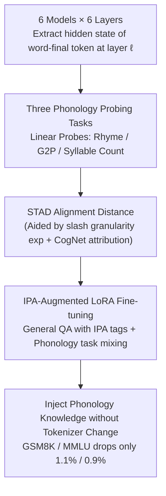

# How Tokenization Limits Phonological Knowledge Representation in Language Models and How to Improve Them

**Conference**: ACL 2026  
**arXiv**: [2604.17105](https://arxiv.org/abs/2604.17105)  
**Code**: https://github.com/liaodisen/Tokenization-Phonology (Available)  
**Area**: Audio & Speech / Tokenization / Representation Probing  
**Keywords**: subword tokenization, phonological knowledge, STAD, IPA fine-tuning, cognates

## TL;DR
This paper employs three phonology probing tasks (rhyme / G2P / syllable count) to demonstrate that BPE-style subword tokenization is both "too coarse" to capture local phonology and "misaligned" in its boundaries to capture prosodic structures. The authors propose the STAD metric and a lightweight IPA-augmented fine-tuning method, enabling Llama3.1-8B to achieve comprehensive improvements across all three tasks while experiencing only a 1.1% and 0.9% drop in GSM8K and MMLU performance, respectively.

## Background & Motivation

**Background**: Text-only LLMs (such as GPT-4o) exhibit remarkable phonological awareness (e.g., writing poetry, rhyming, and language instruction) despite never having heard audio. How this capability emerges from orthography and what factors restrict it has not been systematically investigated.

**Limitations of Prior Work**: Suvarna et al. 2024 evaluated PhonologyBench using prompting and concluded that LLM performance on phonological tasks is mediocre. However, prompting-based evaluations often underestimate the latent knowledge within models (Hu & Levy 2023). While isolated observations exist regarding BPE's struggles with phonemes, mechanistic explanations and quantitative diagnostics are lacking.

**Key Challenge**: Subword tokenization is designed for training efficiency (frequency-driven), which fundamentally contradicts "syllable/phoneme boundaries" (linguistic-driven). Historically, identifying specifically which tasks, layers, and word types within the LM are most severely affected relied on intuition.

**Goal**: (RQ1) To use probing instead of prompting to measure how much phonological knowledge is actually encoded in LM hidden states; (RQ2) To determine how tokenization strategies (granularity and boundaries) affect this encoding; (RQ3) To inject phonological knowledge without replacing the tokenizer.

**Key Insight**: Phonological capability is decomposed into two levels: **local features** (rhyme / coda matching), which require fine-grained tokens, and **prosodic structure** (syllables / G2P), which require token-syllable alignment. The authors quantify "alignment quality" into a single numerical value using STAD (syllabification-tokenization alignment distance).

**Core Idea**: Transform the intuition that "tokenization is the root cause of phonological failure" into a measurable diagnostic metric (STAD), and circumvent the high cost of tokenizer replacement via a lightweight post-training scheme involving "IPA injection + general QA mixed training."

## Method

### Overall Architecture

The study does not propose a new model but rather diagnoses how subword tokenization restricts LM phonological capabilities. This is accomplished through three sequential experiments. First, Probing: Linear probes are trained on hidden states $\boldsymbol{h}_{i\ell}$ extracted from the last token of each word at layer $\ell$, covering 6 models across 6 depth ratios and 3 tasks. Second, Mechanism Analysis: The effect of granularity is tested using slash-delimited inputs; boundary effects are tested by grouping words by STAD (A: STAD=0 vs. M: STAD>0.25); and cognate counts from CogNet are used to explain why certain words are tokenized poorly. Third, Improvement: Llama3.1-8B is fine-tuned using LoRA on a mixture of OpenHermes2.5 general data and phonological tasks, where IPA transcriptions are inserted into responses, thereby injecting phonological knowledge without modifying the tokenizer.

### Key Designs

**1. Three Phonology Probing Tasks: Quantifying Internal Knowledge via Linear Probes**

Since prompting underestimates latent knowledge, linear probes are used to directly read hidden states. The tasks include: rhyme awareness (binary classification via logistic regression on $\boldsymbol{h}_\ell$), G2P (regression mapping to 39 phonemes padded to length 8), and syllable count (ridge regression on integer labels). Probes are strictly linear to prevent them from learning phonological tasks independently, which would confound the assessment of representation quality (Hewitt & Liang 2019). A random embedding control experiment is included to confirm signals originate from the model.

**2. STAD (Syllabification-Tokenization Alignment Distance): Quantifying Segmentation Alignment**

To verify that boundary misalignment harms phonological representation, "alignment" must be quantified. STAD encodes all possible split positions for an $n+1$ character word into binary vectors $\boldsymbol{v}_{\text{tok}}$ and $\boldsymbol{v}_{\text{syl}}$ of length $n$. The normalized Hamming distance is defined as $\text{STAD} = \sum_i |b_i - c_i| / n$. For example, if the syllable vector for *musical* is $[0,1,0,1,0,0]$ and the tokenization vector is $[0,0,1,0,0,0]$, then STAD $= 3/6 = 0.5$. With alignment quantified, paired t-tests between Group A (aligned) and Group M (misaligned) can directly test the causal chain "poor alignment $\rightarrow$ poor phonological probing." This metric is tokenizer-agnostic and allows cross-comparison of BPE, SentencePiece, and ByT5.

**3. IPA-Augmented LoRA Fine-tuning: Injecting Phonological Knowledge without Tokenizer Changes**

Base models are rarely retrained for phonological tasks, and changing tokenizers is costly. Instead, a "post-training patch" is implemented. Specifically, IPA transcriptions for random words within 3,000 OpenHermes2.5 general QA pairs are wrapped in `<IPA>...</IPA>` tags. This is mixed with 200 rhyme, 500 syllable, and 500 G2P task samples requiring step-by-step IPA reasoning. LoRA is applied only to $W_Q$ and $W_V$ weights ($r=8, \alpha=16$). Treating IPA as side information interleaved with original tasks injects phonological knowledge while preserving the instruction-following distribution. The small data volume and LoRA-only approach keep catastrophic forgetting negligible.

### Loss & Training

Probing uses scikit-learn's `LogisticRegression` (C=10, max_iter=1000) and `RidgeCV` (alphas $\in \{10,100,500,1000,2000\}$). LoRA SFT uses standard cross-entropy loss, requiring less than 5 GPU hours on 2× A40. Evaluation uses accuracy for rhyme/syllable tasks and PER (phoneme error rate, Levenshtein distance divided by reference length) for G2P.

## Key Experimental Results

### Main Results

| Model | Layer 20% Rhyme Acc | Layer 20% G2P $R^2$ | Layer 20% Syllable $R^2$ |
|---|---|---|---|
| BERT (110M) | 67.6 | 0.073 | 0.265 |
| GPT-2 (124M) | 64.7 | 0.188 | 0.624 |
| GPT-neo (2.7B) | 68.6 | 0.147 | 0.662 |
| Mistral-7B-Instruct-v3 | 80.6 | 0.202 | 0.470 |
| Llama3-8B-Instruct | 80.7 | 0.263 | 0.661 |
| Llama3.1-8B-Instruct | **79.8** | **0.330** | **0.713** |
| Random embedding (control) | 48.7 | -0.100 | -0.073 |

| Configuration (Rhyme, Layer 20%) | BERT | GPT-2 | Mistral-7B | Llama3.1-8B |
|---|---|---|---|---|
| Original tokenization | 67.6 | 64.7 | 80.6 | 79.8 |
| Added slash fine-grained | **74.5*** | **76.9*** | 81.1 | **85.1*** |

### Ablation Study

| Configuration | Key Observation | Description |
|---|---|---|
| Slash / Comma / Dot delimiter | All outperformed "None"; results were similar | Gains stem from granularity, not the specific character |
| STAD = 0 (A) vs > 0.25 (M) | Most models show significantly higher G2P / syllable $R^2$ in group A | Confirms tokenizer-syllable alignment impacts internal representation |
| BERT on STAD grouping | No significant trend observed | Bidirectional attention may mitigate segmentation misalignment |
| Slash gains in Probing | Only significant at the probing layers; rhyme inference didn't always improve | Improving representation $\neq$ improving zero-shot performance; requires fine-tuning |
| Llama3.1-8B-IPA vs Llama3.1-8B-Instruct | GSM8K 69.9 → 68.8 (-1.1), MMLU 65.3 → 64.4 (-0.9) | Minimal loss of general capabilities |

### Key Findings
- **Phonological signals peak at 20-60% depth**: Prompting underestimates this, emphasizing the need for probing to reveal latent capability.
- **STAD provides causal rather than purely correlational diagnosis**: For Group A (low STAD), G2P / syllable $R^2$ jumps to 0.93-0.98, while Group M (high STAD) drops to 0.5-0.7. This ~40-point gap is caused entirely by tokenizer split positions.
- **Cognates/Loanwords explain tokenization failures**: CogNet retrieval indicates that Group M words have far more cross-lingual variants (e.g., *musical* has ~30 variants). Their n-gram distribution in training corpora differs from monolingual words, leading BPE to split them at non-syllabic boundaries.
- **Lightweight IPA fine-tuning yields significant gains** across three tasks with only a 0.9-1.1% cost to general capability—much more practical than tokenizer replacement and retraining.

## Highlights & Insights
- **Elegance of STAD**: A diagnostic metric based on a simple Hamming distance that can be applied to any tokenizer as a sanity check, providing direct guidance for the tokenizer-syllable alignment design space.
- **Cognate analysis provides the "Why"**: While many studies simply state that "BPE splits are weird," this work offers a falsifiable linguistic hypothesis: words with cross-lingual variants suffer from n-gram distribution shifts that cause BPE errors.
- **IPA-augmented fine-tuning trick**: "Peppering" IPA tags into general QA data rather than training on phonology tasks in isolation effectively avoids catastrophic forgetting. This strategy is transferable to any scenario requiring the injection of new modalities without degrading existing performance.

## Limitations & Future Work
- **Language Scope**: Restricted to English/alphabetic languages; transferability to logographic languages like Chinese or Japanese is unknown.
- **G2P Formulation**: Simple linear regression was used instead of sequence generation for probing. This may underestimate the true G2P capability of some models.
- **STAD Ground Truth**: It assumes "natural syllabification" is the only correct split, but phonological theories (e.g., onset maximalism) vary, and results are sensitive to tool-specific biases.
- **Scaling**: Fine-tuning has not yet been verified on models significantly larger than 8B.

## Related Work & Insights
- **vs. Suvarna et al. 2024 (PhonologyBench)**: While they concluded phonological ability is weak based on prompting, this paper argues the ability exists in representations but is underutilized.
- **vs. ByT5 / CANINE**: Those works replace tokenizers architecturally. This paper pursues "post-training injection," acknowledging that the sunken cost of LLMs necessitates compatible "patches."
- **vs. Singh & Strouse 2024 (numeric tokenization)**: They found right-to-left splits are better for numbers. This work extends the phenomenon of "misalignment $\rightarrow$ performance degradation" from mathematics to phonology.

## Rating
- Novelty: ⭐⭐⭐⭐ STAD is a clear original contribution; IPA-augmented fine-tuning is a novel "gentle injection" scheme.
- Experimental Thoroughness: ⭐⭐⭐⭐ Covers 6 models, 6 layer depths, 3 tasks, multiple delimiters, and an 8-tokenizer CogNet analysis.
- Writing Quality: ⭐⭐⭐⭐ Clear four-stage structure: identify, quantify, explain, and fix the limitation.
- Value: ⭐⭐⭐⭐ STAD can serve as a sanity check for tokenizer design; IPA-augmented LoRA is a high-value practical technique.

<!-- RELATED:START -->

## Related Papers

- [\[CVPR 2026\] How Far Can We Go With Synthetic Data for Audio-Visual Sound Source Localization?](../../CVPR2026/audio_speech/how_far_can_we_go_with_synthetic_data_for_audio-visual_sound_source_localization.md)
- [\[ACL 2026\] \[b\] = \[d\] − \[t\] + \[p\]: Self-supervised Speech Models Discover Phonological Vector Arithmetic](bd-tp_self-supervised_speech_models_discover_phonological_vector_arithmetic.md)
- [\[ICML 2026\] MoshiRAG: Asynchronous Knowledge Retrieval for Full-Duplex Speech Language Models](../../ICML2026/audio_speech/moshirag_asynchronous_knowledge_retrieval_for_full-duplex_speech_language_models.md)
- [\[ICCV 2025\] How Would It Sound? Material-Controlled Multimodal Acoustic Profile Generation for Objects](../../ICCV2025/audio_speech/how_would_it_sound_material-controlled_multimodal_acoustic_profile_generation_fo.md)
- [\[ACL 2026\] Closing the Modality Reasoning Gap for Speech Large Language Models](closing_the_modality_reasoning_gap_for_speech_large_language_models.md)

<!-- RELATED:END -->
