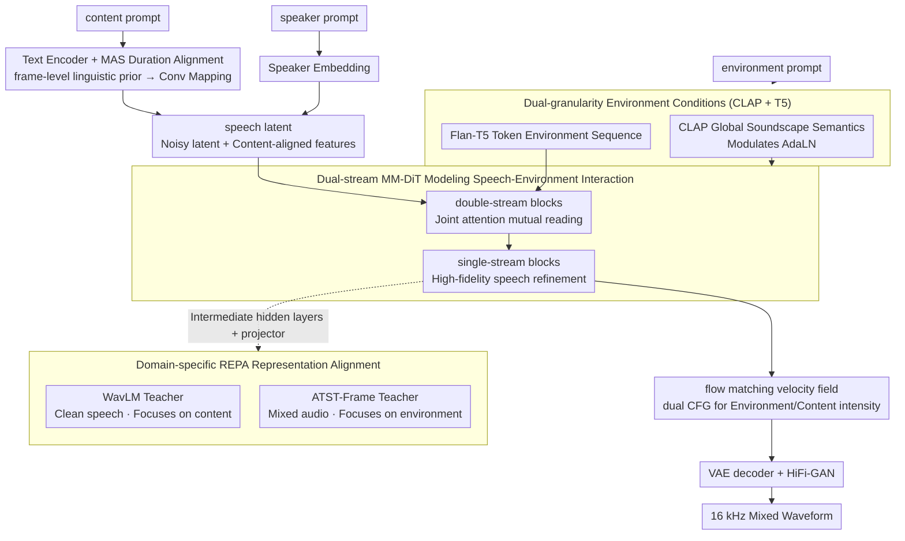

# ImmersiveTTS: Environment-Aware Text-to-Speech with Multimodal Diffusion Transformer and Domain-Specific Representation Alignment

**Conference**: ACL2026  
**arXiv**: [2605.30965](https://arxiv.org/abs/2605.30965)  
**Code**: https://jjunak-yun.github.io/ImmersiveTTS  
**Area**: Speech Synthesis / Environment-Aware TTS  
**Keywords**: Environment-aware speech synthesis, multimodal diffusion Transformer, flow matching, representation alignment, audio generation  

## TL;DR
ImmersiveTTS utilizes a dual-stream MM-DiT to simultaneously model transcript content and environmental descriptions. It stabilizes training through dual-teacher representation alignment using WavLM and ATST-Frame, enhancing speech naturalness, intelligibility, and speech-environment fusion quality in TTS with background sounds.

## Background & Motivation
**Background**: Text-guided audio generation is generally divided into TTA and TTS. TTA excels at generating environmental sounds, music, and sound effects but struggles with precise speech content; TTS excels at generating clear speech from text but usually treats background sounds, room acoustics, or soundscapes as external conditions rather than generating them alongside the speech.

**Limitations of Prior Work**: Environment-aware TTS needs to satisfy two goals simultaneously: speech must be intelligible, natural, and preserve speaker characteristics; background sounds must match natural language descriptions and fuse with the speech like a real recording. Existing methods such as VoiceLDM and VoiceDiT, while capable of controlling the environment with text descriptions, still lack sufficient interaction between the speech and environment streams, often leading to correct speech content with mismatched backgrounds or vice versa.

**Key Challenge**: There are significant differences in temporal structures, spectral patterns, and semantic granularity between speech and environmental sounds. Speech emphasizes phonemes, prosody, and intelligibility, whereas the environment emphasizes global soundscapes and local sound events. If constrained by a single condition or a single SSL teacher, the model tends to bias toward one end, creating a trade-off between clarity and environmental consistency.

**Goal**: The authors aim to build a unified model that generates mixed audio directly from content and environment prompts while maintaining low sampling steps, high speech intelligibility, environmental semantic consistency, and natural fusion.

**Key Insight**: The paper migrates the multimodal diffusion transformer approach from the SD3/Flux series to joint speech-environment generation. Transcript-aligned speech latents and text-conditioned environment contexts are placed into two streams, exchanging information via joint attention. Additionally, domain-specific REPA is introduced to align different intermediate layers with speech SSL and environmental sound SSL representations respectively.

**Core Idea**: Use "Dual-stream MM-DiT + Dual-teacher REPA" instead of simple prompt conditioning, allowing speech content and environmental soundscapes to interact explicitly during the generation process rather than being generated separately and mixed in post-processing.

## Method
The input to ImmersiveTTS consists of three types of information: a content prompt (the text to be spoken), an environment prompt (background sound or scene description), and a speaker prompt (used to extract speaker embeddings). The output is a 16 kHz waveform where speech and environmental sounds coexist. The overall model follows a latent flow matching framework: target audio is first compressed into AudioLDM2 VAE latents, a velocity field from Gaussian noise to the target audio is learned in latent space, and finally, the waveform is reconstructed by a VAE decoder and HiFi-GAN vocoder.

### Overall Architecture
During training, LibriTTS clean speech is mixed with WavCaps non-speech environmental sounds at SNRs of 2 to 10 dB to form environment-aware TTS training samples. Clean speech is retained with a probability of 0.15 to prevent the model from losing its pure speech synthesis capability. Environmental descriptions are processed via CLAP to obtain global acoustic semantics for modulating AdaLN and via Flan-T5-Large to obtain token-level environmental text sequences for the environment stream.

On the speech side, frame-level linguistic priors are obtained through a text encoder and MAS duration alignment, mapped to a VAE latent-compatible representation via a convolutional network, and concatenated with noisy latents. The double-stream blocks of the MM-DiT allow environment tokens and speech latents to read each other via joint attention; subsequent single-stream blocks retain only the speech stream for high-fidelity refinement. Finally, the model uses flow matching to predict the velocity field, using dual classifier-free guidance during inference to independently adjust the intensity of environmental and content conditions.

### Key Designs
**1. Dual-stream MM-DiT for Speech-Environment Interaction: Placing speech and environment in two parallel streams for explicit coupling during generation.**

Environment-aware TTS is not simply a matter of "generating speech and then overlaying background"—the background sound affects intelligibility, the sense of sound field, and overall naturalness. Methods like VoiceLDM and VoiceDiT, which treat the environment as an external condition, often encounter cases where speech is correct but the background doesn't fit, or the background fits but speech is destroyed by noise. ImmersiveTTS sends transcript-aligned speech latents and text-conditioned environment contexts into two separate streams. The environment stream receives Flan-T5 token embeddings, and the speech stream receives noisy audio latents with content-aligned features. Double-stream DiT blocks use joint attention for mutual reading, while subsequent single-stream blocks refine the speech representation specifically adapted to the environment. This dual-stream structure preserves the differences in temporal structure and semantic granularity while providing an alignment channel.

**2. Dual-granularity Environmental Conditions with CLAP + T5: Providing global soundscape semantics and local acoustic cues simultaneously.**

Using only CLAP often results in coarse-grained scene labels, while using only text tokens lacks stable global acoustic constraints, causing the model to bias toward one side. ImmersiveTTS routes environmental descriptions through two paths: CLAP embeddings are combined with timestep embeddings after an MLP to modulate AdaLN scale/shift for global semantics; Flan-T5 token embeddings enter the environment stream as environmental context sequences, allowing the speech stream to pick out specific acoustic cues via attention. Combining both granularities is more suitable for generating results where "speech is embedded in a soundscape" rather than "background is playing next to speech."

**3. Domain-specific REPA Representation Alignment: Using two complementary SSL teachers to manage speech intelligibility and environmental consistency separately.**

A single SSL teacher struggles to interpret both speech and environment domains; constraints favoring one often degrade the other. The authors extract hidden features from intermediate layers of the speech stream, map them via MLP projectors, and align them with representations from two frozen teachers using cosine alignment loss: WavLM is applied to clean speech (pre-mixing) focusing on content, while ATST-Frame is applied to mixed audio focusing on environmental events. The overall training objective is formulated as: $\mathcal{L}=\mathcal{L}_{Prior}+\mathcal{L}_{Dur}+\mathcal{L}_{Flow}+\mathcal{L}_{REPA}$. Splitting supervision by domain mitigates the trade-off between clarity and environmental consistency.

### Loss & Training
The training objective consists of four parts: MAS prior loss and duration loss for training the text encoder and duration predictor, flow matching loss for training the latent velocity field, and REPA loss for intermediate representation alignment. All loss weights are set to 1 in experiments. The model is trained for 400k steps using 2 NVIDIA RTX A6000 GPUs, with AdamW learning rate $1\times 10^{-4}$ and a batch size of 8 per GPU. The model contains 12 double-stream blocks, 18 single-stream blocks, 6 attention heads, and a hidden size of 1024, totaling approximately 450M trainable parameters.

During inference, $Z_0\sim\mathcal{N}(0,I)$ is sampled and the flow ODE is solved via an Euler solver. Dual CFG independently controls environmental guidance and content guidance; experiments use $\omega_{env}=3, \omega_{cont}=3$ with 25 NFEs.

## Key Experimental Results

### Main Results

| Test Set | Model | NFEs | SN-MOS↑ | EC-MOS↑ | ON-MOS↑ | WER↓ | FAD↓ | CLAP↑ |
|--------|------|------|---------|---------|---------|------|------|-------|
| AudioCaps | VoiceLDM | 200 | 3.41 ± 0.06 | 3.33 ± 0.07 | 2.55 ± 0.05 | 16.45 | 8.75 | 0.229 |
| AudioCaps | VoiceDiT | 200 | 3.47 ± 0.05 | 3.44 ± 0.07 | 2.63 ± 0.05 | 11.68 | 9.07 | 0.263 |
| AudioCaps | ImmersiveTTS | 25 | 4.20 ± 0.07 | 3.48 ± 0.07 | 3.47 ± 0.05 | 8.06 | 5.80 | 0.308 |
| Seed-TTS + AudioCaps | VoiceLDM | 200 | 3.32 ± 0.06 | 3.24 ± 0.07 | 2.91 ± 0.08 | 11.20 | 6.98 | 0.118 |
| Seed-TTS + AudioCaps | VoiceDiT | 200 | 3.45 ± 0.06 | 3.38 ± 0.06 | 3.12 ± 0.08 | 7.08 | 5.37 | 0.134 |
| Seed-TTS + AudioCaps | ImmersiveTTS | 25 | 4.18 ± 0.07 | 3.32 ± 0.06 | 3.23 ± 0.08 | 4.48 | 3.92 | 0.207 |

Main results indicate that ImmersiveTTS achieves the lowest WER, lowest FAD, and highest CLAP on AudioCaps simultaneously, outperforming 200-step diffusion baselines with only 25 sampling steps. On the enhanced test set, VoiceDiT shows slightly higher EC-MOS, but ImmersiveTTS leads in SN-MOS, ON-MOS, WER, FAD, and CLAP, indicating a preference for overall naturalness and intelligibility.

### Ablation Study

| Alignment Policy | Teacher | Speech Domain | Env Domain | WER↓ | FAD↓ | CLAP↑ |
|----------|---------|--------|--------|------|------|-------|
| Base | None | - | - | 11.21 | 9.64 | 0.236 |
| Single | WavLM | ✓ | - | 10.97 | 8.02 | 0.231 |
| Single | ATST | - | ✓ | 13.77 | 8.78 | 0.271 |
| Single | USAD | ✓ | ✓ | 9.04 | 7.93 | 0.239 |
| Dual | WavLM + USAD | ✓ | ✓ | 8.95 | 7.33 | 0.248 |
| Dual | USAD + ATST | ✓ | ✓ | 8.94 | 8.20 | 0.266 |
| Dual | WavLM + ATST | ✓ | ✓ | 8.06 | 5.80 | 0.308 |

### Key Findings
- The single WavLM teacher primarily improves speech content, while the single ATST teacher improves environmental semantics, but using them individually sacrifices the other domain. The dual-teacher combination of WavLM + ATST is optimal across WER, FAD, and CLAP.
- Analysis of sampling steps shows that the greatest gains occur when moving from very few steps to a moderate count; 9 steps already outperform VoiceLDM and VoiceDiT at 200 NFEs in WER, FAD, and CLAP.
- Speaker similarity in the appendix shows ImmersiveTTS achieves an S-MOS of 3.15 ± 0.06, matching VoiceDiT and approaching the 3.18 ± 0.05 of reconstructed samples.

## Highlights & Insights
- This paper explicitly models "environment-aware TTS" as a cross-modal joint generation problem rather than a post-processing mix of TTS and TTA. This definition is closer to real scenarios where speech clarity and background intensity are mutually restrictive.
- Dual-teacher REPA is a practical design: WavLM and ATST-Frame are not simply stacked; supervision signals are split by speech and environment domains. This "domain-specific teacher" mindset can be transferred to tasks like video dubbing, speech enhancement, and music-vocal mixing.
- The most convincing aspect of the experiments is the simultaneous improvement in quality and efficiency. 25 NFEs reaching or exceeding 200 NFEs baselines proves that flow matching + MM-DiT is deployment-friendly, rather than just producing good offline metrics.

## Limitations & Future Work
- The authors admit that training relies heavily on synthetic mixed data, so real-world speech-environment interactions (e.g., reverberation, occlusion, spatial positioning, dynamic source changes) may still be insufficient.
- Exploration of robustness across different SNRs, scene difficulties, and background complexities is currently limited. The main results prove average performance but don't show stability in extreme noise or high reverb.
- While the model preserves speaker identity and content, it lacks explicit control over paralinguistic attributes like emotion, speaking style, prosody, and intensity. Future work could integrate prosody/style/emotion prompts into a third control stream.
- Regarding risks, like common speech synthesis, environment-aware TTS could be abused for unauthorized voice synthesis or deceptive audio, necessitating watermarking and detection protocols.

## Related Work & Insights
- **vs VoiceLDM**: VoiceLDM is based on AudioLDM, conditioning a U-Net on content and environment prompts. This work switches to dual-stream MM-DiT and adds domain-specific REPA, reducing WER from 16.45 to 8.06 and increasing CLAP from 0.229 to 0.308.
- **vs VoiceDiT**: VoiceDiT uses DiT and AdaLN for environmental control, but cross-modal interaction remains weak. ImmersiveTTS uses joint attention for interaction in intermediate layers and achieves higher ON-MOS with fewer NFEs.
- **vs Separate TTS/TTA pipelines**: The appendix shows that pipelines like CosyVoice2 + TangoFlux are strong in some objective metrics but fail to directly model speech-background interactions. The insight is that the value of a unified model lies in learning the mutual influence of the realistic mixing process.

## Rating
- Novelty: ⭐⭐⭐⭐☆ Combines MM-DiT, flow matching, and domain-specific REPA for environment-aware TTS; the problem definition and dual-teacher alignment are distinct.
- Experimental Thoroughness: ⭐⭐⭐⭐☆ Covers main experiments, single-tasking, alignment policies, NFEs, CFG scale, and speaker similarity, though real recording scenarios are still lacking.
- Writing Quality: ⭐⭐⭐⭐☆ The methodological chain is clear and tables directly support conclusions.
- Value: ⭐⭐⭐⭐☆ Highly valuable for immersive speech, gaming/NPCs, accessibility, and multimedia generation; 25-step inference is practically viable.

<!-- RELATED:START -->

## Related Papers

- [\[CVPR 2026\] SAVE: Speech-Aware Video Representation Learning for Video-Text Retrieval](../../CVPR2026/audio_speech/save_speech-aware_video_representation_learning_for_video-text_retrieval.md)
- [\[ICLR 2026\] Latent Speech-Text Transformer](../../ICLR2026/audio_speech/latent_speech_text_transformer.md)
- [\[CVPR 2026\] Hear What You See: Video-to-Audio Generation with Diffusion Transformer and Semantic-Temporal Alignment-Ranked Direct Preference Optimization](../../CVPR2026/audio_speech/hear_what_you_see_video-to-audio_generation_with_diffusion_transformer_and_seman.md)
- [\[ACL 2026\] FC-TTS: Style and Timbre Control in Zero-Shot Text-to-Speech with Disentangled Speech Representations](fc-tts_style_and_timbre_control_in_zero-shot_text-to-speech_with_disentangled_sp.md)
- [\[ICML 2026\] Towards Streaming Synchronized Spatial Audio Generation via Autoregressive Diffusion Transformer](../../ICML2026/audio_speech/towards_streaming_synchronized_spatial_audio_generation_via_autoregressive_diffu.md)

<!-- RELATED:END -->
