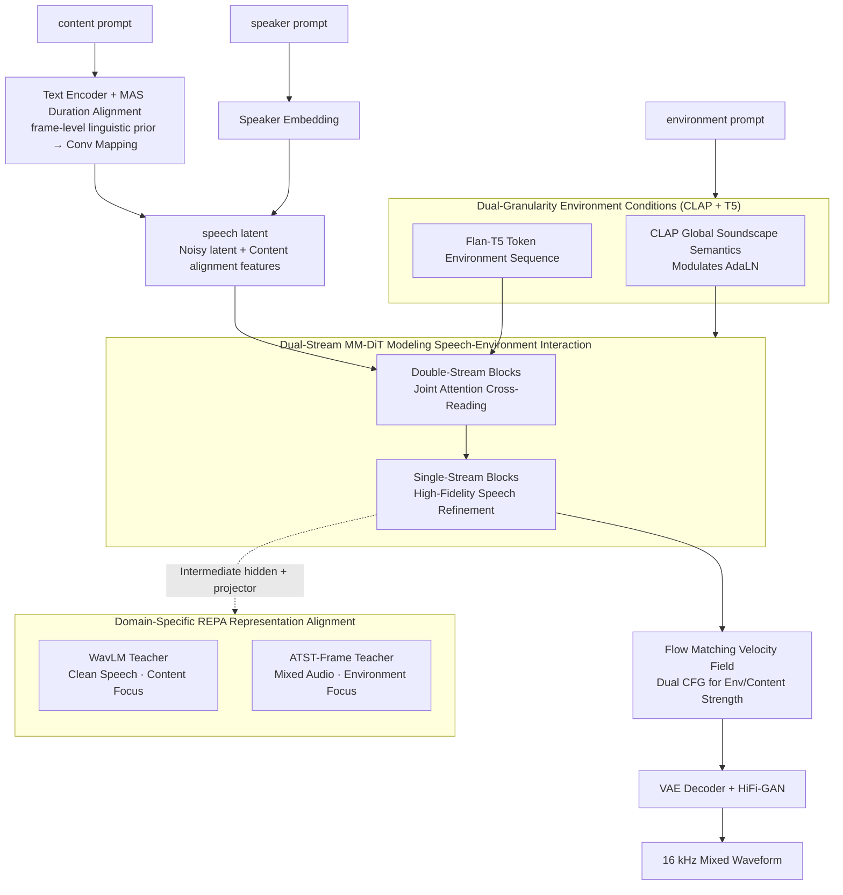

# ImmersiveTTS: Environment-Aware Text-to-Speech with Multimodal Diffusion Transformer and Domain-Specific Representation Alignment

**Conference**: ACL2026  
**arXiv**: [2605.30965](https://arxiv.org/abs/2605.30965)  
**Code**: https://jjunak-yun.github.io/ImmersiveTTS  
**Area**: Speech Synthesis / Environment-Aware TTS  
**Keywords**: Environment-aware speech synthesis, multimodal diffusion Transformer, flow matching, representation alignment, audio generation  

## TL;DR
ImmersiveTTS utilizes a dual-stream MM-DiT to simultaneously model transcript content and environmental descriptions, stabilized by dual-teacher representation alignment with WavLM and ATST-Frame, enhancing speech naturalness, intelligibility, and speech-environment fusion quality in background-noise TTS.

## Background & Motivation
**Background**: Text-guided audio generation is largely divided into TTA and TTS. TTA excels at generating ambient sounds, music, and effects but struggles with precise speech content; TTS excels at generating clear speech from text but typically treats background sounds, room acoustics, or soundscapes as external conditions rather than generating them alongside the speech.

**Limitations of Prior Work**: Environment-aware TTS must satisfy two objectives: speech must be intelligible, natural, and preserve speaker characteristics; background sounds must match natural language descriptions and blend with the speech as if they were a single real recording. Existing methods like VoiceLDM and VoiceDiT use text descriptions to control the environment, but the interaction between the speech stream and environment stream remains insufficient, often leading to correct speech content with mismatched backgrounds, or fitting backgrounds with corrupted speech.

**Key Challenge**: The temporal structures, spectral patterns, and semantic granularities of speech and ambient sounds differ significantly. Speech emphasizes phonemes, prosody, and content intelligibility, while the environment emphasizes global soundscapes and local acoustic events. Using a single condition or a single SSL teacher constraint often forces the model to favor one side, creating a trade-off between clarity and environmental consistency.

**Goal**: The authors aim to construct a unified model to generate mixed audio directly from content and environment prompts while maintaining low sampling steps, high intelligibility, environmental semantic consistency, and natural fusion.

**Key Insight**: The paper migrates the multimodal diffusion transformer concept from the SD3/Flux series to joint speech-environment generation: transcript-aligned speech latents and text-conditioned environment contexts are placed into two streams and exchange information via joint attention. Simultaneously, domain-specific REPA is introduced to align different intermediate layers with speech SSL and environmental SSL representations respectively.

**Core Idea**: Replace simple prompt conditioning with "dual-stream MM-DiT + dual-teacher REPA," allowing explicit interaction between speech content and the environmental soundscape during generation, rather than separate generation followed by post-process mixing.

## Method
The input for ImmersiveTTS includes three types of information: a content prompt (the words to be spoken), an environment prompt (background sound or scene description), and a speaker prompt (to extract speaker embeddings). The output is 16 kHz waveform containing both speech and ambient sounds. The overall framework utilizes a latent flow matching approach: target audio is compressed into AudioLDM2 VAE latents, a velocity field from Gaussian noise to target audio is learned in the latent space, and the waveform is eventually restored by a VAE decoder and HiFi-GAN vocoder.

### Overall Architecture
During training, LibriTTS clean speech and WavCaps non-speech environment sounds are mixed at SNRs ranging from 2 to 10 dB to form environment-aware TTS training samples; a 0.15 probability of preserving clean speech is maintained to ensure the model retains pure speech capabilities. Environment descriptions provide global acoustic semantics via CLAP to modulate AdaLN, while token-level environmental text sequences from Flan-T5-Large enter the environment stream.

On the speech side, a text encoder and MAS duration alignment produce a frame-level linguistic prior, which is mapped to a VAE latent-compatible representation via a convolutional network and concatenated with the noisy latent. The double-stream blocks of the MM-DiT allow environmental tokens and speech latents to read each other through joint attention; subsequent single-stream blocks retain only the speech stream for high-fidelity refinement. Finally, the model uses flow matching to predict the velocity field, with dual classifier-free guidance at inference to regulate environment and content condition strengths.

### Key Designs
**1. Dual-Stream MM-DiT for Speech-Environment Interaction: Explicitly coupling speech and environment in parallel streams during generation**

Environment-aware TTS is not simply a matter of "generating speech then overlaying background"—the background sound itself affects intelligibility, soundstage perception, and overall naturalness. Prior methods like VoiceLDM and VoiceDiT, which treat the environment as an external condition, often suffer from mismatching or corrupted speech. ImmersiveTTS feeds transcript-aligned speech latents and text-conditioned environment contexts into two parallel streams: the environment stream receives Flan-T5 token embeddings, and the speech stream receives noisy audio latents with content alignment features. Joint attention in double-stream DiT blocks allows cross-reading between modes, while subsequent single-stream blocks focus on refining the environment-adapted speech.

**2. Dual-Granularity Environment Conditions (CLAP + T5): Providing both global soundscape semantics and local acoustic cues**

Using only CLAP often results in coarse scene labels, while using only text tokens lacks stable global acoustic constraints. ImmersiveTTS processes environment descriptions through two paths: CLAP embeddings (via MLP) combine with timestep embeddings for AdaLN scale/shift modulation to provide global semantics, while Flan-T5 token embeddings serve as the environmental context sequence, allowing the speech stream to extract specific acoustic cues through attention.

**3. Domain-Specific REPA Representation Alignment: Using two complementary SSL teachers to manage speech intelligibility and environmental consistency**

A single SSL teacher struggles to span the speech and environment domains simultaneously. The authors extract hidden features from the intermediate layers of the speech stream, mapped via MLP projectors, to align with representations from two frozen teachers using cosine alignment loss: WavLM (on pre-mixed clean speech) focuses on speech content, while ATST-Frame (on mixed audio) focuses on environmental events. The total training objective is $\mathcal{L}=\mathcal{L}_{Prior}+\mathcal{L}_{Dur}+\mathcal{L}_{Flow}+\mathcal{L}_{REPA}$. Splitting supervision by domain alleviates the trade-off between clarity and environmental consistency.

### Loss & Training
The training objective consists of four parts: MAS prior loss and duration loss for the text encoder and duration predictor, flow matching loss for the latent velocity field, and REPA loss for intermediate representation alignment. All loss weights are set to 1. The model is trained for 400k steps on 2 NVIDIA RTX A6000s using AdamW at $1\times 10^{-4}$ with a batch size of 8 per GPU. The model contains 12 double-stream blocks and 18 single-stream blocks with a hidden size of 1024, totaling approximately 450M trainable parameters.

At inference, $Z_0\sim\mathcal{N}(0,I)$ is sampled and solved via an Euler solver. Dual CFG independently controls $\omega_{env}=3$ and $\omega_{cont}=3$ with 25 NFEs.

## Key Experimental Results

### Main Results

| Test Set | Model | NFEs | SN-MOS↑ | EC-MOS↑ | ON-MOS↑ | WER↓ | FAD↓ | CLAP↑ |
|--------|------|------|---------|---------|---------|------|------|-------|
| AudioCaps | VoiceLDM | 200 | 3.41 ± 0.06 | 3.33 ± 0.07 | 2.55 ± 0.05 | 16.45 | 8.75 | 0.229 |
| AudioCaps | VoiceDiT | 200 | 3.47 ± 0.05 | 3.44 ± 0.07 | 2.63 ± 0.05 | 11.68 | 9.07 | 0.263 |
| AudioCaps | ImmersiveTTS | 25 | 4.20 ± 0.07 | 3.48 ± 0.07 | 3.47 ± 0.05 | 8.06 | 5.80 | 0.308 |
| Seed-TTS + AudioCaps | VoiceLDM | 200 | 3.32 ± 0.06 | 3.24 ± 0.07 | 2.91 ± 0.08 | 11.20 | 6.98 | 0.118 |
| Seed-TTS + AudioCaps | VoiceDiT | 200 | 3.45 ± 0.06 | 3.38 ± 0.06 | 3.12 ± 0.08 | 7.08 | 5.37 | 0.134 |
| Seed-TTS + AudioCaps | ImmersiveTTS | 25 | 4.18 ± 0.07 | 3.32 ± 0.06 | 3.23 ± 0.08 | 4.48 | 3.92 | 0.207 |

Main results indicate ImmersiveTTS achieves the lowest WER, lowest FAD, and highest CLAP score on AudioCaps simultaneously, outperforming 200-step diffusion baselines with only 25 steps. On the enhanced test set, ImmersiveTTS maintains superiority in SN-MOS, ON-MOS, WER, FAD, and CLAP.

### Ablation Study

| Alignment Strategy | Teacher | Speech Domain | Env Domain | WER↓ | FAD↓ | CLAP↑ |
|----------|---------|--------|--------|------|------|-------|
| Base | None | - | - | 11.21 | 9.64 | 0.236 |
| Single | WavLM | ✓ | - | 10.97 | 8.02 | 0.231 |
| Single | ATST | - | ✓ | 13.77 | 8.78 | 0.271 |
| Single | USAD | ✓ | ✓ | 9.04 | 7.93 | 0.239 |
| Dual | WavLM + USAD | ✓ | ✓ | 8.95 | 7.33 | 0.248 |
| Dual | USAD + ATST | ✓ | ✓ | 8.94 | 8.20 | 0.266 |
| Dual | WavLM + ATST | ✓ | ✓ | 8.06 | 5.80 | 0.308 |

### Key Findings
- WavLM single-teacher primarily improves speech content, while ATST single-teacher primarily improves environmental semantics; using either alone sacrifices the other. The WavLM + ATST combination is optimal across WER, FAD, and CLAP.
- Sampling step analysis shows the largest gains when moving from very few steps to a moderate number; 9 steps already outperform 200 NFE baselines.
- In speaker similarity tests, ImmersiveTTS achieves an S-MOS of 3.15 ± 0.06, matching VoiceDiT and approaching reconstructed samples (3.18 ± 0.05).

## Highlights & Insights
- This paper explicitly models "environment-aware TTS" as a cross-modal joint generation problem rather than a post-processing mixture. This is more realistic as speech clarity and background intensity are naturally interconnected.
- Dual-teacher REPA is a practical design: WavLM and ATST-Frame split supervision signals by domain. This "domain-specific teacher" concept can be transferred to video dubbing, speech enhancement, and other multi-source audio tasks.
- The most compelling aspect is the simultaneous improvement in quality and efficiency. Outperforming baselines with 25 NFEs demonstrates that flow matching + MM-DiT is deployment-friendly.

## Limitations & Future Work
- Training relies heavily on synthesized mixture data; real-world interactions (reverberation, occlusion, spatial positioning) may still be insufficient.
- Robustness across different SNRs and complex background scenarios is not yet fully explored.
- The model lacks explicit control over paralinguistic attributes like emotion and prosody. Future work could incorporate a third control stream for style or finer-grained CFG.
- Risk-wise, environment-aware TTS could be misused for unauthorized voice synthesis, requiring watermarking and detection protocols.

## Related Work & Insights
- **vs VoiceLDM**: VoiceLDM uses U-Net conditioned on content and environment; this work switches to dual-stream MM-DiT and domain-specific REPA, reducing WER from 16.45 to 8.06 on AudioCaps.
- **vs VoiceDiT**: VoiceDiT uses DiT with AdaLN, but cross-modal interaction is weaker; ImmersiveTTS uses joint attention for intermediate interaction and achieves higher ON-MOS with fewer NFEs.
- **vs Single-task TTS/TTA pipeline**: Pipelines like CosyVoice2 + TangoFlux generate and mix separately. While strong in individual metrics, they do not model the speech-background interaction directly. ImmersiveTTS demonstrates the value of modeling mutual influence during mixing.

## Rating
- Novelty: ⭐⭐⭐⭐☆ Combines MM-DiT, flow matching, and domain-specific REPA for environment-aware TTS.
- Experimental Thoroughness: ⭐⭐⭐⭐☆ Covers main experiments, single-task metrics, alignment strategies, and speaker similarity, though real-world recordings are limited.
- Writing Quality: ⭐⭐⭐⭐☆ Clear methodology and results support the conclusions.
- Value: ⭐⭐⭐⭐☆ Significant for immersive voice, NPCs, and multimedia generation with practical 25-step inference.

<!-- RELATED:START -->

## Related Papers

- [\[CVPR 2026\] SAVE: Speech-Aware Video Representation Learning for Video-Text Retrieval](../../CVPR2026/audio_speech/save_speech-aware_video_representation_learning_for_video-text_retrieval.md)
- [\[ICLR 2026\] Latent Speech-Text Transformer](../../ICLR2026/audio_speech/latent_speech_text_transformer.md)
- [\[ACL 2026\] FC-TTS: Style and Timbre Control in Zero-Shot Text-to-Speech with Disentangled Speech Representations](fc-tts_style_and_timbre_control_in_zero-shot_text-to-speech_with_disentangled_sp.md)
- [\[ACL 2026\] Privacy-preserving Prosody Representation Learning](privacy-preserving_prosody_representation_learning.md)
- [\[ICML 2026\] Towards Streaming Synchronized Spatial Audio Generation via Autoregressive Diffusion Transformer](../../ICML2026/audio_speech/towards_streaming_synchronized_spatial_audio_generation_via_autoregressive_diffu.md)

<!-- RELATED:END -->
