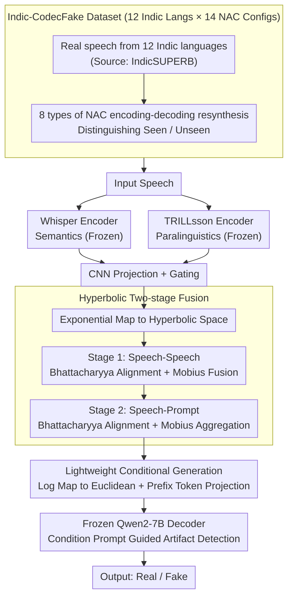

# Indic-CodecFake meets SATYAM: Towards Detecting Neural Audio Codec Synthesized Speech Deepfakes in Indic Languages

**Conference**: ACL 2026  
**arXiv**: [2604.19949](https://arxiv.org/abs/2604.19949)  
**Code**: [https://helixometry.github.io/IndicFake/](https://helixometry.github.io/IndicFake/)  
**Area**: AI Safety / Speech Safety  
**Keywords**: Speech Deepfake Detection, Neural Audio Codec, Indic Languages, Hyperbolic ALM, CodecFake

## TL;DR
This paper constructs the first multi-Indic language CodecFake detection benchmark, ICF, and proposes SATYAM—a hyperbolic audio large language model. By aligning semantic and paralinguistic representations using Bhattacharyya distance in hyperbolic space and subsequently aligning them with prompts, the model achieves a 98.32% detection accuracy with only 3.75M trainable parameters.

## Background & Motivation

**Background**: With the rapid development of speech deepfake technology, a new type of synthetic speech—CodecFake (CF)—driven by audio large language models (ALMs) and neural audio codecs (NACs), has emerged as a new threat. Prior research such as the ASVspoof series has advanced synthetic speech detection, and recently, pre-trained models (WavLM, Whisper, etc.) and ALMs have been applied to this task.

**Limitations of Prior Work**: Existing CF detection datasets almost exclusively focus on English (with some including Chinese), leaving the exploration of vulnerabilities in the Indic language community nearly blank. Experiments show that SOTA CF detectors trained on English data fail significantly on Indic languages (AASIST accuracy drops from 94% to 48%). Zero-shot evaluations of SOTA ALMs also perform extremely poorly on ICF (accuracy around 13%).

**Key Challenge**: India is the world's most populous country with immense linguistic diversity (Indo-European, Dravidian, Austroasiatic, etc.), leading to high risks of AI voice scams despite the lack of targeted CF datasets and models. The phonemic diversity and prosodic variability of speech make English-centric detectors difficult to generalize.

**Goal**: (1) Construct the first large-scale multi-Indic language CF dataset; (2) Systematically evaluate the generalization capabilities of SOTA detectors and ALMs; (3) Propose a specialized detection model.

**Key Insight**: The authors observe that semantic and paralinguistic features may possess a hierarchical structure (from coarse-grained semantics to fine-grained prosody), and hyperbolic space is naturally suited for modeling such hierarchical relationships. Furthermore, Bhattacharyya distance has proven effective for speech representation alignment.

**Core Idea**: Construct the ICF dataset to fill the data gap; propose SATYAM, which performs two-stage fusion using Bhattacharyya distance in hyperbolic space—first aligning semantic (Whisper) and paralinguistic (TRILLsson) representations, then aligning them with input conditional prompts—utilizing Qwen2-7B as a decoder to generate detection decisions.

## Method

### Overall Architecture
SATYAM treats CodecFake detection as a conditional generation problem: rather than training a classification head, a frozen LLM is tasked with outputting "Real" or "Fake". The target audio is first encoded in parallel by two frozen encoders—Whisper for semantics and TRILLsson for paralinguistics (timbre, prosody, synthesis artifacts). Both sets of features are projected via CNNs and gated before being sent into hyperbolic space for two-stage alignment fusion. Finally, they are mapped back to Euclidean space as prefix condition tokens for the Qwen2-7B decoder. Only the projection, gating, and hyperbolic alignment modules are trained, totaling approximately 3.75M parameters.

### Key Designs

**1. Indic-CodecFake (ICF): Expanding Benchmarks from English to 12 Indic Languages**

Existing CF datasets cover English and Chinese but ignore the rich phonemes and prosody of Indic languages, causing English-trained AASIST (94%) to drop to 48% on Indic data. ICF uses real speech from 12 Indic languages from IndicSUPERB as the source and generates fake samples using 14 configurations across 8 NAC categories (DAC, Encodec, SoundStream, SpeechTokenizer, FunCodec, AudioDec, SNAC, MIMI). The dataset maintains original train/valid/test splits and distinguishes between Seen (same NAC in train/test) and Unseen (NACs only in test) settings, forcing detectors to learn general cross-codec forgery features rather than memorizing codec fingerprints.

**2. Hyperbolic Two-stage Fusion: Aligning Speech and Prompts in Hierarchical Geometry**

Semantic cues (content) and paralinguistic cues (style) naturally exist in a coarse-to-fine hierarchy, as do speech and text prompts. Hyperbolic space is ideal for embedding this hierarchy without distortion. Features are first projected into hyperbolic space with curvature $-c$ via the exponential map $\exp_0^c(u) = \tanh(\sqrt{c}\|u\|)\,\frac{u}{\sqrt{c}\|u\|}$. Phase 1 (Speech-Speech) minimizes the hyperbolic Bhattacharyya distance $\mathcal{L}_{S\text{-}S} = D_B(h_w, h_t)$ to align Whisper and TRILLsson representations, followed by fusion via Mobius addition $h_f = h_w \oplus_c h_t$. Phase 2 (Speech-Prompt) similarly uses BD alignment $\mathcal{L}_{S\text{-}T} = D_B(h_f, h_A)$ between speech and prompt representations followed by Mobius aggregation. Bhattacharyya distance is chosen over cosine or Euclidean distance as it measures distribution overlap, which is effective for speech alignment. Ablations show hyperbolic BD two-stage fusion significantly outperforms single-stage or Euclidean alternatives.

**3. Lightweight Conditional Generation: Frozen Encoders and LLM with Fusion Tuning**

The fused hyperbolic representation is mapped back to Euclidean space and projected into prefix condition tokens for the frozen Qwen2-7B. Two prompts are used: a condition prompt ("Analyze the speech for unnatural artifacts") to direct attention to synthesis traces, and a decision prompt for the final "Real" or "Fake" output. Freezing the encoders and LLM while only training the CNN, projection, and hyperbolic modules is based on findings that ALM performance bottlenecks lie in the audio encoder side rather than LLM scale. SATYAM outperforms full-parameter fine-tuning with only 3.75M parameters.

### Loss & Training
The total loss combines two-stage alignment and language modeling: $\mathcal{L} = \lambda_1 \mathcal{L}_{S\text{-}S} + \lambda_2 \mathcal{L}_{S\text{-}T} + \lambda_3 \mathcal{L}_{LM}$, with weights $\lambda_1=1,\ \lambda_2=0.5,\ \lambda_3=1$. Optimization uses AdamW, learning rate $1 \times 10^{-4}$, batch size 32, for 5 epochs.

## Key Experimental Results

### Main Results

| Method | ICF Acc% | ICF EER% | CodecFake Acc% | CodecFake EER% |
|------|---------|---------|---------------|---------------|
| AASIST | 90.60 | 12.47 | 94.21 | 10.13 |
| MiO | 92.80 | 9.04 | 95.11 | 6.49 |
| Fine-tune Qwen2-audio | 93.19 | 8.34 | 95.55 | 5.60 |
| **SATYAM** | **98.32** | **3.27** | **99.11** | **1.94** |
| SATYAM (Qwen2-1.8B) | 97.14 | 4.53 | 98.32 | 2.11 |

### Ablation Study

| Configuration | ICF Acc% | ICF EER% |
|------|---------|---------|
| W + Qwen2-7B (Whisper Only) | 92.98 | 8.61 |
| T + Qwen2-7B (TRILLsson Only) | 93.21 | 8.09 |
| W+T Concatenation (Euclidean) | 93.28 | 7.94 |
| W+T Mobius Addition (Hyperbolic) | 94.01 | 7.02 |
| W+T Euclidean BD | 94.93 | 5.39 |
| W+T Hyperbolic BD Speech-Prompt Only | 95.78 | 5.14 |
| W+T Hyperbolic BD Speech-Speech Only | 96.11 | 5.02 |
| **SATYAM (Full)** | **98.32** | **3.27** |

### Key Findings
- AASIST trained on English CodecFake data dropped to 48% accuracy on ICF, confirming severe cross-lingual generalization issues.
- SOTA ALM zero-shot detection accuracy is only ~13%, indicating current ALMs have limited inherent CF detection capabilities.
- The TRILLsson single encoder performs slightly better than Whisper, reflecting that paralinguistic features are the primary cues for deepfake detection.
- Full two-stage fusion with hyperbolic BD is significantly superior to any single-stage or Euclidean substitute, proving the necessity of hyperbolic geometry and two-stage alignment.
- Cross-language family transfer (Dravidian to Indo-European and vice versa) achieves EER below 8.5%, demonstrating robust generalization.
- Replacing Qwen2-7B with the lightweight 1.8B version results in only minor performance degradation, confirming the audio encoder quality is the bottleneck.

## Highlights & Insights
- Fills the gap in Indic language CF detection; the ICF dataset covering 12 languages and 14 NAC configurations is a valuable community benchmark.
- Bhattacharyya distance in hyperbolic space is an innovative fusion scheme. Extending BD from Euclidean to hyperbolic space can be transferred to other multimodal tasks requiring hierarchical alignment.
- Outperforming full-parameter methods with only 3.75M trainable parameters suggests that correct inductive biases and fusion strategies are more important than model scale.

## Limitations & Future Work
- Only used the Qwen2 LLM decoder family, although references suggest LLM choice has limited impact.
- Encoding-decoding resynthesis might not fully represent real-world attack scenarios (e.g., joint NAC-TTS generation).
- Hyperbolic operations may have numerical stability issues, especially during large-scale training.
- Adversarial attacks and defenses on ICF have not been explored.

## Related Work & Insights
- **vs CodecFake (Wu et al.)**: CodecFake only covers the English VCTK corpus; ICF extends this to 12 Indic languages. AASIST's 94% accuracy on CodecFake plummeted to 48% on ICF.
- **vs MiO**: MiO is a SOTA multi-encoder fusion method reaching 92.8% on ICF. SATYAM improves this to 98.3% with the same encoders, suggesting fusion strategy (not the encoder itself) is the bottleneck.
- **vs Gu et al. (ALM Detection)**: Previous studies evaluated ALMs for traditional deepfakes but not CF. This paper is the first to systematically evaluate ALM zero-shot capabilities for CF, showing they are currently inadequate.

## Rating
- Novelty: ⭐⭐⭐⭐ ICF dataset fills an important gap, and hyperbolic BD fusion is a novel technical contribution.
- Experimental Thoroughness: ⭐⭐⭐⭐⭐ Comprehensive design covering zero-shot, in-domain training, cross-benchmark transfer, cross-family transfer, unseen codecs, and noisy conditions.
- Writing Quality: ⭐⭐⭐ Rich content but organization is slightly verbose; many table symbols require frequent cross-referencing.
- Value: ⭐⭐⭐⭐ Direct contribution to the multilingual deepfake detection community; SATYAM's methodology has generalization value.

<!-- RELATED:START -->

## Related Papers

- [\[ACL 2026\] SN-WER: Script-Normalized WER for Multi-Script Indic ASR Evaluation](sn-wer_script-normalized_wer_for_multi-script_indic_asr_evaluation.md)
- [\[ICLR 2026\] FlexiCodec: A Dynamic Neural Audio Codec for Low Frame Rates](../../ICLR2026/audio_speech/flexicodec_a_dynamic_neural_audio_codec_for_low_frame_rates.md)
- [\[ACL 2025\] Analyzing and Mitigating Inconsistency in Discrete Audio Tokens for Neural Codec Language Models](../../ACL2025/audio_speech/audio_token_consistency.md)
- [\[CVPR 2026\] Hierarchical Codec Diffusion for Video-to-Speech Generation](../../CVPR2026/audio_speech/hierarchical_codec_diffusion_for_video-to-speech_generation.md)
- [\[ICML 2026\] Alethia: A Foundational Encoder for Voice Deepfakes](../../ICML2026/audio_speech/alethia_a_foundational_encoder_for_voice_deepfakes.md)

<!-- RELATED:END -->
