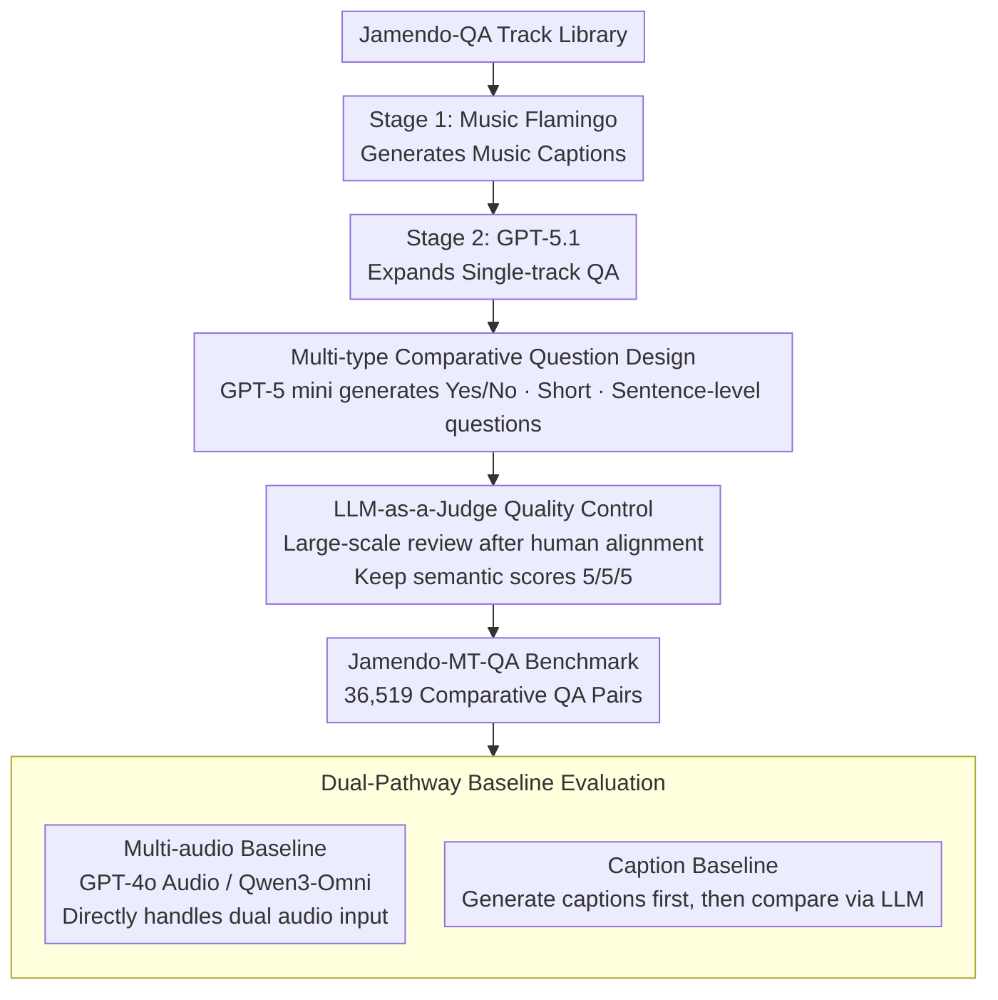

# Jamendo-MT-QA: A Benchmark for Multi-Track Comparative Music Question Answering

**Conference**: ACL 2026 Findings  
**arXiv**: [2604.09721](https://arxiv.org/abs/2604.09721)  
**Code**: None  
**Area**: Audio & Speech / Music Understanding  
**Keywords**: Music Question Answering, Multi-track Comparative Reasoning, Audio-Language Models, Benchmark Datasets, LLM-as-a-Judge  

## TL;DR

Construcs Jamendo-MT-QA, a multi-track comparative music QA benchmark containing 36,519 comparative QA pairs (covering 12,173 track pairs), to systematically evaluate the cross-track comparative reasoning capabilities of audio-language models for the first time, revealing significant deficiencies of existing models in sentence-level comparison generation.

## Background & Motivation

**Background**: Music Question Answering (Music-QA) research primarily focuses on single-track understanding, such as tag prediction, captioning, and classification. However, listeners often describe music in a comparative manner (e.g., "This song is darker than the last one"), and existing benchmarks do not systematically evaluate cross-track comparative reasoning.

**Limitations of Prior Work**: (1) Single-track benchmarks might be driven by text cues rather than true audio perception; (2) Audio-language models (e.g., CLAP, MU-LLaMA) perform strongly on single-track tasks but lack evaluation for multi-track comparative reasoning; (3) There is a lack of datasets specifically designed for musical comparative reasoning.

**Key Challenge**: Existing Music-QA benchmarks cannot distinguish whether models truly understand audio content or rely on text shortcuts, nor can they evaluate cross-track relationship reasoning capabilities.

**Goal**: To build a systematic multi-track comparative QA benchmark to evaluate and expose the shortcomings of existing models.

**Key Insight**: Based on the Jamendo-QA dataset, utilize LLMs to assist in generating three types of comparative questions (Yes/No, Short-answer, Sentence-level), and implement quality control through human evaluation + LLM-as-a-Judge.

**Core Idea**: Construct a high-quality comparative QA benchmark through an LLM-assisted four-stage pipeline (Music Captioning → Single-track QA Expansion → Multi-track Comparative QA Generation → Quality Filtering).

## Method

### Overall Architecture

A four-stage construction process: Stage 1 uses Music Flamingo to generate high-quality captions for each track; Stage 2 uses GPT-5.1 to expand these into single-track QA pairs; Stage 3 uses GPT-5 mini to generate three types of comparative questions (Yes/No, Short-answer, Sentence-level) for each track pair; Stage 4 performs quality filtering via human evaluation and LLM-as-a-Judge. While Stages 1-2 reuse existing models as scaffolding, Stages 3-4 are the two core design contributions of this work. After the benchmark is constructed, a dual-pathway baseline is used for diagnostic evaluation.

### Key Designs

1. **Multi-type Comparative Question Design**: Three types of questions are generated for each track pair: Yes/No questions (e.g., "Is Track A faster than Track B?"), Short-answer questions (selecting the track matching a specific description), and Sentence-level questions (requiring a full comparative analysis). These cover a difficulty gradient from simple judgment to complex reasoning. Human evaluation shows sentence-level questions are significantly more difficult than the first two categories.

2. **LLM-as-a-Judge Quality Control**: Human evaluation and GPT-5 mini scores were first aligned on 300 samples, verifying that the LLM review matches human judgment trends across semantic quality standards (Correctness: 4.87 vs. Human 4.79; Comparative Validity: 4.61 vs. 4.83; Reasoning Quality: 4.37 vs. 4.78). This was then expanded to the full dataset, retaining only QA groups where all three semantic measures scored 5/5/5.

3. **Dual-pathway Baseline Evaluation**: Two types of baselines were designed—the Multi-audio baseline (e.g., GPT-4o Audio, Qwen3-Omni directly processing dual audio inputs) and the Caption baseline (e.g., Music Flamingo generating captions first, then compared by an LLM)—to decouple the contributions of multi-audio perception versus high-level semantic reasoning.

### Loss & Training

This work focuses on benchmark construction and does not involve model training. Evaluation metrics include Accuracy for Yes/No and Short-answer, and BLEU, ROUGE-1/2/L, BERTScore, and LLM-as-a-Judge (1-5 scale) for sentence-level questions.

## Key Experimental Results

### Main Results (Full 12,173 Track Pairs)

| Model | Type | Yes/No Acc | Short Acc | BLEU | BERT-F1 | GPT Judge | Claude Judge |
|---|---|---|---|---|---|---|---|
| Music Flamingo | Cap | 77.4% | 89.7% | 4.00 | 0.879 | 3.24 | 3.87 |
| Qwen2-Audio | Cap | 37.4% | 39.1% | 1.88 | 0.849 | 1.49 | 1.53 |
| MU-LLaMA | Cap | 20.6% | 55.3% | 2.39 | 0.857 | 2.36 | 2.01 |
| Qwen2-Audio | Multi | 50.9% | 80.2% | 2.09 | 0.847 | 1.37 | 1.62 |
| Qwen3-Omni | Multi | 62.9% | 80.3% | 3.58 | 0.863 | 3.11 | 3.48 |

### Ablation Study

- The Caption baseline (Music Flamingo) reached 77.4% on Yes/No, outperforming most multi-audio baselines, suggesting that high-quality captioning + text reasoning is a viable path.
- Qwen2-Audio's multi-audio mode (50.9%) showed a significant improvement over its caption mode (37.4%) in Yes/No questions.
- All models scored $\leq 3.87/5$ on LLM Judge for sentence-level questions, exposing the massive challenge of comparative reasoning.

### Key Findings

- The Caption baseline Music Flamingo performed best overall, indicating that current multi-audio models have not yet fully exploited the advantages of audio input.
- Sentence-level comparative generation is the primary bottleneck, requiring cross-track multi-attribute integration and coherent natural language expression.
- 92.9% of cross-genre track pairs were retained in the dataset, showing that the filtering strategy does not harm diversity.
- Human difficulty ratings confirmed the gradient: Sentence-level > Short-answer > Yes/No.

## Highlights & Insights

- **Filling the Comparative Reasoning Gap**: The first music QA benchmark specifically designed to evaluate cross-track comparative reasoning.
- **Diagnostic Design**: The dual-pathway baseline (Caption vs. Multi-audio) effectively decouples perception capabilities from reasoning capabilities.
- **Quality Control Innovation**: The large-scale LLM review process, validated by human-LLM alignment, can be generalized to the construction of other datasets.

## Limitations & Future Work

- Comparative questions are generated based on captions and metadata rather than directly from audio, which may introduce textual bias.
- Evaluation of sentence-level questions relies on LLM Judge, whose reliability still has room for improvement.
- The comparative understanding capabilities of generative music models were not evaluated.
- Future work could extend to comparative reasoning across more than two tracks (>2).

## Related Work & Insights

- Migration of relational reasoning concepts from multi-hop QA (HotpotQA, DROP) to the audio domain.
- The LLM-as-a-Judge evaluation paradigm is becoming popular in NLP benchmarks.
- This work inspires the construction of comparative reasoning benchmarks for other modalities (e.g., video comparative QA).

## Rating

- **Novelty**: ⭐⭐⭐⭐ The problem definition of multi-track comparative reasoning is novel, with a refined dataset construction methodology.
- **Experimental Thoroughness**: ⭐⭐⭐⭐ Baseline evaluations across multiple models are sufficient, though some models used subsets due to computational costs.
- **Writing Quality**: ⭐⭐⭐⭐ Pipeline descriptions are clear and the quality control process is detailed.
- **Value**: ⭐⭐⭐⭐ Provides an important comparative reasoning benchmark and diagnostic tool for the music understanding field.

<!-- RELATED:START -->

## Related Papers

- [\[ACL 2026\] Music Audio-Visual Question Answering Requires Specialized Multimodal Designs](music_audio-visual_question_answering_requires_specialized_multimodal_designs.md)
- [\[ICLR 2026\] SyncTrack: Rhythmic Stability and Synchronization in Multi-Track Music Generation](../../ICLR2026/audio_speech/synctrack_rhythmic_stability_and_synchronization_in_multi-track_music_generation.md)
- [\[ICLR 2026\] Query-Guided Spatial-Temporal-Frequency Interaction for Music Audio-Visual Question Answering](../../ICLR2026/audio_speech/query-guided_spatial-temporal-frequency_interaction_for_music_audio-visual_quest.md)
- [\[ACL 2026\] Retrieving to Recover: Towards Incomplete Audio-Visual Question Answering via Semantic-consistent Purification](retrieving_to_recover_towards_incomplete_audio-visual_question_answering_via_sem.md)
- [\[ACL 2025\] Sparsify: Learning Sparsity for Effective and Efficient Music Performance Question Answering](../../ACL2025/audio_speech/sparsify_music_avqa.md)

<!-- RELATED:END -->
