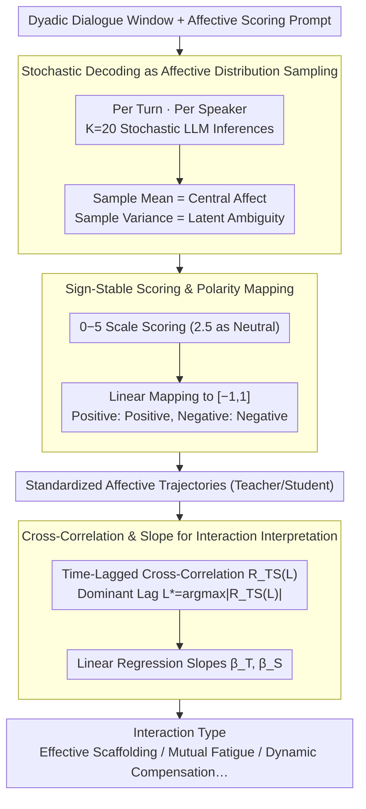

# LLM-MC-Affect: LLM-Based Monte Carlo Modeling of Affective Trajectories and Latent Ambiguity for Interpersonal Dynamic Insight

**Conference**: ACL2026  
**arXiv**: [2601.03645](https://arxiv.org/abs/2601.03645)  
**Code**: Link not publicized (Code address not provided in cache)  
**Area**: Affective Computing / Dialogue Analysis / Educational Dialogue  
**Keywords**: Probabilistic Affective Modeling, Monte Carlo Sampling, Affective Trajectories, Latent Ambiguity, Interpersonal Dynamics  

## TL;DR
This paper proposes LLM-MC-Affect, which transforms affective states in dialogue from single-point labels into latent distributions approximated by stochastic LLM decoding. It further utilizes mean, variance, cross-correlation, and slope metrics to analyze affective synchrony and dominance in teacher-student dialogues.

## Background & Motivation
**Background**: Affective synchrony and interpersonal emotional dynamics are typically studied using physiological signals, neural synchrony, or manual annotation. These methods provide fine-grained time series but impose high requirements for equipment, scene control, and privacy compliance. Conversely, natural language dialogues in education, counseling, and collaboration already contain continuous emotional changes, making textual affective trajectories a more scalable alternative signal.

**Limitations of Prior Work**: Many textual sentiment analysis methods still compress each dialogue turn into a deterministic affective score, assuming a single correct answer for emotional judgement. This erases two types of information: first, the same utterance may be interpreted differently by different people; second, the emotions of both parties influence each other over time rather than being independent.

**Key Challenge**: The central conflict addressed is that scalable text analysis often sacrifices affective ambiguity and interactive structure, while high-fidelity interpersonal dynamic analysis frequently relies on expensive sensors or manual labels. The authors seek to transform LLM stochasticity into a quantifiable source of affective uncertainty without fine-tuning or secondary physiological signal collection.

**Goal**: First, estimate the central affective tendency of each turn; second, represent latent affective ambiguity using the variance of multiple stochastic inferences; third, organize affective sequences from both teacher and student into trajectories; and fourth, interpret who influences whom and whether interaction is improving or deteriorating through time-lagged cross-correlation and trend slopes.

**Key Insight**: The authors observe that LLMs under non-zero temperatures provide different but reasonable affective ratings for the same utterance. Such stochastic output should not be viewed merely as noise but as samples from an underlying affective distribution. Thus, repeated sampling serves as a scalable proxy for multiple human raters.

**Core Idea**: Use Monte Carlo samples from stochastic LLM decoding to estimate affective distributions, then link distribution means and variances into dialogue trajectories to analyze interpersonal affective synchrony at the textual level.

## Method
The core of LLM-MC-Affect is not training a new model but defining a statistical pipeline from dialogue text to interaction interpretation. It prompts an LLM to provide affective scores for turns multiple times under a unified psychometric rubric, converts these into standardized trajectories, and uses time-series tools to interpret the emotional coupling between teacher and student.

### Overall Architecture
The input is a dyadic dialogue window and an affective scoring prompt. For each turn and speaker, the system runs $K$ independent stochastic LLM inferences to obtain a set of affective score samples. Subsequently, the sample mean is calculated as the central affective state, and the sample variance as the perceived ambiguity. Raw scores are first rated on a $0$ to $5$ scale and then mapped to $[-1,1]$, where positive values represent positive affect and negative values represent negative affect.

After obtaining standardized trajectories for both teacher and student, the method calculates the normalized cross-correlation $R_{TS}(L)$ at different dialogue lags $L$, selecting $L^*=\arg\max_L |R_{TS}(L)|$ as the dominant lag. $L^*>0$ indicates teacher affect leads the student; $L^*<0$ indicates student affect leads the teacher. Simultaneously, linear regression is performed on each trajectory to summarize long-term trends via slopes $\beta_T$ and $\beta_S$.

### Key Designs
**1. Stochastic Decoding as Affective Distribution Sampling: Expanding single affective judgments into sets of samples**

Traditional text sentiment analysis compresses each turn into a deterministic score, assuming a single answer and thus averaging out the ambiguity of "one sentence interpreted differently by different people." The authors utilize the fact that LLMs at non-zero temperatures provide varied but reasonable ratings for the same utterance, treating stochastic outputs as samples from a latent distribution. By repeating inference $K=20$ times to obtain $\{\hat{s}_{t,k}\}_{k=1}^K$, they use sample mean for central tendency and sample variance for latent ambiguity. This approximates multiple human raters and distinguishes "certainly neutral" from "competing affective interpretations."

**2. Sign-Stable Affective Scoring and Polarity Mapping: Stabilizing sign confusion before converting to standard coordinates**

LLMs often confuse signs when asked to output positive/negative scores directly. The method requires the model to score on a scale of $0$ to $5$, where $2.5$ is neutral, closer to $0$ is positive, and closer to $5$ is negative—the non-negative interval is more consistently executed by LLMs. Scores are سپس mapped to $[-1,1]$ via $\tilde{s}_t=1-2(s_t/5)$, with variance scaled by $(2/5)^2$. This leverages the stability of non-negative scoring while providing standard coordinates where positive values indicate positive affect, aligning with affective computing literature.

**3. Joint Interpretation of Interaction Patterns via Cross-Correlation and Slopes: Translating trajectories into interaction types**

Affection levels of a single party do not describe the interaction relationship. Understanding who drives whom or whether the interaction is improving or deteriorating requires analyzing phases and trends together. The method calculates normalized cross-correlation $R_{TS}(L)$ across dialogue lags $L$, defining $L^*=\arg\max_L |R_{TS}(L)|$ as the dominant lag: $L^*>0$ means the teacher leads, $L^*<0$ means the student leads. Linear regression slopes $\beta_T, \beta_S$ summarize long-term trends. Combinations of $L^*$, the sign of $R_{TS}(L^*)$, and the signs of $\beta_T, \beta_S$ define interaction categories such as "Effective Scaffolding."

### A Full Example: Personification Topic
Using GPT-4.1 with $\tau=0.7$ on a multi-turn instructional dialogue about "Personification": $K=20$ inferences are performed per turn per speaker, mapping $0$–$5$ scores to $[-1,1]$. Both teacher and student trajectories show a dip around Turn 2 followed by a strong positive recovery by Turn 7. Cross-correlation yields $L^*=+1$ with $R_{TS}=0.999$, suggesting the teacher's prior emotion predicts the student's subsequent emotion. Regression shows $\beta_T=0.1621$ and $\beta_S=0.2532$, both positive with the student recovering faster. The combination of $L^*>0$ (teacher leads) and dual positive slopes (joint improvement) classifies this as Effective Scaffolding.

### Loss & Training
This work does not train a new model or propose supervised losses. it adopts zero-shot inference and statistical estimation: a unified rubric, $K=20$ Monte Carlo samples per turn, fixed temperature for sensitivity analysis, and normalized cross-correlation with least-squares slope estimation. GPT-4.1 at $\tau=0.7$ is primarily used for final analysis due to its balance between mean stability and ambiguity visibility.

## Key Experimental Results

### Main Results

| Target Case | Setting | Key Metrics / Observations | Conclusion |
|:---|:---|:---|:---|
| Google Education Dialogue Dataset | Synthetic multi-turn dialogue | Used GPT-4.1, GPT-3.5-Turbo, Gemma 3 4B, Llama 3.3 70B, etc. | Verified ability to extract trajectories from controlled educational text |
| Personification Topic | GPT-4.1, $\tau=0.7$ | $\beta_T=0.1621, \beta_S=0.2532, L^*=+1, R_{TS}=0.999$ | Interpreted as Effective Scaffolding; teacher leads and drives improvement |
| Cross-Model Comparison | Same rubric, zero-shot | GPT-4.1 and GPT-3.5 both capture V-shaped trajectory (dip at Turn 2) | GPT series is more stable for fine-grained affective shifts |
| Open-Source Model Behavior | Llama 3.3 70B / Phi 4 14B / Gemma 3 4B | Llama 3.3 missed Turn 2 dip; Phi-4 capped at 0.40; Gemma 3 4B stopped at 0.15 | Alignment or scale issues may cause positivity bias and conservative estimates |

### Ablation Study

| Analysis Item | Setting | Key Data | Description |
|:---|:---|:---|:---|
| Temperature Sensitivity | Utterance 6, GPT-4.1 | $\tau=0.1$: Var $0.010$; $\tau=1.0$: Var $0.024$ | Higher temperature increases ambiguity visibility without crashing the mean |
| Mean Stability | Personification range | Mean for Utterance 6 fluctuates between $-0.11$ and $-0.26$ | Central tendency remains stable even as variance significantly changes |
| Trajectory Convergence | Teacher trajectory | Convergent V-shape across all $\tau$ settings | Method filters sampling noise to preserve primary affective signals |
| Statistical Interpretation | NCCF + Slopes | $L^*=+1, R_{TS}=0.999, \beta_T, \beta_S > 0$ | Supports interpretation of "Teacher's prior state predicts student's next state" |

### Key Findings
- Monte Carlo variance is not mere noise but a core variable used to explicitly represent affective ambiguity.
- Affective means are relatively robust to temperature changes, while variance expands with temperature; mean and variance thus serve distinct interpretive functions.
- GPT-4.1 proved most suitable for interaction analysis in this case; some open-source models exhibit excessive positivity or underestimate negative turns, which can serve as a diagnostic signal for model affective bias.
- Cross-correlation supports sequential associations but cannot directly prove causal relationships, a limitation explicitly noted by the authors.

## Highlights & Insights
- Transforming LLM stochasticity from "noise to be suppressed" into "estimable affective distributions" is an insightful perspective. It provides zero-shot LLM inference with statistical semantics similar to multi-human annotation.
- The work goes beyond affective classification to link sequences to interaction patterns. For educational dialogue, the combination of $L^*$ and slopes is more relevant to classroom dynamics than individual scores.
- The method has diagnostic value for model bias: if a model consistently produces overly positive trajectories, it may be unsuitable for monitoring student frustration.
- The pipeline is transferable to clinical counseling, customer service, or collaborative meetings by replacing the rubric with domain-specific interaction dimensions.

## Limitations & Future Work
- Monte Carlo variance blends linguistic ambiguity, model bias, prompt sensitivity, and decoding randomness; it is not strictly equivalent to real human perceptual ambiguity.
- Experiments rely on synthetic educational dialogues, which facilitate controlled variables but may not fully represent noise, non-verbal cues, and student diversity in real classrooms.
- Cross-correlation and lag metrics indicate alignment or leading relationships but should not be interpreted as causal evidence that teacher emotions cause student emotional changes.
- Repeated decoding incurs significant computational cost; deployment in real-time systems would require lighter models or hybrid architectures.
- Future work could incorporate real classroom data, human-rating calibration, cross-cultural rubrics, and sliding window cross-correlation for longer dialogues.

## Related Work & Insights
- **vs. Traditional Text Affective Classification**: Traditional methods output deterministic labels/scores; Ours outputs mean and variance, preserving subjective ambiguity.
- **vs. Multi-Annotator Modeling**: Multi-annotator methods approximate distributions via human disagreement; Ours uses stochastic LLM inference as a lower-cost proxy.
- **vs. Physiological Affective Synchrony**: Physiological signals capture high-fidelity synchrony but have high barriers to entry; Ours trades sensor precision for scalability and privacy.
- **vs. Simple LLM-as-a-Judge**: Standard LLM evaluation often takes a single judgment; Ours statisticalizes the judgment process, making it suitable for analyzing uncertainty and temporal dynamics.

## Rating
- Novelty: ⭐⭐⭐⭐☆ Using stochastic decoding for distribution estimation and linking it to interaction dynamics is clear and novel.
- Experimental Thoroughness: ⭐⭐⭐☆☆ Includes temperature, cross-model, and case analyses, but lacks validation on large-scale real-world datasets.
- Writing Quality: ⭐⭐⭐⭐☆ Logical chain from motivation to statistical modeling and interpretation is complete; limitations are addressed honestly.
- Value: ⭐⭐⭐⭐☆ Highly relevant for educational dialogue, affective computing, and LLM evaluation, particularly for uncertainty-aware interaction analysis.

<!-- RELATED:START -->

<!-- RELATED:END -->

## Related Papers

- [\[ICLR 2026\] Dynamic Parameter Memory: Temporary LoRA-Enhanced LLM for Long-Sequence Emotion Recognition in Conversation](../../ICLR2026/audio_speech/dynamic_parameter_memory_temporary_lora-enhanced_llm_for_long-sequence_emotion_r.md)
- [\[ICLR 2026\] Incentive-Aligned Multi-Source LLM Summaries](../../ICLR2026/audio_speech/incentive-aligned_multi-source_llm_summaries.md)
- [\[ACL 2026\] Data-efficient Targeted Token-level Preference Optimization for LLM-based Text-to-Speech](data-efficient_targeted_token-level_preference_optimization_for_llm-based_text-t.md)
- [\[ACL 2026\] DuIVRS-2: An LLM-based Interactive Voice Response System for Large-scale POI Attribute Acquisition](duivrs-2_an_llm-based_interactive_voice_response_system_for_large-scale_poi_attr.md)
- [\[ICML 2026\] SafeSearch: Automated Red-Teaming of LLM-Based Search Agents](../../ICML2026/audio_speech/safesearch_automated_red-teaming_of_llm-based_search_agents.md)

<!-- RELATED:END -->
