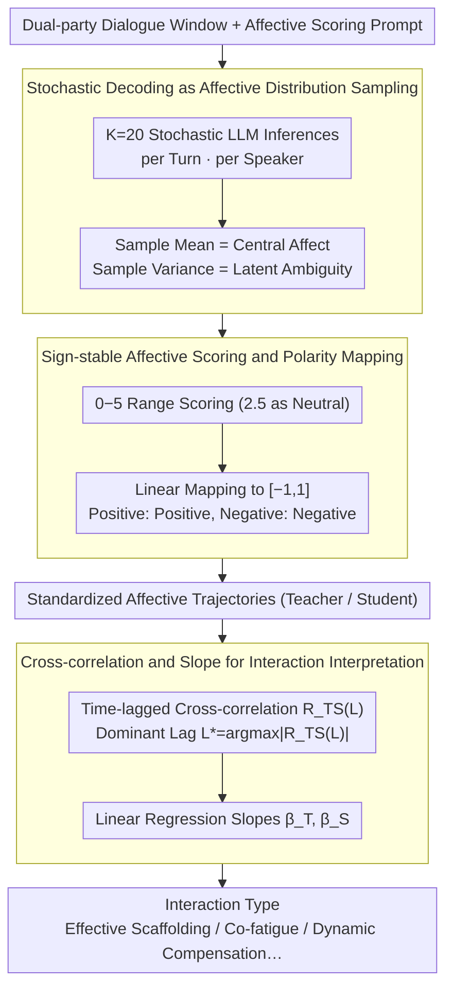

# LLM-MC-Affect: LLM-Based Monte Carlo Modeling of Affective Trajectories and Latent Ambiguity for Interpersonal Dynamic Insight

**Conference**: ACL2026  
**arXiv**: [2601.03645](https://arxiv.org/abs/2601.03645)  
**Code**: No link disclosed (cached code address not provided)  
**Area**: Affective Computing / Dialogue Analysis / Educational Dialogue  
**Keywords**: Probabilistic Affective Modeling, Monte Carlo Sampling, Affective Trajectories, Latent Ambiguity, Interpersonal Dynamics  

## TL;DR
This paper proposes LLM-MC-Affect, which transforms sentiment in dialogues from single-point labels into latent distributions approximated by stochastic LLM decoding. It then uses mean, variance, cross-correlation, and slope metrics to analyze affective synchronization and dominance in teacher-student dialogues.

## Background & Motivation
**Background**: Affective synchronization and interpersonal emotional dynamics are usually studied using physiological signals, neural synchronization, or manual labeling. While these provide fine-grained time series, they impose high requirements on equipment, scenario control, and privacy compliance. Conversely, natural language dialogues in education, counseling, and collaboration already contain continuous emotional changes, making text-based affective trajectories a more scalable alternative.

**Limitations of Prior Work**: Many text sentiment analysis methods still compress each turn into a deterministic sentiment score, assuming a single "correct" emotional judgment. This erases two types of information: first, that the same sentence may be interpreted with different emotions by different people; second, that the emotions of both parties influence each other over time rather than being independent.

**Key Challenge**: The challenge addressed in this paper is that scalable text analysis often sacrifices affective ambiguity and interaction structure, while high-fidelity interpersonal dynamic analysis often relies on expensive sensors or manual labels. The authors aim to transform LLM randomness into a quantifiable source of affective uncertainty without fine-tuning or additional physiological signal collection.

**Goal**: First, to estimate the central affective tendency of each turn; second, to represent latent affective ambiguity using the variance of multiple stochastic inferences; third, to organize the affective sequences of both teacher and student into trajectories; and fourth, to explain who influences whom and whether the interaction is co-improving or co-deteriorating via time-lagged cross-correlation and trend slopes.

**Key Insight**: The authors observe that LLMs under non-zero temperatures provide different but plausible sentiment scores for the same sentence. This stochastic output should not be treated merely as noise but as sampling from a latent affective distribution. Thus, repeated sampling serves as an approximation for multiple human raters.

**Core Idea**: Use Monte Carlo samples from stochastic LLM decoding to estimate affective distributions, then link the distribution means and variances into dialogue trajectories to analyze interpersonal affective synchronization at the text level.

## Method
The core of LLM-MC-Affect is not training a new affective model but defining a statistical pipeline from dialogue text to interaction interpretation. It prompts an LLM to provide turn-level sentiment scores multiple times under a unified psychometric rubric, converts these scores into standardized affective trajectories, and finally uses time-series tools to interpret the emotional coupling between teacher and student.

### Overall Architecture
The input consists of a two-party dialogue window and an affective scoring prompt. For each turn and each speaker, the system runs $K$ independent stochastic LLM inferences to obtain a set of sentiment score samples. Subsequently, the sample mean is calculated as the central affective state, and the sample variance is calculated as the perceived ambiguity. Raw scores are first rated on a scale of $0$ to $5$ and then mapped to $[-1,1]$, where positive values represent positive affect and negative values represent negative affect.

After obtaining the standardized trajectories for both teacher and student, the method calculates the normalized cross-correlation $R_{TS}(L)$ under different dialogue lags $L$, selecting $L^*=\arg\max_L |R_{TS}(L)|$ as the dominant lag. If $L^*>0$, it indicates that the teacher's affect leads the student's; if $L^*<0$, the student's affect leads the teacher's. Simultaneously, linear regression is performed on each trajectory, using slopes $\beta_T$ and $\beta_S$ to summarize long-term affective trends.

### Key Designs
**1. Stochastic Decoding as Affective Distribution Sampling: Expanding sentiment judgment from a single deterministic output to a set of samples**

Traditional text sentiment analysis compresses each turn into a deterministic score, assuming a unique answer for emotional judgment, thereby averaging out the "ambiguity" where the same sentence is interpreted differently by different people. The authors note that LLMs under non-zero temperatures provide different but reasonable ratings for the same sentence. They treat this stochastic output as sampling from a latent affective distribution: repeating inference $K=20$ times for the same context to obtain $\{\hat{s}_{t,k}\}_{k=1}^K$, using the sample mean for central tendency and the sample variance for latent ambiguity. This repeated sampling approximates multiple human raters, distinguishing between "the model is certain it is neutral" and "multiple plausible emotional interpretations are competing," both of which might otherwise be labeled as neutral.

**2. Sign-stable Affective Scoring and Polarity Mapping: Stabilizing LLM sign confusion before converting to standard affective coordinates**

LLMs often confuse signs when asked to directly output positive/negative sentiment scores. The method first requires the model to rate on a $0$ to $5$ scale, where $2.5$ is neutral, values closer to $0$ are more positive, and values closer to $5$ are more negative—non-negative intervals are more stably executed by LLMs. After obtaining the scores, $\tilde{s}_t=1-2(s_t/5)$ is used to map them to $[-1,1]$, with the variance scaled by $(2/5)^2$. This leverages the stability of non-negative scoring while resulting in standard coordinates where "positive is positive, negative is negative," facilitating alignment with affective computing literature.

**3. Interpreting Interaction Modes via Cross-correlation and Slope: Translating trajectories into interaction types like "Effective Scaffolding"**

The emotional level of a single party does not describe the interactive relationship—determining who is leading whom and whether the interaction is co-improving or co-deteriorating requires reading the phases and trends of both trajectories. The method calculates normalized cross-correlation $R_{TS}(L)$ at different lags $L$, taking $L^*=\arg\max_L |R_{TS}(L)|$ as the dominant lag: $L^*>0$ means the teacher leads, and $L^*<0$ means the student leads. Simultaneously, linear regression is applied to each trajectory to summarize long-term trends with slopes $\beta_T, \beta_S$. Using the combination of $L^*$, the sign of $R_{TS}(L^*)$, and the signs of $\beta_T, \beta_S$, the method defines the type of teacher-student interaction.

### A Complete Example: Personification Topic
Running a multi-turn instructional dialogue between a teacher and a student regarding "Personification" with GPT-4.1 at $\tau=0.7$: For each turn and speaker, $K=20$ stochastic inferences are performed, mapping $0$–$5$ scores to $[-1,1]$. This yields standardized affective trajectories for both—both dip around Turn 2 and turn strongly positive by Turn 7. Calculating time-series cross-correlation yields $L^*=+1$ and $R_{TS}=0.999$, indicating the teacher's emotion in the previous turn almost predicts the student's emotion in the next. Linear regression shows slopes $\beta_T=0.1621$ and $\beta_S=0.2532$, both positive with the student recovering faster. The combination of $L^*>0$ (teacher leads) and dual positive slopes (co-improvement) classifies this dialogue as Effective Scaffolding: the teacher leads and drives the student's affect upward.

### Loss & Training
No new model was trained, nor was a supervised loss proposed. The approach uses zero-shot inference and statistical estimation: a unified rubric, $K=20$ Monte Carlo samples per turn, fixed model temperatures for sensitivity analysis, and normalized cross-correlation and least-squares slope estimation during the interaction interpretation phase. GPT-4.1 with $\tau=0.7$ was primarily used for final interaction analysis, as this setting balances mean stability and ambiguity visibility.

## Key Experimental Results

### Main Results

| Target | Setting | Key Metric / Observation | Conclusion |
|--------|---------|-------------------------|------------|
| Google Education Dialogue Dataset | Synthetic multi-turn teacher-student dialogue | Using GPT-4.1, GPT-3.5-Turbo, Gemma 3 4B, Llama 3.3 70B, Phi 4 14B, GPT-OSS 120B | Validates the method's ability to extract affective trajectories from text in controlled educational interactions. |
| Personification Topic | GPT-4.1, $\tau=0.7$ | Teacher slope $\beta_T=0.1621$, student slope $\beta_S=0.2532$, $L^*=+1$, $R_{TS}=0.999$ | Interpreted as Effective Scaffolding, where the teacher leads and drives student affective improvement. |
| Cross-model Comparison | Unified rubric, Zero-shot | Both GPT-4.1 and GPT-3.5-Turbo capture the V-shaped trajectory (early dip followed by recovery). | GPT series are more stable for fine-grained emotional transitions. |
| Open-source Model Behavior | Llama 3.3 70B / Phi 4 14B / Gemma 3 4B | Llama 3.3 70B misses the Turn 2 dip; Phi-4 means cap at ~0.40; Gemma 3 4B recovery stops near 0.15. | Alignment or model scale may introduce positivity bias and conservative emotional estimation. |

### Ablation Study

| Analysis | Setting | Key Data | Description |
|----------|---------|----------|-------------|
| Temperature Sensitivity | Utterance 6, GPT-4.1 | Mean ~ $-0.12$, Var $0.010$ at $\tau=0.1$; Var increases to $0.024$ at $\tau=1.0$. | Higher temperature makes ambiguity more visible but does not equate to the mean losing control. |
| Mean Stability | Personification across temperatures | Mean of Utterance 6 fluctuates between ~$-0.11$ and $-0.26$. | Central affective tendency remains relatively stable even as variance changes significantly. |
| Trajectory Convergence | Teacher Affective Trajectory | All $\tau$ settings show the dip near Turn 2 and strong positive trend by Turn 7. | The method filters stochastic sampling noise while preserving major affective signals. |
| Statistical Interpretation | NCCF + Slopes | $L^*=+1, R_{TS}=0.999, \beta_T, \beta_S > 0$. | Supports the interpretation that the teacher's previous-turn emotion predicts the student's next-turn emotion. |

### Key Findings
- Monte Carlo variance is not simple noise; it is a core variable used by the paper to explicitly represent affective ambiguity.
- Affective means are relatively robust to temperature changes, while variance expands with temperature, allowing them to serve different interpretive functions.
- GPT-4.1 proved most suitable for interaction analysis in this case; some open-source models exhibit over-positivity or underestimate negative transitions, which itself serves as a diagnostic signal for model bias.
- Cross-correlation only supports sequential association interpretation and cannot directly imply causality, a point explicitly emphasized in the limitations.

## Highlights & Insights
- The perspective of turning LLM randomness from "noise to be suppressed" into an "estimable affective distribution" is inspiring. It gives zero-shot LLM inference a statistical semantics similar to multi-human rating.
- The paper does not stop at sentiment classification but connects affective sequences to interaction mode interpretation. For educational dialogues, the combination of $L^*$ and slopes is more aligned with the classroom dynamics teachers care about than individual sentiment scores.
- The method offers diagnostic value for model bias: if a model always yields overly positive trajectories, it may be unsuitable for monitoring student frustration.
- This pipeline can be migrated to other dyadic or multi-party dialogue scenarios like counseling, customer service, or collaborative meetings by simply changing the rubric to the target domain's interaction dimensions.

## Limitations & Future Work
- Monte Carlo variance blends linguistic ambiguity, model bias, prompt sensitivity, and decoding randomness; it is not strictly equivalent to real human perceived ambiguity.
- Experiments rely primarily on synthetic educational dialogues, which facilitate variable control but may not fully represent real-world classroom noise, non-verbal cues, and student diversity.
- Cross-correlation and lag metrics indicate sequential alignment or lead-lag relationships and should not be interpreted as causal evidence that teacher emotions cause student emotional changes.
- Repeated stochastic decoding incurs significant computational costs; lightweight affective models or hybrid architectures are needed for real-time deployment.
- Future work could incorporate real classroom data, human rating calibration, cross-cultural affective rubrics, and sliding-window cross-correlation for longer dialogues.

## Related Work & Insights
- **vs. Traditional Text Sentiment Classification**: Traditional methods output deterministic labels/scores; this method outputs mean and variance, preserving subjective ambiguity.
- **vs. Human Multi-annotator Affective Modeling**: Multi-annotator methods approximate latent distributions with real human disagreement; this method uses stochastic LLM inference as a proxy, which is cheaper but more dependent on model bias.
- **vs. Physiological Signal Affective Sync Studies**: Physiological signals capture high-fidelity sync but have high deployment barriers; text trajectories sacrifice some sensing precision for scalability and privacy.
- **vs. Pure LLM-as-a-Judge**: Standard LLM evaluation often takes a single judgment; this method statisticalizes the evaluation process, making it better suited for analyzing uncertainty and temporal dynamics.

## Rating
- Novelty: ⭐⭐⭐⭐☆ Using stochastic decoding for affective distribution estimation and linking it to interaction dynamics is clear and novel.
- Experimental Thoroughness: ⭐⭐⭐☆☆ Includes temperature, cross-model, and case analyses, but relies heavily on synthetic educational scenarios with a lack of real-world data validation.
- Writing Quality: ⭐⭐⭐⭐☆ The chain from motivation to statistical modeling and interaction interpretation is complete, and limitations are addressed honestly.
- Value: ⭐⭐⭐⭐☆ Valuable for educational dialogue analysis, affective computing, and LLM evaluation, particularly in inspiring interaction analysis with uncertainty awareness.

<!-- RELATED:START -->

## Related Papers

- [\[ICLR 2026\] Dynamic Parameter Memory: Temporary LoRA-Enhanced LLM for Long-Sequence Emotion Recognition in Conversation](../../ICLR2026/audio_speech/dynamic_parameter_memory_temporary_lora-enhanced_llm_for_long-sequence_emotion_r.md)
- [\[ICLR 2026\] Incentive-Aligned Multi-Source LLM Summaries](../../ICLR2026/audio_speech/incentive-aligned_multi-source_llm_summaries.md)
- [\[ACL 2026\] Data-efficient Targeted Token-level Preference Optimization for LLM-based Text-to-Speech](data-efficient_targeted_token-level_preference_optimization_for_llm-based_text-t.md)
- [\[ACL 2026\] DuIVRS-2: An LLM-based Interactive Voice Response System for Large-scale POI Attribute Acquisition](duivrs-2_an_llm-based_interactive_voice_response_system_for_large-scale_poi_attr.md)
- [\[ICML 2026\] SafeSearch: Automated Red-Teaming of LLM-Based Search Agents](../../ICML2026/audio_speech/safesearch_automated_red-teaming_of_llm-based_search_agents.md)

<!-- RELATED:END -->
