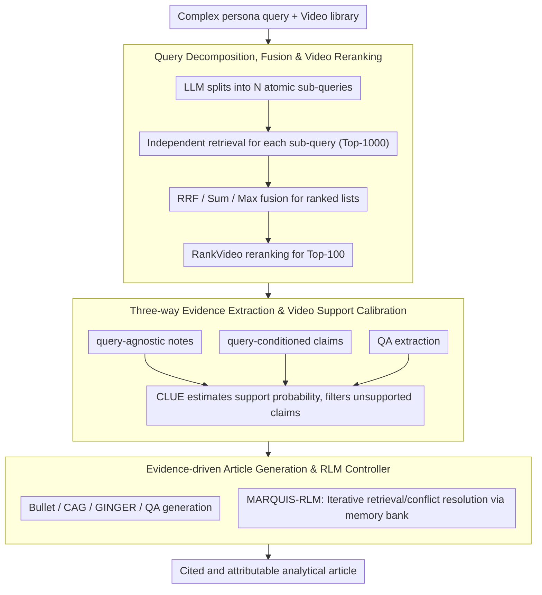

# MARQUIS: A Three-Stage Pipeline for Video Retrieval-Augmented Generation

**Conference**: ACL2026  
**arXiv**: [2605.17640](https://arxiv.org/abs/2605.17640)  
**Code**: https://github.com/debashishc/marquis  
**Area**: Video RAG / Multimodal Retrieval / Evidence-Attributed Generation  
**Keywords**: Video Retrieval-Augmented Generation, Query Decomposition, Evidence Extraction, Uncertainty Calibration, RLM Controller

## TL;DR
MARQUIS decomposes multi-video retrieval-augmented article generation into a three-stage pipeline: "Query Decomposition & Reranking—Calibrated Structured Evidence Extraction—Cited Article Generation." It utilizes an RLM controller for iterative evidence management, improving retrieval nDCG@10 from 0.195 to 0.759 on MAGMaR2026, with the generation side achieving human ratings of 3.83 for Iter-QA-Base.

## Background & Motivation
**Background**: Video corpora record a vast array of real-world events. However, converting audiovisual evidence from multiple videos into a cited, attributable, and well-structured analytical article still largely depends on manual effort. Traditional RAG primarily focuses on text, whereas video RAG must handle visual frames, audio, transcripts, cross-video evidence synthesis, and citation attribution.

**Limitations of Prior Work**: Issues exist at both the retrieval and generation ends. On the retrieval side, queries for tasks like MAGMaR are often long, containing professional personas, background, and multiple implicit/explicit information needs; a single dense embedding tends to compress multi-faceted requirements into one vector, missing relevant videos. On the generation side, models face challenges such as excessive context length, insufficient cross-video reasoning, disordered citations, and unclear factual support when dealing with multiple long videos.

**Key Challenge**: Directly feeding a large volume of video content into a long-context VLM to write an article is both expensive and unreliable. However, video retrieval alone is insufficient because article generation requires fine-grained, citable, and calibratable evidence units. The system needs an evidence management layer between "finding videos" and "writing articles."

**Goal**: The authors aim to build a modular pipeline: first, decompose complex queries into retrievable atomic sub-queries to improve recall; second, convert videos into structured evidence and estimate support probabilities; finally, generate articles with citations based only on filtered evidence. An additional MARQUIS-RLM uses structured memory and tool calling to control evidence collection and organization.

**Key Insight**: This paper treats video RAG as an evidence-management problem. The key is not to let one model "watch all videos and summarize" once, but to break query processing, retrieval, extraction, calibration, and citation generation into checkable steps.

**Core Idea**: Repair retrieval using query decomposition and rank fusion; repair evidence granularity using query-agnostic notes, query-conditioned claims, and QA evidence extraction; filter unsupported claims using CLUE support probabilities; and compare different evidence synthesis methods (Bullet/CAG/GINGER/RLM).

## Method

### Overall Architecture
MARQUIS addresses the problem of "given a complex query and a large video library, write a cited and attributable analytical article." Instead of letting a VLM process all videos at once, it decomposes the task into a three-stage pipeline: retrieval, evidence management, and generation, making each step inspectable and replaceable.

The first stage, **Video Retrieval**, decomposes the complex query into multiple atomic sub-queries. Each sub-query is independently retrieved using OmniEmbed, followed by fusion of ranked lists using strategies like RRF and similarity aggregation. Finally, RankVideo performs video-native reranking on the Top-100 candidates. The second stage, **Information Extraction**, performs parallel extraction of query-agnostic notes, query-conditioned claims, and question-answer evidence from retrieved videos, using CLUE to calibrate whether each piece of evidence is supported by the source video. The third stage, **Article Generation**, feeds filtered evidence artifacts to the generator, comparing synthesis methods such as Bullet, CAG, GINGER, QA-based generation, and the MARQUIS-RLM controller. MARQUIS-RLM is an optional high-level control layer: it wraps all aforementioned modules as tools, invoked by a Root LM in a persistent Python sandbox within a Think-Act-Observe loop while maintaining a structured memory bank.

### Key Designs

**1. Query Decomposition, Fusion & Video Reranking: Breaking long persona queries into short queries familiar to retrievers**

Queries in tasks like MAGMaR are often long, containing professional personas and multi-faceted information needs. Dense retrievers are typically trained on short query-document pairs, making long queries out-of-distribution inputs where a single embedding compresses multiple needs, losing relevant videos. MARQUIS has the LLM decompose the original query into $N$ atomic sub-queries. Each sub-query independently retrieves the Top-1000 video candidates, and the multiple ranked lists are fused into a global ranking. Fusion strategies include RRF, Sum/Max/Mean similarity, and Weighted RRF, with RRF aggregating rankings via:
$$RRF_K(v)=\sum_i 1/(K+\mathrm{rank}(v,q_i))$$
The fused Top-100 are then passed to RankVideo for video-native reranking. Breaking the query into atomic needs allows the retriever to hit videos covering different facets, which is the primary reason retrieval nDCG@10 jumped from 0.195 to 0.759.

**2. Three-way Evidence Extraction & Video Support Calibration: Decoupling extraction from credibility judgment**

Models that "write evidence while watching the video" often confidently misjudge the credibility of the evidence they generate, creating a self-reinforcing hallucination loop. MARQUIS splits evidence extraction into three granularities and separates them from support estimation: query-agnostic note extraction records directly observable visual events, OCR, and speech; query-conditioned claim extraction pulls only claims relevant to the query and supported by the video; QA extraction decomposes information needs into questions answered by a VLM based on video and transcripts. These three outputs—broad observations, task-relevant claims, and targeted QA—are unified and scored by CLUE to obtain a support probability $s_\theta(v,x) \in [0,1]$, filtering out unsupported claims. Severing "what to extract" from "whether to believe it" allows evidence units to carry calibrated confidence rather than being vague summaries.

**3. Evidence-driven Article Generation & RLM Controller: Turning organization and citation from a one-shot prompt into observable states**

The most common error in multi-video generation is not linguistic fluency but evidence organization and citation maintenance. MARQUIS compares synthesis methods on filtered evidence: Bullet lists evidence directly (conservative but not prose); CAG performs one-shot synthesis of a cited article; GINGER performs facet clustering, cluster ranking, per-cluster summarization, and final polishing. The top-level MARQUIS-RLM allows a Root LM to iteratively call tools in a persistent environment, using a memory bank to search, reuse, and revise evidence records while explicitly handling evidence conflicts and information gaps. The value of RLM lies not in a longer context window, but in turning "filling gaps, resolving conflicts, and organizing facts" into a series of observable state transitions, reducing evidence forgetting and cross-source mixing—though it may include more irrelevant facts (it shows the highest citation recall but lower precision).

### A Complete Example: From a Persona Query to a Cited Article

Given a long query with a professional persona and multiple requirements: Stage one decomposes it into atomic sub-queries (e.g., "Timeline of event," "Statements from key figures," "On-site footage"). Each sub-query retrieves Top-1000 candidates via OmniEmbed, fused via RRF into a master list, and the Top-100 are reranked by RankVideo. Stage two runs three-way extraction in parallel: notes record visuals/subtitles, claims extract supported assertions, and QA provides specific answers. CLUE scores each with $s_\theta$, discarding low-probability items. Stage three hands these calibrated, source-tagged pieces of evidence to the generator. If using the RLM route, the Root LM searches the memory bank, identifies missing facets to trigger more retrieval, and finally outputs an article where every sentence can be traced back to specific videos.

### Loss & Training
MARQUIS is primarily a system pipeline rather than an end-to-end training method. Experiments use OmniEmbed for video/query encoding, Qwen3.5-9B for query decomposition and extraction, Qwen3.5-27B for QA and article generation, and Qwen2.5-Omni-7B with Whisper medium.en for multimodal embeddings and transcription. Claim-based extraction/generation does not use audio; the QA pipeline and RLM access audio via transcription tools. Evaluation is conducted on the MAGMaR2026 Test Set. Retrieval uses nDCG and Recall; generation uses MiRAGE automatic metrics and 1-5 human ratings from three annotators.

## Key Experimental Results

### Main Results
Retrieval improvements on MAGMaR2026 are significant:

| Method | nDCG@10 | nDCG@20 | R@10 | R@20 | Note |
|------|---------|---------|------|------|------|
| OmniEmbed | 0.195 | 0.229 | 0.190 | 0.276 | Single query dense retrieval baseline |
| Max Sim | 0.722 | 0.743 | 0.639 | 0.731 | Strongest first-stage nDCG |
| RRF K=10 | 0.700 | 0.739 | 0.612 | 0.735 | More balanced recall |
| Sum Sim + RankVideo | 0.747 | 0.758 | 0.636 | 0.711 | Significant gain after reranking |
| RRF K=10 + RankVideo | 0.759 | 0.771 | 0.652 | 0.735 | Overall best nDCG@10 |

Generation side comparison for 8 systems under oracle relevant video settings:

| System | Human Score | Best Votes | Best % | Info P/R | Cite P/R | Key Observations |
|------|-------------|------------|--------|----------|----------|----------|
| CAG baseline | 3.09 | 1 | 1.8% | 76.4 / 41.0 | 61.7 / 22.8 | One-shot synthesis baseline |
| Bullet | 2.67 | 0 | 0.0% | 71.1 / 39.4 | 60.4 / 23.7 | Conservative, not prose-like |
| GINGER | 3.12 | 6 | 10.5% | 77.6 / 40.4 | 64.3 / 22.6 | Strongest prose among claim-based |
| MARQUIS-RLM | 3.30 | 3 | 5.3% | 70.8 / 38.5 | 59.2 / 27.2 | Highest citation recall (non-QA) |
| SS-QA-GINGER | 3.42 | 10 | 17.5% | 54.4 / 32.4 | 32.6 / 23.8 | Most Best Votes |
| Iter-QA-Base | 3.83 | 8 | 14.0% | 34.7 / 31.3 | 26.8 / 25.8 | Highest average human score |
| Iter-QA-GINGER | 3.69 | 5 | 8.8% | 34.5 / 29.0 | 25.7 / 22.6 | Strong mix of QA + GINGER |

### Ablation Study

| Comparison Point | Result | Implication |
|--------|------|------|
| Vanilla OmniEmbed vs query expansion | nDCG@10 from 0.195 to 0.722 | Query decomposition is the main driver of retrieval gain |
| RRF K=10 first-stage vs +RankVideo | nDCG@10 from 0.700 to 0.759 | Video reranking further improves ranking quality |
| Max Sim vs Max Sim + RankVideo | nDCG@10 from 0.722 down to 0.399 | RankVideo failed significantly with Max Sim fusion (future analysis needed) |
| CAG vs GINGER | Human Score 3.09 to 3.12, Best % 1.8% to 10.5% | Facet clustering/staged generation improves readability |
| CAG vs MARQUIS-RLM | Human Score 3.09 to 3.30, Citation Recall 22.8 to 27.2 | RLM evidence management improves attribution recall at the cost of precision |

### Key Findings
- On the retrieval side, the most important factor is decomposing complex queries into atomic sub-queries; this brings the retriever back to the distribution of short queries it was trained on.
- While RRF-based methods might not show the highest first-stage nDCG, they cover more facets, leading to optimal performance after reranking.
- On the generation side, there is no single winner: QA systems receive high human scores but may conservatively refuse to write if questions fail, lowering automatic scores. Claim-based systems have good precision but may lack synthesis ability. RLM improves citation recall via structured memory but introduces more irrelevant facts.

## Highlights & Insights
- **Decomposing video RAG into an evidence pipeline is effective**: Video article generation is not about "watching more videos and then writing," but requires five distinct steps: retrieval, extraction, calibration, organization, and citation. MARQUIS's modularity makes each step replaceable and evaluable.
- **Independence of calibration and extraction**: Extracting evidence first and then independently judging its support by the source video reduces the hallucination loop where the model both generates and self-validates evidence.
- **RLM as a state management tool**: In long multi-video tasks, a memory bank is more important than a longer context. RLM's value lies in allowing the Root LM to explicitly search for and revise evidence records.
- **Tension between human ratings and automatic metrics**: Iter-QA-Base has the highest human scores but relatively low automatic info/citation precision. This serves as a reminder that video RAG evaluation cannot rely solely on automatic metrics.

## Limitations & Future Work
- The severe performance degradation of Max Sim + RankVideo suggests interaction failures between fusion strategies and rerankers that require further analysis.
- QA systems refuse to write articles when question decomposition or VLM answering fails; while this avoids hallucinations, it results in zero-score outputs on potentially informative topics.
- MARQUIS-RLM shows high citation recall but lower precision, indicating that iterative evidence collection introduces noise. Stronger evidence filtering or integration with GINGER is needed.
- Claim-based extraction/generation does not use audio, potentially missing information available only in speech; while QA/RLM can access transcripts, they increase system complexity.
- Testing was primarily on MAGMaR2026; cross-domain video libraries, real-time streams, non-English audio, and longer event chains still need testing.

## Related Work & Insights
- **vs. Text RAG**: Text RAG usually retrieves passages; MARQUIS retrieves videos and extracts citable evidence, facing additional modality, timestamp, and support validation challenges.
- **vs. Single Video Caption/QA**: Traditional video understanding focuses on captions or entity-centric QA; this task requires synthesizing analytical articles across multiple videos, increasing evidence organization difficulty.
- **vs. Long-context VLM**: Simply extending context can accommodate more videos but cannot guarantee attribution or conflict resolution; MARQUIS uses structured evidence management rather than "blindly stuffing context."
- **Inspiration**: Future multimodal RAG systems should treat "evidence units" as core intermediate representations, preserving source IDs, timestamps, support probabilities, and claim dependencies rather than just natural language summaries.

## Rating
- Novelty: ⭐⭐⭐⭐☆ The three-stage video RAG framework is not a single breakthrough, but the combination of evidence calibration and RLM control is highly valuable.
- Experimental Thoroughness: ⭐⭐⭐⭐☆ Systematic experiments across retrieval and generation using human scores and automatic metrics; limited by the focus on MAGMaR2026.
- Writing Quality: ⭐⭐⭐⭐☆ The pipeline is clear, and tables are information-dense; however, some module details are scattered in the appendix.
- Value: ⭐⭐⭐⭐⭐ Highly relevant for designing video RAG, evidence-attributed generation, and multimodal retrieval systems.

<!-- RELATED:START -->

## Related Papers

- [\[ACL 2026\] PlanRAG-Audio: Planning and Retrieval Augmented Generation for Long-form Audio Understanding](planrag-audio_planning_and_retrieval_augmented_generation_for_long-form_audio_un.md)
- [\[CVPR 2026\] SAVE: Speech-Aware Video Representation Learning for Video-Text Retrieval](../../CVPR2026/audio_speech/save_speech-aware_video_representation_learning_for_video-text_retrieval.md)
- [\[ACL 2025\] WavRAG: Audio-Integrated Retrieval Augmented Generation for Spoken Dialogue Models](../../ACL2025/audio_speech/wavrag_audio-integrated_retrieval_augmented_generation_for_spoken_dialogue_model.md)
- [\[AAAI 2026\] Hearing More with Less: Multi-Modal Retrieval-and-Selection Augmented Conversational LLM-Based ASR](../../AAAI2026/audio_speech/hearing_more_with_less_multi-modal_retrieval-and-selection_augmented_conversatio.md)
- [\[CVPR 2026\] Omni2Sound: Towards Unified Video-Text-to-Audio Generation](../../CVPR2026/audio_speech/omni2sound_towards_unified_video-text-to-audio_generation.md)

<!-- RELATED:END -->
