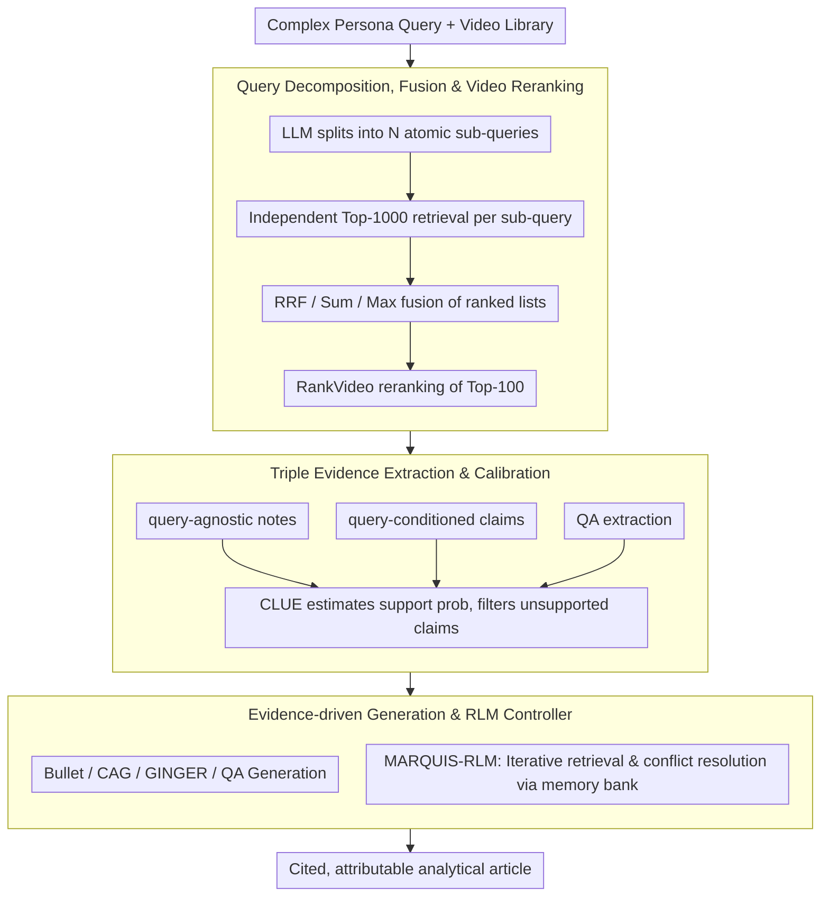

# MARQUIS: A Three-Stage Pipeline for Video Retrieval-Augmented Generation

**Conference**: ACL2026  
**arXiv**: [2605.17640](https://arxiv.org/abs/2605.17640)  
**Code**: https://github.com/debashishc/marquis  
**Area**: Video RAG / Multimodal Retrieval / Evidence-Attributed Generation  
**Keywords**: Video Retrieval-Augmented Generation, Query Decomposition, Evidence Extraction, Uncertainty Calibration, RLM Controller

## TL;DR
MARQUIS decomposes multi-video retrieval-augmented article generation into a three-stage pipeline: "Query Decomposition and Reranking Retrieval—Calibrated Structured Evidence Extraction—Article Generation with Citations." It also employs an RLM controller for iterative evidence management. On MAGMaR2026, it improved retrieval nDCG@10 from 0.195 to 0.759, while the Iter-QA-Base variant achieved a human rating of 3.83 on the generation side.

## Background & Motivation
**Background**: Video corpora are recording a vast number of real-world events. However, converting audio-visual evidence from multiple videos into a cited, attributable, and structured analytical article still largely relies on manual labor. Traditional RAG is primarily text-oriented; video RAG must additionally handle visual frames, audio, transcripts, cross-video evidence synthesis, and citation attribution.

**Limitations of Prior Work**: Issues exist at both retrieval and generation stages. At the retrieval stage, queries in tasks like MAGMaR are often long, containing professional personas, background, and multiple implicit/explicit information needs; a single dense embedding tends to compress multifaceted needs into one vector, missing relevant videos. At the generation stage, models face problems such as excessive context length, insufficient cross-video reasoning, confused citations, and unclear factual support when dealing with multiple long videos.

**Key Challenge**: Directly feeding massive video content into a long-context VLM to write articles is both expensive and unreliable. However, simple video retrieval is also insufficient because article generation requires fine-grained, citable, and calibratable evidence units. The system needs to insert an evidence management layer between "finding videos" and "writing articles."

**Goal**: The authors aim to construct a modular pipeline: first, decompose complex queries into retrievable atomic sub-queries to improve recall; second, convert videos into structured evidence and estimate support probabilities; and finally, generate cited articles based only on filtered evidence. An additional MARQUIS-RLM utilizes structured memory and tool calls to control evidence collection and organization.

**Key Insight**: The paper treats video RAG as an evidence-management problem. The key is not to let one model "watch all videos and summarize" at once, but to decompose query, retrieval, extraction, calibration, and citation generation into inspectable steps.

**Core Idea**: Repair retrieval via query decomposition and rank fusion; repair evidence granularity via query-agnostic notes, query-conditioned claims, and QA evidence extraction; filter unsupported claims using CLUE support probabilities; and compare different evidence synthesis methods using strategies such as Bullet, CAG, GINGER, and RLM.

## Method

### Overall Architecture
MARQUIS addresses the problem of "given a complex query and a large set of videos, write a cited and attributable analytical article." Instead of letting a VLM watch all videos at once, it breaks the task into a three-stage pipeline—retrieval, evidence management, and generation—making every step inspectable and replaceable.

The first stage, **Video Retrieval**, decomposes the complex query into $N$ atomic sub-queries. Each sub-query independently retrieves candidates via OmniEmbed, followed by fusion of ranked lists using strategies like RRF or similarity aggregation. Finally, RankVideo performs video-native reranking for the Top-100 candidates. The second stage, **Information Extraction**, concurrently extracts query-agnostic notes, query-conditioned claims, and question-answer evidence from retrieved videos, using CLUE to calibrate whether each piece of evidence is supported by the source video. The third stage, **Article Generation**, feeds the filtered evidence artifacts to a generator, comparing synthesis methods like Bullet, CAG, GINGER, QA-based generation, and the MARQUIS-RLM controller. MARQUIS-RLM is an optional high-level control layer: it wraps all modular units as tools, invoked by a Root LM in a Think-Act-Observe loop within a persistent Python sandbox, while maintaining a structured memory bank.

### Key Designs

**1. Query Decomposition, Fusion, and Video Reranking: Splitting long persona queries into short queries familiar to retrievers**

Queries in MAGMaR-like tasks are usually long, containing professional personas and complex information needs. Dense retrievers are typically trained on short query-document pairs; a long query is an out-of-distribution input where a single embedding compresses multifaceted requirements into one vector, missing relevant videos. MARQUIS lets an LLM decompose the original query into $N$ atomic sub-queries. Each sub-query independently retrieves Top-1000 video candidates, and the multiple ranked lists are fused into an overall ranking. Fusion strategies include RRF, Sum/Max/Mean similarity, and Weighted RRF. RRF aggregates rankings using $RRF_K(v)=\sum_i 1/(K+\mathrm{rank}(v,q_i))$. The fused Top-100 are then passed to RankVideo for video-native reranking. By splitting requirements, the retriever more easily hits videos covering different facets, which is the primary reason nDCG@10 jumped from 0.195 to 0.759.

**2. Triple Evidence Extraction and Video Support Calibration: Decoupling extraction from credibility judgment**

Directly asking a model to "write evidence while watching video" often results in the model confidently misjudging the credibility of the evidence it just generated, creating a self-corroborating hallucination cycle. MARQUIS splits evidence extraction into three granularities and separates it from support estimation: **query-agnostic note extraction** records directly observable visual events, OCR, and audio; **query-conditioned claim extraction** extracts only claims related to the query and supported by the video; **QA extraction** decomposes information needs into questions answered by the VLM based on video and transcripts. These outputs cover broad observations, task-relevant claims, and targeted QA. All are then unified for CLUE scoring to obtain a support probability $s_\theta(v,x) \in [0,1]$, filtering out unsupported claims. By separating "what to extract" from "whether to believe it," evidence units carry calibratable confidence.

**3. Evidence-Driven Article Generation and RLM Controller: Transforming organization and citation from a one-shot prompt into an observable state**

The most error-prone part of multi-video generation is organization and citation persistence rather than linguistic fluency. MARQUIS compares several synthesis methods on filtered evidence: **Bullet** lists evidence directly (conservative but not prose); **CAG** synthesizes a cited article in one shot; **GINGER** performs facet clustering, cluster ranking, and per-cluster summarization before polishing into prose. The high-level **MARQUIS-RLM** lets a Root LM iteratively call tools in a persistent environment, using a memory bank to search, reuse, and revise evidence records while explicitly handling conflicts and information gaps. The value of RLM lies not in longer context, but in turning "checking for gaps, resolving conflicts, and organizing facts" into a series of observable state transitions, reducing evidence forgetting and cross-source confusion.

### A Complete Example: From Persona Query to Cited Article

Suppose the input is a long persona query requiring multiple information facets. Phase 1 decomposes it into atomic sub-queries (e.g., "timeline of event X," "key figure statements," "on-site footage"). Each sub-query retrieves Top-1000 candidates via OmniEmbed, fused via RRF into a master list, with the Top-100 reranked by RankVideo. Phase 2 runs triple extraction: notes record visual details, claims extract query-relevant supported assertions, and QA provides specific answers. CLUE assigns each evidence item an $s_\theta$ score, discarding those with low support probability. Phase 3 passes these calibrated, source-tagged evidences to the generator. In the RLM route, the Root LM retrieves evidence from the memory bank; if a facet is missing, it returns to the tools for supplemental retrieval, finally outputting an article where every sentence refers back to specific videos.

### Loss & Training
MARQUIS is primarily a system pipeline rather than an end-to-end training method. Experiments use OmniEmbed for video/query encoding, Qwen3.5-9B for query decomposition and extraction, Qwen3.5-27B for QA and article generation, and Qwen2.5-Omni-7B with Whisper medium.en for multimodal embedding and transcription. Claim-based extraction/generation does not use audio; the QA pipeline and RLM can access audio via transcription tools. Evaluation is performed on the MAGMaR2026 Test Set using nDCG and Recall for retrieval, and MiRAGE metrics alongside 1-5 human ratings for generation.

## Key Experimental Results

### Main Results
Retrieval improvements on MAGMaR2026 are significant:

| Method | nDCG@10 | nDCG@20 | R@10 | R@20 | Description |
|------|---------|---------|------|------|------|
| OmniEmbed | 0.195 | 0.229 | 0.190 | 0.276 | Single query dense retrieval baseline |
| Max Sim | 0.722 | 0.743 | 0.639 | 0.731 | Strongest first-stage nDCG |
| RRF K=10 | 0.700 | 0.739 | 0.612 | 0.735 | More balanced recall |
| Sum Sim + RankVideo | 0.747 | 0.758 | 0.636 | 0.711 | Significant Gain after reranking |
| RRF K=10 + RankVideo | 0.759 | 0.771 | 0.652 | 0.735 | Overall best nDCG@10 |

Generation results comparing 8 systems under oracle relevant videos:

| System | Human Score | Best Votes | Best % | Info P/R | Cite P/R | Key Observations |
|------|-------------|------------|--------|----------|----------|----------|
| CAG baseline | 3.09 | 1 | 1.8% | 76.4 / 41.0 | 61.7 / 22.8 | One-shot synthesis baseline |
| Bullet | 2.67 | 0 | 0.0% | 71.1 / 39.4 | 60.4 / 23.7 | Conservative, lacks prose structure |
| GINGER | 3.12 | 6 | 10.5% | 77.6 / 40.4 | 64.3 / 22.6 | Strongest claim-based prose |
| MARQUIS-RLM | 3.30 | 3 | 5.3% | 70.8 / 38.5 | 59.2 / 27.2 | Strongest citation recall (non-QA) |
| SS-QA-GINGER | 3.42 | 10 | 17.5% | 54.4 / 32.4 | 32.6 / 23.8 | Highest best votes |
| Iter-QA-Base | 3.83 | 8 | 14.0% | 34.7 / 31.3 | 26.8 / 25.8 | Highest human mean score |
| Iter-QA-GINGER | 3.69 | 5 | 8.8% | 34.5 / 29.0 | 25.7 / 22.6 | QA + GINGER remains strong |

### Ablation Study

| Comparison | Result | Implication |
|--------|------|------|
| Original OmniEmbed vs query expansion | nDCG@10 from 0.195 to max 0.722 | Query decomposition is the primary retrieval driver |
| RRF K=10 first-stage vs +RankVideo | nDCG@10 from 0.700 to 0.759 | Video reranking further improves order quality |
| Max Sim vs Max Sim + RankVideo | nDCG@10 from 0.722 to 0.399 | RankVideo failed significantly with Max Sim fusion |
| CAG vs GINGER | Human Score 3.09 to 3.12, Best % 1.8% to 10.5% | Facet clustering/staged generation improves readability |
| CAG vs MARQUIS-RLM | Human Score 3.09 to 3.30, Citation Recall 22.8 to 27.2 | RLM improves attribution recall but reduces precision |

### Key Findings
- In retrieval, the most critical step is decomposing complex queries into atomic sub-queries, aligned with the retriever's training distribution.
- RRF-based methods, while not always having the highest first-stage nDCG, better cover multifaceted information and become best-in-class after reranking.
- In generation, there is no single winner: QA systems receive high human scores but may refuse to write when failing to decompose questions, lowering automatic metrics. RLM improves citation recall via structured memory but introduces more irrelevant facts.

## Highlights & Insights
- **Decomposing video RAG into an evidence pipeline is correct**: Video article generation requires five stages: retrieval, extraction, calibration, organization, and citation. MARQUIS’s modularity allows each step to be evaluated independently.
- **Independent Calibration**: Separating evidence extraction from support judgment reduces the cycle of hallucinated self-corroboration.
- **RLM as a State Management Tool**: In multi-video tasks, a memory bank is more important than longer context. RLM allows a Root LM to explicitly search and revise evidence records.
- **Metric Tension**: Tension exists between human scores and automatic metrics. Iter-QA-Base has the highest human score but lower automatic precision, suggesting video RAG evaluation requires more than just automatic metrics.

## Limitations & Future Work
- The severe degradation of Max Sim + RankVideo suggests interaction failures between fusion strategies and rerankers that require further analysis.
- QA systems refuse to write articles when question decomposition or VLM answering fails; while this avoids hallucinations, it results in zero-output for otherwise informative topics.
- MARQUIS-RLM has high citation recall but lower precision, indicating that iterative evidence collection introduces noise.
- Claim-based extraction does not use audio, potentially missing voice-only information.
- Evaluation was primarily on MAGMaR2026; cross-domain libraries, live streams, and non-English audio require more testing.

## Related Work & Insights
- **vs. Text RAG**: Text RAG usually retrieves passages; MARQUIS retrieves videos and extracts citable evidence, facing additional modal and timestamp attribution challenges.
- **vs. Single-video Captioning/QA**: Traditional video understanding focuses on captions or entity-centric QA; this task requires synthesizing articles across multiple videos, increasing organization difficulty.
- **vs. Long-context VLM**: Simply extending context can accommodate more videos but doesn't guarantee attribution or conflict resolution. MARQUIS replaces "blind context filling" with structured evidence management.
- **Insight**: Future multimodal RAG systems should treat "evidence units" (retaining source ID, timestamps, support probability, and dependencies) as the core intermediate representation rather than just natural language summaries.

## Rating
- Novelty: ⭐⭐⭐⭐☆ The three-stage framework is not a single-point breakthrough, but the combination of evidence calibration and RLM control is highly valuable.
- Experimental Thoroughness: ⭐⭐⭐⭐☆ Systematic experiments across retrieval and generation using both human and automatic metrics; limited primarily to MAGMaR2026.
- Writing Quality: ⭐⭐⭐⭐☆ Clear pipeline and dense tables; some module details are in the appendix, requiring cross-referencing.
- Value: ⭐⭐⭐⭐⭐ Highly relevant for the design of video RAG, attributed generation, and multimodal retrieval systems.

<!-- RELATED:START -->

## Related Papers

- [\[ACL 2026\] PlanRAG-Audio: Planning and Retrieval Augmented Generation for Long-form Audio Understanding](planrag-audio_planning_and_retrieval_augmented_generation_for_long-form_audio_un.md)
- [\[CVPR 2026\] SAVE: Speech-Aware Video Representation Learning for Video-Text Retrieval](../../CVPR2026/audio_speech/save_speech-aware_video_representation_learning_for_video-text_retrieval.md)
- [\[ACL 2025\] WavRAG: Audio-Integrated Retrieval Augmented Generation for Spoken Dialogue Models](../../ACL2025/audio_speech/wavrag_audio-integrated_retrieval_augmented_generation_for_spoken_dialogue_model.md)
- [\[AAAI 2026\] Hearing More with Less: Multi-Modal Retrieval-and-Selection Augmented Conversational LLM-Based ASR](../../AAAI2026/audio_speech/hearing_more_with_less_multi-modal_retrieval-and-selection_augmented_conversatio.md)
- [\[ACL 2026\] FIGMA: Towards Fine-Grained Music Retrieval](figma_towards_fine-grained_music_retrieval.md)

<!-- RELATED:END -->
