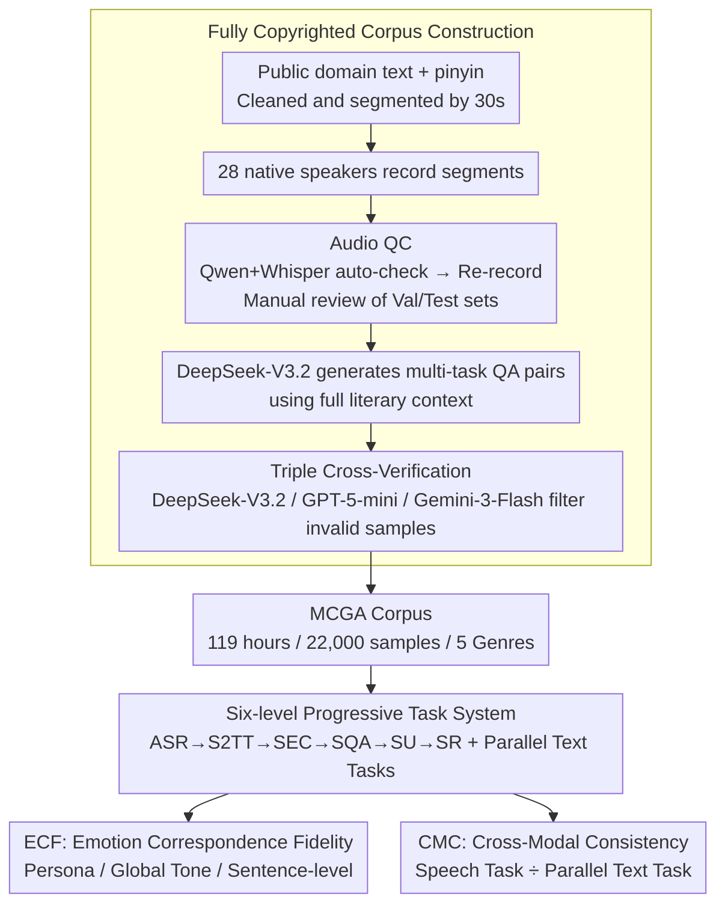

# MCGA: A Multi-task Classical Chinese Literary Genre Audio Corpus

**Conference**: ACL 2026 Findings  
**arXiv**: [2601.09270](https://arxiv.org/abs/2601.09270)  
**Code**: [https://github.com/yxduir/MCGA](https://github.com/yxduir/MCGA)  
**Area**: Speech and Natural Language Processing / Classical Chinese Literature  
**Keywords**: Classical literary audio corpus, multimodal large language models, speech emotion analysis, cross-modal consistency, classical Chinese literature research

## TL;DR

This paper constructs MCGA, the first large-scale (119 hours, 22,000 samples) fully copyrighted audio corpus for classical Chinese literature. It covers five major genres (Fu, Poetry, Prose, Ci, and Qu) and six speech tasks (ASR/S2TT/SEC/SQA/SU/SR). Evaluation of 10 multimodal large language models reveals significant deficiencies in current models regarding the understanding of classical Chinese literary audio.

## Background & Motivation

**Background**: The rapid development of Multimodal Large Language Models (MLLMs) has introduced new possibilities for Classical Chinese Studies (CCS). However, existing research primarily focuses on text (e.g., ACLUE, WenMind) and vision (e.g., Oracle-Bench, MCS-Bench), leaving the audio dimension of classical literature almost entirely blank. This field lacks high-quality, domain-specific audio corpora, preventing the systematic evaluation and improvement of MLLMs in understanding classical Chinese speech.

**Limitations of Prior Work**: (1) Most existing Chinese cultural datasets only involve text or image modalities, lacking parallel classical literary audio data. (2) The few resources involving Chinese speech are mainly oriented toward modern Chinese and fail to cover the unique rhetoric, allusions, and phonological prosody of classical literature. (3) Copyright issues hinder the construction of open-source CCS audio datasets, as recitations found online are often restricted for research distribution.

**Key Challenge**: While MLLMs possess powerful text and vision understanding capabilities, the evaluation infrastructure for classical Chinese audio understanding is completely missing. Without an audio corpus, evaluation is impossible, which in turn stalls model progress in this domain.

**Goal**: To construct a multi-genre, multi-task, and fully copyrighted audio corpus of classical Chinese literature, establishing a systematic evaluation framework to comprehensively assess the current capabilities of MLLMs in classical speech understanding.

**Key Insight**: The project approaches the problem through "genre diversity" and "task diversity." It covers five of the most important genres in Chinese literary history (Fu, Poetry, Prose, Ci, and Qu) and designs a six-level progressive task system ranging from basic (ASR) to advanced (Speech Reasoning - SR).

**Core Idea**: 28 native speakers were recruited to record all audio with copyright transfer. LLMs were used to generate question-answer pairs, which underwent triple verification to ensure quality, resulting in a parallel corpus supporting 6 speech tasks and 4 text tasks.

## Method

### Overall Architecture

MCGA is not a model but an integrated corpus and evaluation system. The core contribution lies in the robust "from-scratch" construction of a fully copyrighted classical literary audio dataset. The pipeline follows three steps: first, collecting public domain classical texts and Pinyin, which are cleaned and segmented (max 30 seconds); second, 28 native speakers record these segments under standardized specifications, with quality control via both MLLM automated checks and manual review; finally, DeepSeek-V3.2 generates multi-task QA pairs using the full context of each segment, followed by triple cross-verification (DeepSeek-V3.2, GPT-5-mini, Gemini-3-Flash) to filter invalid samples. The output is a 119-hour corpus covering five genres.

### Key Designs

**1. Fully Copyrighted Corpus Construction: A four-step pipeline from metadata to evaluable audio**  
Classical recitations on the internet are restricted by copyright, which has prevented the creation of open-source CCS audio datasets. MCGA builds its own from scratch by collecting public domain texts (written >150 years ago), recruiting 28 native speakers (50% Chinese majors, aged 18–40) to record in standard Mandarin, and implementing rigorous QC. All 22,000 samples involve signed copyright transfers, bypassing IPR issues.

**2. Six-level Progressive Task System: From hearing to understanding and reasoning**  
The system decomposes speech understanding into six levels: ASR (transcription), S2TT (translation to English), SEC (speaker and emotion characterization), SQA (open factual QA), SU (understanding), and SR (reasoning with external knowledge). This allows for precise identification of model bottlenecks (e.g., poor ASR vs. poor reasoning).

**3. Emotion Correspondence Fidelity (ECF) Metric: Scoring complex classical recitations**  
Unlike modern discrete emotion classification, ECF handles the layered emotions of classical recitation (e.g., missing someone vs. being broad-minded). It includes: ECF-P (Persona recognition, 0-2 pts), ECF-G (Global tone atmosphere, 0-3 pts), and ECF-F (Sentence-level fidelity, 0-5 pts).

**4. Cross-Modal Consistency (CMC) Metric: Identifying "Pseudo-understanding"**  
An MLLM that truly understands speech should provide consistent answers whether given audio or the corresponding text. CMC quantifies this ratio:  
$$CMC = \frac{1}{3}\left(\frac{SQA}{QA} + \frac{SU}{LU} + \frac{SR}{LR}\right) \times 100$$  
Values closer to 100 indicate better alignment between speech and text understanding.

### Loss & Training

Fine-tuning experiments used Qwen2.5-Omni-7B as the base model with LoRA ($r=8, \alpha=32$). Training lasted 3 epochs on the MCGA training set using the AdamW optimizer (learning rate $1 \times 10^{-4}$) on 4 A100 GPUs.

## Key Experimental Results

### Main Results

| Model | ASR (CER↓) | S2TT (LLM-B↑) | SEC (ECF↑) | SQA (F1↑) | SU (Acc↑) | SR (Acc↑) | Total↑ |
|------|-----------|---------------|------------|----------|----------|----------|------|
| GPT-4o-mini-Audio | 20.6 | 43.5 | 5.7 | 30.6 | 74.8 | 70.2 | 304.2 |
| Gemini-3-Flash | 6.1 | 74.0 | 54.0 | 48.7 | 86.6 | 83.7 | 440.9 |
| Qwen2.5-Omni-7B | 10.1 | 49.7 | 37.0 | 43.5 | 81.3 | 79.3 | 380.7 |
| Qwen3-Omni-30B | 4.4 | 67.6 | 58.4 | 51.5 | 86.9 | 82.9 | 442.9 |
| Step-Audio-2-mini | 9.9 | 41.9 | 36.8 | 45.2 | 80.5 | 80.4 | 374.9 |
| Phi-4-Multimodal | 59.6 | 27.5 | 12.7 | 24.5 | 50.6 | 54.4 | 210.1 |

Qwen3-Omni achieved the highest total score (442.9), leading in ASR, SEC, SQA, and SU. Gemini-3-Flash performed best in S2TT and SR, demonstrating the strength of closed-source models in English generation and reasoning.

| Model | Poetry CER | Ci CER | Qu CER | Fu CER | Prose CER |
|------|--------|--------|--------|--------|--------|
| Qwen3-Omni-30B | 3.8 | 2.8 | 4.1 | 6.2 | 4.3 |
| Qwen2.5-Omni-7B | 9.9 | 7.5 | 8.9 | 14.8 | 8.8 |
| Qwen-Omni-MCGA (Fine-tuned) | 2.8 | 3.1 | 7.8 | 5.3 | 4.1 |

### Ablation Study

| Configuration | ASR CER↓ | S2TT↑ | SEC↑ | SQA↑ | SU↑ | SR↑ |
|------|---------|-------|------|------|-----|-----|
| Qwen2.5-Omni-7B (Origin) | 10.1 | 49.7 | 37.0 | 43.5 | 81.3 | 79.3 |
| Qwen-Omni-MCGA (Fine-tuned) | — | — | — | — | — | — |

The fine-tuned Qwen-Omni-MCGA outperformed the 30B Qwen3-Omni in ASR for Poetry and Prose (CER 2.8 vs 3.8), proving the high value of MCGA as a training resource.

### Key Findings

- **Fu is the most difficult genre**: High CER across all models due to ornate rhetoric, frequent allusions, and modal particles.
- **SEC is the most difficult task**: Even Qwen3-Omni scored only 58.4. GPT-4o-mini-Audio scored only 5.7 due to safety protocols refusing emotion analysis.
- **High Data Consistency**: CER variance between sets is only 0.1, confirming effective recording QC.
- **Open-source models catch up**: Qwen3-Omni (442.9) surpassed Gemini-3-Flash (440.9) in total score.
- **Fine-tuning gains**: The 7B Qwen2.5-Omni exceeded the 30B model in several ASR categories after fine-tuning on MCGA.

## Highlights & Insights

- **Filling the Gap**: MCGA is the first large-scale, fully copyrighted audio corpus for classical Chinese literature.
- **Sophisticated ECF Design**: Multi-layered emotion assessment (Persona, Global, Sentence) tailored for classical recitation.
- **CMC Metric Insight**: The speech/text ratio clearly reveals if a model relies on its text channel rather than truly understanding audio.
- **Genre Analysis**: Insights like "Fu is hard, Ci is easier" provide a roadmap for future genre-specific optimizations.

## Limitations & Future Work

- The corpus only includes standard Mandarin and lacks dialects or traditional chanting (Yinqiang).
- SEC evaluation relies on LLM judges (DeepSeek API); automated subjective emotion evaluation remains an open problem.
- Fine-tuning was only validated on Qwen2.5-Omni-7B.
- Future expansion could include classical chanting and opera.

## Related Work & Insights

- **vs ACLUE/WenMind**: Moves beyond text-only benchmarks to the audio dimension.
- **vs MCS-Bench/Oracle-Bench**: Fills the niche for Text + Speech in classical contexts.
- **vs LibriSpeech/Common Voice**: Addresses the failure of modern datasets to handle classical rhetoric and phonology.

## Rating

- Novelty: ⭐⭐⭐⭐ (First fully copyrighted CCS audio corpus)
- Experimental Thoroughness: ⭐⭐⭐⭐ (Extensive evaluation across 10 models and 6 tasks)
- Writing Quality: ⭐⭐⭐⭐ (Clear structure and rigorous definitions)
- Value: ⭐⭐⭐⭐ (Significant for CCS digitization and MLLM evaluation)

<!-- RELATED:START -->

## Related Papers

- [\[ACL 2026\] Phun-Bench: Evaluating LLMs on Phonological Understanding in Chinese](phun-bench_evaluating_llms_on_phonological_understanding_in_chinese.md)
- [\[ACL 2025\] AI4Reading: Chinese Audiobook Interpretation System Based on Multi-Agent Collaboration](../../ACL2025/audio_speech/ai4reading_chinese_audiobook_interpretation_system_based_on_multi-agent_collabor.md)
- [\[ICLR 2026\] MMSU: A Massive Multi-task Spoken Language Understanding and Reasoning Benchmark](../../ICLR2026/audio_speech/mmsu_a_massive_multi-task_spoken_language_understanding_and_reasoning_benchmark.md)
- [\[ACL 2026\] Pseudo2Real: Task Arithmetic for Pseudo-Label Correction in Automatic Speech Recognition](pseudo2real_task_arithmetic_for_pseudo-label_correction_in_automatic_speech_reco.md)
- [\[ACL 2025\] GigaSpeech 2: An Evolving, Large-Scale and Multi-domain ASR Corpus for Low-Resource Languages](../../ACL2025/audio_speech/gigaspeech2_low_resource_asr.md)

<!-- RELATED:END -->
