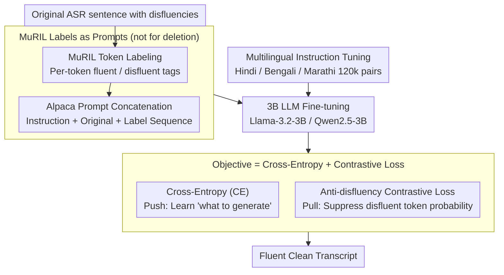

# Mind the Pause: Disfluency-Aware Objective Tuning for Multilingual Speech Correction with LLMs

**Conference**: ACL 2026  
**arXiv**: [2605.12242](https://arxiv.org/abs/2605.12242)  
**Code**: https://github.com/deepak-kumar-98/Mind-the-Pause (Available)  
**Area**: Speech / Multilingual NLP / Indic Languages / LLM fine-tuning  
**Keywords**: disfluency correction, contrastive loss, MuRIL, instruction tuning, Hindi/Bengali/Marathi

## TL;DR
The authors propose a multilingual disfluency correction pipeline: first using MuRIL for token-level fluent/disfluent labeling, then feeding the "original transcript + token labels" into Llama-3.2-3B / Qwen2.5-3B for instruction fine-tuning. The key innovation is an **anti-disfluency contrastive loss** term that explicitly penalizes the probability of generating disfluent tokens (penalizing $-\log(1-\sum_v w_v P_\theta(v))$). On real Hindi/Bengali/Marathi ASR data, the method outperforms the non-contrastive baseline by +1.97 BLEU and mBART by +8.54 BLEU. Furthermore, the 3B models match or even exceed GPT-4o in most settings.

## Background & Motivation

**Background**: Spontaneous speech almost inevitably contains disfluencies (fillers like "uh/um", repetitions, false starts, and self-repairs), which ASR systems do not automatically remove. The authors' measurements show that approximately 30% of sentences in real Indic dialogue recordings contain at least one disfluency. This noise degrades downstream QA performance by 0.5–1.6 points (on a 5-point scale), decreases MT performance by 2–4.7 BLEU, and drops TTS naturalness MOS by ~2 points.

**Limitations of Prior Work**: (i) Traditional pipelines use "detect-then-delete"—sequence taggers like MuRIL mark disfluent tokens for direct deletion, which often causes syntactic fragmentation and semantic incompleteness. (ii) Research on Indic languages (Hindi/Bengali/Marathi) has largely stopped at the detection stage (Bhat 2023, Kundu 2022), lacking full-sentence correction solutions. (iii) Existing LLM-based works either use LLMs as data generators for small taggers (Cheng 2024) or directly prompt GPT-4 to remove disfluencies (Lima & Campelo 2024 for Portuguese), but none integrate token-level detection and LLM rewriting into an end-to-end correction pipeline.

**Key Challenge**: Cross-entropy (CE) fine-tuning provides a positive signal to the LLM to "look like the fluent reference," but **there is no mechanism to tell the model "do not copy disfluent tokens."** The authors observed that even when provided with MuRIL tags, models trained only with cross-entropy occasionally still copy fillers into the output. Thus, positive-only supervision in cross-entropy is insufficient.

**Goal**: (a) Perform end-to-end disfluency correction for Hindi/Bengali/Marathi rather than detection-only; (b) Design a training objective that directly suppresses the generation probability of disfluent tokens to fill the gap left by cross-entropy; (c) Verify if 3B-scale open-source LLMs with this strategy can rival GPT-4o or Gemini 2.5 Pro.

**Key Insight**: Treat the token-level detector's output as a "negative sample indicator for contrastive learning." Since MuRIL has already identified which tokens are disfluent, directly lowering the probability of these tokens during generation provides the most targeted negative supervision.

**Core Idea**: CE loss learns "what should be generated" (push), while contrastive loss learns "what should not be generated" (pull). These two signals work in a push-pull synergy to separate fluent targets from disfluent tokens in the representation space.

## Method

### Overall Architecture
The core conflict this pipeline addresses is that standard fine-tuning lacks a mechanism to prevent copying fillers. The authors employ a two-stage process with dual losses. Stage 1: MuRIL (Multilingual BERT pre-trained on 17 Indic languages) performs token-level binary classification (0=fluent, 1=disfluent). Stage 2: The "instruction + original sentence with disfluencies + MuRIL predicted label sequence" are concatenated in Alpaca format for 3B LLMs (Llama-3.2-3B or Qwen2.5-3B). The training objective combines standard CE with an explicit anti-disfluency contrastive loss.

### Key Designs

**1. MuRIL Labels as LLM Prompts Instead of Deletion Commands: Rewriting Over Deletion**
Traditional detect-then-delete fails by separating "identification" from "rewriting." Here, MuRIL's token labels are provided to the LLM as context, allowing the model to decide whether a disfluent token should be deleted or rewritten for grammatical equivalence. Crucially, the model "references but does not blindly trust" the tags. While MuRIL achieves an F1 of 0.987 on human-edited data, its sentence-level accuracy drops significantly on real data; the LLM learns to correct these labeling errors during instruction tuning.

**2. Anti-disfluency Contrastive Loss: Adding Negative Supervision**
This is the core innovation. While CE is a positive push, the contrastive loss pulls probability away from disfluent tokens at each generation step. For a sample $i$, the set of disfluent tokens $D_i$ is mapped. The probability mass on these tokens at step $t$ is defined as $s_{i,t} = \sum_{v \in D_i} w_v P_\theta(v \mid y^{<t}_i, x_i)$, where weights $w_v \in (0,1]$ follow a geometric decay based on subword position ($1, 0.5, 0.25, \dots$). The contrastive loss is $L_{\text{contrastive}} = \frac{1}{N}\sum_i \frac{1}{T_i} \sum_{t=r_i}^{T_i} -\log(1 - s_{i,t})$. As $s \to 1$, the loss explodes, penalizing the model heavily if it attempts to generate a disfluent token.

**3. Multilingual Instruction Tuning: Single Checkpoint for Hindi/Bengali/Marathi**
Given the high lexical and syntactic similarity between Indic languages, the authors train a single model on a merged dataset of 120k pairs (40k per language). Using Alpaca-style formatting leverages the LLM's existing instruction-following capabilities, framing the task as "rewriting for fluency" rather than simple sequence mapping. The cross-lingual transfer is strong: a model fine-tuned only on Hindi achieves 87.1 BLEU when transferred zero-shot to Bengali.

### Loss & Training
The total objective is $L_{\text{total}} = L_{CE} + \lambda \cdot L_{\text{contrastive}}$, where $\lambda$ follows a warm-up schedule to allow CE to build basic generation capability before contrastive penalties are introduced. Weights $w_v$ for subwords of a disfluent word are set to $1, 0.5, 0.25, \dots$ to prioritize the first subword. Both Llama-3.2-3B and Qwen2.5-3B backbones were used.

## Key Experimental Results

### Main Results
Llama-3.2-3B-Instruct results on three languages (BLEU / chrF2 / TER on real ASR data):

| Language | Data | mBART | Multilingual Instruction FT | w/o Contrastive | **With Contrastive** |
|----------|------|-------|------------------------------|------------------|----------------------|
| Hindi | Real | 71.4 / 85.5 / 15.1 | 64.8 / 81.7 / 23.4 | 87.4 / 93.3 / 9.2 | **90.4 / 95.6 / 5.8** |
| Bengali | Real | 73.5 / 87.9 / 13.0 | 69.6 / 89.0 / 21.6 | 70.7 / 90.5 / 20.8 | **74.4 / 93.8 / 17.9** |
| Marathi | Real | 82.6 / 93.1 / 8.2 | 80.0 / 94.3 / 11.8 | 83.2 / 95.5 / 9.3 | **83.6 / 96.6 / 9.2** |

Qwen2.5-3B-Instruct showed even larger gains (Hindi real: 91.1 BLEU vs 84.2 w/o contrastive, **Gain**: +6.9).

### Ablation Study
Average improvement brought by contrastive loss on Llama-3.2-3B-Instruct:

| Configuration | ΔBLEU | ΔchrF2 | ΔTER |
|---------------|-------|--------|------|
| Multilingual instruction FT (no MuRIL tags) | baseline | baseline | baseline |
| + MuRIL tag conditioning (w/o contrastive) | +6.16 | — | — |
| **+ MuRIL tag + Contrastive loss (Ours)** | **+1.97 over above** | +1.53 | −1.65 |
| Total vs mBART | +8.54 | — | — |

LLM-as-Judge (using Qwen2.5-3B as judge, bidirectional pairwise):

| Language | Data | Proposed Won | Parallel FT Won | Draw |
|----------|------|--------------|-----------------|------|
| Hindi | Real | 28.0% | 9.3% | 62.7% |
| Marathi | Real | 30.0% | 8.0% | 62.0% |
| Bengali | Real | 18.0% | 27.0% | 55.0% |

### Key Findings
- **Contrastive Learning benefits Qwen more than Llama**: Qwen improved by an average of 4.68 BLEU compared to Llama's 1.97 BLEU, likely due to Qwen's superior multilingual grounding.
- **3B open-source models match GPT-4o**: The proposed method matched or outperformed GPT-4o in 4 out of 6 experimental conditions and beat Gemini 2.5 Pro across all three languages.
- **Cross-lingual zero-shot transfer is significant**: Models fine-tuned on a single language maintained performance in the 60s to 80s BLEU range on other Indic languages.
- **Disfluencies severely impact downstream tasks**: Disfluency causes LLaMA Hindi QA scores to drop from 1.70 to 1.18 and Hindi→Bengali MT BLEU to drop by 3.9.

## Highlights & Insights
- **Using detection tags as negative indicators is a portable idea**: This hard-constraint contrastive loss can be applied to any task where an external tagger can identify negative samples (e.g., hallucination suppression, toxicity removal, or deprecated API detection in code).
- **Geometric decay for BPE subwords is a clever detail**: By assigning $w_v \in \{1, 0.5, 0.25, \dots\}$, the model prioritizes penalizing the primary subword that identifies the disfluent word, avoiding over-penalization of common trailing subwords.
- **3B beats GPT-4o**: This provides strong evidence that task-specific contrastive training on small models can outperform massive closed-source models for specialized industrial applications.

## Limitations & Future Work
- **Model Scale**: Experiments were limited to 3B models; whether contrastive loss saturates at 7B/70B scales remains unverified.
- **Data Distribution**: Much of the training data was synthetically generated; real-world complexities like code-mixing or accent-induced disfluencies may not be fully covered.
- **Evaluation**: The gain from contrastive loss versus instruction tuning alone could be further analyzed through more granular sensitivity analysis of the $\lambda$ parameter.

## Related Work & Insights
- **vs Bhat et al. 2023a**: Bhat used detection-only + hard deletion. Ours uses detection + LLM rewriting + contrastive suppression, boosting BLEU from the 60s to the 90s.
- **vs Smooth-LLaMa (Altinok 2025)**: Smooth-LLaMa is an audio-to-text end-to-end model. Ours is ASR-agnostic and modular, which is easier to deploy but lacks raw acoustic features.
- **vs Lima & Campelo 2024**: They found GPT-4 zero-shot sufficient for Portuguese. This paper shows that for Indic languages, zero-shot performance is poor, necessitating task-specific fine-tuning.

## Rating
- **Novelty**: ⭐⭐⭐⭐ The anti-disfluency contrastive loss objective is a novel and solid implementation of hard-negative suppression.
- **Experimental Thoroughness**: ⭐⭐⭐⭐ Comprehensive evaluation across 2 backbones, 3 languages, real/manual data, and downstream tasks.
- **Writing Quality**: ⭐⭐⭐⭐ Formulas and the push-pull mechanism are clearly explained.
- **Value**: ⭐⭐⭐⭐ Directly applicable to Indic ASR; the 3B vs GPT-4o results are highly relevant for industrial deployment.

<!-- RELATED:START -->

...

<!-- RELATED:END -->

## Related Papers

- [\[ACL 2026\] Pseudo2Real: Task Arithmetic for Pseudo-Label Correction in Automatic Speech Recognition](pseudo2real_task_arithmetic_for_pseudo-label_correction_in_automatic_speech_reco.md)
- [\[ACL 2026\] SEPT: Semantically Expanded Prompt Tuning for Audio-Language Models](generalizable_prompt_tuning_for_audio-language_models_via_semantic_expansion.md)
- [\[AAAI 2026\] A Mind Cannot Be Smeared Across Time](../../AAAI2026/audio_speech/a_mind_cannot_be_smeared_across_time.md)
- [\[ACL 2026\] From Flat Language Labels to Typological Priors: Structured Language Conditioning for Multilingual Speech-to-Speech Translation](from_flat_language_labels_to_typological_priors_structured_language_conditioning.md)
- [\[NeurIPS 2025\] EuroSpeech: A Multilingual Speech Corpus](../../NeurIPS2025/audio_speech/eurospeech_a_multilingual_speech_corpus.md)

<!-- RELATED:END -->
