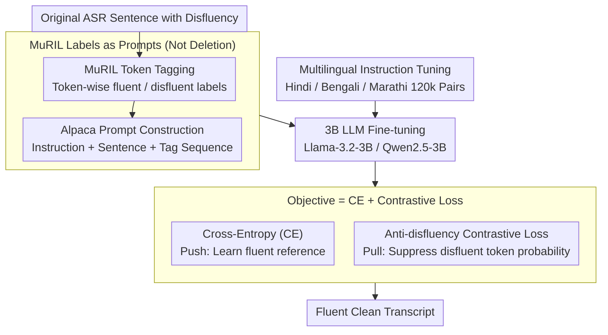

# Mind the Pause: Disfluency-Aware Objective Tuning for Multilingual Speech Correction with LLMs

**Conference**: ACL 2026  
**arXiv**: [2605.12242](https://arxiv.org/abs/2605.12242)  
**Code**: https://github.com/deepak-kumar-98/Mind-the-Pause (Available)  
**Area**: Speech / Multilingual NLP / Indic Languages / LLM fine-tuning  
**Keywords**: disfluency correction, contrastive loss, MuRIL, instruction tuning, Hindi/Bengali/Marathi

## TL;DR
The authors propose a multilingual disfluency correction pipeline: first using MuRIL for token-level fluent/disfluent labeling, then feeding the "original transcript + token labels" into Llama-3.2-3B / Qwen2.5-3B for instruction fine-tuning. The key innovation is an **anti-disfluency contrastive loss** that explicitly penalizes the probability of generating disfluent tokens ($-\log(1-\sum_v w_v P_\theta(v))$). On real Hindi/Bengali/Marathi ASR data, this approach achieves +1.97 BLEU over the non-contrastive baseline and +8.54 BLEU over mBART, with the 3B models matching or exceeding GPT-4o in most settings.

## Background & Motivation

**Background**: Spontaneous speech almost inevitably contains disfluencies (fillers like "uh/um", repetitions, false starts, self-repairs), which ASR systems do not automatically remove. The authors observe that Whisper v3 Large and AI4Bharat Indic Conformer contain at least one disfluency in approximately 30% of sentences in real Indic conversations. This noise drops downstream performance: QA scores by 0.5–1.6 points (on a 5-point scale), MT by 2–4.7 BLEU, and TTS naturalness MOS by ~2 points.

**Limitations of Prior Work**: (i) Traditional pipelines use "detect-then-delete"—where sequence taggers like MuRIL mark tokens for direct deletion, often leading to grammatical fragmentation and semantic incompleteness; (ii) Research on Indic languages (Hindi/Bengali/Marathi) has mostly been limited to detection (Bhat 2023, Kundu 2022), lacking full-sentence correction solutions; (iii) Existing LLM-based work either uses LLMs as data generators for small taggers (Cheng 2024) or prompts GPT-4 directly (Lima & Campelo 2024 in Portuguese); no prior work integrates token-level detection and LLM rewriting into an end-to-end correction pipeline.

**Key Challenge**: Cross-entropy (CE) fine-tuning provides a positive signal to "look like the fluent reference," but **lacks a mechanism to tell the model "do not copy disfluent tokens."** The authors found that even with MuRIL labels, CE-only models occasionally copy fillers into the output. Thus, positive-only supervision via cross-entropy is insufficient.

**Goal**: (a) Perform end-to-end disfluency correction for Hindi/Bengali/Marathi rather than just detection; (b) Design a training objective that directly suppresses the generation probability of disfluent tokens; (c) Verify if 3B-scale open-source LLMs with this strategy can rival GPT-4o / Gemini 2.5 Pro.

**Key Insight**: Treat the output of the token-level detector as a "negative sample indicator for contrastive learning." Since MuRIL identifies disfluent tokens, directly lowering their probability during generation provides targeted negative supervision.

**Core Idea**: Use CE loss to push the model toward "what to generate" and contrastive loss to pull it away from "what not to generate." This push-pull synergy separates the representation space of fluent targets and disfluent tokens.

## Method

### Overall Architecture
The pipeline addresses the core contradiction where CE fine-tuning tells the model what to mimic but not what to avoid. The authors utilize a two-stage approach with dual losses. Stage one uses MuRIL (multilingual BERT pretrained on 17 Indic languages) for token-level binary classification (0=fluent, 1=disfluent). Stage two feeds the "instruction + original sentence + MuRIL label sequence" into a 3B LLM (Llama-3.2-3B-Instruct or Qwen2.5-3B-Instruct) in Alpaca format. The training objective combines standard CE with a contrastive loss to suppress disfluent tokens.

### Key Designs

**1. MuRIL Labels as LLM Prompts: Rewriting Instead of Hard Deletion**
Traditional "detect-then-delete" fails by decoupling identification from rewriting, leading to broken syntax. Here, MuRIL labels are provided to the LLM as context, allowing the model to decide whether to delete or paraphrase disfluent segments. While MuRIL achieves high token-level F1 (0.987) on edited data, its accuracy drops on real data (33–63%); the authors use this imperfection as a source of robustness training, where the LLM learns to generate the fluent reference $y_i$ via $L_{CE} = -\sum_i \sum_t \log P_\theta(y^t_i \mid y^{<t}_i, x_i)$ while correcting erroneous tags.

**2. Anti-disfluency Contrastive Loss: Negative Supervision**
This is the core contribution. While CE is a positive push, the contrastive loss pulls probability mass away from disfluent tokens at each step. For a sample $i$, the set of disfluent tokens $D_i$ is identified. The probability mass $s_{i,t}$ on these tokens at step $t$ is calculated: $s_{i,t} = \sum_{v \in D_i} w_v P_\theta(v \mid y^{<t}_i, x_i)$. The weights $w_v \in (0,1]$ follow a geometric decay ($1, 0.5, 0.25, \ldots$) based on subword position to prioritize the start of words. The loss is $L_{\text{contrastive}} = \frac{1}{N}\sum_i \frac{1}{T_i} \sum_{t=r_i}^{T_i} -\log(1 - s_{i,t})$, where $r_i$ is the start of the response. As $s \to 1$, the loss explodes, providing a strong gradient against disfluent token generation.

**3. Multilingual Instruction Tuning**
Given the lexical and syntactic similarities among Indic languages, the authors train a single checkpoint for Hindi, Bengali, and Marathi using 120k pairs. Using the Alpaca format helps reuse the LLM's instruction-following capabilities to frame the task as "rewriting for fluency" rather than simple seq2seq mapping. The shared representation is strong enough that a Hindi-only fine-tuned model transfers to Bengali with 87.1 BLEU.

### Loss & Training
Total loss: $L_{\text{total}} = L_{CE} + \lambda \cdot L_{\text{contrastive}}$. $\lambda$ follows a warm-up schedule to allow CE to establish basic generation capabilities before applying contrastive penalties. The two backbones used are Llama-3.2-3B-Instruct and Qwen2.5-3B-Instruct.

## Key Experimental Results

### Main Results
Performance of Llama-3.2-3B-Instruct (BLEU / chrF2 / TER on real ASR data):

| Language | Data | mBART | Multilingual Instruction FT | w/o Contrastive | **With Contrastive** |
| :--- | :--- | :--- | :--- | :--- | :--- |
| Hindi | Real | 71.4 / 85.5 / 15.1 | 64.8 / 81.7 / 23.4 | 87.4 / 93.3 / 9.2 | **90.4 / 95.6 / 5.8** |
| Bengali | Real | 73.5 / 87.9 / 13.0 | 69.6 / 89.0 / 21.6 | 70.7 / 90.5 / 20.8 | **74.4 / 93.8 / 17.9** |
| Marathi | Real | 82.6 / 93.1 / 8.2 | 80.0 / 94.3 / 11.8 | 83.2 / 95.5 / 9.3 | **83.6 / 96.6 / 9.2** |

Qwen2.5-3B-Instruct showed even larger gains (Hindi real: 91.1 BLEU vs 84.2 w/o contrastive, +6.9).

### Ablation Study
Average gains from contrastive loss on Llama-3.2-3B-Instruct:

| Configuration | ΔBLEU | ΔchrF2 | ΔTER |
| :--- | :--- | :--- | :--- |
| Multilingual instruction FT (no MuRIL tags) | baseline | baseline | baseline |
| + MuRIL tag conditioning (w/o contrastive) | +6.16 | — | — |
| **+ MuRIL tag + Contrastive loss (Ours)** | **+1.97** | +1.53 | −1.65 |
| Total vs mBART | +8.54 | — | — |

LLM-as-Judge (Pairwise comparison using Qwen2.5-3B):
- **Ours vs. Parallel FT**: Proposed method wins strongly in Hindi (28% win vs 9% loss) and Marathi (30% win vs 8% loss).

### Key Findings
- **Contrastive loss benefits Qwen more than Llama**: Qwen improved by 4.68 BLEU vs 1.97 for Llama, suggesting the loss is most effective for models with strong multilingual grounding that occasionally "slip up."
- **3B models rival GPT-4o**: In 4 out of 6 evaluation conditions, the 3B model matched or outperformed GPT-4o, and it beat Gemini 2.5 Pro in all three languages.
- **Strong cross-lingual transfer**: Zero-shot transfer between Indic languages is robust, with models maintaining BLEU in the 90s on edited data across the family.
- **Downstream impact**: Disfluency causes LLaMA Hindi QA scores to drop from 1.70 to 1.18 and reduces Hindi→Bengali MT BLEU by 3.9.

## Highlights & Insights
- **Detection labels as negative indicators**: This portable strategy can be applied to hallucination suppression (entity errors), toxicity removal, or deprecated API avoidance in code generation.
- **Subword geometric decay**: A clever way to handle BPE tokenization by focusing the penalty on the first subword of a disfluent word to avoid over-penalizing incidental subword matches.
- **Small but smart beats Scaling**: Task-specific contrastive training allows a 3B model to exceed frontier closed-source models, providing a strong case for industrial deployment.

## Limitations & Future Work
- The model scale is limited to 3B; it is unclear if the contrastive loss saturates at larger scales (70B+).
- The synthetic portion of the data uses rule-based generation, which may not capture complex code-mixing or accent-induced disfluencies.
- The 27% loss rate against the baseline in Bengali (LLM-as-Judge) suggests potential issues with MuRIL token boundary accuracy in that specific language that were not fully explored.

## Related Work & Insights
- **vs. Bhat et al. 2023a**: Moves from detection-only hard deletion to LLM rewriting with contrastive suppression, improving BLEU from the 60s to the 90s.
- **vs. Smooth-LLaMa (Altinok 2025)**: While Smooth-LLaMa is end-to-end (audio-to-text), this method is ASR-agnostic and modular, making it easier to integrate into existing text-based pipelines.
- **vs. Saini et al. 2021**: Replaces unsupervised style transfer with hard-constraint supervision via detection tags, proving more stable for low-resource Indic languages.

## Rating
- Novelty: ⭐⭐⭐⭐ The anti-disfluency contrastive objective is a refined adaptation of negative suppression for this specific task.
- Experimental Thoroughness: ⭐⭐⭐⭐ Comprehensive evaluation across multiple backbones, languages, and downstream tasks.
- Writing Quality: ⭐⭐⭐⭐ Clear loss formulations and pipeline visualizations.
- Value: ⭐⭐⭐⭐ Significant practical utility for Indic ASR; the 3B vs. GPT-4o results are highly relevant for efficient deployment.

<!-- RELATED:START -->

## Related Papers

- [\[ACL 2026\] Pseudo2Real: Task Arithmetic for Pseudo-Label Correction in Automatic Speech Recognition](pseudo2real_task_arithmetic_for_pseudo-label_correction_in_automatic_speech_reco.md)
- [\[ACL 2026\] Phun-Bench: Evaluating LLMs on Phonological Understanding in Chinese](phun-bench_evaluating_llms_on_phonological_understanding_in_chinese.md)
- [\[AAAI 2026\] A Mind Cannot Be Smeared Across Time](../../AAAI2026/audio_speech/a_mind_cannot_be_smeared_across_time.md)
- [\[ACL 2026\] From Flat Language Labels to Typological Priors: Structured Language Conditioning for Multilingual Speech-to-Speech Translation](from_flat_language_labels_to_typological_priors_structured_language_conditioning.md)
- [\[ACL 2026\] SEPT: Semantically Expanded Prompt Tuning for Audio-Language Models](generalizable_prompt_tuning_for_audio-language_models_via_semantic_expansion.md)

<!-- RELATED:END -->
## Related Papers

- [\[ACL 2026\] Pseudo2Real: Task Arithmetic for Pseudo-Label Correction in Automatic Speech Recognition](pseudo2real_task_arithmetic_for_pseudo-label_correction_in_automatic_speech_reco.md)
- [\[AAAI 2026\] A Mind Cannot Be Smeared Across Time](../../AAAI2026/audio_speech/a_mind_cannot_be_smeared_across_time.md)
- [\[ACL 2026\] From Flat Language Labels to Typological Priors: Structured Language Conditioning for Multilingual Speech-to-Speech Translation](from_flat_language_labels_to_typological_priors_structured_language_conditioning.md)
- [\[NeurIPS 2025\] EuroSpeech: A Multilingual Speech Corpus](../../NeurIPS2025/audio_speech/eurospeech_a_multilingual_speech_corpus.md)
- [\[ACL 2026\] SEPT: Semantically Expanded Prompt Tuning for Audio-Language Models](generalizable_prompt_tuning_for_audio-language_models_via_semantic_expansion.md)

<!-- RELATED:END -->
