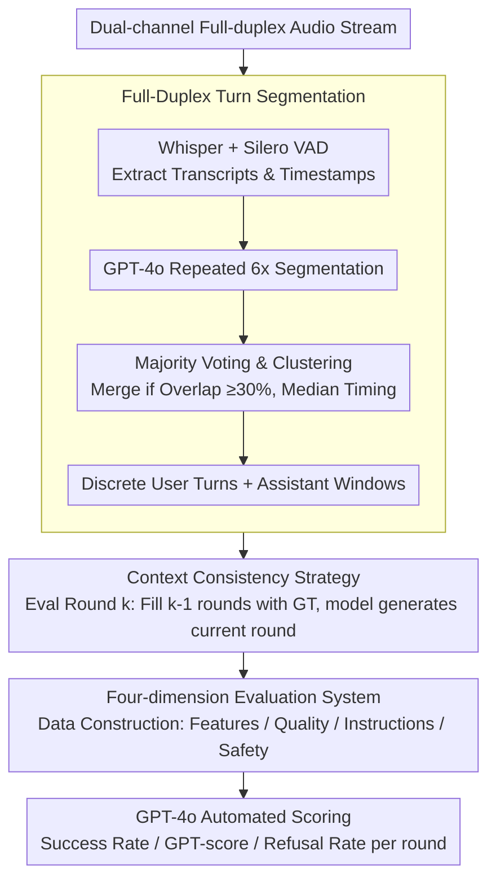

# MTR-DuplexBench: Towards a Comprehensive Evaluation of Multi-Round Conversations for Full-Duplex Speech Language Models

**Conference**: ACL 2026 Findings  
**arXiv**: [2511.10262](https://arxiv.org/abs/2511.10262)  
**Code**: [https://github.com/ZhangHe0918/MTR-DuplexBench](https://github.com/ZhangHe0918/MTR-DuplexBench)  
**Area**: Speech Language Models / Evaluation Benchmarks  
**Keywords**: Full-duplex speech models, multi-round conversation evaluation, turn segmentation, conversation quality, safety evaluation

## TL;DR

This paper proposes MTR-DuplexBench, a comprehensive benchmark for evaluating Full-Duplex Speech Language Models (FD-SLMs) in multi-round scenarios. By introducing an innovative turn segmentation method to address blurred turn boundaries and context inconsistency, the framework evaluates four dimensions: conversational features, conversation quality, instruction following, and safety. Experiments reveal that existing FD-SLMs suffer from continuous performance degradation during multi-round interactions.

## Background & Motivation

**Background**: Full-Duplex Speech Language Models (FD-SLMs) enable real-time "simultaneous listening and speaking" interactions, supporting complex features like interruptions and backchanneling. These represent the future of voice interaction. Currently, Moshi and Freeze-Omni are the only two open-source FD-SLMs available.

**Limitations of Prior Work**: Existing benchmarks (e.g., Full-Duplex-Bench, Full-Duplex-Bench v1.5) primarily focus on single-round evaluation, whereas real conversations typically unfold over multiple rounds. Furthermore, most existing benchmarks only assess conversational features (e.g., interruptions), ignoring critical capabilities such as instruction following and safety. While FD-Bench supports multi-round scenarios, it focuses solely on interruption episodes, and Talking Turns requires expensive manual data collection.

**Key Challenge**: Evaluation of full-duplex conversations faces two technical challenges: (1) Blurred turn boundaries: unlike half-duplex, full-duplex communication is spontaneous without explicit start/end markers; (2) Context inconsistency: in multi-round evaluation, deviations in early model responses can cause user inputs in subsequent rounds to become disconnected from the actual scene, reducing evaluation reliability.

**Goal**: To build a comprehensive evaluation benchmark for full-duplex SLMs that supports round-by-round assessment and covers four dimensions: conversational features, quality, instruction following, and safety.

**Key Insight**: By designing a full-duplex turn segmentation algorithm, continuous full-duplex streams are partitioned into discrete rounds. By filling the assistant channel with ground-truth responses for historical rounds during evaluation, both turn boundary and context inconsistency issues are resolved simultaneously.

**Core Idea**: Use GPT-4o for multiple segmentations + majority voting + clustering to determine turn boundaries. Employ a strategy of "previous ground-truth history + current model inference" to eliminate context drift and construct a four-dimensional comprehensive evaluation framework.

## Method

### Overall Architecture

The core difficulty MTR-DuplexBench addresses is how to segment continuous, dual-channel audio streams into discrete conversations for round-by-round scoring while maintaining context consistency. The pipeline first processes dual-channel audio through a turn segmentation algorithm into user turns and assistant response windows. Evaluation data across four dimensions (features, quality, instructions, safety) is then fed to the model round-by-round and scored automatically by GPT-4o. When evaluating round $k$, history for the previous $k-1$ rounds is filled with ground-truth responses, and the model only generates the current round. Final outputs include success rate, GPT-score, and refusal rate.

### Key Designs

**1. Full-Duplex Turn Segmentation: Using Multi-sampling Voting to Define Blurred Boundaries**

Full-duplex communication is spontaneous and lacks clear markers. Single GPT-based segmentation is unstable. This paper utilizes Whisper + Silero VAD to extract timestamps and transcripts, then sorts VAD segments for GPT-4o. The key is repeating segmentation 6 times followed by majority voting: a candidate turn is merged if it overlaps $\geq 30\%$ with existing ones, using median start/end times. The assistant response window is set from the start of the current user turn to the end of the next, ensuring a complete window. This robust methodology can be transferred to any structured event extraction from continuous streams.

**2. Context Consistency Strategy: Ground-Truth History Filling to Prevent Error Accumulation**

A risk in multi-round evaluation is that if early model responses deviate, subsequent user inputs become based on a non-existent history. This paper fills the assistant channel of previous $k-1$ rounds with ground-truth (GT) audio when evaluating round $k$. Thus, the model always faces a "correct" context, measuring single-round capability under ideal conditions to avoid error amplification. While it does not assess performance under accumulated errors, it is a reasonable trade-off for current FD-SLM development stages.

**3. Four-dimension Evaluation System: Integrating Instruction Following and Safety**

For FD-SLM deployment, models must understand instructions and maintain safety, especially during interruptions. The benchmark includes: 200 synthesized 10-round conversations for **Conversational Features** (success rates and latency of smooth turn-taking, interruption, pause handling, background speech, and backchanneling); 200 Candor segments for **Conversation Quality** (GPT-score 0–5); 300 Llama Question queries for **Instruction Following** (success rate); and 520 AdvBench queries for **Safety** (multi-round refusal rate). All evaluations are automated via GPT-4o.

## Key Experimental Results

### Main Results

Success rates for conversational features decline as the number of rounds increases (Round 1 vs. 1-10 average):

| Model | Smooth Turn-taking | Interruption | Pause Handling | Background Speech |
|------|---------|------|---------|---------|
| Moshi | 73.0→57.4% | 72.5→54.2% | 93.5→84.8% | 53.0→25.7% |
| Freeze-Omni | 69.0→36.4% | 76.0→56.6% | 89.0→68.5% | 0.5→1.1% |
| VocalNet (HD) | 100→100% | 100→100% | 100→100% | 0→0% |
| Cascaded | 98.5→99.0% | 99.5→96.3% | 100→100% | 0→0% |

### Ablation Study

Performance of multi-feature combinations vs. single features (Moshi, avg success rate rounds 1-10):

| Configuration | Success Rate | Description |
|------|--------|------|
| Smooth Turn-taking (S) only | 57.4% | Single feature baseline |
| S + Interruption (I) | 54.5% | Two alternating features |
| S + I + Pause (P) | 54.3% | Three alternating features |
| S + I + P + Background (B) | 37.6% | Four alternating features; significant drop |

### Key Findings
- FD-SLMs experience continuous degradation in multi-round settings: Freeze-Omni's turn-taking dropped from 69% to 36%.
- HD models show perfect performance on features (100% in turn-taking/interruption) but fail completely on background speech.
- Moshi is the only model capable of handling background speech, though its success rate halves over rounds.
- Moshi has the lowest latency (~0.6-0.9s), while Cascaded models are highest (~9-12s).
- Combinations of features further reduce performance, posing a greater challenge.
- Multi-round interruptions may degrade FD-SLM safety refusal capabilities.

## Highlights & Insights
- **Turn Segmentation Engineering**: The combination of GPT sampling, majority voting, and clustering is highly practical for converting unstructured audio into structured discrete rounds.
- **Context Consistency Strategy**: Ground-truth filling is a clever way to eliminate error accumulation, allowing for a focused measurement of single-round capability within a multi-round context.
- **Comprehensive Dimensions**: This is the first work to integrate instruction following and safety into full-duplex evaluation, raising forward-looking questions about safety during interruptions.

## Limitations & Future Work
- Only two open-source FD-SLMs (Moshi and Freeze-Omni) were evaluated; the sample size is limited.
- Ground-truth history filling prevents assessment of how models handle their own accumulated errors.
- Synthetic data generated by GPT-4o may not perfectly mirror real human conversational patterns.
- Safety evaluation relies on AdvBench; more complex jailbreak attacks are not covered.
- Future work should include more models and use benchmark signals to improve multi-round consistency during training.

## Related Work & Insights
- **vs Full-Duplex-Bench**: MTR-DuplexBench extends beyond single-round evaluation to provide round-by-round analysis and broader dimensions.
- **vs FD-Bench**: While FD-Bench supports up to 5 rounds, it focuses only on interruptions and lacks the fine-grained round-by-round analysis of this work.
- **vs Talking Turns**: MTR-DuplexBench offers better reproducibility through an automated pipeline compared to expensive human-in-the-loop data collection.

## Rating
- Novelty: ⭐⭐⭐⭐ First benchmark for multi-round round-by-round FD evaluation with a novel segmentation method.
- Experimental Thoroughness: ⭐⭐⭐ limited by the small number of available FD-SLMs.
- Writing Quality: ⭐⭐⭐⭐ Clear problem definition and detailed methodology.
- Value: ⭐⭐⭐⭐ Significant for driving research in multi-round full-duplex speech interaction.

<!-- RELATED:START -->

## Related Papers

- [\[ACL 2026\] Full-Duplex-Bench-v2: A Multi-Turn Evaluation Framework for Duplex Dialogue Systems with an Automated Examiner](full-duplex-bench-v2_a_multi-turn_evaluation_framework_for_duplex_dialogue_syste.md)
- [\[ICML 2026\] MoshiRAG: Asynchronous Knowledge Retrieval for Full-Duplex Speech Language Models](../../ICML2026/audio_speech/moshirag_asynchronous_knowledge_retrieval_for_full-duplex_speech_language_models.md)
- [\[ACL 2026\] Style Amnesia: Investigating Speaking Style Degradation and Mitigation in Multi-Turn Spoken Language Models](style_amnesia_investigating_speaking_style_degradation_and_mitigation_in_multi-t.md)
- [\[ICML 2026\] The Silent Thought: Modeling Internal Cognition in Full-Duplex Spoken Dialogue Models via Latent Reasoning](../../ICML2026/audio_speech/the_silent_thought_modeling_internal_cognition_in_full-duplex_spoken_dialogue_mo.md)
- [\[ACL 2026\] Do We Need Distinct Representations for Every Speech Token? Unveiling and Exploiting Redundancy in Large Speech Language Models](do_we_need_distinct_representations_for_every_speech_token_unveiling_and_exploit.md)

<!-- RELATED:END -->
