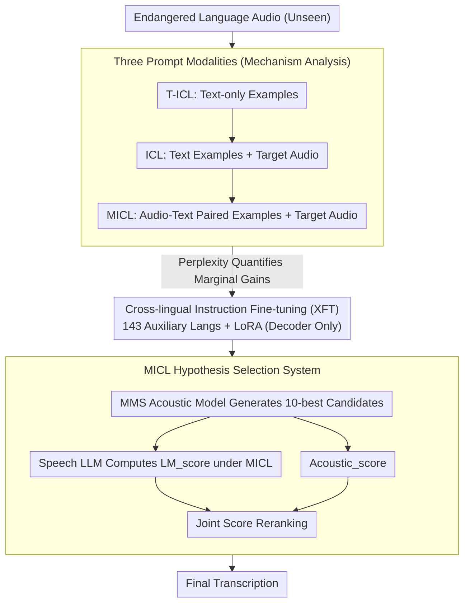

# Multimodal In-Context Learning for ASR of Low-Resource Languages

**Conference**: ACL 2026 Findings  
**arXiv**: [2601.05707](https://arxiv.org/abs/2601.05707)  
**Code**: [github](https://github.com/ZL-KA/MICL)  
**Area**: Audio & Speech / Low-resource ASR  
**Keywords**: Multimodal Contextual Learning, Low-resource ASR, Speech Large Language Models, Cross-lingual Transfer, Hypothesis Selection

## TL;DR

This study systematically investigates whether Multimodal In-Context Learning (MICL) enables speech LLMs to learn unseen endangered languages. It proposes an MICL-based hypothesis selection system that combines the complementary strengths of acoustic models and speech LLMs, significantly improving ASR performance across three endangered languages.

## Background & Motivation

**Background**: Out of 7000+ languages globally, current ASR systems cover only a tiny fraction, primarily due to the scarcity of labeled data. While speech LLMs (e.g., Phi4, Qwen3-Omni) exhibit powerful multi-task capabilities, their performance remains limited to the high-resource languages covered during training.

**Limitations of Prior Work**: (1) Existing ICL research focuses mainly on the text modality and high-resource languages; (2) The effectiveness of Multimodal ICL (MICL) for speech LLMs on uncovered languages is under-explored; (3) Direct prompt-based ASR using speech LLMs yields extremely poor results on unseen languages (WER > 100%).

**Key Challenge**: While speech LLMs possess strong ICL capabilities, it remains unclear how to effectively utilize these capabilities for data-scarce endangered languages.

**Goal**: To validate the effectiveness of MICL for unseen languages, analyze its internal mechanisms, and construct a practical ASR system.

**Key Insight**: A systematic experimental design is employed to compare three modality settings—text ICL, audio+text ICL, and multimodal ICL—evaluating two speech LLMs across endangered languages from three different language families.

**Core Idea**: Although MICL may not enable speech LLMs to generate high-quality transcriptions directly, it can be combined with acoustic models via hypothesis selection. This approach utilizes the language understanding capabilities of MICL to rerank candidate transcriptions.

## Method

### Overall Architecture

The paper investigates whether speech LLMs can "learn on the fly" an endangered language never seen during training through MICL and transform this capability into a functional ASR system. The work follows a three-step approach. First, MICL mechanism analysis: three prompt modes—T-ICL (text-only), ICL (text + target audio), and MICL (audio-text pairs + target audio)—are designed to quantify the marginal gains of each modality using perplexity. Second, cross-lingual fine-tuning: MICL instruction fine-tuning is conducted on 143 auxiliary languages (excluding the target language) to determine if this "format-learning, not language-learning" transfer holds. Finally, a hypothesis selection system is implemented: an MMS acoustic model generates N-best candidates, and the speech LLM calculates language model scores via MICL to jointly rerank and select the optimal transcription.

### Key Designs

**1. Three Prompt Modalities: Disentangling Contributions of Text, Target Audio, and Paired Examples**

Directly using speech LLMs for prompt-based ASR on unseen languages results in WER exceeding 100%, necessitating an understanding of which components in the context are functional. The authors isolate modality contributions using three prompts: T-ICL provides only text examples ($c_i = t_i$) to measure the contribution of pure text context; ICL adds target audio $a^*$ to the text examples to isolate the role of the target audio itself; MICL provides paired audio-text examples ($c_i = (a_i, t_i)$) plus $a^*$ to measure the additional benefit of "paired demonstrations" over text-only ones. Comparing the three using perplexity (PPL) quantifies the marginal reduction in PPL per added modality. Results indicate that MICL leads to a continuous decrease in PPL for both speech LLMs as the number of examples increases, proving that "on-the-fly learning" is indeed occurring.

**2. Cross-lingual Fine-tuning (XFT): Training the Model to Use Context, Not Memorize Languages**

Endangered languages have extremely limited data (2–4 hours each), making direct training impossible. Instead, the paper performs MICL instruction fine-tuning on 143 languages from ML-SUPERB 2.0 (explicitly excluding the target languages). LoRA is used to update only decoder parameters while freezing the rest, with 1–10 context examples randomly selected for each sample during training. The resulting model learns the general ability to "follow MICL prompt formats and effectively utilize context examples" rather than language-specific knowledge. Consequently, it benefits target languages never seen during training; for instance, XFT performance on Kichwa approaches the level of direct fine-tuning on the target language.

**3. MICL Hypothesis Selection System: Reranking Candidates via Complementarity**

Acoustic models excel at basic phoneme-to-grapheme recognition, while speech LLMs excel at contextual language understanding. Neither is perfect. Rather than forcing end-to-end transcription from the speech LLM, the system performs reranking: given a 10-best candidate list from MMS, the final hypothesis is chosen using a joint score:

$$\hat{h} = \arg\max_{h^{(k)}} \big[\text{Acoustic\_score}(h^{(k)}) + \text{LM\_score}_{MICL}(h^{(k)})\big]$$

where $\text{LM\_score}_{MICL}$ is the log-likelihood of the candidate under the MICL condition by the speech LLM. The acoustic score ensures the candidate does not deviate from the pronunciation, while the MICL language score uses context examples to prioritize candidates that are more fluent and consistent with the language's patterns, compensating for each other's weaknesses without requiring end-to-end training.

### Loss & Training

During fine-tuning, the loss is calculated only on target transcription tokens, with context examples serving as conditional inputs. LoRA is used for adaptation, freezing other parameters. Perplexity (PPL) is used for configuration selection, while Word Error Rate (1-WER) serves as the final evaluation metric.

## Key Experimental Results

### Main Results (Qwen3-Omni Perplexity, Pre-trained Model)

| Language | Task | 0-shot | 1-shot | 5-shot | 10-shot | 50-shot | 100-shot |
|---|---|---|---|---|---|---|---|
| Khinalug | T-ICL | 1302 | 289 | 69 | 57 | 44 | 43 |
| Khinalug | ICL | 54 | 28 | 11 | 10 | 11 | 15 |
| Khinalug | MICL | 58 | 30 | 9 | 10 | 8 | 13 |
| Kichwa | ICL | 18 | 10 | 5 | 4 | 3 | 3 |
| Kichwa | MICL | 17 | 7 | 4 | 4 | 3 | 4 |
| Mboshi | ICL | 178 | 51 | 21 | 16 | 10 | 9 |
| Mboshi | MICL | 189 | 34 | 13 | 10 | 7 | 9 |

### Main Results (Hypothesis Selection WER)

| Model | Khinalug | Kichwa | Mboshi |
|---|---|---|---|
| Acoustic Model (MMS) | 42.1 | 17.3 | 31.4 |
| Phi4 ASR-FT | 41.5 | 17.4 | 29.9 |
| Phi4 XFT | 41.0 | 17.1 | 29.6 |
| Phi4 TFT | 40.8 | 16.6 | 28.6 |
| Qwen3-Omni | 40.7 | 17.2 | 30.0 |
| N-gram LM | 39.6 | 17.7 | 30.6 |
| Oracle | 36.5 | 12.4 | 22.1 |

### Key Findings

- MICL enables both speech LLMs to learn unseen languages, with PPL decreasing as the number of context samples increases.
- Qwen3-Omni consistently benefits from audio examples in long-context scenarios (100 samples), while Phi4 primarily benefits in short-context (≤3 samples).
- Attention analysis reveals that the models allocate more attention to text (65-70%) than audio (30-35%), showing a layer-dependent pattern.
- Cross-lingual fine-tuning on Kichwa achieves performance near direct target-language fine-tuning, indicating that language diversity enhances generalization.

## Highlights & Insights

- **Effectiveness of MICL on Unseen Languages**: The first systematic proof that speech LLMs can learn unrepresented endangered languages via multimodal in-context learning.
- **Attention Mechanism Analysis**: Discovery of a layer-dependent modality preference—shallow and deep layers favor audio, while middle layers favor text.
- **Practical System Design**: The hybrid acoustic model + speech LLM hypothesis selection system is efficient and effective without requiring end-to-end training.

## Limitations & Future Work

- Due to computational constraints, cross-lingual fine-tuning was only conducted on Phi4.
- Context samples during fine-tuning were limited to 1-10, potentially restricting long-context performance.
- The datasets for the three endangered languages are extremely small (2-4 hours), requiring further verification of the generalizability of the conclusions.
- Future work could explore larger-scale cross-lingual instruction fine-tuning and a broader range of endangered languages.

## Related Work & Insights

- Represents a multimodal extension of text-based ICL for low-resource languages (Li & Niehues, 2025b).
- The hypothesis selection approach can be extended to other low-resource multimodal tasks.
- Attention patterns observed align with the text-bias phenomenon reported in vision LLMs.

## Rating

- **Novelty**: ⭐⭐⭐⭐ First systematic study of MICL for endangered language ASR; unique perspective.
- **Experimental Thoroughness**: ⭐⭐⭐⭐ 3 languages × 2 models × multiple ICL settings × attention analysis; comprehensive coverage.
- **Writing Quality**: ⭐⭐⭐⭐ Clear and systematic experimental design with logically rigorous comparisons.
- **Value**: ⭐⭐⭐⭐ Provides a new technical path for endangered language ASR with significant social value.

<!-- RELATED:START -->

## Related Papers

- [\[ACL 2026\] Hard to Be Heard: Phoneme-Level ASR Analysis of Phonologically Complex, Low-Resource Endangered Languages](hard_to_be_heard_phoneme-level_asr_analysis_of_phonologically_complex_low-resour.md)
- [\[ACL 2025\] GigaSpeech 2: An Evolving, Large-Scale and Multi-domain ASR Corpus for Low-Resource Languages](../../ACL2025/audio_speech/gigaspeech2_low_resource_asr.md)
- [\[ICML 2026\] Algorithmic Recourse of In-Context Learning for Tabular Data](../../ICML2026/audio_speech/algorithmic_recourse_of_in-context_learning_for_tabular_data.md)
- [\[ICML 2026\] Multiple Choice Learning of Low-Rank Adapters for Language Modeling](../../ICML2026/audio_speech/multiple_choice_learning_of_low-rank_adapters_for_language_modeling.md)
- [\[AAAI 2026\] HQ-SVC: Towards High-Quality Zero-Shot Singing Voice Conversion in Low-Resource Scenarios](../../AAAI2026/audio_speech/hq-svc_towards_high-quality_zero-shot_singing_voice_conversion_in_low-resource_s.md)

<!-- RELATED:END -->
