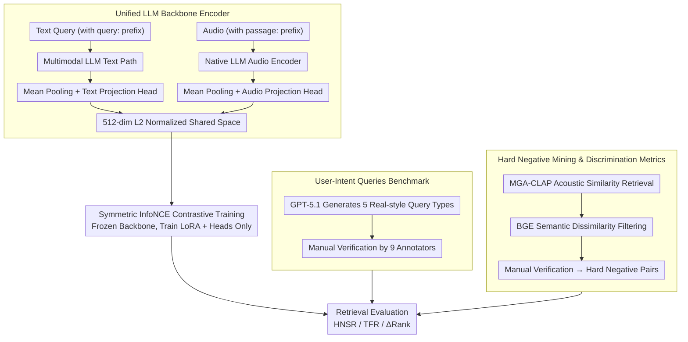

# Omni-Embed-Audio: Leveraging Multimodal LLMs for Robust Audio-Text Retrieval

**Conference**: ACL 2026  
**arXiv**: [2604.18360](https://arxiv.org/abs/2604.18360)  
**Code**: [Web Demo](https://omni-embed-audio.github.io)  
**Area**: Multimodal VLM / Audio Retrieval  
**Keywords**: Audio-text retrieval, CLAP, Multimodal LLM, User-Intent Queries, Hard negative discrimination

## TL;DR
This paper proposes OEA (Omni-Embed-Audio), which leverages multimodal LLMs as a unified encoder to construct a retrieval-oriented audio-text embedding space. It introduces the User-Intent Queries (UIQ) benchmark and hard negative discrimination metrics (HNSR/TFR). The study finds that the LLM backbone significantly outperforms the CLAP series in T2T retrieval (+22%) and hard negative discrimination (+4.3%p HNSR@10).

## Background & Motivation

**Background**: Methods based on Contrastive Language-Audio Pretraining (CLAP) have become the mainstream paradigm for audio-text retrieval. The latest M2D-CLAP achieves SOTA by combining self-supervised masked modeling with CLAP. Performance on standard benchmarks (AudioCaps, Clotho) continues to improve.

**Limitations of Prior Work**: (1) Standard benchmarks use descriptive caption-style queries, which differ significantly from real-world search behavior—actual Freesound queries average only 1.8 words; (2) Existing model performance drops by up to 16% when faced with paraphrased queries; (3) Existing metrics only check if the target is retrieved but do not measure whether the model can suppress acoustically similar but semantically different distractors—i.e., they lack evaluation of discrimination capability.

**Key Challenge**: The text encoders of CLAP models are lightweight and optimized for contrastive alignment with audio, compressing the entire query into a "bag-of-content" vector. This prevents them from handling negation semantics ("no thunder") and fine-grained semantic distinctions, which are core requirements in real search scenarios.

**Goal**: (1) Construct a unified retrieval encoder based on multimodal LLMs; (2) Systematically evaluate retrieval robustness under various real query types; (3) Propose new metrics to measure hard negative discrimination capability.

**Key Insight**: LLMs are exposed to numerous negation patterns ("don't", "except") during instruction-following pretraining. Their attention mechanisms can maintain composite semantic structures, complementing the lightweight text encoders of CLAP.

**Core Idea**: Use a multimodal LLM with native audio understanding as a unified encoder. Combined with LoRA adaptation and contrastive learning, it aims to surpass specialized CLAP models in retrieval quality and semantic discrimination.

## Method

### Overall Architecture
The core of OEA is the transformation of a multimodal LLM with native audio understanding into a unified retrieval encoder capable of encoding both text and audio. This bypasses the bottleneck of insufficient expressiveness in the text-side of dual-encoder CLAP models. For input, text queries are prefixed with "query:" and processed via the LLM text pathway, while audio is prefixed with "passage:" and processed via the native LLM audio encoder. Both pathways apply mean pooling to the final hidden layer, followed by modality-specific projection heads that map outputs into a 512-dimensional L2-normalized space for direct cosine similarity retrieval. During training, backbone weights are frozen, and only the LoRA adapters and projection heads are updated. The method is supported by the UIQ query benchmark and the HNSR/TFR metrics for measuring hard negative discrimination.

### Key Designs

**1. Unified LLM Backbone Encoder: Leveraging Linguistic Priors for Audio Retrieval**

CLAP-based methods use a lightweight text encoder to compress queries into "bag-of-content" vectors, failing to process negation semantics like "no thunder" or distinguish fine-grained differences. OEA instead uses multimodal LLMs with native audio understanding (e.g., Nemotron-3B, Qwen2.5-Omni-3B/7B) as a shared backbone. Text and audio share the same Transformer, allowing audio representations to directly inherit the rich linguistic priors accumulated by the LLM during instruction pretraining. Implementation involves attaching LoRA adapters to attention layers and using modality-specific projection heads to map to a 512-dimensional space. With the backbone completely frozen, only LoRA and projection heads are trained—trainable parameters account for only 0.29–0.36% of the total (approx. 11–16M), converting a generative LLM into a contrastive retrieval encoder.

**2. User-Intent Queries (UIQ) Benchmark: Stress-testing Robustness with Real Search Styles**

Standard benchmarks only contain caption-style queries, whereas real Freesound queries average only 1.8 words, leading to significant evaluation distortion. UIQ defines 5 query types categorized into three classes: Conversational (Question, Imperative), Reformulated (Keyphrase, Paraphrase), and Exclusionary (Negative). These queries are generated by GPT-5.1 under vocabulary and length constraints and manually verified by 9 annotators (average score 4.15/5). Imperative and Negative queries are precisely what existing benchmarks lack and represent the greatest challenge for semantic understanding; UIQ systematically incorporates them.

**3. Hard Negative Mining and Discrimination Metrics (HNSR/TFR): Suppressing Distractors While Retrieving Targets**

Standard R@k only considers whether the target is retrieved. For exclusionary queries, the true difficulty lies in pushing acoustically similar but semantically different distractors outside of the top-k. To this end, a four-stage hard negative mining pipeline was designed: MGA-CLAP acoustic similarity retrieval → BGE text semantic dissimilarity filtering → manual verification → construction of (target audio, hard negative audio) pairs. HNSR@k is defined as the proportion of cases where the "target is in top-k and the hard negative is outside top-k," while $\Delta\text{-Rank} = \text{Rank(HN)} - \text{Rank(Target)}$ quantifies the rank separation between the two. These metrics fill the gap in exclusionary query evaluation.

### Loss & Training
The model uses a symmetric InfoNCE contrastive loss with a temperature $\tau = 0.07$. A multi-stage curriculum is employed: initial audio-text alignment on WavCaps (275K samples), followed by fine-tuning on AudioCaps v2 (91K samples), with an optional addition of Clotho v2 data (denoted as +Cl). The AdamW optimizer is used with PyTorch DDP and BFloat16 precision.

## Key Experimental Results

### Main Results (T2A Retrieval)

| Model | AudioCaps R@5 | Clotho R@5 | MECAT R@5 |
|------|-------------|-----------|----------|
| M2D-CLAP | **77.13** | 42.91 | 23.55 |
| OEA-Nemo3B | 72.64 | 40.57 | **24.53** |
| OEA-Qwen3B (+Cl) | 69.35 | **49.78** | 17.16 |
| OEA-Qwen7B | 72.25 | 44.78 | 23.29 |

### T2T Retrieval and Hard Negative Discrimination

| Model | Clotho T2T R@1 | MECAT T2T R@5 | HNSR@10 |
|------|---------------|--------------|---------|
| M2D-CLAP | 55.85 | 38.74 | 30.3% |
| OEA-Qwen7B (+Cl) | **63.58** | **47.41** | **34.6%** |
| Gain | +13.8% | +22.4% | +4.3%p |

### Key Findings
- In T2A retrieval, OEA is roughly comparable to M2D-CLAP. M2D-CLAP is stronger on in-domain AudioCaps, while OEA generalizes better across domains (Clotho/MECAT).
- In T2T retrieval, OEA leads significantly (+22% relative gain) because the text understanding capability of the LLM backbone far exceeds CLAP's lightweight text encoder.
- OEA holds a unique advantage in imperative queries (+5.1%p), stemming from the instruction-following pretraining of the LLM.
- OEA is significantly stronger in hard negative discrimination (HNSR@10 +4.3%p, TFR@10 +34.7%). The LLM's attention mechanism preserves the composite structure of negation semantics.
- 7B models are not always superior to 3B—retrieval quality is more constrained by contrastive alignment and the match between data and backbone.

## Highlights & Insights
- The **"complementary capabilities"** argument is very clear—M2D-CLAP is stronger for in-domain caption-style retrieval, whereas OEA is stronger for T2T and semantic discrimination. The paper provides clear decision rules for deployment based on the scenario.
- The introduction of HNSR/TFR metrics fills a gap in exclusionary query evaluation—standard R@k cannot distinguish between "retrieving the target with hard negatives mixed in" and "cleanly retrieving the target."
- Transforming an LLM into a retrieval encoder by training only 0.29-0.36% of parameters is extremely parameter-efficient.

## Limitations & Future Work
- OEA relies on multimodal LLM backbones with native audio understanding, limiting the choice of base models.
- Memory consumption is much larger than CLAP (18.3GB vs ~0.6GB); deployment on edge devices requires quantization or distillation.
- Hard negative filtering using MGA-CLAP + BGE might miss certain types of acoustic confusion.
- UIQ is generated by a single LLM; though manually verified, it may not cover all real-world query styles.
- Performance in multilingual audio retrieval scenarios has not been evaluated.
- Audio encoding latency is high (666ms/clip for Qwen7B), requiring pre-computation for real-time scenarios.

## Related Work & Insights
- **vs M2D-CLAP (Niizumi et al., 2025)**: M2D-CLAP is stronger in T2A but lacks in T2T and discrimination; OEA's advantage in semantic understanding comes from the LLM backbone.
- **vs RobustCLAP (Selvakumar et al., 2024)**: RobustCLAP optimizes for paraphrase robustness but does not handle exclusionary queries; OEA naturally handles negation semantics through the LLM.
- **vs NevIR/ExcluIR (Weller et al., 2023)**: These works found that text retrieval models perform near-random on negation queries; OEA proves that an LLM backbone can partially solve this problem.

## Rating
- Novelty: ⭐⭐⭐⭐ Using multimodal LLMs as audio retrieval encoders is a fresh perspective; the UIQ benchmark and discrimination metrics are significant contributions.
- Experimental Thoroughness: ⭐⭐⭐⭐⭐ 3 datasets, 6 OEA variants, 4 CLAP baselines, 5 query types, and multi-dimensional analysis.
- Writing Quality: ⭐⭐⭐⭐ Clear conclusions, well-thought-out experimental design, and practical deployment suggestions.
- Value: ⭐⭐⭐⭐ Advances the audio retrieval evaluation paradigm; the UIQ benchmark can be widely adopted by the community.

<!-- RELATED:START -->

## Related Papers

- [\[ACL 2026\] Protecting Bystander Privacy via Selective Hearing in Audio LLMs](protecting_bystander_privacy_via_selective_hearing_in_audio_llms.md)
- [\[CVPR 2026\] OmniRet: Efficient and High-Fidelity Omni Modality Retrieval](../../CVPR2026/audio_speech/omniret_efficient_and_high-fidelity_omni_modality_retrieval.md)
- [\[ACL 2026\] PlanRAG-Audio: Planning and Retrieval Augmented Generation for Long-form Audio Understanding](planrag-audio_planning_and_retrieval_augmented_generation_for_long-form_audio_un.md)
- [\[ACL 2026\] Music Audio-Visual Question Answering Requires Specialized Multimodal Designs](music_audio-visual_question_answering_requires_specialized_multimodal_designs.md)
- [\[NeurIPS 2025\] Node-Based Editing for Multimodal Generation of Text, Audio, Image, and Video](../../NeurIPS2025/audio_speech/node-based_editing_for_multimodal_generation_of_text_audio_image_and_video.md)

<!-- RELATED:END -->
