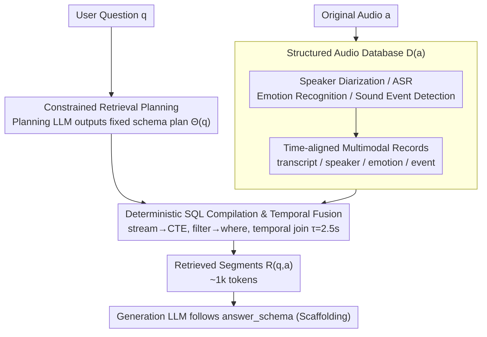

# PlanRAG-Audio: Planning and Retrieval Augmented Generation for Long-form Audio Understanding

**Conference**: ACL2026 Findings  
**arXiv**: [2605.20414](https://arxiv.org/abs/2605.20414)  
**Code**: The paper states that the data and code will be released after acceptance  
**Area**: Long-form Audio Understanding / Audio RAG  
**Keywords**: Long-form audio understanding, retrieval planning, structured audio database, SQL retrieval, multimodal audio reasoning

## TL;DR
PlanRAG-Audio reformulates long audio understanding as a problem of "planning which modalities and time segments to query, then retrieving evidence from a structured audio database." This reduces the LLM input for 60 minutes of audio from approximately 115k tokens to about 1k tokens, while significantly improving speaker counting, event ordering, and speaker-constrained QA.

## Background & Motivation
**Background**: Large audio-language models can process speech content, speakers, emotions, and non-speech events, but long audio quickly leads to token and memory bottlenecks. For example, a one-hour lecture corresponds to approximately 12k text tokens but can exceed 100k speech tokens. Text RAG has proven that "retrieving only relevant evidence" migitates long-context issues, but audio RAG must also handle multimodality and temporal alignment.

**Limitations of Prior Work**: Many long audio methods perform ASR to text followed by NLP, which ignores intonation, speaker identity, emotion, and background events. Directly passing entire audio segments to a long-context model is costly, leads to unstable output formats, and lacks sufficient support for non-text tasks such as speaker diarization, emotion recognition, and sound event detection.

**Key Challenge**: The difficulty of long audio lies not only in the input length but also in the fact that questions often span multiple heterogeneous clues. A single question might require knowledge of what a specific speaker said, the emotion during a certain period, the sequence of background events, and the output format simultaneously. Without explicit planning, models neither know which streams to examine nor easily lose critical evidence among irrelevant information.

**Goal**: The authors aim to construct a reproducible, zero-shot, task-agnostic long audio understanding framework where the model first generates a structured retrieval plan, then uses deterministic SQL to retrieve relevant segments from an audio database, and finally generates answers using compact evidence.

**Key Insight**: The paper organizes audio preprocessing results into a time-aligned database. The LLM no longer consumes the entire audio directly but instead generates a constrained retrieval plan specifying streams, filters, fusion, return fields, and an answer schema.

**Core Idea**: Externalize long audio reasoning into database queries through planned structured retrieval, allowing the LLM to process only a small amount of cross-modal evidence relevant to the question.

## Method

### Overall Architecture
PlanRAG-Audio addresses the issue that "stuffing an hour of audio into an LLM is long, expensive, and unstable." Its key is not replacing a stronger audio encoder, but reformulating "listening to the whole audio before answering" into "offline indexing + online planning retrieval + deterministic execution + compact generation." This ensures the model only processes a small amount of cross-modal evidence relevant to the question.

In the first stage, the system performs speaker diarization, ASR, emotion recognition, and sound event detection on the raw audio, organizing the results into a time-aligned audio database $D(a)$. In the second stage, a planning LLM generates a retrieval plan $\Theta(q)$ based on the user's question, deciding which streams to query, what filters to use, how to fuse multiple streams, which fields to return, and the schema for the final answer. In the third stage, a rule-based SQL generator compiles the plan into a merged SQL query, executes it against the database, and returns segments $R(q,a)$. In the fourth stage, a generation LLM generates the answer based only on these retrieved segments and the output schema. Thus, the task length and LLM input length are decoupled: the input for 60 minutes of audio is compressed from approximately 115k tokens to about 1k tokens.

### Key Designs

**1. Structured Audio Database: Decomposing long audio into time-aligned, queryable multimodal records**

Long audio questions often require aligning "who said it," "what was said," "what the emotion was," and "what happened in the background" within the same time window. Models fed directly with long context can only implicitly infer these relationships within a long string of tokens, which is unstable and prone to losing clues. PlanRAG-Audio performs perception before indexing: speaker diarization creates homogeneous time segments used as shared boundaries for transcript, speaker, and emotion streams; the sound event stream is generated independently using a sliding window, recording its own start/end and label-score JSONB. Once information becomes structured records with timestamps, cross-modal matching can be completed precisely using temporal joins rather than having the LLM guess which emotion corresponds to which sentence.

**2. Constrained Retrieval Planning: Thinking explicitly about "what to query" before retrieval**

The difficulty of complex audio questions lies in "which streams to check and what conditions to filter by." Blindly stuffing the entire database content into the model is wasteful and prone to incorrect formatting. PlanRAG-Audio requires the planning LLM to output a retrieval plan with a fixed schema, containing five categories of fields: streams, filters, fusion, output return_fields, and answer_schema. For instance, for a speaker-constrained MCQA, the plan selects transcription and speaker streams, specifies text or speaker filters, and constrains the answer_schema to output only A/B/C/D. Framing the planning with a fixed schema reduces invalid plans, makes subsequent SQL compilation deterministic, and resolves the common "correct answer but unparseable output" issue in long-context models.

**3. Deterministic SQL Compilation & Temporal Fusion: High-level planning for the LLM, precise execution for the database**

Generative retrieval is inherently unstable; letting the LLM directly "retrieve and align" is error-prone. PlanRAG-Audio compiles plans into executable SQL: each stream is compiled into an independent CTE, filters into WHERE clauses, and the final SELECT projects fields according to the output contract and performs temporal joins based on fusion strategies—the temporal fusion in the appendix uses nearest midpoint matching with a default tolerance window of $\tau=2.5$ seconds. Thus, the LLM is only responsible for high-level planning, while cross-modal alignment is transformed from error-prone prompt reasoning into checkable query logic. Adding a new modality only requires compiling an additional stream, providing good scalability.

### A Complete Example: Speaker-constrained MCQA for a 60-minute lecture

Suppose the question is "Regarding what a specific speaker said in the lecture, which option is correct?" If the entire audio is passed directly to Gemini, the input is approximately 115.2k tokens, which is expensive and often results in unparseable formats. Using PlanRAG-Audio: In the offline phase, the hour-long audio is built into a database; diarization cuts time segments for each speaker, aligning transcript/emotion to the same boundaries, while SED uses a sliding window for background events. In the online phase, the planning LLM generates a retrieval plan after seeing the question—selecting transcription and speaker streams, locking filters to the target speaker, and limiting the answer_schema to A/B/C/D. The SQL generator compiles this into a query with CTEs and temporal joins, retrieving only segments related to that speaker, totaling about 0.9k tokens. The generation LLM answers using this compact evidence; if the database contains no relevant speech from that speaker, the structured result is empty, and the model chooses to abstain based on this (in experiments, abstention in this setting rose from 0.54% to 94.90%) rather than fabricating an answer.

### Loss & Training
PlanRAG-Audio does not train an end-to-end model but combines off-the-shelf perception modules and LLMs in a zero-shot setting. Key configurations include OWSM-CTC v4 medium for ASR, Pyannote community-1 for diarization, Odyssey 2024 SER baseline for emotion recognition, and BEATs iter3+ AS2M finetuned for SED. Qwen3-4B-Instruct serves as the primary generation model. Long-context baselines include Gemini 2.5 Flash and Voxtral-Mini-3B-2507. The authors explicitly avoid task-specific prompt engineering or handwritten SQL, instead relying on a unified planning schema.

## Key Experimental Results

### Main Results
| Experimental Item | Model / Setting | Value | Description |
|-------------------|-----------------|-------|-------------|
| 60 min MCQA Input Length | Gemini direct audio | 115.2k tokens | High cost for direct long-context processing |
| 60 min MCQA Input Length | Gemini + PlanRAG-Audio | 0.9k tokens | Input after retrieval is approximately constant |
| 60 min MCQA Input Length | Qwen + PlanRAG-Audio | 1.2k tokens | Small models can also handle retrieved evidence |
| Gemini diarization parse failure | 10 to 540 minutes | 17.92% unparseable | Format stability is a significant issue in long context |

### Ablation Study
| Task | Without PlanRAG-Audio | With PlanRAG-Audio | Key Change |
|------|-----------------------|--------------------|------------|
| Gemini speaker count | 14.20% | 69.40% | Explicit speaker segments transform counting into structured reasoning |
| Gemini event order | Spearman 0.30 | Spearman 0.68 | Event ordering is more stable after timestamp retrieval |
| Qwen speaker count | 35.16% | 36.66% | Minor improvement, suggesting Qwen has some inherent ability to use structured evidence for this task |
| Qwen event order | Spearman 0.11 | Spearman 0.34 | Externalizing temporal structure brings obvious gains |
| Gemini speaker-constrained MCQA | QA 68.13%, Abst. 0.54% | QA 70.96%, Abst. 94.90% | Retrieval planning greatly improves abstention in unanswerable scenarios |
| Qwen speaker-constrained MCQA | Direct baseline not reported | QA 67.59%, Abst. 82.20% | Small models combined with structured evidence can also handle speaker constraints |

### Key Findings
- The primary Gain of PlanRAG-Audio comes from "selective retrieval" rather than a stronger generation model. Without planning, letting Qwen process the entire database content still results in degradation for long audio; with planning, performance remains stable regardless of duration.
- In absolute results for OWSM + Qwen, the MCQA parseable accuracy without PlanRAG dropped from 66.24 at 10 minutes to 30.69 at 300 minutes, and could not be reported at 540 minutes; with PlanRAG, it remained at 65.67, 67.23, 65.09, 63.87, and 56.70 from 10 to 540 minutes.
- Semantic retrieval is not necessarily superior to keyword retrieval. In the appendix, for 30-minute MCQA, keyword search achieved 67.23 vs. vector search at 60.40; at 540 minutes, keyword was 56.07 vs. vector at 57.39, indicating that retrieval planning is more critical than retriever expressiveness.
- Preprocessing costs grow approximately linearly with audio length. It is suitable for offline indexing scenarios where multiple queries are reused, but introduces extra overhead for real-time one-off queries.

## Highlights & Insights
- The paper transforms long audio understanding from a model context window problem into an information system problem. Standardizing perception results into a database and using an LLM to plan queries is a clear engineering abstraction.
- The `answer_schema` is an easily overlooked but vital design. Long-context models fail not just due to wrong answers, but because of unparseable outputs; constraining the format during the planning stage reduces such errors.
- Results indicate that speaker-constrained abstention is a strength of PlanRAG-Audio. When a question is unanswerable, it is necessary to know that "the specified speaker provided no relevant evidence," which is exactly where structured retrieval is more reliable than full-text input.
- The paper does not hide complexity within a black-box model but uses simple keyword retrieval for experiments, highlighting the contribution of planning instead.

## Limitations & Future Work
- The authors acknowledge that Gemini evaluations are affected by API limiters, including long-context instability and format failures, which may affect the precise judgment of long-context baselines.
- While simple keyword retrieval is currently used (with the appendix showing no stable gain for vector search), stronger hybrid retrieval, learned rankers, or query rewriting could still improve recall.
- The framework is limited by upstream perception modules. Errors in ASR, diarization, emotion recognition, and SED propagate directly into the database; PlanRAG-Audio itself does not optimize these modules.
- Preprocessing is reusable but not free. It is well-suited for multiple-query scenarios like meeting recordings, podcast archives, and lecture notes; for low-latency real-time voice assistants, incremental indexing and streaming planning are needed.
- Risks are inherited from pre-trained components, such as ASR bias against accents/languages, emotion recognition misjudgments, and speaker identification errors.

## Related Work & Insights
- **vs ASR-first long audio QA**: Traditional methods convert audio to text for NLP, losing speaker, emotion, and non-speech events; PlanRAG-Audio preserves this information as parallel streams.
- **vs direct long-context LALM**: Direct processing by Gemini/Voxtral is expensive and format-unstable; PlanRAG-Audio compresses input to ~1k tokens and decouples task length from LLM input length.
- **vs text PlanRAG / Plan\*RAG**: Text planning retrieval mainly handles document selection and reasoning steps; PlanRAG-Audio additionally handles temporal alignment, speaker constraints, and acoustic events.
- **Insight**: For other long-sequence multimodal data like video, sensor logs, or robot trajectories, one could also construct structured event databases first and let the LLM perform query planning instead of stuffing raw sequences directly into the context.

## Rating
- Novelty: ⭐⭐⭐⭐ Systematically migrates planning RAG to long audio and uses SQL/database abstractions for cross-modal temporal alignment; the logic is very solid.
- Experimental Thoroughness: ⭐⭐⭐⭐ Covers QA, MCQA, summarization, SD, ER, SED, and advanced composite tasks; there is room for deeper error analysis of upstream modules.
- Writing Quality: ⭐⭐⭐⭐ Clear structure with intuitive examples; some absolute results are in the appendix, while relative results in the main text require comparative reading.
- Value: ⭐⭐⭐⭐⭐ Highly valuable for practical long-audio retrieval and QA scenarios such as long meetings, podcasts, class recordings, and customer service logs.

<!-- RELATED:START -->

## Related Papers

- [\[ACL 2026\] Comprehensive Benchmarking of Long-Form Speech Generation in Diverse Scenarios](comprehensive_benchmarking_of_long-form_speech_generation_in_diverse_scenarios.md)
- [\[ACL 2026\] MARQUIS: A Three-Stage Pipeline for Video Retrieval-Augmented Generation](marquis_a_three-stage_pipeline_for_video_retrieval-augmented_generation.md)
- [\[CVPR 2026\] AudioStory: Generating Long-Form Narrative Audio with Large Language Models](../../CVPR2026/audio_speech/audiostory_generating_long-form_narrative_audio_with_large_language_models.md)
- [\[ACL 2025\] WavRAG: Audio-Integrated Retrieval Augmented Generation for Spoken Dialogue Models](../../ACL2025/audio_speech/wavrag_audio-integrated_retrieval_augmented_generation_for_spoken_dialogue_model.md)
- [\[ICML 2025\] Long-Form Speech Generation with Spoken Language Models](../../ICML2025/audio_speech/long-form_speech_generation_with_spoken_language_models.md)

<!-- RELATED:END -->
