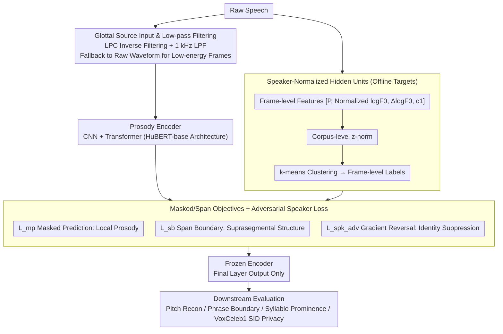

# Privacy-preserving Prosody Representation Learning

**Conference**: ACL2026  
**arXiv**: [2606.00407](https://arxiv.org/abs/2606.00407)  
**Code**: https://github.com/kpeverson/speaker_disentangled_prosody  
**Area**: Speech Privacy / AI Security  
**Keywords**: Prosody representation, speaker disentanglement, self-supervised learning, privacy protection, speech security  

## TL;DR
This paper proposes a self-supervised prosody encoder using glottal source as input, which reduces identity leakage through F0 speaker normalization and adversarial speaker loss. It outperforms raw prosody and HuBERT baselines in phrase boundary detection, syllable prominence, and pitch reconstruction, while reducing VoxCeleb1 speaker identification accuracy from 0.64 (HuBERT) to 0.14.

## Background & Motivation
**Background**: Prosody in speech includes non-lexical information such as pitch, energy, pauses, and duration lengthening, which expresses informational focus, sarcasm, self-correction, interrogative mood, and excitement levels. Modern speech models often utilize self-supervised representation learning to obtain general speech representations, but these representations typically conflate lexical content, prosody, and speaker identity.

**Limitations of Prior Work**: Traditional prosodic features rely on F0, energy, duration statistics, and phonetic alignment. However, F0 extraction, forced alignment, and energy features are susceptible to noise, speaker variability, and recording conditions. Self-supervised models like HuBERT are effective for some prosody tasks but do not explicitly protect speaker privacy.

**Key Challenge**: Acoustic-prosodic cues themselves carry speaker information, such as mean pitch, glottal characteristics, and voice quality. If a model requires prosodic expression but not identity information, directly learning from raw speech or raw prosodic features exposes users to privacy risks like speaker identification, voice cloning, and deepfakes.

**Goal**: To learn an explicit prosody representation that preserves linguistically relevant prosodic events and local pitch dynamics while minimizing speaker identity information. The authors aim to demonstrate that speaker disentanglement does not have to come at the cost of downstream prosody performance.

**Key Insight**: The paper draws on the masked prediction + span boundary objectives of ProsodyBERT/HuBERT but replaces the input with the estimated glottal waveform and incorporates speaker disentanglement strategies into the training objectives and hidden-unit target construction.

**Core Idea**: Redesign the input, targets, and losses of the prosody encoder around the themes of "de-lexicalization, de-identification, and prosody preservation," rather than perform post-hoc privacy filtering on existing speech representations.

## Method
The proposed model is a frame-based prosody encoder with a structure similar to HuBERT-base: a convolutional module processes the input, followed by a Transformer that outputs frame-level representations. Training does not require transcriptions; instead, it uses hidden units obtained by clustering acoustic-prosodic features as self-supervised targets.

### Overall Architecture
First, the system estimates the glottal source from raw speech. The authors use LPC inverse filtering to extract the glottal source; low-energy non-speech frames return the raw waveform directly to avoid LPC artifacts. This is followed by a 1 kHz low-pass filter to reduce lexical information leakage.

Second, hidden units are constructed offline. Each frame's acoustic-prosodic feature includes periodicity $P$, speaker-normalized $\log F0$, $\Delta\log F0$, and the first mel-frequency cepstral coefficient $c_1$. These features undergo corpus-level z-normalization before k-means clustering to produce frame-level labels.

Third, the prosody encoder learns local prosody cues via masked prediction, captures suprasegmental patterns across frames/spans via a span-boundary objective, and suppresses speaker identity information using an adversarial speaker identification loss.

Finally, the trained encoder is frozen, and only the final encoder output layer is used for downstream tasks. The authors evaluate the representation on three prosody tasks: pitch reconstruction, phrase boundary detection, and syllable prominence detection, while assessing privacy leakage via VoxCeleb1 speaker identification.

### Key Designs
**1. Glottal source input and low-pass filtering: Moving privacy protection forward to the input layer to prevent identity shortcuts.**

If raw waveforms are fed into the model, they contain both lexical content and speaker details, making it difficult to completely erase identity info regardless of the adversarial loss strength. This work intervenes at the input: LPC inverse filtering estimates the glottal waveform, filtering out vocal tract resonances that carry heavy phonetic/lexical information, leaving glottal source components related to prosody and voice quality. Frames with energy below $10^{-4}$ skip inverse filtering to avoid unreliable LPC coefficients. A subsequent 1 kHz low-pass filter further suppresses residual lexical information, blocking "identity shortcuts" before data even enters the model.

**2. Speaker-normalized hidden units: Erasing speaker-specific mean pitch from the self-supervised targets.**

Even with clean input, if target labels retain speaker-specific pitch ranges, the model will be pulled back toward identity information. This work normalizes features during hidden unit construction: frame features $[P,\log F0,\Delta\log F0,c_1]$ use $\log F0$ minus the speaker's mean log pitch, weighted by periodicity $P$ (to prevent unvoiced/noise frames from polluting statistics). Energy is replaced by the first mel-cepstral coefficient $c_1$ to reduce sensitivity to recording conditions. These features, after corpus-level z-normalization, are clustered into labels. This ensures the targets contain relative pitch dynamics rather than absolute pitch.

**3. Masked/span objectives with adversarial speaker loss: Preserving prosody via the main tasks while suppressing identity via the adversarial term.**

Masked prediction alone tends to retain speaker cues, while adversarial loss alone can degrade prosodic task performance. This work optimizes three objectives simultaneously:

$$L=L_{mp}+\alpha_{sb}L_{sb}+\alpha_{spk}^{adv}L_{spk}^{adv}$$

$L_{mp}$ is the HuBERT-style masked hidden-unit cross-entropy for local prosodic cues. $L_{sb}$ is the span-boundary objective, using unmasked boundary frames to predict labels of masked spans, forcing the model to capture suprasegmental structures. $L_{spk}^{adv}$ utilizes gradient reversal to train a speaker classifier while making the encoder learn anti-speaker features. The main tasks ensure the representation remains useful for prosody, while the adversarial term makes identity information unreadable.

### Loss & Training
The model is trained on the transcribed portion of GigaSpeech. As the corpus lacks speaker labels, the authors use a pretrained speaker encoder to extract utterance-level embeddings, which are clustered into 1000 pseudo-speaker labels for normalization and adversarial objectives. Pitch/periodicity are extracted using torchcrepe. Training is conducted via fairseq on 4 NVIDIA A40 or L40 GPUs for 500K steps, with the checkpoint having the lowest validation loss frozen for downstream tasks.

## Key Experimental Results

### Main Results
On prosody modeling tasks, the proposed encoder variants generally outperform raw prosody and HuBERT-base. The most significant improvement is in syllable prominence detection, with a reported 15% F1 gain over HuBERT-base.

| Model / Setting | Speaker-normalized $\log F0$ | Adv Speaker Loss | Phrase Boundary F1 | Syllable Prominence F1 | Pitch MSE | 0-mean Pitch MSE |
|-------------|------------------------------|------------------|--------------------|------------------------|-----------|------------------|
| Most frequent class | None | None | 0.00 | 0.00 | N/A | N/A |
| HuBERT-base | No | ✗ | 0.79 | 0.74 | 0.056 | 0.011 |
| Raw prosody | ✓ | None | 0.49 | 0.66 | N/A | N/A |
| Ours | No | ✗ | 0.82 | 0.86 | 0.027 | 0.012 |
| Ours | Yes | ✗ | 0.82 | 0.86 | 0.048 | 0.012 |
| Ours | No | ✓ | 0.73 | 0.82 | 0.024 | 0.012 |
| Ours | Yes | ✓ | 0.82 | 0.85 | 0.025 | 0.008 |

Speaker disentanglement is evaluated using VoxCeleb1 speaker identification accuracy (lower is better).

| Model / Setting | Speaker-normalized $\log F0$ | Adv Speaker Loss | Speaker ID Accuracy |
|-------------|------------------------------|------------------|---------------------|
| HuBERT-base | No | ✗ | 0.64 |
| Ours | No | ✗ | 0.41 |
| Ours | Yes | ✗ | 0.42 |
| Ours | No | ✓ | 0.22 |
| Ours | Yes | ✓ | 0.14 |

### Ablation Study
The two disentanglement strategies serve different roles: speaker-normalized targets show little impact on SID accuracy when used alone but reach the lowest identity leakage when combined with adversarial loss. Adversarial loss alone significantly reduces speaker identifiability but harms phrase boundary F1 without speaker-normalized targets.

| Ablation Config | Prosody Performance | Privacy Performance | Explanation |
|----------|--------------|----------|------|
| No speaker norm, No adv | Phrase 0.82, Prominence 0.86 | SID 0.41 | Better than HuBERT, but still retains identity info |
| Speaker norm, No adv | Phrase 0.82, Prominence 0.86 | SID 0.42 | Target normalization insufficient to reduce SID alone |
| No speaker norm, Adv | Phrase 0.73, Prominence 0.82 | SID 0.22 | Significant privacy gain, but harms prosodic utility |
| Speaker norm, Adv | Phrase 0.82, Prominence 0.85 | SID 0.14 | Optimal privacy-utility trade-off |

### Key Findings
- The encoder improves phrase boundary F1 from HuBERT's 0.79 to 0.82 and syllable prominence F1 from 0.74 to 0.85/0.86, proving that de-identification does not necessitate sacrificing prosodic event modeling.
- The final combination (speaker normalization + adversarial loss) reduces SID accuracy to 0.14, much lower than HuBERT-base (0.64) and the non-disentangled version (0.41).
- The adversarial objective provides a 46% relative SID reduction, while the combined strategies yield a 66% relative reduction.
- In 0-mean pitch reconstruction, the fully disentangled model achieves an MSE of 0.008, superior to HuBERT-base's 0.011, indicating its strength in modeling local pitch dynamics over speaker-specific pitch offsets.
- Using only the final encoder layer is a privacy-conscious choice; SUPERB traditionally uses all intermediate layers, which might reintroduce identity information.

## Highlights & Insights
- This paper treats privacy protection as an integrated part of the pipeline—modifying input, target, and loss simultaneously—rather than as post-processing. This end-to-end disentanglement is more robust than a lone adversarial classifier.
- The glottal source input is insightful: it retains prosody and voice quality cues while reducing lexical leakage via low-pass and low-energy processing, aligning with the principle of "minimal sufficient representation."
- The most compelling result is the privacy-utility trade-off: SID accuracy is minimized while phrase boundary F1 remains stable and syllable prominence stays significantly higher than HuBERT. This suggests privacy and utility are not strictly zero-sum in this context.
- Such prosody representations could serve expressive TTS, speech understanding, and dialogue systems while providing a safer intermediate representation for privacy-sensitive scenarios.

## Limitations & Future Work
- Pseudo-speaker labels were used for training. The authors note that if real speaker metadata were available for GigaSpeech, normalization and adversarial loss might be even more effective.
- Evaluation focused on local linguistic prosodic events. Paralinguistic tasks like emotion, sarcasm, and health diagnostics have not yet been systematically evaluated.
- The understanding tasks used hand transcriptions; evaluation with ASR transcriptions would be more realistic but requires more complex scoring.
- No human subjective evaluation in speech generation or voice conversion was performed. Whether privacy-preserving representations affect naturalness or expressiveness remains to be verified.
- The current model is not causal and thus cannot be used for streaming generation, though moving to a causal framework is considered straightforward.
- Privacy assessment assumes attackers have limited data; the ethical statement acknowledges that more data might allow for stronger speaker recognition algorithms.

## Related Work & Insights
- **vs HuBERT / wav2vec 2.0**: These general SSL speech representations aid prosody tasks but do not explicitly disentangle identity; this work uses the HuBERT architecture but changes to prosody-oriented input/targets/loss.
- **vs ProsodyBERT**: ProsodyBERT uses hidden units and span-boundary objectives; this work inherits that approach but adds glottal source input and speaker disentanglement.
- **vs PE-Wav2vec**: PE-Wav2vec also utilizes the glottal waveform; this work further integrates privacy objectives into the training framework.
- **vs information bottleneck / pitch shifting / adversarial loss**: These are existing disentanglement techniques; this work's contribution is combining speaker-normalized targets with adversarial loss in a prosody SSL context, validated by dual prosody + SID metrics.

## Rating
- Novelty: ⭐⭐⭐⭐☆ Explicitly combines prosody SSL with privacy protection; design is targeted and effective.
- Experimental Thoroughness: ⭐⭐⭐⭐☆ Includes prosody modeling, speaker ID, and key ablations, though lacks generation and broad paralinguistic evaluation.
- Writing Quality: ⭐⭐⭐⭐☆ Concise methodology, clear tables, and honest acknowledgment of limitations.
- Value: ⭐⭐⭐⭐☆ Significant for privacy-sensitive speech systems, especially as an intermediate representation for downstream applications.

<!-- RELATED:START -->

## Related Papers

- [\[ICLR 2026\] EmotionThinker: Prosody-Aware Reinforcement Learning for Explainable Speech Emotion Reasoning](../../ICLR2026/audio_speech/emotionthinker_prosody-aware_reinforcement_learning_for_explainable_speech_emoti.md)
- [\[CVPR 2026\] SAVE: Speech-Aware Video Representation Learning for Video-Text Retrieval](../../CVPR2026/audio_speech/save_speech-aware_video_representation_learning_for_video-text_retrieval.md)
- [\[ACL 2026\] Protecting Bystander Privacy via Selective Hearing in Audio LLMs](protecting_bystander_privacy_via_selective_hearing_in_audio_llms.md)
- [\[ACL 2026\] ImmersiveTTS: Environment-Aware Text-to-Speech with Multimodal Diffusion Transformer and Domain-Specific Representation Alignment](immersivetts_environment-aware_text-to-speech_with_multimodal_diffusion_transfor.md)
- [\[ACL 2026\] How Tokenization Limits Phonological Knowledge Representation in Language Models and How to Improve Them](how_tokenization_limits_phonological_knowledge_representation_in_language_models.md)

<!-- RELATED:END -->
