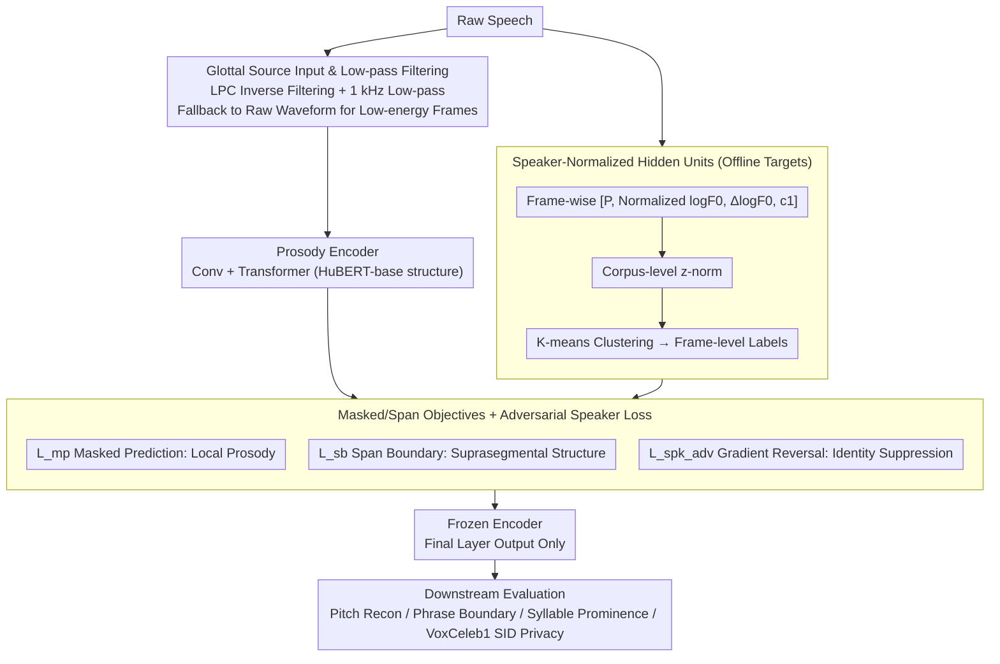

# Privacy-preserving Prosody Representation Learning

**Conference**: ACL2026  
**arXiv**: [2606.00407](https://arxiv.org/abs/2606.00407)  
**Code**: https://github.com/kpeverson/speaker_disentangled_prosody  
**Area**: Speech Privacy / AI Security  
**Keywords**: Prosody Representation, Speaker Disentanglement, Self-Supervised Learning, Privacy Preservation, Speech Security  

## TL;DR
This paper proposes a self-supervised prosody encoder using glottal source as input. By employing F0 speaker normalization and adversarial speaker loss to reduce identity leakage, the model outperforms raw prosody and HuBERT baselines in phrase boundary detection, syllable prominence, and pitch reconstruction. Simultaneously, it reduces VoxCeleb1 speaker identification accuracy from 0.64 (HuBERT) to 0.14.

## Background & Motivation
**Background**: Prosody in speech includes non-lexical information such as pitch, energy, pauses, and duration lengthening. It conveys information focus, sarcasm, self-correction, interrogative intonation, and excitement levels, which are crucial for speech understanding and generation. Modern speech models often use self-supervised representation learning to obtain general speech representations, but these representations typically blend lexical content, prosody, and speaker identity.

**Limitations of Prior Work**: Traditional prosodic features rely on F0, energy, and duration statistics coupled with phonetic alignment. However, F0 extraction, forced alignment, and energy features are susceptible to noise, speaker variability, and recording conditions. While self-supervised models like HuBERT are effective for certain prosody tasks, they do not explicitly protect speaker privacy.

**Key Challenge**: Acoustic-prosodic cues inherently carry speaker information, such as average pitch, glottal characteristics, and voice quality. If a model requires prosodic expressiveness without identity information, learning directly from raw speech or raw prosodic features exposes users to privacy risks such as speaker identification, voice cloning, and deepfakes.

**Goal**: To learn an explicit prosody representation that preserves linguistically relevant prosodic events and local pitch dynamics while minimizing speaker identity information. The authors aim to demonstrate that speaker disentanglement does not necessarily come at the cost of downstream prosody performance.

**Key Insight**: The paper draws inspiration from the masked prediction and span boundary objectives of ProsodyBERT/HuBERT but replaces the input with an estimated glottal waveform. It incorporates speaker disentanglement strategies into both the training objectives and the construction of hidden-unit targets.

**Core Idea**: Redesign the input, targets, and losses of the prosody encoder around "removing lexical content, removing identity, and retaining prosody," rather than performing post-hoc privacy filtering on existing speech representations.

## Method
The model is a frame-based prosody encoder with a structure similar to HuBERT-base: a convolutional module processes the input, followed by a Transformer to output frame-level representations. Training does not require transcript supervision; instead, it uses self-supervised targets derived from clustering acoustic-prosodic features.

### Overall Architecture
First, the system estimates the glottal source from raw speech. The authors use LPC inverse filtering to extract the glottal source. For low-energy non-speech frames, the raw waveform is returned directly to avoid LPC artifacts. A 1 kHz low-pass filter is subsequently applied to reduce lexical information leakage.

Second, hidden units are constructed offline. Each frame's acoustic-prosodic features include periodicity $P$, speaker-normalized $\log F0$, $\Delta\log F0$, and the first mel-frequency cepstral coefficient $c_1$. These features undergo corpus-level z-normalization before k-means clustering to produce frame-level labels.

Third, the prosody encoder learns local prosodic cues via masked prediction, suprasegmental patterns through a span-boundary objective, and minimizes speaker identity information via an adversarial speaker identification loss.

Finally, the trained encoder is frozen, and only the final encoder output layer is used for downstream tasks. The authors evaluate representation capability on three prosody tasks (pitch reconstruction, phrase boundary detection, and syllable prominence detection) and evaluate privacy leakage via VoxCeleb1 speaker identification.

### Key Designs
**1. Glottal Source Input and Low-pass Filtering: Shifting privacy protection to the input layer to prevent identity shortcuts.**
If raw waveforms are fed into the model, they contain both lexical content and speaker details, making it difficult to completely erase identity information regardless of the strength of the adversarial loss. This work intervenes at the input: LPC inverse filtering estimates the glottal waveform to filter out vocal tract resonances (containing phoneme/lexical info) while retaining glottal source components related to prosody and voice quality. Frames with energy below $10^{-4}$ bypass inverse filtering to avoid unreliable LPC coefficients. A 1 kHz low-pass filter is then applied to further suppress residual lexical information.

**2. Speaker-normalized Hidden Units: Erasing the speaker's average pitch from the self-supervised target.**
Even with clean inputs, if the masked prediction targets retain speaker-specific pitch ranges, the model will be pulled back toward identity information. This work normalizes targets during hidden unit construction: features $[P, \log F0, \Delta\log F0, c_1]$ are used, where $\log F0$ is subtracted by the speaker's mean log pitch (weighted by periodicity $P$ to prevent unvoiced frames from polluting statistics). Energy is replaced by the first mel-cepstral coefficient $c_1$ to reduce sensitivity to recording conditions. These are clustered into frame-level labels after corpus-level z-normalization, leaving only relative pitch dynamics.

**3. Masked/Span Objectives with Adversarial Speaker Loss: Balancing prosody retention and identity suppression.**
The model optimizes three objectives simultaneously:
$$L=L_{mp}+\alpha_{sb}L_{sb}+\alpha_{spk}^{adv}L_{spk}^{adv}$$
where $L_{mp}$ is the HuBERT-style masked cross-entropy for local prosodic cues. $L_{sb}$ is the span-boundary objective, using unmasked boundary frames of a masked span to predict the center label, forcing the model to capture suprasegmental structures. $L_{spk}^{adv}$ utilizes gradient reversal to train a speaker classifier while forcing the encoder to learn anti-speaker features.

### Loss & Training
The model is trained on the transcribed portion of GigaSpeech. Lacking official speaker labels, the authors extract utterance-level embeddings using a pretrained speaker encoder and cluster them into 1000 pseudo-speaker labels for normalization and adversarial objectives. Pitch/periodicity are extracted via `torchcrepe`. Training is performed using `fairseq` on 4 NVIDIA A40 or L40 GPUs for 500K steps.

## Key Experimental Results

### Main Results
The proposed encoder variants generally outperform raw prosody and HuBERT-base on prosody modeling tasks. The most significant improvement is in syllable prominence detection, with a reported 15% relative F1 increase over HuBERT-base.

| Model / Setting | Speaker-normalized $\log F0$ | Adv Speaker Loss | Phrase Boundary F1 | Syllable Prominence F1 | Pitch MSE | 0-mean Pitch MSE |
|:---|:---:|:---:|:---:|:---:|:---:|:---:|
| Most Frequent Class | N/A | N/A | 0.00 | 0.00 | N/A | N/A |
| HuBERT-base | No | ✗ | 0.79 | 0.74 | 0.056 | 0.011 |
| Raw Prosody | ✓ | N/A | 0.49 | 0.66 | N/A | N/A |
| Ours | No | ✗ | 0.82 | 0.86 | 0.027 | 0.012 |
| Ours | Yes | ✗ | 0.82 | 0.86 | 0.048 | 0.012 |
| Ours | No | ✓ | 0.73 | 0.82 | 0.024 | 0.012 |
| Ours | Yes | ✓ | 0.82 | 0.85 | 0.025 | 0.008 |

Privacy leakage is evaluated using VoxCeleb1 speaker identification accuracy (lower is better).

| Model / Setting | Speaker-normalized $\log F0$ | Adv Speaker Loss | Speaker ID Accuracy |
|:---|:---:|:---:|:---:|
| HuBERT-base | No | ✗ | 0.64 |
| Ours | No | ✗ | 0.41 |
| Ours | Yes | ✗ | 0.42 |
| Ours | No | ✓ | 0.22 |
| Ours | Yes | ✓ | 0.14 |

### Ablation Study
The two disentanglement strategies serve different roles: speaker-normalized targets have little impact on SID accuracy alone but achieve the lowest leakage when combined with adversarial loss. Adversarial loss significantly reduces identity recognizability but can harm phrase boundary F1 without speaker-normalized targets.

| Ablation Config | Prosody Performance | Privacy Performance | Explanation |
|:---|:---|:---|:---|
| No Norm, No Adv | Phrase 0.82, Prominence 0.86 | SID 0.41 | Better than HuBERT, but identity remains. |
| Norm, No Adv | Phrase 0.82, Prominence 0.86 | SID 0.42 | Target normalization alone is insufficient. |
| No Norm, Adv | Phrase 0.73, Prominence 0.82 | SID 0.22 | Privacy improved at the cost of prosody. |
| Norm, Adv | Phrase 0.82, Prominence 0.85 | SID 0.14 | Best privacy-utility trade-off. |

### Key Findings
- The encoder improves phrase boundary F1 from HuBERT's 0.79 to 0.82 and syllable prominence F1 from 0.74 to 0.85/0.86, proving identity removal does not sacrifice prosodic modeling.
- The full combination reduces SID accuracy to 0.14, significantly lower than HuBERT-base (0.64) and the non-disentangled version (0.41).
- Adversarial objectives yield a 46% relative SID reduction; the combined strategies yield a 66% relative reduction.
- For 0-mean pitch reconstruction, the MSE of 0.008 outperforms HuBERT (0.011), indicating superior modeling of local pitch dynamics.

## Highlights & Insights
- Privacy protection is integrated into the architecture (input, target, and loss) rather than treated as post-processing.
- The use of glottal source is effective: it retains prosody and voice quality while reducing lexical leakage via low-pass filtering.
- The results demonstrate that privacy and utility are not strictly zero-sum in this context; the best privacy model retained high prosodic accuracy.

## Limitations & Future Work
- Pseudo-speaker labels were used instead of real metadata; results might improve with actual speaker ID.
- Evaluation focused on linguistic prosodic events; paralinguistic tasks like emotion or sarcasm detection were not assessed.
- The model is non-causal, hindering its use in streaming generation.
- Evaluation assumes attackers have limited data; stronger recognition algorithms might still extract identity from the representations.

## Related Work & Insights
- **vs HuBERT / wav2vec 2.0**: General SSL representations help with prosody but do not disentangle identity.
- **vs ProsodyBERT**: Inherits the hidden unit and span boundary approach but adds glottal source and disentanglement.
- **vs PE-Wav2vec**: Shares the glottal waveform concept but incorporates privacy objectives into training.

## Rating
- Novelty: ⭐⭐⭐⭐☆
- Experimental Thoroughness: ⭐⭐⭐⭐☆
- Writing Quality: ⭐⭐⭐⭐☆
- Value: ⭐⭐⭐⭐☆

<!-- RELATED:START -->

## Related Papers

- [\[ICLR 2026\] EmotionThinker: Prosody-Aware Reinforcement Learning for Explainable Speech Emotion Reasoning](../../ICLR2026/audio_speech/emotionthinker_prosody-aware_reinforcement_learning_for_explainable_speech_emoti.md)
- [\[CVPR 2026\] SAVE: Speech-Aware Video Representation Learning for Video-Text Retrieval](../../CVPR2026/audio_speech/save_speech-aware_video_representation_learning_for_video-text_retrieval.md)
- [\[ACL 2026\] Protecting Bystander Privacy via Selective Hearing in Audio LLMs](protecting_bystander_privacy_via_selective_hearing_in_audio_llms.md)
- [\[CVPR 2026\] Semantic Noise Reduction via Teacher-Guided Dual-Path Audio-Visual Representation Learning](../../CVPR2026/audio_speech/semantic_noise_reduction_via_teacher-guided_dual-path_audio-visual_representatio.md)
- [\[ACL 2026\] ImmersiveTTS: Environment-Aware Text-to-Speech with Multimodal Diffusion Transformer and Domain-Specific Representation Alignment](immersivetts_environment-aware_text-to-speech_with_multimodal_diffusion_transfor.md)

<!-- RELATED:END -->
