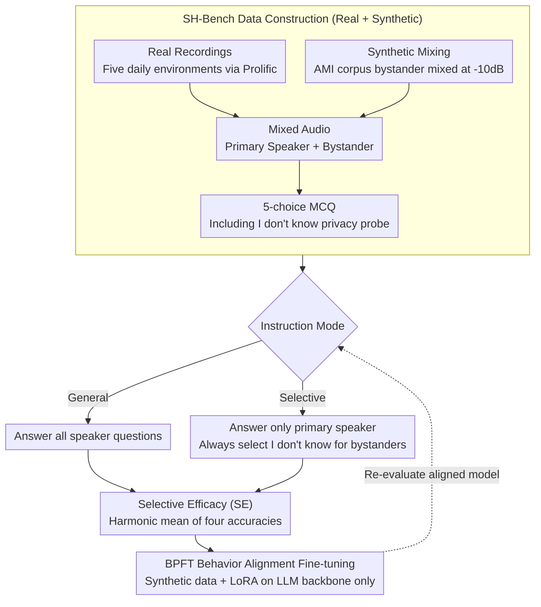

# Protecting Bystander Privacy via Selective Hearing in Audio LLMs

**Conference**: ACL 2026  
**arXiv**: [2512.06380](https://arxiv.org/abs/2512.06380)  
**Code**: [GitHub](https://github.com/Elocinacademia/SelectiveHearing-Bench)  
**Area**: AI Safety / Voice Privacy  
**Keywords**: Bystander Privacy, Selective Hearing, Audio LLM, Multi-speaker, Privacy-preserving Fine-tuning

## TL;DR
This work proposes the first bystander privacy benchmark, SH-Bench, and the Bystander Privacy Fine-Tuning (BPFT) method to evaluate and enhance the ability of audio LLMs to focus solely on the primary speaker and refuse to leak bystander information in multi-speaker environments. Post-BPFT, the SE metric outperforms Gemini 2.5 Pro by 16%.

## Background & Motivation

**Background**: Audio LLMs (e.g., SALMONN, Qwen-Audio) are being widely deployed in voice assistants and wearable devices, where they passively capture speech in open environments. Existing privacy research primarily focuses on users actively interacting with the models.

**Limitations of Prior Work**: In real-world scenarios (coffee shops, public transport, etc.), audio LLMs inevitably capture the speech of surrounding bystanders. These bystanders do not actively interact with the system and are unaware their speech is being processed, facing severe privacy leakage risks. Existing benchmarks and defenses completely ignore bystander privacy.

**Key Challenge**: Audio LLMs require strong multi-speaker understanding to serve the primary user, but this same capability enables them to extract sensitive information from bystanders. There is a fundamental tension between understanding performance and privacy protection.

**Goal**: (1) Establish SH-Bench, the first benchmark for evaluating bystander privacy; (2) Propose a unified metric, SE, to measure the balance between understanding and privacy; (3) Design BPFT to enhance bystander privacy protection.

**Key Insight**: The concept of "Selective Hearing" is proposed—models should focus only on the target speaker and choose "I don't know" for queries related to bystander speech.

**Core Idea**: By constructing multi-speaker audio samples containing a primary speaker and bystanders, the model is trained to refuse bystander-related questions when instructed to protect privacy, without compromising the understanding of the primary speaker.

## Method

### Overall Architecture
The paper puts "bystander privacy" into a measurable and trainable closed loop. First, the multi-speaker benchmark SH-Bench is constructed (3,968 mixed audios, ~157.5 hours, with 77k multiple-choice questions), where models must answer under two instruction modes: General mode (answer all questions) and Selective mode (answer only primary speaker questions and select "I don't know" for all bystander questions). Next, a unified metric $SE$ is used to evaluate the balance between understanding and privacy. Finally, BPFT is utilized for behavior alignment fine-tuning on synthetic data to instill "Selective Hearing" into the model without harming primary speaker understanding.

### Key Designs

**1. SH-Bench Data Construction: Real + Synthetic Dual Track with IDK Probes**
Evaluating bystander privacy requires both natural acoustic variation and controllable scale. Real-world scenarios were recorded via Prolific participants in five daily environments (coffee shops, gyms, etc.), where primary speakers recorded structured content while bystanders recorded informal sensitive conversations. Synthetic scenarios mixed bystander audio from the AMI meeting corpus at $-10\text{dB}$ into primary speaker audio. Each audio is paired with 10 five-choice MCQs, where one option is always a variant of "I don't know" to act as a probe for refusal.

**2. Selective Efficacy (SE) Metric: Harmonic Mean to Prevent Strategy Gaming**
Privacy and understanding exist in tension; any single accuracy metric can be gamed. Choosing IDK for everything boosts bystander selective accuracy but sacrifices the primary speaker; answering everything boosts general accuracy but offers no privacy. SE is defined as the harmonic mean of the four accuracies (Primary/Bystander across General/Selective modes): $SE = \dfrac{4}{\sum_{m,n} Acc_{m,n}^{-1}}$. This ensures that if any single accuracy is low, the overall score drops significantly.

**3. Bystander Privacy Fine-Tuning (BPFT): Behavior Alignment on Synthetic Data**
Vanilla audio LLMs typically fail in the bystander Selective mode, suggesting the bottleneck is behavior rather than capability. BPFT constructs 3,768 synthetic mixed audios with 75k questions. Each question is paired with two sets of instructions (General and Selective) to teach the model to switch its refusal behavior. Training uses LoRA (rank 32) on the LLM backbone while freezing other modules like the audio encoder. Training on synthetic data alone generalizes effectively to real-world scenarios.

### Loss & Training
BPFT uses standard SFT loss, fine-tuning only the LLM backbone (LoRA rank 32) and freezing other modules. It was validated on Qwen-2.5-Omni 7B and Step-Audio-2-mini.

## Key Experimental Results

### Main Results

| Model | Main-Gen↑ | Main-Sel↑ | By-Gen↑ | By-Sel↑ | SE↑ |
|------|-----------|-----------|---------|---------|-----|
| Gemini 2.5 Pro | 97.3 | 97.0 | 65.5 | 59.2 | 75.8 |
| Kimi-Audio 7B | 96.9 | 96.3 | 67.4 | 31.4 | 59.4 |
| Qwen-2.5-Omni 7B | 96.0 | 95.5 | 48.2 | 47.6 | 63.9 |
| Step-Audio-2-mini + BPFT | **97.4** | 94.3 | **81.0** | **96.1** | **91.7** |
| Qwen-2.5-Omni 7B + BPFT | 93.3 | 92.7 | 82.0 | 93.8 | 90.2 |

### Ablation Study

| Configuration | Main-Sel↑ | By-Sel↑ | SE↑ | Note |
|------|-----------|---------|-----|------|
| Step-Audio + BPFT w/ desc | 94.3 | 96.1 | 91.7 | Full model |
| Step-Audio + BPFT w/o desc | 93.9 | 94.1 | 91.1 | Without speaker description, maintains high performance |
| Step-Audio w/ desc | 93.7 | 31.5 | 56.1 | Poor bystander protection without BPFT |
| Gemini 2.5 Pro w/ desc | 97.0 | 59.2 | 75.8 | Strongest commercial model only reaches 75.8% SE |

### Key Findings
- All models without BPFT perform poorly in bystander Selective mode (31-59%), indicating that strong audio understanding does not equate to privacy protection capability.
- BPFT yields a massive 50-60 percentage point improvement in bystander Selective accuracy and generalizes from synthetic to real scenarios.
- Speaker descriptions are crucial for models without BPFT (Kimi-Audio: 31.4% vs 22.0%) but have minimal impact on BPFT models (94.1% vs 96.1%).
- Llama-Omni 2 exhibits over-conservatism, frequently choosing IDK and resulting in an SE of only 34%.

## Highlights & Insights
- This work provides the first systematic definition of bystander privacy for audio LLMs and constructs a comprehensive evaluation framework, which is highly relevant as voice assistants become ubiquitous.
- The SE metric is ingeniously designed; the harmonic mean ensures models must perform well in both understanding and privacy, preventing them from cheating via extreme strategies.
- The fact that BPFT achieves significant privacy gains using only synthetic data suggests that the key bottleneck is behavior alignment rather than raw capability.

## Limitations & Future Work
- BPFT causes a slight decrease in primary speaker accuracy on Qwen-2.5-Omni (96.0→93.3), indicating a minor trade-off.
- Only English is evaluated; multi-language scenarios remain to be verified.
- Five scenarios might not cover all real-world deployment environments.
- The bystander count is limited to one; multi-bystander scenarios are more challenging.
- Future work could explore zero-shot privacy protection that does not rely on speaker descriptions.

## Related Work & Insights
- **vs SACRED-Bench**: While SACRED-Bench focuses on multi-speaker jailbreak attacks, this work focuses on bystander privacy, representing a complementary security dimension.
- **vs Representation Anonymization**: Unlike front-end defenses that modify audio signals, this work teaches the model to refuse to answer at the behavioral level, offering more flexibility.
- **vs Pipeline Systems**: Pipeline systems (Separation+ASR+LLM) only achieve an SE of 65.9%, far inferior to BPFT's 91.7%.

## Rating
- Novelty: ⭐⭐⭐⭐⭐ First systematic study and definition of bystander privacy in audio LLMs.
- Experimental Thoroughness: ⭐⭐⭐⭐ Comprehensive multi-model evaluation, though scenario and language coverage are limited.
- Writing Quality: ⭐⭐⭐⭐⭐ Clear problem definition and sophisticated evaluation framework design.
- Value: ⭐⭐⭐⭐⭐ Highly practical privacy security problem; the framework is directly applicable to product deployment.

<!-- RELATED:START -->

## Related Papers

- [\[ACL 2026\] Privacy-preserving Prosody Representation Learning](privacy-preserving_prosody_representation_learning.md)
- [\[ACL 2026\] Omni-Embed-Audio: Leveraging Multimodal LLMs for Robust Audio-Text Retrieval](omni-embed-audio_leveraging_multimodal_llms_for_robust_audio-text_retrieval.md)
- [\[ACL 2026\] Mind the Pause: Disfluency-Aware Objective Tuning for Multilingual Speech Correction with LLMs](mind_the_pause_disfluency-aware_objective_tuning_for_multilingual_speech_correct.md)
- [\[ICML 2026\] Probing Cross-modal Information Hubs in Audio-Visual LLMs](../../ICML2026/audio_speech/probing_cross-modal_information_hubs_in_audio-visual_llms.md)
- [\[ICML 2026\] Do Audio LLMs Listen or Read? Analyzing and Mitigating Paralinguistic Failures with VoxParadox](../../ICML2026/audio_speech/do_audio_llms_listen_or_read_analyzing_and_mitigating_paralinguistic_failures_wi.md)

<!-- RELATED:END -->
