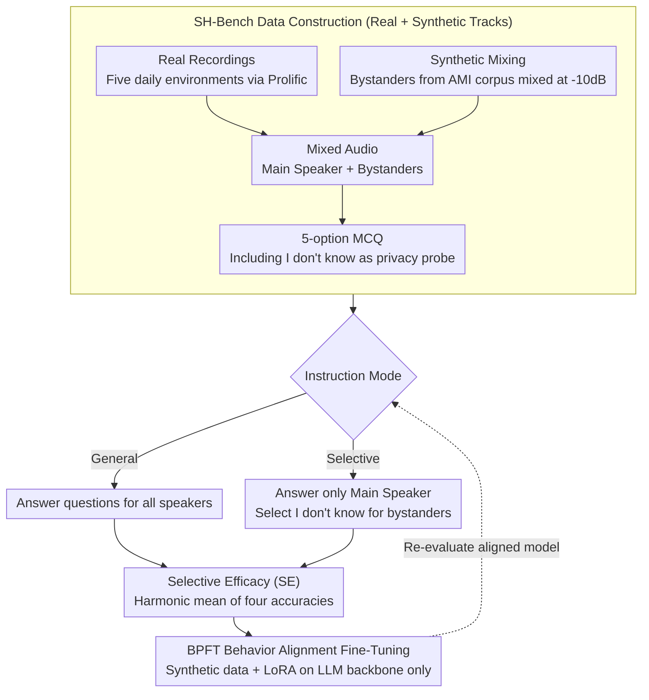

# Protecting Bystander Privacy via Selective Hearing in Audio LLMs

**Conference**: ACL 2026  
**arXiv**: [2512.06380](https://arxiv.org/abs/2512.06380)  
**Code**: [GitHub](https://github.com/Elocinacademia/SelectiveHearing-Bench)  
**Area**: AI Safety / Audio Privacy  
**Keywords**: Bystander Privacy, Selective Hearing, Audio LLM, Multi-speaker, Privacy-preserving Fine-tuning

## TL;DR
This paper proposes the first bystander privacy benchmark, SH-Bench, and a Bystander Privacy Fine-Tuning (BPFT) method to evaluate and enhance the capability of audio LLMs to focus solely on the primary speaker and refuse to leak bystander information in multi-speaker environments. After BPFT, the SE metric improves by 16% compared to Gemini 2.5 Pro.

## Background & Motivation

**Background**: Audio LLMs (e.g., SALMONN, Qwen-Audio) are being widely deployed in voice assistants and wearable devices, where they passively capture speech in open environments. Existing privacy research primarily focuses on users who actively interact with the models.

**Limitations of Prior Work**: In real-world scenarios (cafes, public transit, etc.), audio LLMs inevitably capture the speech of surrounding bystanders. These bystanders do not actively interact with the system and are unaware that their speech is being processed, leading to severe privacy leakage risks. Existing benchmarks and defense mechanisms completely overlook bystander privacy.

**Key Challenge**: Audio LLMs require robust multi-speaker understanding to serve the primary user, yet this capability simultaneously enables them to extract sensitive information from bystanders. There is a fundamental tension between understanding performance and privacy protection.

**Goal**: (1) Establish SH-Bench, the first benchmark for evaluating bystander privacy; (2) Propose a unified metric, SE, to measure the balance between understanding and privacy protection; (3) Design the BPFT method to enhance bystander privacy.

**Key Insight**: The concept of "Selective Hearing" is introduced—the model should focus only on the target speaker and respond with "I don't know" to queries related to bystander speech.

**Core Idea**: By constructing multi-speaker audio samples containing both a primary speaker and bystanders, the model is trained to refuse bystander-related questions when instructed to protect privacy, without compromising the understanding of the primary speaker.

## Method

### Overall Architecture
The paper integrates "bystander privacy" into an evaluable and trainable closed loop. First, it constructs the multi-speaker benchmark SH-Bench (3,968 mixed audios, approximately 157.5 hours, with 77k five-option multiple-choice questions). The model is evaluated under two instruction modes: General mode (answer all questions) and Selective mode (answer only primary speaker questions and select "I don't know" for all bystander questions). A unified metric, SE, is used to constrain both "understanding capability" and "privacy protection" to prevent the model from gaming the score using extreme strategies. Finally, BPFT is applied for behavior alignment fine-tuning on synthetic data to instill "selective hearing" into the model without harming primary speaker understanding.

### Key Designs

**1. SH-Bench Data Construction: Dual Tracks (Real + Synthetic) with IDK Probes**
Evaluating bystander privacy requires both natural acoustic variation and controllable scale. Real-world scenarios were captured by recruiting participants via Prolific to record in five daily environments (e.g., cafes, gyms, public transit), where the primary speaker recorded structured content and bystanders recorded informal sensitive conversations. Synthetic scenarios were based on the AMI meeting corpus, mixing bystander audio at $-10\text{dB}$ to simulate background voices. Each audio is paired with 10 MCQs, always including an "I don't know" variant as a probe to test the model's willingness to refuse bystander-related questions.

**2. Selective Efficacy (SE) Metric: Harmonic Mean to Prevent Strategy Exploitation**
There is a trade-off between understanding and privacy. Any single accuracy metric can be cheated: selecting IDK for everything boosts bystander performance in Selective mode but sacrifices the main speaker's results. SE is therefore defined as the harmonic mean of four accuracies (Main Speaker and Bystander across General and Selective modes): $SE = \dfrac{4}{\sum_{m,n} Acc_{m,n}^{-1}}$. If any single metric is low, the overall SE score collapses, forcing the model to perform well across all dimensions.

**3. Bystander Privacy Fine-Tuning (BPFT): Behavior Alignment on Synthetic Data**
Vanilla audio LLMs typically fail in bystander Selective mode; the bottleneck is behavior alignment rather than capability. BPFT utilizes 3,768 synthetic mixed audios with 75k questions. For each question, two sets of instructions (General and Selective) are provided to teach the model to switch its refusal behavior based on the instruction. Training applies LoRA (rank 32) only to the LLM backbone while freezing other modules like the audio encoder. Training on synthetic data alone generalizes effectively to real-world scenarios.

### Loss & Training
BPFT uses standard SFT loss, fine-tuning only the LLM backbone (LoRA rank 32) and freezing other modules. It was validated on Qwen-2.5-Omni 7B and Step-Audio-2-mini.

## Key Experimental Results

### Main Results

| Model | Main-Gen↑ | Main-Sel↑ | By-Gen↑ | By-Sel↑ | SE↑ |
|------|-----------|-----------|---------|---------|-----|
| Gemini 2.5 Pro | 97.3 | 97.0 | 65.5 | 59.2 | 75.8 |
| Kimi-Audio 7B | 96.9 | 96.3 | 67.4 | 31.4 | 59.4 |
| Qwen-2.5-Omni 7B | 96.0 | 95.5 | 48.2 | 47.6 | 63.9 |
| Step-Audio-2-mini + BPFT | **97.4** | 94.3 | **81.0** | **96.1** | **91.7** |
| Qwen-2.5-Omni 7B + BPFT | 93.3 | 92.7 | 82.0 | 93.8 | 90.2 |

### Ablation Study

| Configuration | Main-Sel↑ | By-Sel↑ | SE↑ | Description |
|------|-----------|---------|-----|------|
| Step-Audio + BPFT w/ desc | 94.3 | 96.1 | 91.7 | Full model |
| Step-Audio + BPFT w/o desc | 93.9 | 94.1 | 91.1 | High performance remains without speaker description |
| Step-Audio w/ desc | 93.7 | 31.5 | 56.1 | Poor bystander protection without BPFT |
| Gemini 2.5 Pro w/ desc | 97.0 | 59.2 | 75.8 | Strongest commercial model achieves only 75.8% SE |

### Key Findings
- All models without BPFT perform poorly in bystander Selective mode (31-59%), indicating that strong audio understanding does not equate to privacy protection capability.
- BPFT leads to a massive improvement of 50-60 percentage points in bystander Selective accuracy and generalizes to real scenarios using only synthetic training data.
- Speaker descriptions are critical for non-BPFT models (Kimi-Audio: 31.4% vs. 22.0%) but have minimal impact on BPFT models (94.1% vs. 96.1%).
- Llama-Omni 2 exhibits over-conservatism, frequently choosing IDK, resulting in an SE of only 34%.

## Highlights & Insights
- This is the first work to systematically propose and define the bystander privacy problem for audio LLMs and construct a complete evaluation framework. This issue is highly relevant given the widespread deployment of voice assistants.
- The design of the SE metric is ingenious; the harmonic mean ensures that models must balance understanding and privacy, preventing deception through extreme strategies.
- BPFT significantly improves privacy protection using only synthetic data, suggesting that the bottleneck for current models is behavior alignment rather than underlying capability.

## Limitations & Future Work
- BPFT causes a slight decline in main speaker accuracy on Qwen-2.5-Omni (96.0→93.3), indicating a performance trade-off.
- Only English was evaluated; multi-lingual scenarios remain to be verified.
- Five scenarios may not cover all real-world deployment environments.
- Bystanders were limited to a single person; multi-bystander scenarios present a greater challenge.
- Future work could explore zero-shot privacy protection that does not rely on speaker descriptions.

## Related Work & Insights
- **vs. SACRED-Bench**: While SACRED-Bench focuses on multi-speaker jailbreak attacks, this paper focuses on bystander privacy, representing a complementary security dimension.
- **vs. Representation-level Anonymization**: Unlike front-end defenses that modify audio signals, this work teaches the model to refuse to answer at the behavioral level, offering greater flexibility.
- **vs. Pipeline Systems**: Pipeline systems (Source Separation + ASR + LLM) achieve an SE of only 65.9%, significantly underperforming compared to the 91.7% achieved by BPFT.

## Rating
- Novelty: ⭐⭐⭐⭐⭐ First systematic study and definition of bystander privacy in audio LLMs.
- Experimental Thoroughness: ⭐⭐⭐⭐ Comprehensive multi-model evaluation, though scene and language coverage are limited.
- Writing Quality: ⭐⭐⭐⭐⭐ Clear problem definition and well-designed evaluation framework.
- Value: ⭐⭐⭐⭐⭐ Highly practical privacy and security issue; the framework is directly applicable to product deployment.

<!-- RELATED:START -->

## Related Papers

- [\[ACL 2026\] Privacy-preserving Prosody Representation Learning](privacy-preserving_prosody_representation_learning.md)
- [\[ACL 2026\] Omni-Embed-Audio: Leveraging Multimodal LLMs for Robust Audio-Text Retrieval](omni-embed-audio_leveraging_multimodal_llms_for_robust_audio-text_retrieval.md)
- [\[ACL 2026\] Phun-Bench: Evaluating LLMs on Phonological Understanding in Chinese](phun-bench_evaluating_llms_on_phonological_understanding_in_chinese.md)
- [\[ICML 2026\] Do Audio LLMs Listen or Read? Analyzing and Mitigating Paralinguistic Failures with VoxParadox](../../ICML2026/audio_speech/do_audio_llms_listen_or_read_analyzing_and_mitigating_paralinguistic_failures_wi.md)
- [\[ACL 2026\] Mind the Pause: Disfluency-Aware Objective Tuning for Multilingual Speech Correction with LLMs](mind_the_pause_disfluency-aware_objective_tuning_for_multilingual_speech_correct.md)

<!-- RELATED:END -->
