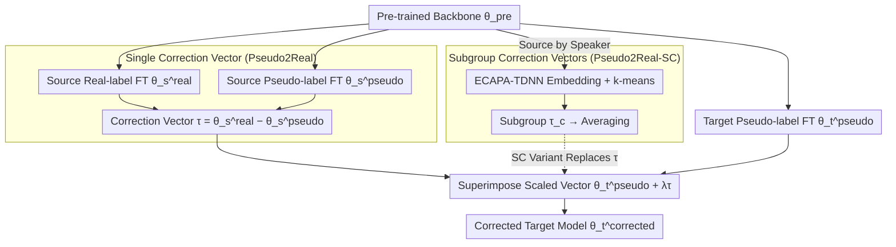

# Pseudo2Real: Task Arithmetic for Pseudo-Label Correction in Automatic Speech Recognition

**Conference**: ACL 2026 Findings  
**arXiv**: [2510.08047](https://arxiv.org/abs/2510.08047)  
**Code**: None  
**Area**: Speech Processing / Domain Adaptation  
**Keywords**: Pseudo-Label Correction, Task Arithmetic, Parameter Space Correction, Accent Adaptation, Whisper

## TL;DR

This paper proposes Pseudo2Real, a parameter space correction method that calculates a "correction vector" by computing the weight difference between a real-label model and a pseudo-label model in the source domain. This vector is then applied to a target domain model fine-tuned on pseudo-labels to rectify systematic pseudo-label biases, achieving up to a 35% relative Word Error Rate (WER) reduction across ten African accents in the AfriSpeech-200 dataset.

## Background & Motivation

**Background**: ASR systems often face a scarcity of annotated data when encountering new domains (e.g., new accents). Pseudo-labeling—using a teacher model to generate labels—is a common domain adaptation strategy; however, pseudo-labels inherit systematic biases from the teacher model.

**Limitations of Prior Work**: (1) Confidence filtering and consistency checks can only suppress noise but cannot correct structured bias patterns; (2) Iterative self-training (such as Noisy Student) requires multiple training rounds and still propagates repetitive errors from the teacher; (3) Weight-space methods like Exponential Moving Average (EMA) average training trajectories and are not specifically targeted at pseudo-label bias.

**Key Challenge**: When the target domain lacks ground-truth annotations, how can one identify and correct systematic error patterns within the pseudo-labels?

**Goal**: Design a reusable parameter space correction method that can rectify pseudo-label bias without requiring target domain labels.

**Key Insight**: Based on Linear Mode Connectivity—models fine-tuned from the same pre-trained starting point reside in a shared low-loss region, meaning weight differences can be interpreted as meaningful directions rather than random noise.

**Core Idea**: The weight difference between the real-label model and the pseudo-label model in the source domain captures the direction of pseudo-label bias. Adding the scaled correction vector to the target domain pseudo-label model corrects the bias.

## Method

### Overall Architecture

The philosophy of Pseudo2Real is to move "pseudo-label noise" from the sample space to the parameter space for processing. Since a source domain with ground-truth labels allows for the simultaneous training of a "real-label model" and a "pseudo-label model," their weight difference characterizes the systematic bias introduced by pseudo-labels. This direction can then be transferred to correct an unlabeled target domain. Specifically, starting from the same pre-trained backbone $\theta^{\text{pre}}$, the source domain is fine-tuned using real labels and pseudo-labels to obtain $\theta_s^{\text{real}}$ and $\theta_s^{\text{pseudo}}$, respectively. Subtracting them yields the correction vector $\tau = \theta_s^{\text{real}} - \theta_s^{\text{pseudo}}$. The target domain, which only has pseudo-labels, is fine-tuned to obtain $\theta_t^{\text{pseudo}}$, and the final model is generated by adding the scaled correction vector: $\theta_t^{\text{corrected}} = \theta_t^{\text{pseudo}} + \lambda\tau$. This entire process requires no target domain ground-truth and eliminates the need for iterative training. The SC (Speaker Clustering) variant refines a single correction vector into multiple subgroup vectors based on speaker clustering, which are then averaged.

### Key Designs

**1. Single Correction Vector (Pseudo2Real): Parameterizing "Pseudo→Real" as a Transferable Direction**

While confidence filtering and consistency checks only suppress noise, they cannot address structural bias patterns. The key observation of Pseudo2Real is that the correction vector $\tau = \theta_s^{\text{real}} - \theta_s^{\text{pseudo}}$ precisely encodes the parameter space direction "from pseudo-labeled results toward ground-truth results." Adding this scaled vector to the target domain pseudo-label model completes the cross-domain correction. This subtraction is meaningful because models fine-tuned from the same pre-trained starting point fall within a shared low-loss region (Linear Mode Connectivity), ensuring weight differences represent structured directions rather than random noise. The task arithmetic framework further guarantees that such directions can be scaled, combined, and transferred.

**2. Subgroup Correction Vector (Pseudo2Real-SC): Finer-grained Correction via Speaker Grouping**

Pseudo-label quality varies based on accents, pronunciation habits, and recording conditions; a global correction vector may smooth over these nuances. The SC variant first extracts speaker embeddings using ECAPA-TDNN and performs k-means clustering. A correction vector $\tau_c$ is estimated separately for each subgroup, and the final model is defined as $\theta_t^{\text{corrected}} = \theta_t^{\text{pseudo}} + \frac{\lambda}{C}\sum_{c=1}^{C}\tau_c$. Since clustering relies solely on acoustic embeddings and requires no domain labels, it is fully automated yet manages to capture fine-grained biases that a unified vector might lose.

### Loss & Training

The fine-tuning stage employs standard ASR loss across five Whisper model scales: tiny, base, small, medium, and large-v2. The correction stage only requires tuning a single hyperparameter, the scaling coefficient $\lambda$.

## Key Experimental Results

The evaluation is designed to be challenging: the 10 most frequent accents in AfriSpeech-200 are split into two folds based on language families (spanning Niger-Congo, Afro-Asiatic, and Indo-European). These folds alternately serve as source and target domains for mutual correction to test whether the correction direction can transfer between significantly different domains.

### Main Results

**AfriSpeech-200 WER Comparison (Whisper tiny, Average of 10 Accents)**

| Method | Avg WER |
|------|---------|
| Pre-trained $\theta^{\text{pre}}$ | 106.5 |
| Source Real $\theta_s^{\text{real}}$ | 88.2 |
| Pseudo-label $\theta_t^{\text{pseudo}}$ | 89.3 |
| Confidence Filtering | 88.7 |
| Error Correction (EC) | — |
| **Pseudo2Real** | **~58** |
| **Pseudo2Real-SC** | **~55** |

### Ablation Study

**Correction Performance Across Different Model Scales**

| Whisper Scale | Pseudo-label WER | +Pseudo2Real WER | Relative Reduction |
|-------------|-----------|-----------------|---------|
| tiny (39M) | 89.3 | ~58 | ~35% |
| base (74M) | — | — | Consistent Improvement |
| large-v2 (1.55B) | — | — | Reduced Gains |

### Key Findings

- Pseudo2Real achieves up to a 35% relative WER reduction on Whisper tiny.
- Subgroup Clustering (SC) further enhances performance, proving that pseudo-label bias indeed varies by speaker.
- Correction vectors are most effective on small models; larger models possess stronger inherent error-correction capabilities.
- The method is consistently effective across all 10 accents, even when transferring across different language families.
- The optimal value for $\lambda$ typically falls between 0.5 and 1.0, and the method is relatively insensitive to this choice.

## Highlights & Insights

- The method is extremely simple—requiring only one vector subtraction and one vector addition, with no need for iterative training.
- The insight that "pseudo-label bias can be parameterized" holds theoretical value, as it shifts the handling of label noise from the sample space to the parameter space.
- The approach is orthogonal to and can be combined with existing methods such as confidence filtering and iterative self-training.

## Limitations & Future Work

- It requires the source domain to have both real and pseudo labels, which limits its applicability in scenarios with no labeled data at all.
- The correction vector assumes that pseudo-label bias patterns are similar between the source and target domains; it may fail when domains are highly divergent.
- Evaluations were limited to accent adaptation; performance in other scenarios like noisy environments or far-field speech has not been verified.
- The Linear Mode Connectivity assumption may not hold under extreme domain shifts.

## Related Work & Insights

- **vs SYN2REAL (Su et al., 2024)**: While the latter corrects the acoustic gap between synthetic and real speech, this work corrects the annotation gap between real and pseudo labels—addressing a different dimension of the problem.
- **vs Noisy Student**: Noisy Student requires multiple rounds of iterative training, whereas this method requires only a single vector operation.
- **vs EMA**: EMA smoothes training trajectories but is not targeted at pseudo-label bias; this work explicitly captures the "pseudo-to-real" direction.

## Rating

- Novelty: ⭐⭐⭐⭐ Innovative perspective applying task arithmetic to pseudo-label correction.
- Experimental Thoroughness: ⭐⭐⭐⭐ 10 accents × 5 model scales × 6 baselines + clustering ablation.
- Writing Quality: ⭐⭐⭐⭐ Clear methodological intuition and rigorous experimental design.
- Value: ⭐⭐⭐⭐ Simple and effective, capable of being combined with existing pseudo-labeling methods.

<!-- RELATED:START -->

## Related Papers

- [\[ACL 2026\] \[b\] = \[d\] − \[t\] + \[p\]: Self-supervised Speech Models Discover Phonological Vector Arithmetic](bd-tp_self-supervised_speech_models_discover_phonological_vector_arithmetic.md)
- [\[ICLR 2026\] Pay Attention to CTC: Fast and Robust Pseudo-Labelling for Unified Speech Recognition](../../ICLR2026/audio_speech/pay_attention_to_ctc_fast_and_robust_pseudo-labelling_for_unified_speech_recogni.md)
- [\[ICLR 2026\] Automatic Stage Lighting Control: Is it a Rule-Driven Process or Generative Task?](../../ICLR2026/audio_speech/automatic_stage_lighting_control_is_it_a_rule-driven_process_or_generative_task.md)
- [\[ACL 2026\] Mind the Pause: Disfluency-Aware Objective Tuning for Multilingual Speech Correction with LLMs](mind_the_pause_disfluency-aware_objective_tuning_for_multilingual_speech_correct.md)
- [\[ACL 2026\] MCGA: A Multi-task Classical Chinese Literary Genre Audio Corpus](mcga_a_multi-task_classical_chinese_literary_genre_audio_corpus.md)

<!-- RELATED:END -->
