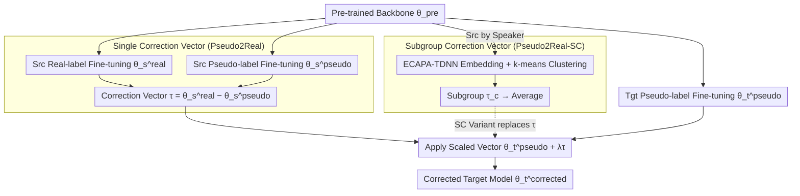

# Pseudo2Real: Task Arithmetic for Pseudo-Label Correction in Automatic Speech Recognition

**Conference**: ACL 2026 Findings  
**arXiv**: [2510.08047](https://arxiv.org/abs/2510.08047)  
**Code**: None  
**Area**: Speech Processing / Domain Adaptation  
**Keywords**: Pseudo-label Correction, Task Arithmetic, Parameter Space Correction, Accent Adaptation, Whisper

## TL;DR

This paper proposes Pseudo2Real, a parameter-space correction method that computes a "correction vector" by taking the weight difference between a real-label model and a pseudo-label model in a source domain. Applying this vector to a pseudo-label fine-tuned model in the target domain corrects systematic pseudo-labeling biases, achieving up to a 35% relative Word Error Rate (WER) reduction across ten African accents in AfriSpeech-200.

## Background & Motivation

**Background**: ASR systems face data scarcity when encountering new domains (e.g., new accents). Pseudo-labeling (using a teacher model to generate labels) is a common domain adaptation strategy, but pseudo-labels inherit the systematic biases of the teacher model.

**Limitations of Prior Work**: (1) Confidence filtering and consistency checks only suppress noise but cannot correct structured bias patterns; (2) Iterative self-training (e.g., Noisy Student) requires multiple training rounds and still propagates repetitive teacher errors; (3) Weight-space methods like EMA use training trajectory averages and do not target pseudo-label bias specifically.

**Key Challenge**: When the target domain lacks ground-truth labels, how can systematic error patterns in pseudo-labels be identified and corrected?

**Goal**: Design a reusable parameter-space correction method that corrects pseudo-label bias without requiring target domain labels.

**Key Insight**: Based on Linear Mode Connectivity—models fine-tuned from the same pre-trained starting point reside in a shared low-loss region, meaning weight differences can be interpreted as meaningful directions rather than noise.

**Core Idea**: The weight difference between a real-label model and a pseudo-label model in the source domain captures the direction of pseudo-label bias. Scaling and adding this correction vector to a target domain pseudo-label model effectively corrects those biases.

## Method

### Overall Architecture

The idea of Pseudo2Real is to transition "pseudo-label noise" from sample space to parameter space: since both a "real-label model" and a "pseudo-label model" can be trained on a source domain with ground truth, their weight difference characterizes the systematic bias direction introduced by pseudo-labels. This direction can then be migrated to correct an unlabeled target domain. Specifically, starting from the same pre-trained backbone $\theta^{\text{pre}}$, the source domain is fine-tuned with real and pseudo labels to obtain $\theta_s^{\text{real}}$ and $\theta_s^{\text{pseudo}}$, respectively. Subtracting them yields the correction vector $\tau = \theta_s^{\text{real}} - \theta_s^{\text{pseudo}}$. In the target domain where only pseudo-labels exist, a model is fine-tuned to get $\theta_t^{\text{pseudo}}$, which is then updated with the scaled correction vector: $\theta_t^{\text{corrected}} = \theta_t^{\text{pseudo}} + \lambda\tau$. This process requires no target domain ground truth or iterative training. The SC variant refines the single correction vector into multiple subgroup vectors via speaker clustering before averaging.

### Key Designs

**1. Single Correction Vector (Pseudo2Real): Mapping "Pseudo→Real" bias as a transferable direction**

While confidence filtering and consistency checks only suppress noise, they fail to fix structured bias patterns. The key observation of Pseudo2Real is that the correction vector $\tau = \theta_s^{\text{real}} - \theta_s^{\text{pseudo}}$ encodes the parameter-space direction pointing from pseudo-label outcomes to real-label outcomes. Scaling and adding this vector to the target pseudo-label model completes cross-domain correction. This subtraction is meaningful because models fine-tuned from the same pre-trained starting point landing in a shared low-loss region (Linear Mode Connectivity) ensures the weight difference is a structured direction rather than random noise. The task arithmetic framework further guarantees that such directions can be scaled, combined, and transferred.

**2. Subgroup Correction Vector (Pseudo2Real-SC): Finer correction via speaker grouping**

Pseudo-label quality varies based on accents, pronunciation habits, and recording conditions; a global correction vector may smooth over these differences. The SC variant first extracts speaker embeddings using ECAPA-TDNN and performs k-means clustering. A correction vector $\tau_c$ is estimated for each subgroup, and the final model is $\theta_t^{\text{corrected}} = \theta_t^{\text{pseudo}} + \frac{\lambda}{C}\sum_{c=1}^{C}\tau_c$. Since clustering relies solely on acoustic embeddings and no domain labels, it is entirely automated and successfully captures fine-grained biases lost by a unified vector.

### Loss & Training

Standard ASR losses are used during the fine-tuning phase, covering five Whisper scales (tiny/base/small/medium/large-v2). During the correction phase, only the scaling coefficient $\lambda$ needs hyperparameter tuning.

## Key Experimental Results

The evaluation is intentionally challenging: the 10 accents with the most samples in AfriSpeech-200 are split into two folds by language family (spanning Niger-Congo, Afroasiatic, and Indo-European families). These folds alternate as source and target domains to test whether the correction direction can transfer between significantly different domains.

### Main Results

**AfriSpeech-200 WER Comparison (Whisper tiny, Avg. over 10 accents)**

| Method | Avg. WER |
|------|---------|
| Pre-trained $\theta^{\text{pre}}$ | 106.5 |
| Source Real $\theta_s^{\text{real}}$ | 88.2 |
| Pseudo-label $\theta_t^{\text{pseudo}}$ | 89.3 |
| Confidence Filtering | 88.7 |
| Error Correction (EC) | — |
| **Ours (Pseudo2Real)** | **~58** |
| **Ours (Pseudo2Real-SC)** | **~55** |

### Ablation Study

**Correction performance across model scales**

| Whisper Scale | Pseudo-label WER | +Pseudo2Real WER | Gain (Relative) |
|-------------|-----------|-----------------|---------|
| tiny (39M) | 89.3 | ~58 | ~35% |
| base (74M) | — | — | Consistent Gain |
| large-v2 (1.55B) | — | — | Reduced Gain |

### Key Findings

- Pseudo2Real achieves up to a 35% relative WER reduction on Whisper tiny.
- Subgroup clustering (SC) further improves results, indicating that pseudo-label bias indeed varies by speaker.
- The correction vector is most effective on smaller models; larger models possess stronger intrinsic error-correction capabilities.
- The method is consistently effective across all 10 accents, even when crossing different language families.
- The optimal value for $\lambda$ is between 0.5 and 1.0, and results are relatively insensitive to this choice.

## Highlights & Insights

- The method is extremely simple—requiring only one vector subtraction and one vector addition, avoiding iterative training.
- The insight that "pseudo-label bias can be parameterized" has theoretical value—shifting label noise processing from sample space to parameter space.
- It can be combined orthogonally with existing methods like confidence filtering or iterative self-training.

## Limitations & Future Work

- It requires the source domain to have both real and pseudo labels, which limits applicability in scenarios with zero annotations.
- The correction vector assumes similar pseudo-label bias patterns between source and target domains; it may fail for highly divergent domains.
- Evaluation was limited to accent adaptation; its effectiveness in other scenarios like noisy environments or far-field speech remains unverified.
- The Linear Mode Connectivity assumption might not hold under extreme domain shifts.

## Related Work & Insights

- **vs SYN2REAL (Su et al., 2024)**: The latter corrects the acoustic gap between synthetic and real speech, while Ours corrects the annotation gap between real and pseudo labels—different problem dimensions.
- **vs Noisy Student**: The latter requires multiple rounds of iterative training; Ours requires only a single vector operation.
- **vs EMA**: EMA smoothes training trajectories but does not target pseudo-label bias; Ours explicitly captures the "Pseudo-to-Real" direction.

## Rating

- Novelty: ⭐⭐⭐⭐ Innovative perspective applying task arithmetic to pseudo-label correction.
- Experimental Thoroughness: ⭐⭐⭐⭐ 10 accents × 5 model scales × 6 baselines + clustering ablation.
- Writing Quality: ⭐⭐⭐⭐ Clear methodological intuition and rigorous experimental design.
- Value: ⭐⭐⭐⭐ Simple yet effective, easily combinable with existing pseudo-labeling methods.

<!-- RELATED:START -->

## Related Papers

- [\[ACL 2026\] \[b\] = \[d\] − \[t\] + \[p\]: Self-supervised Speech Models Discover Phonological Vector Arithmetic](bd-tp_self-supervised_speech_models_discover_phonological_vector_arithmetic.md)
- [\[ICLR 2026\] Pay Attention to CTC: Fast and Robust Pseudo-Labelling for Unified Speech Recognition](../../ICLR2026/audio_speech/pay_attention_to_ctc_fast_and_robust_pseudo-labelling_for_unified_speech_recogni.md)
- [\[ACL 2026\] Mind the Pause: Disfluency-Aware Objective Tuning for Multilingual Speech Correction with LLMs](mind_the_pause_disfluency-aware_objective_tuning_for_multilingual_speech_correct.md)
- [\[ACL 2026\] MCGA: A Multi-task Classical Chinese Literary Genre Audio Corpus](mcga_a_multi-task_classical_chinese_literary_genre_audio_corpus.md)
- [\[ACL 2026\] Speech-Hands: A Self-Reflection Voice Agentic Approach to Speech Recognition and Audio Reasoning with Omni Perception](speech-hands_a_self-reflection_voice_agentic_approach_to_speech_recognition_and_.md)

<!-- RELATED:END -->
