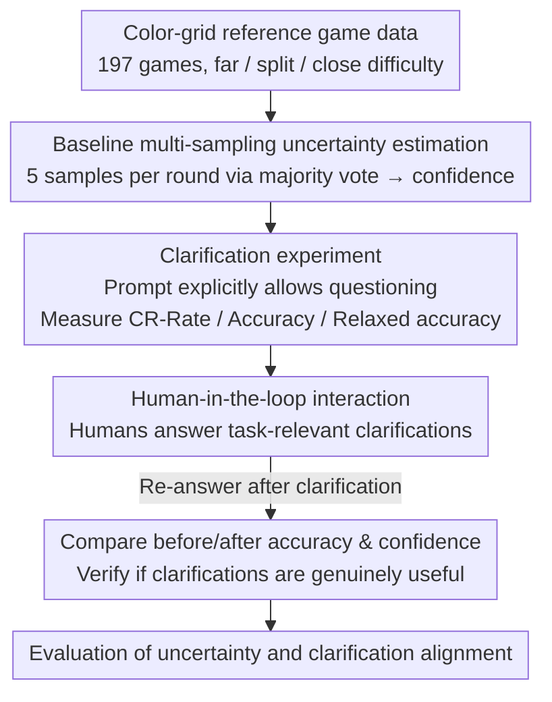

# Reference Games as a Testbed for the Alignment of Model Uncertainty and Clarification Requests

**Conference**: ACL2026  
**arXiv**: [2601.07820](https://arxiv.org/abs/2601.07820)  
**Code**: https://github.com/Manarali-bit/reference-games-clarification  
**Area**: Multimodal Interaction / VLM Uncertainty / Clarification Requests  
**Keywords**: reference game, clarification request, VLM calibration, pragmatic competence, uncertainty alignment  

## TL;DR
This paper employs color-grid reference games to examine whether VLMs can translate internal uncertainty into appropriate clarification requests. It finds that even in highly controlled tasks, Qwen2.5-VL and GPT-5-mini exhibit interactive gaps such as overconfidence, unstable clarification behavior, and low-quality clarification questions.

## Background & Motivation
**Background**: In human conversation, listeners are not passive receivers. When references are ambiguous, information is insufficient, or multiple candidates exist, listeners initiate repairs—such as asking clarification questions—to maintain mutual understanding.

**Limitations of Prior Work**: Language models and vision-language models can answer fluently but do not necessarily know when they are uncertain. Fluent output can mask comprehension failure, leading users to believe the model is confident; simultaneously, the confidence expressed through a model's language often mismatches its actual accuracy.

**Key Challenge**: It is difficult to define "when clarification is mandatory" in open-ended dialogues because user intent and the space of possible interpretations are not closed. Without explicit ground truth, judging whether a model should have asked a question is challenging.

**Goal**: To identify a controlled, closed, and quantifiable test scenario to evaluate whether a VLM as a listener can identify internal uncertainty and express it through appropriate clarification requests.

**Key Insight**: The authors choose reference games. This task features fixed candidate referents, clear targets, and difficulty conditions, allowing for direct assessment of whether the model selects the correct object and whether it should initiate questions for difficult samples.

**Core Idea**: To extend reference games from a "referential resolution test" to an "alignment test between model uncertainty and clarification behavior," evaluated through baseline confidence, CR-rate, relaxed accuracy, and human-AI interaction experiments.

## Method
The study utilizes a color-grid reference game: each round consists of three $3\times3$ color-grid blocks, where one is the target and two are distractors; a human speaker provides a description of the target, and the model (as a listener) must identify it. The authors design three experiments: the baseline requires the model to pick a target; the clarification experiment explicitly allows the model to ask questions when uncertain; and the interaction experiment involves humans answering the model's questions to verify if these clarifications are genuinely helpful.

### Overall Architecture
Data is derived from the color-grid reference game by McDowell and Goodman (2019), comprising 197 games with 60 rounds each. Samples are categorized into far, split, and close difficulty levels based on the color similarity between targets and distractors. The authors test Qwen2.5-VL-7B, Qwen2.5-VL-72B, and GPT-5-mini. The Qwen models were run on the full dataset (reporting results for a 500-round subset); GPT-5-mini was evaluated on a 500-round subset due to API costs, with 19 null answers excluded. The three experiments progress sequentially: first, baseline uncertainty is estimated per round; then, the model’s ability to ask appropriate questions is tested when permitted; finally, humans answer these clarifications to check for actual utility.

### Key Designs
**1. Baseline multi-sampling for uncertainty estimation: Using consistency signals as an interpretable "how sure am I" indicator**

A single output cannot distinguish whether a model is certain or guessing. Therefore, this study samples each round 5 times in the baseline experiment, using the majority vote as the final prediction. The proportion of the majority answer across these 5 samples is defined as the baseline confidence—taking values of $0.4, 0.6, 0.8, 1.0$. Although coarse, this consistency ratio provides a simple, interpretable proxy for uncertainty: if repeated sampling for the same description yields fluctuating answers, the model is internally uncertain. Alignment is then judged by checking if this confidence matches the actual task difficulty.

**2. Clarification experiment: Explicitly prompting "permission to ask" to observe usage and correctness**

Measuring accuracy alone does not reveal if a model knows it is uncertain. The study modifies the prompt to explicitly tell the model it can ask questions when uncertain, using three metrics to decompose its behavior: CR-Rate (proportion of clarification requests), Accuracy (correctness rate within non-clarification responses), and Relaxed accuracy (where both "correct answers" and "properly initiating a clarification" are considered acceptable). These metrics aim to identify whether a listener initiates questions more frequently on difficult, low-confidence samples while answering directly on high-confidence ones.

**3. Human-in-the-loop interaction: Human verification of clarification utility**

A high CR-rate only indicates a tendency to ask questions, not necessarily that the questions are effective—a model might simply say "please clarify" without identifying specific ambiguities. To address this, the authors had humans review 116 clarification requests generated by Qwen2.5-VL-72B to label them as task-relevant. Humans provided answers for relevant questions and rewrote the original descriptions for irrelevant ones. The model then re-answered based on the clarified dialogue. This step separates "asking a question" from "asking a useful question"—if accuracy does not improve after clarification, the questions failed to narrow down the candidate space.

### Loss & Training
This study is an evaluation research and does not involve model training. The key "strategy" is the experimental protocol: the baseline uses majority voting from 5 samples to estimate confidence; the clarification phase uses 1 sample to parse for questions; and the interaction phase involves expert human responses followed by a re-evaluation of Qwen2.5-VL-72B.

## Key Experimental Results

### Main Results

| Model | Baseline Accuracy | Baseline Confidence | CR-Rate | Clarification Accuracy | Relaxed Accuracy |
|------|-------------------|---------------------|---------|-------------------------|------------------|
| Qwen2.5-VL-7B | 0.53 (0.52 full) | 0.88 (0.87 full) | 0.0 (0.002 full) | 0.46 (0.42 full) | 0.46 (0.42 full) |
| Qwen2.5-VL-72B | 0.77 (0.71 full) | 0.91 (0.92 full) | 0.24 (0.24 full) | 0.73 (0.71 full) | 0.80 (0.78 full) |
| GPT-5-mini | 0.91 | 0.99 | 0.13 | 0.94 | 0.94 |
| Human | 0.92 full | N/A | N/A | N/A | N/A |

### Difficulty Conditions Results

| Model / Condition | Baseline Accuracy | CR-Rate | Relaxed Accuracy | Phenomenon |
|-------------|-------------------|---------|------------------|------|
| GPT-5-mini close | 0.87 | 0.17 | 0.92 | Frequent questions in difficult conditions |
| GPT-5-mini far | 0.98 | 0.06 | 0.99 | Fewer questions in simple conditions |
| Qwen2.5-VL-72B close | 0.68 (0.65 full) | 0.24 (0.23 full) | 0.71 (0.73 full) | CR-rate does not significantly change with difficulty |
| Qwen2.5-VL-7B ALL | 0.53 (0.52 full) | 0.0 (0.002 full) | 0.46 (0.42 full) | Almost never asks questions |

### Interaction Experiments

| Setting | Before Accuracy | After Accuracy | Before Confidence | After Confidence | Conclusion |
|------|-----------------|----------------|-------------------|------------------|------|
| Qwen-72B CR-only ALL | 0.776 | 0.741 | 0.871 | 0.902 | Accuracy decreased by 0.035 after human answers |
| Qwen-72B full ALL | 0.767 | 0.759 | 0.914 | 0.921 | Accuracy slightly decreased (0.008), confidence slightly increased |
| Qwen-72B CR quality | 42% task-relevant | 58% not task-relevant | - | - | Most clarification questions failed to capture task-relevant ambiguities |

### Key Findings
- GPT-5-mini's clarification behavior most closely resembles a rational pattern: higher CR-rate in difficult conditions and an increase in non-clarification accuracy from 0.91 to 0.94.
- Qwen2.5-VL-72B asks questions, but its frequency is poorly aligned with task difficulty and internal uncertainty.
- Qwen2.5-VL-7B rarely asks questions, suggesting that "permission to ask" is insufficient to induce clarification behavior in smaller models.
- Interaction experiments show that clarification requests must be specific and task-relevant to be valuable; generic template-like questions may increase confidence but do not improve accuracy.

## Highlights & Insights
- The contribution lies in the evaluation scenario design rather than a new model. Reference games transform "when to clarify" from a vague dialogue issue into a measurable problem, ideal for assessing pragmatic competence.
- Relaxed accuracy is a useful metric: it acknowledges that "asking when uncertain" is a successful interactive behavior, rather than only rewarding direct answers.
- The manual analysis showing only 42% task-relevance is critical, indicating that simply counting CR-rate overestimates model capability. The real challenge is formulating questions that effectively narrow down the candidate space.

## Limitations & Future Work
- Human data comes from 60-round interaction dyads where participants build common ground; VLMs only see initial descriptions, placing them at a potential disadvantage in comparison.
- Baseline confidence is based on diversity sampling, which might not equate to the model's internal probabilistic uncertainty. The authors also note that even with information-theoretic uncertainty estimates for Qwen-72B, clarification behavior remains poorly aligned.
- Some human speaker descriptions in the data may be flawed; baseline errors are not exclusively the fault of the listener model.
- Future work could extend to multi-turn reference games where models build mutual understanding through clarification rather than just the first round.

## Related Work & Insights
- **vs. Open-ended clarification research**: It is difficult to judge when clarification is needed in open dialogues; the closed set in reference games allows for a cleaner definition of clarification needs.
- **vs. Uncertainty quantification**: While entropy or sampling consistency can measure uncertainty, this paper asks whether models can translate that uncertainty into interactive behavior.
- **vs. Referential resolution benchmarks**: Traditional reference games focus on picking the right target; this paper extends it to evaluate the interactive quality of "choosing or questioning."
- **Insight**: When evaluating dialogue models, "knowing when to appropriately refuse, counter-question, or clarify" should be included in task success metrics, rather than just one-shot accuracy.

## Rating
- Novelty: ⭐⭐⭐⭐☆ Using reference games for uncertainty-clarification alignment testing is inspired; the problem definition is excellent despite the simple method.
- Experimental Thoroughness: ⭐⭐⭐⭐☆ Covers three models, three difficulty levels, and human-AI interaction; could still expand model scales and task types.
- Writing Quality: ⭐⭐⭐⭐☆ Arguments are clear, metrics are intuitive, and discussions are balanced.
- Value: ⭐⭐⭐⭐☆ Highly valuable for building reliable interactive VLMs, particularly highlighting that "asking questions" $\neq$ "asking useful questions."

<!-- RELATED:START -->

## Related Papers

- [\[AAAI 2026\] A Text-Routed Sparse Mixture-of-Experts Model with Explanation and Temporal Alignment for Multi-Modal Sentiment Analysis](../../AAAI2026/audio_speech/text-routed_sparse_mixture-of-experts_model_with_explanation_and_temporal_alignm.md)
- [\[ICLR 2026\] AC-Foley: Reference-Audio-Guided Video-to-Audio Synthesis with Acoustic Transfer](../../ICLR2026/audio_speech/ac-foley_reference-audio-guided_video-to-audio_synthesis_with_acoustic_transfer.md)
- [\[NeurIPS 2025\] MGAudio: Model-Guided Dual-Role Alignment for High-Fidelity Open-Domain Video-to-Audio Generation](../../NeurIPS2025/audio_speech/model-guided_dual-role_alignment_for_high-fidelity_open-domain_video-to-audio_ge.md)
- [\[CVPR 2025\] UWAV: Uncertainty-Weighted Weakly-Supervised Audio-Visual Video Parsing](../../CVPR2025/audio_speech/uwav_uncertainty-weighted_weakly-supervised_audio-visual_video_parsing.md)
- [\[ACL 2026\] ImmersiveTTS: Environment-Aware Text-to-Speech with Multimodal Diffusion Transformer and Domain-Specific Representation Alignment](immersivetts_environment-aware_text-to-speech_with_multimodal_diffusion_transfor.md)

<!-- RELATED:END -->
