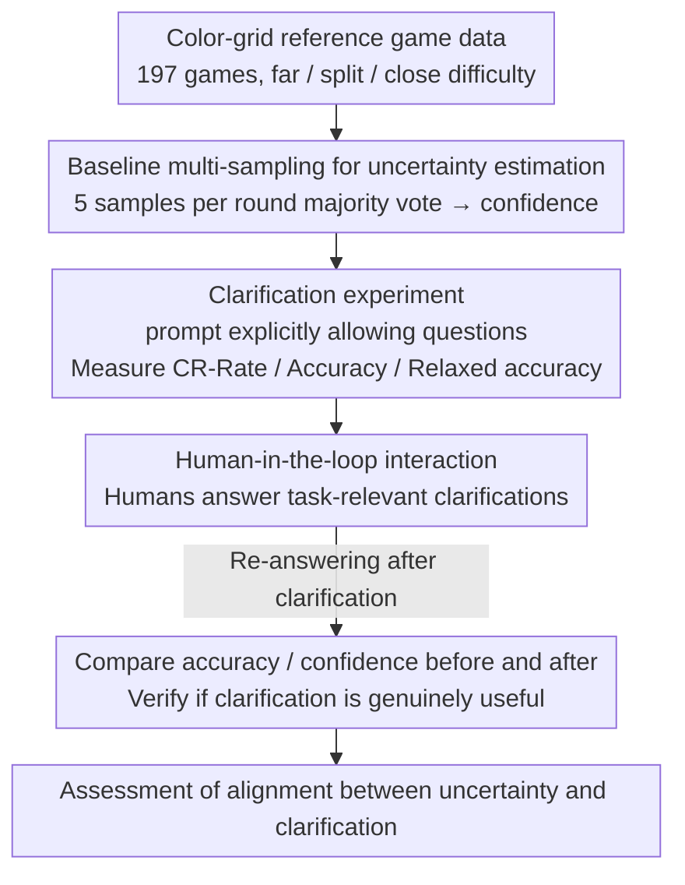

# Reference Games as a Testbed for the Alignment of Model Uncertainty and Clarification Requests

**Conference**: ACL2026  
**arXiv**: [2601.07820](https://arxiv.org/abs/2601.07820)  
**Code**: https://github.com/Manarali-bit/reference-games-clarification  
**Area**: Multimodal Interaction / VLM Uncertainty / Clarification Requests  
**Keywords**: reference game, clarification request, VLM calibration, pragmatic competence, uncertainty alignment  

## TL;DR
This paper utilizes color-grid reference games to examine whether VLMs can translate internal uncertainty into appropriate clarification requests, finding that even in controlled tasks, Qwen2.5-VL and GPT-5-mini still exhibit interaction gaps such as overconfidence, unstable clarification behavior, and low-quality clarification questions.

## Background & Motivation
**Background**: In human conversation, the listener is not a passive recipient. When references are unclear, information is insufficient, or multiple candidates exist, listeners initiate repairs, such as asking clarification questions, to maintain mutual understanding.

**Limitations of Prior Work**: Language models and vision-language models can answer fluently but do not necessarily know when they are uncertain. Fluent output can mask comprehension failures, misleading users into believing the model is highly certain; meanwhile, the confidence expressed in model language often fails to match actual accuracy.

**Key Challenge**: In open dialogue, it is difficult to define "when clarification is necessary" because user intents and the space of possible interpretations are not closed. Without explicit ground truth, it is hard to judge whether a model should ask a question.

**Goal**: To find a controllable, closed, and quantifiable testing scenario to evaluate whether a VLM as a listener can identify internal uncertainty and express it through appropriate clarification requests.

**Key Insight**: The authors choose reference games. This task features fixed candidate referents, clear goals, and difficulty conditions, allowing for direct assessment of whether the model selects the correct object and whether it is more likely to ask questions on difficult samples.

**Core Idea**: To extend the reference game from a "referential resolution test" to an "alignment test between model uncertainty and clarification behavior," evaluated using baseline confidence, CR-rate, relaxed accuracy, and human-computer interaction experiments.

## Method
The paper employs a color-grid reference game: each round features three $3\times3$ color-grid blocks, one as the target and two as distractors; a human speaker provides a description of the target, and the model as the listener must identify the target. The authors design three experiments: a baseline requiring only target selection; a clarification experiment explicitly allowing questions when uncertain; and an interaction experiment where humans answer the model's questions to verify if these clarifications are genuinely helpful.

### Overall Architecture
Data originates from the color-grid reference game by McDowell and Goodman (2019), totaling 197 games with 60 rounds each. Samples are categorized into far, split, and close difficulty levels based on the color similarity between targets and distractors. The authors test Qwen2.5-VL-7B, Qwen2.5-VL-72B, and GPT-5-mini. Qwen models run the full dataset and report results on a 500-subset; GPT-5-mini is evaluated only on the 500-round subset due to API costs, with 19 null answers excluded. Three experiments progress sequentially: first estimating round-wise uncertainty with a baseline, then observing whether the model asks questions correctly when permitted, and finally having humans answer clarifications to test their actual utility.

### Key Designs
**1. Baseline multi-sampling for uncertainty estimation: Using consistency signals to give the model an interpretable "how sure I am"**

A single output does not reveal whether the model is truly confident or guessing blindly. Therefore, this study samples each round 5 times in the baseline experiment, uses the majority vote as the final prediction, and defines the proportion of the majority answer among the 5 samples as the baseline confidence—thus it can only take values of $0.4, 0.6, 0.8, 1.0$. Though coarse, this consistency ratio provides a simple and interpretable uncertainty proxy: if sampling repeatedly for the same description yields fluctuating answers, it indicates internal uncertainty. Subsequent judgments on "whether the model should ask questions on difficult samples" rely on whether this confidence aligns with actual difficulty.

**2. Clarification experiment: Explicitly including "permitting questions" in the prompt to see if the model uses it correctly**

Measuring accuracy alone cannot answer "whether the model knows it is uncertain." The study modifies the prompt to explicitly tell the model it can ask back when uncertain and deconstructs its behavior using three metrics: CR-Rate is the proportion of clarification requests generated, Accuracy counts only the proportion of correct answers among non-clarification responses, and Relaxed accuracy considers both "correct answers" and "appropriately asking clarifications" as acceptable behaviors. These metrics are designed to see if a listener who truly knows how to clarify asks more frequently on difficult, low-confidence samples and answers directly on high-confidence samples.

**3. Human-in-the-loop interaction: Having humans answer the model's questions to verify if clarifications are genuinely useful**

A high CR-rate only indicates the model likes to ask questions, not that it asks meaningful ones—it might simply say "please clarify" without identifying specific ambiguities. To address this, the study invited humans to review 116 clarification requests generated by Qwen2.5-VL-72B and label them as task-relevant. For relevant questions, humans provided direct answers; for irrelevant ones, they rewrote the original description. The model then re-answered based on the clarified dialogue, comparing accuracy and confidence before and after. This step separates "ability to ask" from "ability to ask useful questions"—if accuracy does not increase or even decreases after clarification, the questions failed to help the model narrow down the candidate space.

### Loss & Training
This work does not train models and is an evaluation study. The key "strategy" is the experimental protocol: the baseline uses majority voting from 5 samples to estimate confidence; clarification uses only 1 sample and parses whether a question was asked; the interaction phase involves expert humans providing clarification responses, followed by a re-evaluation of Qwen2.5-VL-72B.

## Key Experimental Results

### Main Results

| Model | Baseline Accuracy | Baseline Confidence | CR-Rate | Clarification Accuracy | Relaxed Accuracy |
|------|-------------------|---------------------|---------|-------------------------|------------------|
| Qwen2.5-VL-7B | 0.53 (0.52 full) | 0.88 (0.87 full) | 0.0 (0.002 full) | 0.46 (0.42 full) | 0.46 (0.42 full) |
| Qwen2.5-VL-72B | 0.77 (0.71 full) | 0.91 (0.92 full) | 0.24 (0.24 full) | 0.73 (0.71 full) | 0.80 (0.78 full) |
| GPT-5-mini | 0.91 | 0.99 | 0.13 | 0.94 | 0.94 |
| Human | 0.92 full | Not reported | N/A | N/A | N/A |

### Extracts of Difficulty Condition Results

| Model / Condition | Baseline Accuracy | CR-Rate | Relaxed Accuracy | Phenomenon |
|-------------|-------------------|---------|------------------|------|
| GPT-5-mini close | 0.87 | 0.17 | 0.92 | Asks more questions in difficult conditions |
| GPT-5-mini far | 0.98 | 0.06 | 0.99 | Asks fewer questions in simple conditions |
| Qwen2.5-VL-72B close | 0.68 (0.65 full) | 0.24 (0.23 full) | 0.71 (0.73 full) | CR-rate does not vary significantly with difficulty |
| Qwen2.5-VL-7B ALL | 0.53 (0.52 full) | 0.0 (0.002 full) | 0.46 (0.42 full) | Almost never asks questions |

### Interaction Experiment

| Setting | Before Accuracy | After Accuracy | Before Confidence | After Confidence | Conclusion |
|------|-----------------|----------------|-------------------|------------------|------|
| Qwen-72B CR-only ALL | 0.776 | 0.741 | 0.871 | 0.902 | Accuracy decreased by 0.035 after human answers |
| Qwen-72B full ALL | 0.767 | 0.759 | 0.914 | 0.921 | Full set accuracy decreased slightly by 0.008; confidence increased slightly |
| Qwen-72B CR quality | 42% task-relevant | 58% not task-relevant | - | - | Most clarification questions failed to capture task-relevant ambiguity |

### Key Findings
- GPT-5-mini's clarification behavior most closely matches a reasonable pattern: higher CR-rate in difficult conditions, with accuracy of non-clarification answers increasing from 0.91 to 0.94.
- Qwen2.5-VL-72B asks questions, but the alignment between clarification frequency, task difficulty, and uncertainty is unstable.
- Qwen2.5-VL-7B rarely asks questions, suggesting that "permitting questions" alone is insufficient to induce clarification behavior in smaller models.
- Interaction experiments indicate that clarification requests must be specific and task-relevant to be valuable; generic template-style questions may increase confidence but do not improve accuracy.

## Highlights & Insights
- The contribution lies not in a new model, but in the evaluation scenario design. Reference games transform the "should I clarify" question from a vague open dialogue into a measurable problem, ideal for assessing pragmatic competence.
- Relaxed accuracy is a useful metric: it acknowledges that "asking when uncertain" is a successful interactive behavior, rather than only rewarding direct answers.
- The manual analysis of 42% task-relevance is crucial, showing that simply counting CR-rate overestimates model capability. The real challenge is asking questions that effectively narrow down the candidate space.

## Limitations & Future Work
- Human data comes from 60-round interaction dyads where participants build common ground; VLMs only see the initial description, which may disadvantage them in comparison.
- Baseline confidence is based on diversity sampling, which might not equate to internal probabilistic uncertainty. The authors also note that Qwen-72B's information-theoretic uncertainty estimation is finer but still fails to better align clarification behavior.
- Some human speaker descriptions in the data may be flawed; baseline errors are not necessarily entirely the fault of the listener model.
- Future work could extend to multi-round reference games, allowing models to build mutual understanding through their own clarifications rather than just evaluating the first round.

## Related Work & Insights
- **vs Open-ended Clarification Research**: It is hard to judge when clarification is needed in open dialogue; the closed candidate set in reference games defines clarification needs more cleanly.
- **vs Uncertainty Quantification**: Entropy or sampling consistency can measure uncertainty, but this paper further asks whether the model can translate uncertainty into interactive behavior.
- **vs Referential Resolution Benchmarks**: Traditional reference games focus on selecting the correct target; this paper extends them to evaluate interactive quality between "selecting or asking."
- **Insight**: When evaluating dialogue models, "whether they appropriately refuse to answer, ask back, or clarify" should be incorporated into task success, rather than just looking at the accuracy of one-shot answers.

## Rating
- Novelty: ⭐⭐⭐⭐☆ Using reference games as an uncertainty-clarification alignment test is insightful; the method is simple but the problem definition is excellent.
- Experimental Thoroughness: ⭐⭐⭐⭐☆ Covers three models, three difficulty levels, and human-computer interaction; model scale and task types could be further expanded.
- Writing Quality: ⭐⭐⭐⭐☆ Clear argumentation, easy-to-understand metrics, and restrained discussion.
- Value: ⭐⭐⭐⭐☆ Highly valuable for building more reliable interactive VLMs, especially by reminding us that "knowing how to ask" does not equal "asking useful questions."

<!-- RELATED:START -->

## Related Papers

- [\[ACL 2026\] RespiraMFM: A Multimodal Foundation Model for Respiratory Disease Recognition via Contrastive Audio-Language Alignment](respiramfm_a_multimodal_foundation_model_with_contrastive_audio-language_alignme.md)
- [\[AAAI 2026\] A Text-Routed Sparse Mixture-of-Experts Model with Explanation and Temporal Alignment for Multi-Modal Sentiment Analysis](../../AAAI2026/audio_speech/text-routed_sparse_mixture-of-experts_model_with_explanation_and_temporal_alignm.md)
- [\[ICLR 2026\] AC-Foley: Reference-Audio-Guided Video-to-Audio Synthesis with Acoustic Transfer](../../ICLR2026/audio_speech/ac-foley_reference-audio-guided_video-to-audio_synthesis_with_acoustic_transfer.md)
- [\[CVPR 2025\] UWAV: Uncertainty-Weighted Weakly-Supervised Audio-Visual Video Parsing](../../CVPR2025/audio_speech/uwav_uncertainty-weighted_weakly-supervised_audio-visual_video_parsing.md)
- [\[ACL 2026\] ImmersiveTTS: Environment-Aware Text-to-Speech with Multimodal Diffusion Transformer and Domain-Specific Representation Alignment](immersivetts_environment-aware_text-to-speech_with_multimodal_diffusion_transfor.md)

<!-- RELATED:END -->
