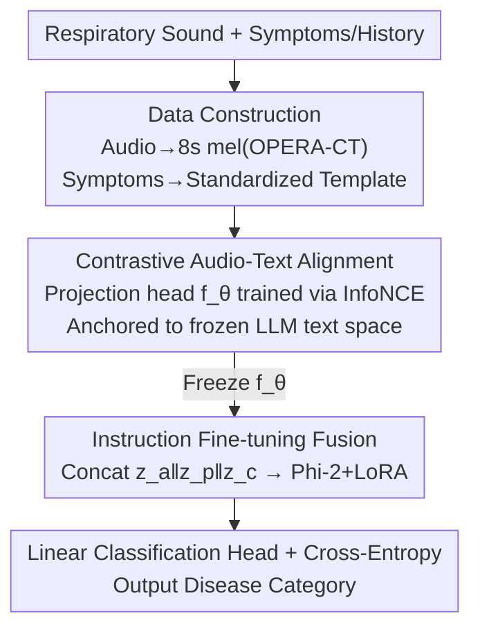

# RespiraMFM: A Multimodal Foundation Model for Respiratory Disease Recognition via Contrastive Audio-Language Alignment

**Conference**: ACL 2026  
**arXiv**: [2606.09966](https://arxiv.org/abs/2606.09966)  
**Code**: Yes (Original provides Project Page + GitHub, specific URL not provided in cache)  
**Area**: Audio/Speech / Medical Multimodal / Contrastive Learning  
**Keywords**: Respiratory Disease Recognition, Audio-Text Alignment, Contrastive Learning, Multimodal Fusion, Zero-shot

## TL;DR
RespiraMFM addresses the challenge where "non-linguistic acoustic biomarkers like coughing/wheezing are difficult to align with symptom text" by proposing a **two-stage decoupling** architecture: first, use contrastive learning to explicitly anchor audio embeddings into the LLM text semantic space, then freeze this aligner for instruction fine-tuning classification. This improves supervised AUROC by 9.15% and zero-shot performance by 20.98% across five respiratory diseases and nine tasks.

## Background & Motivation

**Background**: Detection of respiratory diseases (COVID-19, Tuberculosis (TB), COPD, Asthma, Pneumonia) relies heavily on audio—cough sounds and stethoscope recordings. While unimodal audio models (OPERA, HeAR, AST via contrastive learning, etc.) exist, the information provided by sound alone is limited. Multimodal approaches have emerged, combining respiratory sounds with clinical text (symptoms, history, smoking status, etc.), such as BTS using CLAP for feature extraction followed by a linear classifier, and RespLLM using an LLM as a text encoder with a trainable linear projector for dimensional alignment.

**Limitations of Prior Work**: Directly applying off-the-shelf "speech-text alignment" methods to respiratory diseases is problematic. In speech, the audio carries rich semantic/syntactic information that naturally aligns with text; however, respiratory disease tasks involve fusing **non-linguistic acoustic biomarkers** (coughing, wheezing, crackles) with free-text symptom descriptions, which reside at different semantic levels. Methods like RespLLM follow the "feature concatenation / linear projector + end-to-end joint training" paradigm from speech, leading to two major flaws: first, the inherent mismatch between cough sounds and clinical text makes it difficult for a unified training objective to converge to a stable shared representation, underutilizing both modalities; second, this inefficient fusion is strongly coupled with training data, causing models to perform well only on in-domain diseases while failing in zero-shot scenarios for unseen diseases.

**Key Challenge**: Linear projectors only perform **dimensional alignment** (mapping 768-d audio to LLM $d$-dimensions) but fail to achieve **semantic alignment**. Since audio and text encoders are trained independently, their output distributions are incompatible across modalities. Relying solely on a linear layer and a classification loss during end-to-end learning makes convergence difficult and limits generalization.

**Goal**: To identify "audio-text semantic misalignment" as the root cause and provide a simple yet effective solution—specifically performing a alignment stage before fine-tuning to anchor acoustic features to symptom concepts.

**Key Insight**: Drawing from the experience that contrastive learning in CLIP/CLAP creates strong multimodal representations beneficial for zero-shot tasks, the alignment process is decoupled from "end-to-end incidental learning" and treated as a standalone stage.

**Core Idea**: Two-stage decoupling—first, contrastively train a lightweight projection head to explicitly align audio to the frozen LLM's text embedding space, then freeze it for instruction fine-tuning classification.

## Method

### Overall Architecture

RespiraMFM is a **two-stage, decoupled** training architecture. First, data construction is performed: raw respiratory sounds and patient symptoms are preprocessed into instruction fine-tuning data. The first stage is **Modality Alignment**—a lightweight projection head $f_\theta$ is trained independently using contrastive learning to map high-dimensional audio features into the LLM's semantic embedding space, providing a "semantically anchored" initialization for the projection head weights. The second stage is **Instruction Fine-tuning**—the aligner is frozen, and the aligned audio embeddings are concatenated with text embeddings and fed into the LLM (Phi-2 2.7B + LoRA) with a linear classification head, learning disease classification via cross-entropy. Crucially, alignment and fine-tuning are separated; once the aligner is trained, it is frozen and no longer "distorted" by the classification loss.

### Key Designs

**1. Two-stage Decoupled Training: Separating "Semantic Alignment" from "End-to-end Fine-tuning"**

Addressing the "unified end-to-end training convergence and generalization" pain point, the authors no longer allow the projector and LLM to learn simultaneously from the classification loss. Instead, they employ a two-step process: the first stage trains only the aligner, and the second stage freezes the aligner to train only the classification. The advantage is that the alignment stage has a clean, focused objective (pulling paired audio-text samples closer) undisturbed by downstream classification signals, allowing for a stable shared representation. The fine-tuning stage then reuses this aligned representation as a robust initialization. The fundamental difference from RespLLM's "end-to-end training of linear projector with LLM" is this decoupling, which ensures alignment quality is not constrained by classification objectives coupled with training data, significantly improving zero-shot generalization.

**2. Contrastive Audio-Text Alignment: Anchoring Non-linguistic Acoustic Markers to Symptom Text via InfoNCE**

This is the core of the paper. Using a frozen OPERA-CT audio encoder $f_O$ to obtain a 768-d audio embedding $\mathbf{e}_a$ and a frozen LLM text encoder $f_T$ for a $d$-dimensional text embedding $\mathbf{e}_t$, only a lightweight projection head $f_\theta:\mathbb{R}^{768}\to\mathbb{R}^{d}$ is trained. After L2 normalization $\mathbf{z}_i^a=f_\theta(\mathbf{e}_i^a)/\|f_\theta(\mathbf{e}_i^a)\|$ and $\mathbf{z}_i^t=\mathbf{e}_i^t/\|\mathbf{e}_i^t\|$, the InfoNCE contrastive loss is applied:

$$\mathcal{L}_{\text{contrast}} = -\frac{1}{N}\sum_{i=1}^{N}\log\frac{\exp(\mathbf{z}_i^a\cdot\mathbf{z}_i^t/\tau)}{\sum_{j=1}^{N}\exp(\mathbf{z}_i^a\cdot\mathbf{z}_j^t/\tau)}$$

This brings paired audio-symptoms closer and pushes unpaired ones further away, where $\tau$ is the temperature. This solves the issue of "linear projectors only aligning dimensions, not semantics": contrastive supervision forces acoustic markers like coughing/wheezing to semantically align with the correct symptom concepts. t-SNE visualizations in the paper confirm that aligned audio embeddings cluster more clearly and are more separable between COVID and healthy categories, which is the source of improved zero-shot generalization.

**3. Data Construction + Instruction Fine-tuning Fusion: Standardizing Heterogeneous Clinical Data into Unified Instructions**

To address the messy formatting of symptom fields across datasets, standardization is performed first: each audio segment is cropped/padded to 8 seconds and converted to a mel-spectrogram $x_a$ using a 64ms Hann window and 32ms stride via OPERA-CT. Relevant symptoms are extracted from tables and formatted into a standardized template $x_c$, paired with task-specific prompts $x_p$ (e.g., "Determine if the patient has COVID-19, output 0/1"). In the fine-tuning stage, the three embeddings are concatenated in the embedding layer $z_{fusion}=z_a\,\|\,z_p\,\|\,z_c$, where $z_a=f_\theta(f_O(x_a))$ utilizes the frozen alignment projection head. The fused sequence passes through Phi-2 (2.7B), and the pooled representation $z_h$ of the last token is fed into a fully connected classification head + softmax, trained with cross-entropy $\mathcal{L}_{CE}=-\sum_i y_i\log(\hat{y}_i)$. Parameter-efficient fine-tuning is performed on the LLM using LoRA ($r=16, \alpha=32$, dropout 0.1), while the encoder and aligner remain frozen.

### Loss & Training

Two stages use two sets of losses: The alignment stage uses InfoNCE $\mathcal{L}_{\text{contrast}}$ to train only the projection head $f_\theta$. The fine-tuning stage freezes $f_\theta$, $f_O$, and $f_T$, using LoRA + the classification head with cross-entropy $\mathcal{L}_{CE}$. The backbone LLM is Phi-2 (2.7B), trained for 20 epochs with a batch size of 16 on 4×A100-80GB. Tasks T1–T4 are used for training and in-domain evaluation, while T5–T9 are reserved for zero-shot testing (where T8 asthma and T9 pneumonia are completely unseen diseases).

## Key Experimental Results

### Main Results (Supervised, T1–T4 In-domain AUROC)

Mean values of three independent runs. RespiraMFM consistently outperforms all multimodal baselines across four tasks, achieving an average AUROC of 0.823, a 9.15% gain over the strongest baseline RespLLM (0.754):

| Task | Dataset/Disease | Qwen2-Audio | BTS | RespLLM | RespiraMFM | Gain |
|------|------|------|------|------|------|------|
| T1 | UK COVID-19 | 0.855 | 0.898 | 0.881 | **0.910** | ↑1.41% |
| T2 | Coughvid / COVID | 0.561 | 0.595 | 0.613 | **0.673** | ↑9.79% |
| T3 | TBscreen / TB | 0.334 | 0.568 | 0.687 | **0.709** | ↑3.20% |
| T4 | ICBHI / COPD | 0.614 | 0.880 | 0.833 | **0.999** | ↑13.64% |
| Avg | — | 0.591 | 0.735 | 0.754 | **0.823** | ↑9.15% |

### Zero-shot (T5–T9, including unseen datasets and diseases)

Average AUROC of 0.738, a 20.98% gain over BTS (0.61). T8 (Asthma) and T9 (Pneumonia) are novel diseases never seen during training:

| Task | Disease | BTS | RespLLM | RespiraMFM | Gain |
|------|------|------|------|------|------|
| T6 | TB (Unseen Set CodaTB) | 0.645 | 0.669 | **0.689** | ↑2.99% |
| T7 | COPD (Unseen Set KAUH) | 0.491 | 0.425 | **0.829** | ↑42.74% |
| T8 | Asthma (Unseen Dis.) | 0.418 | 0.399 | **0.552** | ↑20.55% |
| T9 | Pneumonia (Unseen Dis.) | 0.595 | 0.400 | **0.709** | ↑19.29% |
| Avg(T5-T9) | — | 0.61 | 0.56 | **0.738** | ↑20.98%(vs BTS) |

### Ablation Study

| Dimension | Configuration | Key Metric | Description |
|------|------|---------|------|
| Modality (Coswara, Acc) | Audio Only | 0.6102 | Audio is more accurate for mild/asymptomatic cases |
| Modality | Text Only | 0.7934 | Text is more accurate for symptomatic/healthy cases |
| Modality | **Audio+Text** | **0.8203** | Optimal across all severities and overall |
| Alignment (T5-T9) | No Alignment (E2E Linear) | Lower | Significant drop in zero-shot tasks |
| Alignment | **With Contrastive (Frozen)**| Consistently Higher | More separable clusters in t-SNE |

### Key Findings
- **Alignment is Key to Generalization**: Removing contrastive alignment and reverting to "end-to-end linear projector" leads to a consistent drop in AUC across all zero-shot tasks; t-SNE shows clearer binary clustering (COVID vs. Healthy) after alignment, explaining the zero-shot improvements.
- **Modality Complementarity**: Audio is more reliable for mild/asymptomatic cases, while text is better for symptomatic/healthy cases. Multimodal performance surpasses either single modality across all severity groups (0.8203 > 0.7934 > 0.6102).
- **High Data Efficiency**: In the multimodal configuration, the model approaches peak performance with nearly an order of magnitude less training data, suitable for label-scarce clinical scenarios. Even if only audio is provided during testing, the better embedding space learned during alignment still yields stronger pure-audio performance.
- **Interpretability**: [CLS] attention shows that for COVID patients, attention focuses on tokens like fever, cough, and fatigue, while for healthy samples, it focuses on negative tokens like "asymptomatic" or "non-smoker," consistent with clinical intuition.

## Highlights & Insights
- **Precise Diagnosis, Simple Solution**: Attributing multimodal failure to "semantic misalignment rather than dimensional mismatch" and solving it with the minimal change of "pre-alignment + freezing" is a hallmark of "finding the right cause."
- **Decoupling Enables Zero-shot**: Separating alignment into a standalone contrastive training stage prevents it from being skewed by classification loss, yielding a 20%+ zero-shot gain. This "align-then-fine-tune" paradigm can be migrated to other non-linguistic audio (heart sounds, bowel sounds) + clinical text diagnostic tasks.
- **Frozen Encoder + LoRA + Lightweight Projector**: Achieving SOTA with very few trainable parameters is engineering-friendly and ideal for resource-constrained medical deployments.
- **Audio-only Benefits from Alignment**: The alignment stage improves the audio embedding space structure, ensuring that even when symptom text is missing at inference, pure audio performance remains stronger than baselines.

## Limitations & Future Work
- **Dependency on Symptom Metadata Quality**: The authors admit performance is influenced by the quality and consistency of symptom metadata, which varies across datasets and clinical settings.
- **Evaluation Data Imbalance**: Sample sizes for COPD, asthma, and pneumonia (T7-T9) are much smaller than for COVID/TB. The statistical reliability for these diseases is limited—the massive ↑42.74% gain on T7 should be interpreted cautiously given the small test set of 132 samples.
- **Limited Modalities**: Only audio and symptom text are fused. Incorporating medical imaging or wearable sensors could further enhance performance.
- **Future Directions**: Validate on larger, more balanced datasets for low-resource diseases and extend alignment losses to more clinical modalities.

## Related Work & Insights
- **vs RespLLM**: Both use LLM + audio multimodality, but RespLLM uses a trainable linear projector trained end-to-end with the LLM, aligning dimensions but not semantics. RespiraMFM uses pre-alignment + freezing, yielding +9.15% in main experiments and +32.02% in zero-shot relative to RespLLM.
- **vs BTS**: BTS uses CLAP for dual-modality features with a linear classifier, lacking strong zero-shot capabilities. RespiraMFM’s contrastive alignment + LLM instruction fine-tuning leads significantly on unseen diseases (avg +20.98% zero-shot).
- **vs Unimodal (OPERA, HeAR, AST Contrastive)**: These rely solely on audio and are limited by acoustic information; RespiraMFM introduces symptoms and solves cross-modal alignment, remaining stronger even in audio-only inference due to alignment.
- **vs CLIP/CLAP**: Adopts the idea of contrastive alignment for strong multimodal representations but targets the more difficult "non-linguistic acoustic marker ↔ free-text symptoms" scenario within a two-stage diagnostic framework.

## Rating
- Novelty: ⭐⭐⭐⭐ Clear diagnosis of "semantic misalignment" and the pre-alignment solution is simple yet effective; uses CLIP-like ideas but the scenario and decoupling are novel.
- Experimental Thoroughness: ⭐⭐⭐⭐⭐ Five diseases, nine tasks, seven datasets, with comprehensive experiments on supervised/zero-shot/scaling/modality/alignment/interpretability.
- Writing Quality: ⭐⭐⭐⭐ Clear motivation-method-experiment chain, though relative gain figures for small test sets require a caveat.
- Value: ⭐⭐⭐⭐⭐ Provides a deployable multimodal paradigm for clinical respiratory diagnosis where labels are scarce and zero-shot generalization is required.

<!-- RELATED:START -->

## Related Papers

- [\[ACL 2026\] MTR-DuplexBench: Towards a Comprehensive Evaluation of Multi-Round Conversations for Full-Duplex Speech Language Models](mtr-duplexbench_towards_a_comprehensive_evaluation_of_multi-round_conversations_.md)
- [\[ACL 2026\] Speech-Hands: A Self-Reflection Voice Agentic Approach to Speech Recognition and Audio Reasoning with Omni Perception](speech-hands_a_self-reflection_voice_agentic_approach_to_speech_recognition_and_.md)
- [\[ACL 2026\] Analyzing Reasoning Shifts in Audio Deepfake Detection under Adversarial Attacks: The Reasoning Tax versus Shield Bifurcation](analyzing_reasoning_shifts_in_audio_deepfake_detection_under_adversarial_attacks.md)
- [\[ACL 2026\] SegTune: Structured and Fine-Grained Control for Song Generation](segtune_structured_and_fine-grained_control_for_song_generation.md)
- [\[ACL 2026\] Multimodal In-Context Learning for ASR of Low-Resource Languages](multimodal_in-context_learning_for_asr_of_low-resource_languages.md)

<!-- RELATED:END -->
