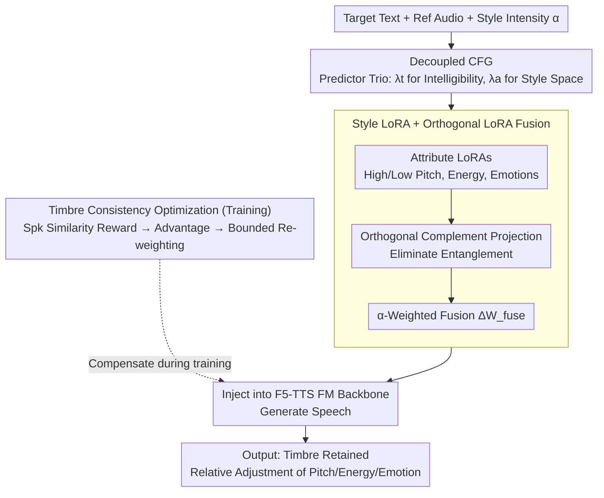

# ReStyle-TTS: Relative and Continuous Style Control for Zero-Shot Speech Synthesis

**Conference**: ACL2026  
**arXiv**: [2601.03632](https://arxiv.org/abs/2601.03632)  
**Code**: https://cucl-2.github.io/Restyle-TTS  
**Area**: Audio & Speech  
**Keywords**: Zero-Shot Speech Synthesis, Style Control, LoRA Fusion, Relative Control, Timbre Consistency

## TL;DR
ReStyle-TTS enables zero-shot TTS to break free from the style of the reference audio through decoupled text/reference guidance, continuously scalable Style LoRAs, orthogonal LoRA fusion, and timbre consistency optimization. This allows for relative adjustments of pitch, energy, and emotion while maintaining text intelligibility and speaker timbre.

## Background & Motivation
**Background**: Zero-shot TTS can clone the timbre of unseen speakers using short reference audio. Given a reference audio and a text, the model generates speech in the same voice, making voice assistants, dubbing, and personalized reading more flexible.

**Limitations of Prior Work**: Reference audio contains not only timbre but also the speaking rate, pitch, energy, and emotion at that moment. To clone the voice, models often inherit the style of the reference audio simultaneously. If a user only has a happy reference sample but wants to synthesize an angry tone, they must find another reference matching the target style, which is inconvenient in practice.

**Key Challenge**: Controlling style requires weakening the reference audio's constraint on the generation; however, the reference is also the source of the speaker's timbre. Over-weakening leads to speaker timbre drift. There is an inherent trade-off between style controllability and timbre consistency.

**Goal**: The authors aim to achieve a user-friendly zero-shot TTS control method: preserving the speaker identity provided by a short reference while allowing continuous, relative, and composable control over pitch, energy, and emotion.

**Key Insight**: The paper observes that existing controllable TTS models mostly rely on absolute target styles or discrete text prompts (e.g., "speak in a happy tone"). This does not align with common user needs; a more natural operation is "slightly higher pitch than the reference" or "a bit more angry." Therefore, control should be relative to the reference rather than pushing all samples toward a fixed style.

**Core Idea**: First, use Decoupled CFG to reduce the model's implicit dependence on the reference style, then use Style LoRA to provide explicit style directions, and finally use Timbre Consistency Optimization to restore the weakened timbre consistency.

## Method

### Overall Architecture
ReStyle-TTS is built on flow-matching zero-shot TTS models like F5-TTS. It takes target text, a reference audio, and one or more style intensity knobs as input, and outputs speech that retains the reference speaker's timbre but with relatively adjusted pitch/energy/emotion. It does not retrain the base model but chains the generation pipeline with three modifications: first, generating with lower reference guidance via Decoupled CFG to free up style space; second, adding corresponding Style LoRAs (with orthogonal fusion if necessary) to the base model with user-specified intensities to inject style directions; third, re-weighting the flow-matching loss during training with a speaker similarity reward to compensate for timbre consistency.

### Key Designs
**1. Decoupled Classifier-Free Guidance: Splitting text fidelity and reference dependency into two knobs**

The core contradiction in zero-shot TTS is that reference audio is both a timbre source and a style shackle. Standard CFG combines $f_{a,t}$ and $f_{\emptyset,\emptyset}$, mixing text and reference into a single guidance weight. DCFG calculates an additional text-only prediction $f_{\emptyset,t}$ and splits the guidance: $\hat{f}_{DCFG}=f_{\emptyset,t}+\lambda_t(f_{\emptyset,t}-f_{\emptyset,\emptyset})+\lambda_a(f_{a,t}-f_{\emptyset,t})$, where $\lambda_t$ controls text strength and $\lambda_a$ controls reference strength. This allows $\lambda_t$ to remain high for intelligibility while $\lambda_a$ is lowered to release style space, giving downstream LoRAs room to change attributes without being locked by the reference style.

**2. Style LoRA and Orthogonal LoRA Fusion: Using non-interfering low-rank directions as continuous sliders**

In image generation, LoRAs are used as style sliders. In TTS, since style is buried in the reference audio, it must first be decoupled via DCFG. The authors train LoRAs for high/low pitch, high/low energy, and various emotions. During inference, the scaling factor $\alpha_i$ for each LoRA serves as a continuous knob. To prevent attribute entanglement when multiple LoRAs are active, OLoRA projects each LoRA's update vector onto the orthogonal complement of other LoRA subspaces before weighted fusion: $\Delta W_{fuse}=\sum_i \alpha_i \tilde{\Delta W_i}$. This ensures that adjusting one knob primarily affects the target attribute, providing stable and composable continuous control.

**3. Timbre Consistency Optimization: Pulling timbre back with bounded reward re-weighting**

Reducing reference guidance via DCFG risks speaker timbre drift. TCO compensates for this by re-weighting the flow-matching loss. After generating a sample, a speaker verification model calculates a similarity reward $r_t$ against the reference. An EMA baseline $b_t$ is maintained to obtain the advantage $A_t=r_t-b_t$. The original flow-matching loss is then re-weighted by $w_t=1+\lambda \tanh(\beta A_t)$: $\mathcal{L}_{total}=w_t\mathcal{L}_{FM}$. Unlike high-variance policy gradients, this advantage-weighted regression does not require backpropagation through the generation process, making it stable and efficient while emphasizing samples with high timbre similarity.

### Loss & Training
The base model is F5-TTS. Style LoRAs are trained on different subsets of the VccmDataset for attributes including high/low pitch, high/low energy, and emotions (angry, disgusted, fear, happy, sad, surprised, neutral); contempt was excluded due to data scarcity. LoRAs are injected into all linear layers with rank 32, alpha 64, AdamW learning rate $1\times 10^{-5}$, and batch size of 30,000 audio frames, trained for 250 hours per subset. During DCFG training, masked speech dropout is 0.3, and masked speech + text dropout is 0.2. In inference, $\lambda_a=0.5$ is used to reduce reference dependency, while $\lambda_t=2$. TCO uses $\lambda=0.2, \beta=5.0, \mu=0.9$.

## Key Experimental Results

### Main Results
The paper first compares the control format of controllable zero-shot TTS. ReStyle-TTS provides relative control via LoRA sliders rather than requiring external style audio or text prompts.

| Method | Timbre Source | Style Source | Continuous Control | Control Type |
|------|----------|----------|----------|----------|
| IndexTTS2 / Vevo | Reference Audio | Style Audio | No | Absolute |
| ControlSpeech / EmoVoice / CosyVoice | Reference Audio | Text Description | No | Absolute |
| StyleFusion TTS | Reference Audio | Audio or Text | No | Absolute |
| ReStyle-TTS | Reference Audio | Style LoRA | Yes | Relative |

In scenarios where the reference and target emotions conflict, ReStyle-TTS effectively overrides the reference emotion. The following table shows accuracy (ACC) for off-diagonal emotion transfer cases.

| Reference → Target | CosyVoice ACC↑ | EmoVoice ACC↑ | IndexTTS2 ACC↑ | ReStyle-TTS ACC↑ |
|--------------------|----------------|---------------|----------------|------------------|
| Happy → Angry | 65.2 | 73.5 | 88.5 | 100.0 |
| Fear → Happy | 82.9 | 85.7 | 90.4 | 100.0 |
| Surprised → Angry | 72.0 | 78.5 | 83.6 | 100.0 |
| Angry → Neutral | 58.4 | 74.2 | 78.9 | 84.6 |
| Disgusted → Happy | 83.5 | 86.5 | 89.3 | 96.8 |

Conflicting style control for pitch and energy is also stable, significantly outperforming CosyVoice and EmoVoice.

| Attribute | Reference → Target | CosyVoice ACC↑ | EmoVoice ACC↑ | ReStyle-TTS ACC↑ |
|----------|--------------------|----------------|---------------|------------------|
| Pitch | Low → High | 74.9 | 72.4 | 90.2 |
| Pitch | High → Low | 76.9 | 73.1 | 92.8 |
| Energy | Low → High | 87.5 | 76.1 | 92.4 |
| Energy | High → Low | 88.6 | 75.9 | 93.0 |

### Ablation Study
DCFG is critical for style controllability, while TCO is critical for timbre preservation. Standard CFG fails to change attributes despite good WER and Spk-sv. Removing TCO preserves control but leads to a drop in speaker similarity.

| Configuration | Attr Δ(rel.)↑ | WER(%)↓ | Spk-sv↑ | Conclusion |
|------|---------------|---------|---------|------|
| default ($\lambda_t=2, \lambda_a=0.5$) | 51.2% | 2.31 | 0.79 | Balanced control, intelligibility, and timbre |
| w/o DCFG ($\lambda_{cfg}=2$) | 2.1% | 1.83 | 0.90 | Good timbre but nearly uncontrollable |
| w/o DCFG ($\lambda_{cfg}=0.5$) | 7.6% | 2.67 | 0.85 | Slightly controllable but still locked by reference |
| w/o TCO | 51.0% | 2.32 | 0.71 | Controllability remains, but timbre consistency drops |

### Key Findings
- Single-attribute control curves change smoothly with LoRA strength while WER and Spk-sv remain stable, suggesting Style LoRA acts as a continuous slider rather than a discrete switch.
- Negatively scaling a high-attribute LoRA naturally produces the opposite effect (e.g., using a negative coefficient for a high-pitch LoRA to lower pitch), reducing data requirements.
- 2D and 3D control surfaces show that adjusting one LoRA primarily affects the target attribute with minimal impact on others, validating OLoRA's role in disentanglement.
- In relative control experiments, the regression slope between reference and generated energy varies from 0.77 to 1.22 with an intercept near 0, indicating the model preserves relative ranking rather than pushing samples to a fixed value.

## Highlights & Insights
- The DCFG design is highly practical: it doesn't eliminate the reference influence entirely but splits it into two adjustable coefficients, addressing the core trade-off of zero-shot TTS.
- Using LoRA as a speech style slider is highly transferable. Compared to text prompts, intensity adjustment is better suited for product interactions and continuous interpolation in UIs.
- TCO is a restrained reinforcement learning design: it avoids high-variance policy gradients by using reward-based re-weighting of the supervised loss, leveraging speaker verification signals without instability.
- The paper clearly articulates "relative control." Many controllable generation methods are actually absolute target control, whereas real users often need to fine-tune based on the current sample.

## Limitations & Future Work
- The main limitation is that scaling to new attributes requires collecting corresponding data and training additional LoRAs. The control space is not an open-ended natural language set.
- Experiments currently focus on pitch, energy, and certain emotions, leaving out more complex dimensions like speaking rate, pauses, accents, or role-playing styles.
- Even with TCO, dropping reference guidance in DCFG means timbre and style are not perfectly separable; timbre drift might still occur in extreme emotional scenarios or long segments.
- Emotion accuracy relies on automated evaluators like Emotion2Vec. While subjective MOS-SA is provided, larger-scale listening tests are needed for naturalness.
- Voice cloning combined with emotion manipulation carries misuse risks. The authors suggest watermarking and detection, which should be prerequisites for deployment.

## Related Work & Insights
- **vs IndexTTS2 / Vevo**: These rely on external style audio; ReStyle-TTS uses LoRA intensity for relative adjustment without needing a target style sample.
- **vs ControlSpeech / EmoVoice / CosyVoice**: These use text descriptions, which are user-friendly but often discrete and unstable; ReStyle-TTS provides more predictable slider-based control.
- **vs StyleFusion TTS**: StyleFusion supports text/audio style inputs but remains absolute; ReStyle-TTS emphasizes reference-relative control.
- **vs Image LoRA composition**: While image LoRAs modify style directly, TTS style is inherent in the reference audio. The use of DCFG to decouple reference dependency before applying or fusing LoRAs is a necessary adaptation for the speech domain.

## Rating
- Novelty: ⭐⭐⭐⭐ The combination of DCFG, Style LoRA, OLoRA, and TCO effectively solves the relative style control problem in zero-shot TTS.
- Experimental Thoroughness: ⭐⭐⭐⭐ Covers single/multi-attribute control, relative control, conflicting styles, and ablation. More real-world user tests would be beneficial.
- Writing Quality: ⭐⭐⭐⭐ Clear motivation and understandable diagrams. Some continuous control results are mainly visualized; tabular data for those would complement the conflict experiments.
- Value: ⭐⭐⭐⭐⭐ Highly practical for controllable speech synthesis, especially for product scenarios requiring fine-grained style editing while preserving speaker identity.

<!-- RELATED:START -->

## Related Papers

- [\[ACL 2026\] FC-TTS: Style and Timbre Control in Zero-Shot Text-to-Speech with Disentangled Speech Representations](fc-tts_style_and_timbre_control_in_zero-shot_text-to-speech_with_disentangled_sp.md)
- [\[ICLR 2026\] FlexiVoice: Enabling Flexible Style Control in Zero-Shot TTS with Natural Language Instructions](../../ICLR2026/audio_speech/flexivoice_enabling_flexible_style_control_in_zero-shot_tts_with_natural_languag.md)
- [\[ACL 2025\] ControlSpeech: Towards Simultaneous and Independent Zero-shot Speaker Cloning and Zero-shot Language Style Control](../../ACL2025/audio_speech/controlspeech_zero_shot.md)
- [\[ACL 2025\] TCSinger 2: Customizable Multilingual Zero-shot Singing Voice Synthesis](../../ACL2025/audio_speech/tcsinger_2_customizable_multilingual_zero-shot_singing_voice_synthesis.md)
- [\[ACL 2026\] UniVocal: Unified Speech-Singing Code-Mixed Synthesis](univocal_unified_speech-singing_code-switching_synthesis.md)

<!-- RELATED:END -->
