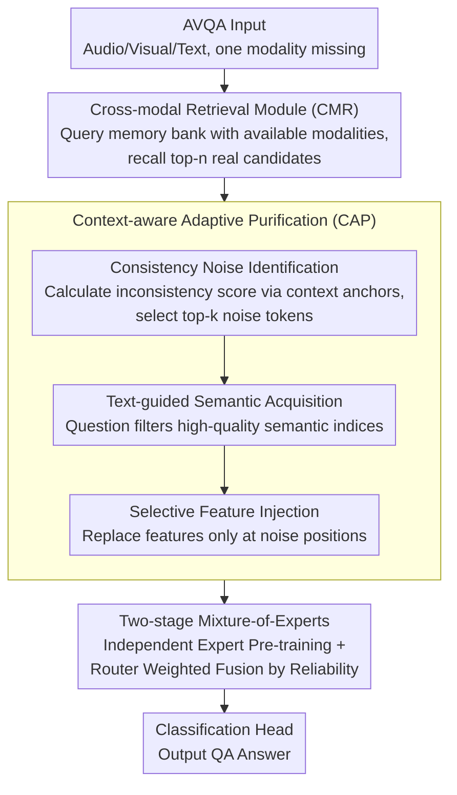

# Retrieving to Recover: Towards Incomplete Audio-Visual Question Answering via Semantic-consistent Purification

**Conference**: ACL 2026  
**arXiv**: [2604.10695](https://arxiv.org/abs/2604.10695)  
**Code**: None  
**Area**: Audio & Speech / Multimodal Learning  
**Keywords**: Audio-Visual Question Answering, Missing Modality, Retrieval-based Recovery, Semantic Purification, Mixture-of-Experts

## TL;DR

This paper proposes the R2ScP framework, which shifts the missing modality handling paradigm in AVQA from traditional generative completion to retrieval-based recovery. By employing cross-modal retrieval and a context-aware adaptive purification mechanism to eliminate retrieval noise, it significantly improves question-answering performance in scenarios with incomplete modalities.

## Background & Motivation

**Background**: Audio-Visual Question Answering (AVQA) requires models to perform reasoning across visual, audio, and textual modalities to understand dynamic scenes. Current methods typically assume that all modality data are fully available; however, performance degrades severely in practical scenarios such as equipment failure, sensor occlusion, or data transmission interruptions.

**Limitations of Prior Work**: Mainstream approaches for handling missing modalities rely on generative completion—synthesizing pseudo-features of the missing modality from existing ones. However, generative models tend to produce "common knowledge," which are generalized representations lacking fine-grained modality-specific information. For example, when inferring missing audio from a visual scene of a concert, a generative model might synthesize a generic "music" embedding but fail to capture the specific instrumental timbre visible in the frame, thereby introducing semantic hallucinations and noise.

**Key Challenge**: Generative methods essentially "imagine" missing information from existing modalities, and their outputs are limited by cross-modality shared knowledge, failing to recover unique modality-specific information. This information loss directly impacts question-answering tasks that require precise reasoning.

**Goal**: To shift the paradigm of handling missing modalities from generation to retrieval—recalling real, high-quality feature segments from a semantic database instead of synthesizing imperfect hallucinations.

**Key Insight**: The authors observe that real-world feature libraries contain a vast amount of reusable modality-specific knowledge; the key lies in how to accurately retrieve and denoise this information.

**Core Idea**: Replace generative completion with cross-modal retrieval and filter retrieval noise through a context-aware purification mechanism to preserve fine-grained modality-specific knowledge.

## Method

### Overall Architecture

R2ScP processes AVQA inputs where certain modalities may be missing (audio/visual/text) and outputs the answer. The Mechanism is to change the recovery of missing modalities from "generative completion" to "retrieval-based recovery." The pipeline consists of three steps: first, the Cross-Modal Retrieval (CMR) module uses available modalities as queries within a unified semantic space to recall real candidate features from an external memory bank; second, the Context-aware Adaptive Purification (CAP) mechanism uses both the context of available modalities and the textual question as constraints to eliminate retrieval noise and inject high-quality semantics; finally, a two-stage Mixture-of-Experts weights and fuses the original and recovered modalities based on reliability before passing them to a classification head for the answer.

### Key Designs

**1. Cross-Modal Retrieval Module (CMR): Replacing Imagined Pseudo-features with Real Feature Segments**

The fundamental flaw of generative completion is that it can only "imagine" common knowledge from existing modalities, losing fine-grained modality-specific information (e.g., the timbre of a specific instrument in a frame). CMR adopts a retrieval approach: an external memory bank $\mathcal{B} = \{(\mathbf{k}_i, \mathbf{v}_i)\}_{i=1}^{M}$ is constructed by encoding a large volume of real features into unified semantic embeddings using pre-trained multimodal models like ImageBind. When a modality is missing, the available modality is used as a query $\mathbf{Q}_{avl}$, and top-n candidates are recalled based on cosine similarity $S_i = \frac{\mathbf{Q}_{avl} \cdot \mathbf{k}_i}{\|\mathbf{Q}_{avl}\| \|\mathbf{k}_i\| + \epsilon}$. Since both keys and values reside in a unified semantic space, visual queries can directly align with semantically relevant real audio features, thereby retrieving reusable modality-specific knowledge from the database rather than synthesizing a generalized "music" embedding.

**2. Context-aware Adaptive Purification (CAP): Denoising via Context Constraints and Question Guidance**

Retrieval inevitably introduces irrelevant information—for instance, a violin performance might recall cello or applause features. Thus, CAP purifies in three steps. First, Consistency Noise Identification: calculate the inconsistency score $\delta_i = 1 - \text{sim}(H_{miss} \cdot \mathbf{W}_{proj}, \mathbf{g}_{avl})$ between retrieved features and the global context anchor of available modalities, identifying a set of top-k discordant tokens as the noise index set $\Omega_{noise}$. Second, Text-guided Semantic Acquisition: use multi-head cross-attention and self-attention to allow the textual question to sift through common knowledge for high-quality semantic indices $\Omega_{salient}$ most relevant to the current question. Finally, Selective Feature Injection: only replace features at noise positions while keeping others intact: $H_{miss}^{pur} = (\mathbf{1} - \mathcal{M}_{noise}) \odot H_{miss} + \mathcal{M}_{noise} \odot \text{Gather}(H_{guided}, \Omega_{salient})$. Constraints from available modalities prevent semantic drift, while question guidance ensures that the information retained is what is truly needed to answer the question.

**3. Two-stage Mixture-of-Experts Training: Explicitly Distinguishing Reliability of Original and Recovered Modalities**

Recovered modalities are ultimately less reliable than original ones; forced fusion can be biased by uncertain information. The authors split training into two stages. Stage one involves independently pre-training the Visual expert $\mathcal{E}_v$, Audio expert $\mathcal{E}_a$, and Text expert $\mathcal{E}_t$, forcing each to extract discriminative representations without relying on cross-modal shortcuts, thus avoiding feature collapse. Stage two freezes the experts and only trains the Gating network (Router), which dynamically calculates weights $\alpha_{m'} = \frac{\exp(g_{m'})}{\sum_{m} \exp(g_m)}$ based on input context to obtain the joint representation $\mathbf{Z}_{joint} = \alpha_a H_a + \alpha_t H_t + \alpha_v H_v$. This allows recovered modalities to be assigned lower weights to reflect their uncertainty rather than being treated equally with real modalities.

### Loss & Training

In addition to the standard cross-entropy loss $\mathcal{L}_{task}$, a semantic ranking loss $\mathcal{L}_{rank}$ is introduced to enforce that features recovered from positive samples are superior to negative samples but inferior to real features: $\mathcal{L}_{total} = \mathcal{L}_{task} + \lambda(\mathcal{L}_{rank}^+ + \mathcal{L}_{rank}^-)$. This ensures that purified retrieved features reside within a valid semantic manifold.

## Key Experimental Results

### Main Results

| Dataset | Modality Setting | Ours (R2ScP) | Prev. SOTA (IMOL) | Gain |
|--------|---------|-----------|---------------|------|
| Music-AVQA | Missing Audio | 69.37 | 67.11 | +2.26 |
| Music-AVQA | Missing Visual | 72.06 | 69.21 | +2.85 |
| Music-AVQA | Complete | 73.19 | 71.86 | +1.33 |
| AVQA | Missing Audio | 63.25 | 61.32 | +1.93 |
| AVQA | Missing Visual | 75.12 | 72.38 | +2.74 |
| AVQA | Complete | 90.64 | 90.28 | +0.36 |

### Ablation Study

| Configuration | Music-AVQA | AVQA | Description |
|------|-----------|------|------|
| w/o CMR w/o CAP | 62.43 | 57.43 | Baseline (Missing Audio) |
| +CMR only | 67.21 | 61.78 | Retrieval brings +4.78/+4.35 |
| +CAP only | 64.11 | 59.64 | Purification itself is effective |
| +CMR+CAP (Full) | 69.37 | 63.25 | Combination yields best results |

### Key Findings

- Retrieval-based recovery is more effective than generative completion, especially when the visual modality is missing (+2.85 vs IMOL).
- CMR and CAP are independently effective, but their combination is optimal, indicating that retrieval and purification are complementary.
- R2ScP still outperforms comparison methods in complete modality settings, suggesting the retrieval-recovery framework serves as a modal enhancement even without missing data.
- The two-stage training strategy avoids cross-modal feature collapse by decoupling expert pre-training from gated mixture.

## Highlights & Insights

- Paradigm Innovation: The shift from "generative completion" to "retrieval-based recovery" is simple yet powerful, avoiding the hallucination issues of generative methods.
- The three-stage purification design of CAP (noise identification → semantic acquisition → selective injection) is logically rigorous and fully utilizes guidance signals from available modalities and questions.
- The semantic ranking loss cleverly establishes a quality gradient of "Real > Positive Retrieval > Negative Retrieval."
- Performance gains even in complete modality scenarios indicate that retrieval mechanisms can serve as a general modality enhancement tool.

## Limitations & Future Work

- The construction and storage overhead of the external memory bank are significant, potentially posing a bottleneck for large-scale deployment.
- It is currently assumed that the missing modality is completely unavailable; scenarios with partial loss or noise degradation are not addressed.
- Retrieval quality is highly dependent on the alignment quality of the unified semantic space (ImageBind).
- Validated only on the AVQA task; generalization to other multimodal reasoning tasks (e.g., VQA, dialogue) remains to be explored.

## Related Work & Insights

- **vs Missing-AVQA (ECCV 2024)**: Missing-AVQA uses relation-aware generators to synthesize missing features, which results in common knowledge; R2ScP preserves modality-specific info through retrieval.
- **vs IMOL (ACL 2025)**: While IMOL also uses retrieval, it is primarily for contrastive alignment rather than direct feature recovery; R2ScP directly replaces missing info with retrieved features.
- **vs MoMKE (MM 2024)**: MoMKE preserves modality-specific knowledge via mixture-of-experts but does not handle feature recovery; R2ScP combines retrieval and MoE architectures for a more complete solution.

## Rating

- Novelty: ⭐⭐⭐⭐ The paradigm shift from generation to retrieval is a clear innovation; the CAP purification mechanism is elegantly designed.
- Experimental Thoroughness: ⭐⭐⭐⭐ Two datasets, multiple missing modality settings, and detailed ablation studies.
- Writing Quality: ⭐⭐⭐⭐ Clear problem motivation and detailed method description.
- Value: ⭐⭐⭐⭐ Provides a new research direction for handling missing multimodal data.

<!-- RELATED:START -->

## Related Papers

- [\[ACL 2026\] Music Audio-Visual Question Answering Requires Specialized Multimodal Designs](music_audio-visual_question_answering_requires_specialized_multimodal_designs.md)
- [\[ICLR 2026\] Query-Guided Spatial-Temporal-Frequency Interaction for Music Audio-Visual Question Answering](../../ICLR2026/audio_speech/query-guided_spatial-temporal-frequency_interaction_for_music_audio-visual_quest.md)
- [\[ACL 2026\] Jamendo-MT-QA: A Benchmark for Multi-Track Comparative Music Question Answering](jamendo-mt-qa_a_benchmark_for_multi-track_comparative_music_question_answering.md)
- [\[AAAI 2026\] End-to-end Contrastive Language-Speech Pretraining Model For Long-form Spoken Question Answering](../../AAAI2026/audio_speech/end-to-end_contrastive_language-speech_pretraining_model_for_long-form_spoken_qu.md)
- [\[ICML 2026\] Multimodal Fusion via Self-Consistent Task-Gradient Fields](../../ICML2026/audio_speech/multimodal_fusion_via_self-consistent_task-gradient_fields.md)

<!-- RELATED:END -->
