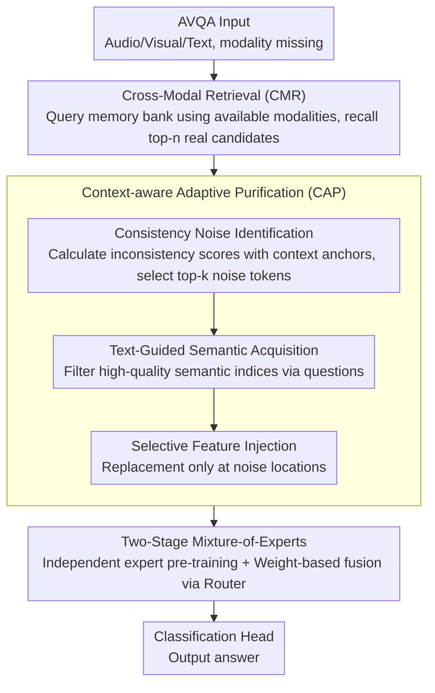

# Retrieving to Recover: Towards Incomplete Audio-Visual Question Answering via Semantic-consistent Purification

**Conference**: ACL 2026  
**arXiv**: [2604.10695](https://arxiv.org/abs/2604.10695)  
**Code**: None  
**Area**: Audio & Speech / Multimodal Learning  
**Keywords**: Audio-Visual Question Answering, Missing Modality, Retrieval-based Recovery, Semantic Purification, Mixture-of-Experts

## TL;DR

This paper proposes the R2ScP framework, which shifts the paradigm of handling missing modalities in AVQA from traditional generative completion to retrieval-based recovery. By employing cross-modal retrieval and a context-aware adaptive purification mechanism to eliminate retrieval noise, the framework significantly improves question-answering performance in modality-incomplete scenarios.

## Background & Motivation

**Background**: Audio-Visual Question Answering (AVQA) requires models to perform reasoning across visual, audio, and textual modalities to understand dynamic scenes. Current methods typically assume that all modalities are fully available, but performance degrades severely in real-world scenarios such as equipment failure, sensor occlusion, or data transmission interruptions.

**Limitations of Prior Work**: Mainstream approaches for handling missing modalities rely on generative completion—synthesizing pseudo-features of the missing modality from existing ones. However, generative models tend to produce "common knowledge," which lacks the fine-grained, modality-specific information needed for precise reasoning. For instance, when inferring missing audio from a concert scene, a generative model might synthesize a generic "music" embedding but fail to capture the specific timbre of the instruments visible in the frame, thereby introducing semantic hallucinations and noise.

**Key Challenge**: Generative methods essentially "imagine" missing information from existing modalities, and their outputs are constrained by cross-modal shared knowledge, making it impossible to recover unique modality-specific information. This information loss directly impacts question-answering tasks that require exact reasoning.

**Goal**: To shift the paradigm of handling missing modalities from generation to retrieval—recalling real, high-quality feature snippets from a semantic database instead of synthesizing imperfect hallucinations.

**Key Insight**: The authors observe that real-world feature libraries contain a vast amount of reusable modality-specific knowledge; the key lies in how to accurately retrieve and denoise these features.

**Core Idea**: Replace generative completion with cross-modal retrieval and filter retrieval noise through a context-aware purification mechanism to preserve fine-grained, modality-specific knowledge.

## Method

### Overall Architecture

R2ScP processes AVQA inputs (audio/visual/text) where certain modalities may be missing and outputs the answer. The Mechanism involves switching from "generative completion" to "retrieval-based recovery" for missing modalities. The pipeline consists of three steps: first, the Cross-Modal Retrieval (CMR) module uses available modalities as queries in a unified semantic space to recall real candidate features from an external memory bank; second, the Context-aware Adaptive Purification (CAP) mechanism uses both available modal contexts and the textual question as constraints to eliminate retrieval noise and inject high-quality semantics; finally, a two-stage Mixture-of-Experts (MoE) fuses original and recovered modalities via reliability-based weighting before passing them to a classification head.

### Key Designs

**1. Cross-Modal Retrieval (CMR): Replacing Imagined Pseudo-features with Real Feature Snippets**

The fundamental flaw of generative completion is that it can only "imagine" common knowledge from existing modalities, losing modality-specific fine-grained information (e.g., the specific timbre of an instrument in a frame). CMR adopts a retrieval strategy: using pre-trained multimodal models like ImageBind to encode a large volume of real features into a unified semantic embedding space, forming an external memory bank $\mathcal{B} = \{(\mathbf{k}_i, \mathbf{v}_i)\}_{i=1}^{M}$. When a modality is missing, the available modality serves as a query $\mathbf{Q}_{avl}$ to recall top-n candidates based on cosine similarity $S_i = \frac{\mathbf{Q}_{avl} \cdot \mathbf{k}_i}{\|\mathbf{Q}_{avl}\| \|\mathbf{k}_i\| + \epsilon}$. Since keys and values reside in a unified semantic space, a visual query can align directly with semantically relevant real audio features, recovering reusable modality-specific knowledge rather than synthesizing a generalized embedding.

**2. Context-aware Adaptive Purification (CAP): Dual Denoising via Contextual Constraints and Question Guidance**

Retrieval inevitably introduces irrelevant information—for a violin performance, features of a cello or applause might be recalled. Thus, CAP purifies in three steps. First, Consistency Noise Identification: calculate the inconsistency score $\delta_i = 1 - \text{sim}(H_{miss} \cdot \mathbf{W}_{proj}, \mathbf{g}_{avl})$ between retrieved features and the global context anchor of available modalities, selecting top-k discordant tokens as the noise index set $\Omega_{noise}$. Second, Text-Guided Semantic Acquisition: use multi-head cross-attention and self-attention to allow the textual question to filter the most relevant high-quality semantic indices $\Omega_{salient}$ from common knowledge. Finally, Selective Feature Injection: only replace features at noise locations while preserving others: $H_{miss}^{pur} = (\mathbf{1} - \mathcal{M}_{noise}) \odot H_{miss} + \mathcal{M}_{noise} \odot \text{Gather}(H_{guided}, \Omega_{salient})$. Constraints from available modalities ensure the semantics remain aligned, while question guidance ensures that the information retained is what is truly needed to answer the question.

**3. Two-stage Mixture-of-Experts Training: Explicitly Distinguishing Reliability of Original and Recovered Modalities**

Recovered modalities are ultimately less reliable than real ones; rigid fusion can be misled by uncertain information. The authors decompose training into two stages. Stage 1: independently pre-train the visual expert $\mathcal{E}_v$, audio expert $\mathcal{E}_a$, and text expert $\mathcal{E}_t$, forcing each to extract discriminative representations without relying on cross-modal shortcuts to prevent feature collapse. Stage 2: freeze the experts and train only the gating network (Router), dynamically calculating weights $\alpha_{m'} = \frac{\exp(g_{m'})}{\sum_{m} \exp(g_m)}$ based on input context to obtain the joint representation $\mathbf{Z}_{joint} = \alpha_a H_a + \alpha_t H_t + \alpha_v H_v$. This allows recovered modalities to be assigned lower weights to reflect their uncertainty.

### Loss & Training

In addition to the standard cross-entropy task loss $\mathcal{L}_{task}$, a semantic ranking loss $\mathcal{L}_{rank}$ is introduced to force features recovered from positive samples to be superior to those from negative samples but inferior to real features: $\mathcal{L}_{total} = \mathcal{L}_{task} + \lambda(\mathcal{L}_{rank}^+ + \mathcal{L}_{rank}^-)$. This ensures that purified retrieved features reside within a valid semantic manifold.

## Key Experimental Results

### Main Results

| Dataset | Modality Setting | Ours (R2ScP) | Prev. SOTA (IMOL) | Gain |
|-----------|------------------|--------------|-------------------|------|
| Music-AVQA| Missing Audio    | 69.37        | 67.11             | +2.26|
| Music-AVQA| Missing Visual   | 72.06        | 69.21             | +2.85|
| Music-AVQA| Complete         | 73.19        | 71.86             | +1.33|
| AVQA      | Missing Audio    | 63.25        | 61.32             | +1.93|
| AVQA      | Missing Visual   | 75.12        | 72.38             | +2.74|
| AVQA      | Complete         | 90.64        | 90.28             | +0.36|

### Ablation Study

| Configuration | Music-AVQA | AVQA | Description |
|---------------|------------|------|-------------|
| w/o CMR w/o CAP| 62.43      | 57.43| Baseline (Missing Audio) |
| +CMR only     | 67.21      | 61.78| Retrieval gain (+4.78/+4.35) |
| +CAP only     | 64.11      | 59.64| Purification is effective independently |
| +CMR+CAP (Full)| 69.37      | 63.25| Best performance with integration |

### Key Findings

- Retrieval-based recovery is more effective than generative completion, especially when the visual modality is missing (+2.85 vs. IMOL).
- CMR and CAP are each independently effective, but their combination yields the best results, indicating they are complementary.
- R2ScP still outperforms baseline methods in complete modality settings, suggesting the framework helps modality fusion generally.
- The two-stage training strategy prevents cross-modal feature collapse by decoupling expert pre-training and gating mixture.

## Highlights & Insights

- **Novelty**: The paradigm shift from "generative completion" to "retrieval-based recovery" is simple yet powerful, effectively avoiding the hallucination problems of generative methods.
- The three-stage purification design of CAP (noise identification → semantic acquisition → selective injection) is logically rigorous and fully utilizes guidance signals from available modalities and questions.
- The semantic ranking loss cleverly establishes a quality gradient of "Real > Positive Retrieval > Negative Retrieval."
- Improvements in full modality scenarios suggest that retrieval mechanisms can serve as a general tool for modality enhancement.

## Limitations & Future Work

- The construction and storage overhead of the external memory bank are significant, potentially posing a bottleneck for large-scale deployment.
- It is currently assumed that a modality is either fully present or fully missing, without addressing partial missing or noisy degradation scenarios.
- Retrieval quality is highly dependent on the alignment quality of the unified semantic space (ImageBind).
- The method was validated only on AVQA tasks; generalization to other multimodal reasoning tasks (e.g., VQA, dialogue) remains to be explored.

## Related Work & Insights

- **vs. Missing-AVQA (ECCV 2024)**: Missing-AVQA uses relation-aware generators to synthesize missing features, which only produce common knowledge; R2ScP preserves modality-specific information via retrieval.
- **vs. IMOL (ACL 2025)**: While IMOL also uses retrieval, it is primarily for contrastive alignment rather than direct feature recovery; R2ScP uses retrieved features to replace missing information directly.
- **vs. MoMKE (MM 2024)**: MoMKE preserves modality-specific knowledge through MoE but does not handle feature recovery; R2ScP combines retrieval with MoE architecture for a more complete solution.

## Rating

- Novelty: ⭐⭐⭐⭐ The paradigm shift is a clear innovation; the CAP mechanism is elegantly designed.
- Experimental Thoroughness: ⭐⭐⭐⭐ Coverage of two datasets, multiple missing settings, and detailed ablation studies.
- Writing Quality: ⭐⭐⭐⭐ Clear motivation and detailed methodology.
- Value: ⭐⭐⭐⭐ Provides a new research direction for handling missing multimodal data.

<!-- RELATED:START -->

## Related Papers

- [\[ACL 2026\] Music Audio-Visual Question Answering Requires Specialized Multimodal Designs](music_audio-visual_question_answering_requires_specialized_multimodal_designs.md)
- [\[ICLR 2026\] Query-Guided Spatial-Temporal-Frequency Interaction for Music Audio-Visual Question Answering](../../ICLR2026/audio_speech/query-guided_spatial-temporal-frequency_interaction_for_music_audio-visual_quest.md)
- [\[ACL 2026\] Jamendo-MT-QA: A Benchmark for Multi-Track Comparative Music Question Answering](jamendo-mt-qa_a_benchmark_for_multi-track_comparative_music_question_answering.md)
- [\[CVPR 2026\] Semantic Noise Reduction via Teacher-Guided Dual-Path Audio-Visual Representation Learning](../../CVPR2026/audio_speech/semantic_noise_reduction_via_teacher-guided_dual-path_audio-visual_representatio.md)
- [\[AAAI 2026\] End-to-end Contrastive Language-Speech Pretraining Model For Long-form Spoken Question Answering](../../AAAI2026/audio_speech/end-to-end_contrastive_language-speech_pretraining_model_for_long-form_spoken_qu.md)

<!-- RELATED:END -->
