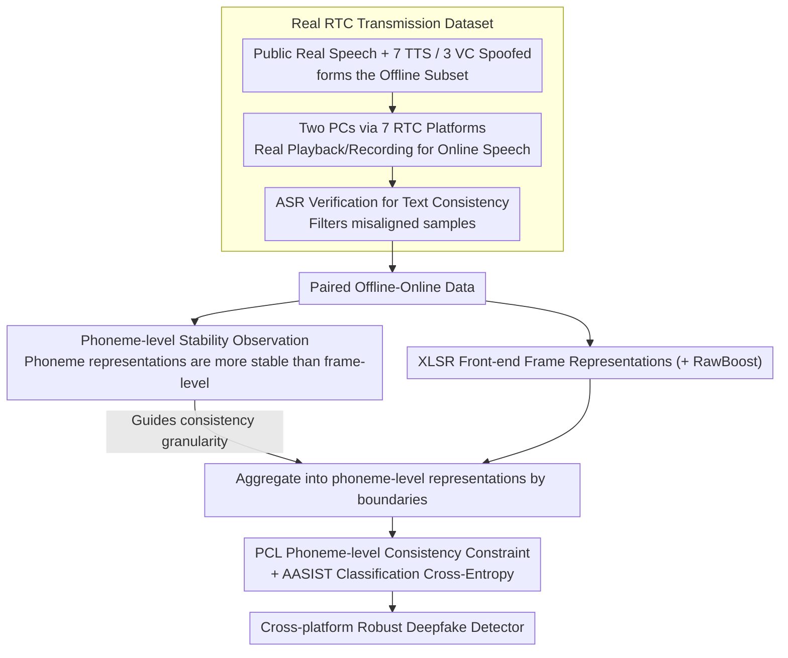

# RTCFake: Speech Deepfake Detection in Real-Time Communication

**Conference**: ACL2026  
**arXiv**: [2604.23742](https://arxiv.org/abs/2604.23742)  
**Code**: https://huggingface.co/datasets/JunXueTech/RTCFake  
**Area**: AI Security / Speech Deepfake Detection / Real-Time Communication Security  
**Keywords**: Audio Deepfake Detection, Real-Time Communication, Cross-platform Generalization, Phoneme Consistency, EER

## TL;DR
RTCFake constructs a ~600-hour speech deepfake detection dataset targeting real-world Real-Time Communication (RTC) platforms and proposes Phoneme-guided Consistency Learning (PCL). This method reduces the average EER of XLSR+AASIST from 7.33% (mixed training) to 5.81% across offline, online, cross-platform, and unseen noise scenarios.

## Background & Motivation
**Background**: Speech deepfake detection has seen developments with datasets like ASVspoof, ADD, DFADD, CodecFake, SpeechFake, and SpoofCeleb. Common methodologies employ handcrafted acoustic features, end-to-end detectors, self-supervised speech representations (SSL), and graph attention backends like AASIST.

**Limitations of Prior Work**: Many datasets primarily simulate offline or isolated distortions, such as codec compression, MP3, or noisy environments. However, RTC platforms like Zoom, WeChat, QQ, DingTalk, and Lark involve black-box processing chains including noise suppression, echo cancellation, automatic gain control (AGC), codecs, network jitter, and packet loss. These coupled distortions alter fine-grained artifacts in spoofed speech, causing detectors trained offline to fail significantly in real call environments.

**Key Challenge**: Speech deepfake detection relies on frame-level details, yet RTC systems strongly perturb these local acoustic details. Conversely, platforms strive to preserve semantic intelligibility. Consequently, frame-level features are unstable, while semantic structures remain relatively stable.

**Goal**: Ours aims to provide a dataset transmitted through mainstream RTC platforms and design a training strategy that enables detection models to learn representations stable across offline/online, cross-platform, and unseen noise conditions.

**Key Insight**: Through paired offline-online speech analysis, it was observed that phoneme-level representations exhibit higher similarity and lower variance before and after transmission compared to frame-level representations. Thus, phoneme boundaries serve as stable anchors to constrain consistency between offline and online representations during training.

**Core Idea**: Instead of relying solely on frame-level spoofing traces that are easily erased by RTC black-box processing, the model is guided toward semantically structured representations that are more stable across platforms via phoneme-level consistency.

## Method

### Overall Architecture
RTCFake consists of two components: a dataset under real transmission conditions and a training method leveraging the paired offline-online structure of this dataset. The work focuses on detection and robustness evaluation. On the data side, real speech is collected from public corpora, and spoofed speech is synthesized using 7 TTS and 3 VC systems to form the offline subset. These are then played/recorded via two independent PCs across mainstream RTC platforms to generate online speech, with ASR used to verify text consistency and filter out misaligned samples. On the methodological side, XLSR+AASIST serves as the detector (XLSR for front-end representation, AASIST for back-end classification, and RawBoost for robustness), augmented by Phoneme-guided Consistency Learning (PCL). During training, paired offline and online speech are fed simultaneously; frame representations are aggregated into phoneme-level representations based on phoneme boundaries to enforce consistency.

### Key Designs
**1. Real RTC Transmission Dataset: Replacing Simulated Distortions with Real Platform Capture**

Existing benchmarks mostly simulate offline or single distortions (codec, MP3, noise), which fail to replicate the non-linear black-box processing (noise reduction, echo cancellation, AGC, jitter/loss coupling) within platforms like Zoom, WeChat, and QQ. This leads to distribution shifts where offline-trained detectors fail. RTCFake transmits spoofed speech through seven platforms (Zoom, QQ, WeChat, DingTalk, Lark, VooV, Telegram) to obtain strictly paired online speech. The dataset totals ~600 hours across 307 speakers, including held-out platforms and noise conditions for evaluation.

**2. Phoneme-level Stability Observation: Selecting the Right Granularity for Consistency**

This observation determines the layer at which PCL should operate. The authors compared frame-level and phoneme-level representation similarity before and after transmission using paired data. Phoneme-level representations showed higher mean similarity and lower variance, indicating that while RTC platforms perturb fine acoustic textures, they preserve semantic intelligibility. Conclusion: while frame-level artifacts are useful for detection, they are unstable in RTC; phoneme-level aggregation filters transient perturbations and provides a reliable cross-platform anchor.

**3. Phoneme-guided Consistency Learning: Explicit Training Constraints for Cross-platform Stability**

Simply mixing offline and online samples for training only passively mitigates distribution shifts. PCL uses a phoneme recognition model to obtain boundaries and performs average pooling of frame representations within the same phoneme to obtain offline representation $p^{(a)}$ and online representation $p^{(b)}$. The training objective minimizes the mean cross-entropy of both branches plus $\lambda \mathcal{L}_{pcl}$, where $\mathcal{L}_{pcl}$ is the phoneme-level MSE consistency loss. This preserves discriminative power from the front-end while explicitly supervising the model to converge toward stable semantic representations.

### Loss & Training
The experiments use XLSR+AASIST with 16 kHz audio input, Adam optimizer, learning rate $1\times 10^{-6}$, and weight decay $1\times 10^{-4}$. Training lasts up to 100 epochs with early stopping after 10 epochs of no improvement. Classification uses Cross-Entropy, and PCL uses MSE consistency constraints. The evaluation metric is Equal Error Rate (EER).

## Key Experimental Results

### Main Results
The main table compares models trained on public datasets, RTCFake offline sets, online sets, mixed sets, and PCL. EERs for public datasets migrated to RTC conditions are generally high, proving existing benchmarks are insufficient for real communication distributions.

| Training Data / Method | Offline EER | Online P01 | Online P02 | Online P05 | Online P07 | All Avg EER | Conclusion |
|-----------------|-------------|------------|------------|------------|------------|-------------|------|
| ASVspoof2019 | 51.15 | 54.68 | 29.70 | 48.23 | 49.40 | 50.28 | Nearly ineffective under real RTC |
| SpoofCeleb | 29.56 | 40.05 | 30.70 | 32.48 | 38.55 | 34.06 | In-the-wild data is not equivalent to RTC |
| Off | 5.42 | 6.79 | 20.40 | 16.07 | 13.79 | 9.60 | Good offline, significant online shift |
| On | 9.57 | 5.05 | 7.30 | 11.77 | 8.35 | 8.96 | Good online, but harms offline generalization |
| Mix | 6.09 | 4.93 | 8.85 | 11.65 | 8.57 | 7.33 | Mixed training is more balanced |
| PCL | 4.84 | 3.79 | 6.24 | 10.17 | 6.77 | 5.81 | Best overall EER |

Under unseen noise conditions, PCL is the most stable, achieving 3.88% EER on clean-only S01 and consistently lower EER than Off, On, and Mix on unseen noises (S02/S03/S04/S06/S07).

### Ablation Study

| Configuration | Average EER | Description |
|------|----------|------|
| Phoneme Features Only + FCL | 8.34 | Frame-level consistency on phoneme features is weak |
| Phoneme Features Only + PCL | 7.52 | Phoneme consistency is superior to frame consistency |
| Frame Features + FCL | 6.55 | Frame features still provide a strong detection basis |
| Frame Features + PCL | 5.81 | Preserves fine-grained details while stabilizing via phoneme constraints |

### Key Findings
- RTCFake demonstrates that distribution shifts caused by real communication platforms are not covered by traditional datasets. Models trained on public datasets show EERs in the 30%-50% range under RTC conditions.
- Offline and online training exhibit respective biases: Off performs well offline but degrades online; On is strong online but degrades offline. Mix is more balanced but lacks stability.
- PCL reduces the All Avg EER from 7.33% (Mix) to 5.81%, showing superior stability across platforms and noise, confirming that phoneme-level anchors mitigate representation drift caused by RTC black-box processing.

## Highlights & Insights
- The dataset contribution is highly practical. Unlike papers validating only on simulated distortions, RTCFake uses paired online speech from mainstream platforms, reflecting deployment environments.
- A critical observation: RTC platforms prioritize semantic intelligibility at the expense of local acoustic details. Thus, "phoneme-level stability and frame-level drift" is a sound inductive bias.
- PCL acts as a training constraint without modifying the detector backbone, suggesting it can serve as a universal plug-in for other speech deepfake detection frameworks.
- Insights for AI security: Robustness evaluation must cover black-box post-processing in real pipelines. Over-reliance on clean or simple codec scenarios leads to overestimating reliability.

## Limitations & Future Work
- While using real platforms, the data does not yet fully cover variations in end-user devices, microphone/speaker differences, room acoustics, or diverse user behaviors.
- PCL still shows performance gaps under extreme unseen noise or aggressive platform non-linearities, indicating phoneme-level consistency is not a panacea.
- Generalization needs verification across more front-ends, back-ends, and multilingual detection models beyond XLSR+AASIST.
- Synthetically generated sources (7 TTS, 3 VC) need continuous expansion to keep pace with rapidly evolving generative models.

## Related Work & Insights
- **vs ASVspoof / ADD**: These benchmarks are essential for standardized evaluation, but RTCFake focuses on black-box transmission shifts in real platforms.
- **vs CodecFake**: CodecFake emphasizes codec-related artifacts. RTCFake covers a broader scope, including the coupling of noise reduction, echo cancellation, gain, and transmission links.
- **vs SpoofCeleb / FakeSpeechWild**: In-the-wild data covers public video or ambient noise but lacks the paired offline-online structure required to analyze transmission-induced representation changes specifically.
- **vs Standard Mixed Training**: Mix simply aggregates samples, whereas PCL utilizes the paired structure to explicitly constrain stable representations, leading to better cross-platform and noise robustness.

## Rating
- Novelty: ⭐⭐⭐⭐☆ The dataset scenario is precisely targeted; the PCL method is elegant and aligns well with the observed stability of RTC representations.
- Experimental Thoroughness: ⭐⭐⭐⭐☆ Platforms, noise, training sources, and ablations are comprehensive, though backbone coverage could be broader.
- Writing Quality: ⭐⭐⭐⭐☆ Data construction, distortion motivation, and EER results are clear.
- Value: ⭐⭐⭐⭐⭐ Highly valuable for real-time conferencing, online authentication, and speech security deployment; emphasizes the necessity of validation under real transmission conditions.

<!-- RELATED:START -->

## Related Papers

- [\[ACL 2026\] HCFD: A Benchmark for Audio Deepfake Detection in Healthcare](hcfd_a_benchmark_for_audio_deepfake_detection_in_healthcare.md)
- [\[ACL 2026\] XLSR-MamBo: Scaling the Hybrid Mamba-Attention Backbone for Audio Deepfake Detection](xlsr-mambo_scaling_the_hybrid_mamba-attention_backbone_for_audio_deepfake_detect.md)
- [\[NeurIPS 2025\] VITA-1.5: Towards GPT-4o Level Real-Time Vision and Speech Interaction](../../NeurIPS2025/audio_speech/vita-15_towards_gpt-4o_level_real-time_vision_and_speech_interaction.md)
- [\[ACL 2026\] Analyzing Reasoning Shifts in Audio Deepfake Detection under Adversarial Attacks: The Reasoning Tax versus Shield Bifurcation](analyzing_reasoning_shifts_in_audio_deepfake_detection_under_adversarial_attacks.md)
- [\[ACL 2026\] Semi-Supervised Diseased Detection from Speech Dialogues with Multi-Level Data Modeling](semi-supervised_diseased_detection_from_speech_dialogues_with_multi-level_data_m.md)

<!-- RELATED:END -->
