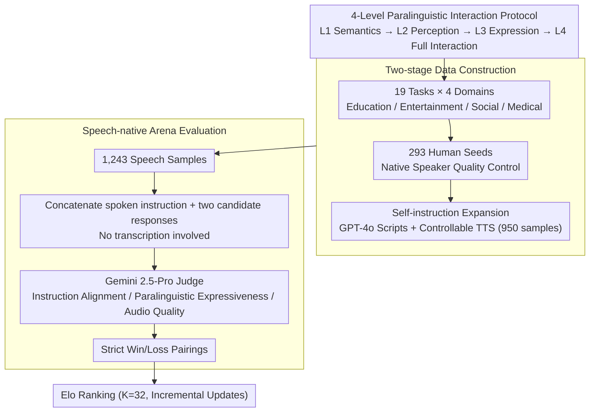

# S2S-Arena: Evaluating Paralinguistic Instruction Following in Speech-to-Speech Models

**Conference**: ACL2026  
**arXiv**: [2503.05085](https://arxiv.org/abs/2503.05085)  
**Code**: https://github.com/FreedomIntelligence/S2S-Arena  
**Area**: Speech Interaction / Speech-to-Speech Models / Evaluation Benchmark  
**Keywords**: Speech-to-Speech, Paralinguistic Information, Arena Evaluation, Elo, Instruction Following

## TL;DR
S2S-Arena proposes a benchmark to evaluate S2S models directly in the speech modality. Utilizing a four-level paralinguistic interaction protocol, 1,243 speech samples, and 1,001 pairwise comparisons, it reveals significant gaps in current systems regarding complex tone, emotion, speaking style, and expressive control.

## Background & Motivation
**Background**: LLMs have propelled speech-to-speech systems from cascaded ASR→LLM→TTS architectures toward unified speech interaction models. Representative systems include GPT-4o-realtime, Qwen2.5-Omni, GLM-4-Voice, Kimi-Audio, LLaMA-Omni, and Mini-Omni.

**Limitations of Prior Work**: Many speech benchmarks still evaluate models by converting outputs back to text or only focus on speech understanding tasks. This discards paralinguistic information such as prosody, emotion, speaker traits, and speaking style, which are crucial for natural, empathetic, and context-aware S2S interaction.

**Key Challenge**: Real speech interaction requires both semantic correctness and the ability of the model to perceive input tones and express appropriate speech attributes in the output. Textual evaluation can measure semantics but fails to assess whether a response "sounds human," has the "correct tone," or "complies with expressive instructions."

**Goal**: The authors aim to establish a speech-native benchmark where S2S models undergo pairwise comparison at the level of speech input and output, systematically evaluating semantic understanding and paralinguistic expressive capabilities.

**Key Insight**: S2S-Arena designs a four-level interaction protocol, increasing difficulty from pure semantic instructions to full paralinguistic interaction. It expands data using human seeds combined with speech-native self-instruction and utilizes Gemini 2.5-Pro as an automated speech judge highly consistent with humans.

**Core Idea**: Upgrade S2S evaluation from "whether the transcript is correct" to "whether the speech interaction itself satisfies semantic and paralinguistic instructions," using Arena Elo rankings for continuous model comparison.

## Method
The contribution of S2S-Arena is an original speech-native evaluation system rather than a new model: it defines a difficulty-stratified task protocol, constructs corresponding speech samples, validates an automated judge consistent with humans, and ranks multiple S2S systems through pairwise comparisons.

### Overall Architecture
The process is divided into data construction and evaluation tracks. For data, the authors organize 19 representative tasks across four domains (Education, Entertainment, Social, Medical) based on the 4-level protocol. Human seeds consist of scripts, dubbing, recordings, and high-quality corpora. These are expanded to 1,243 samples using GPT-4o for scripts and controllable TTS (Doubao-TTS, AudioX, Parler-TTS) for synthesis. For evaluation, the system avoids transcription: spoken instructions and two candidate spoken responses are concatenated and fed to the judge, which evaluates preference based on instruction alignment, paralinguistic expressiveness, and output audio quality. Results are used to update Elo rankings.

### Key Designs

**1. 4-Level Paralinguistic Interaction Protocol: Segmenting "Speech Capability" into Locatable Gradients**
Many models appear competent under simple semantic instructions, but bottlenecks reside in harder paralinguistic levels. The protocol splits tasks into four escalating tiers: L1 tests semantic instruction execution; L2 requires perceiving paralinguistic cues (age, emotion, style) from input to adjust semantic answers; L3 allows neutral input but requires specific output attributes (speed, emotion, style); L4 requires both "understanding input paralinguistic cues" and "generating matching expressions." This gradient precisely identifies where a model fails—whether in semantic understanding, acoustic perception, or expressive generation.

**2. Two-stage Data Construction: Balancing Human Quality and Automated Scale**
Manual collection is costly, while fully automated generation risks drifting in difficulty and attributes. Seed data consists of 293 human-vetted samples covering all 19 tasks, checked by four native speakers. The augmentation phase uses few-shot self-instruction to generate 950 samples, expanding to 100+ task variations. Random manual verification confirmed high quality: 90% difficulty level consistency and 93% paralinguistic attribute consistency.

**3. Speech-native Arena Evaluation: Replacing Missing References with Relative Preferences**
Speech generation quality lacks a unique "correct" answer, and metrics like BLEU or WER cannot measure human-likeness. Thus, pairwise preference is used. All models start with an Elo of 1000, updated via the standard formula with $K=32$. Only strict win/loss outcomes are recorded (no ties). Sampling favors pairs with moderate rating gaps to maximize information gain per comparison. The Elo framework naturally supports incremental updates for future models.

### Loss & Training
Ours does not train the evaluated models; the primary selection involves the automated judge. On the seed set, 19 human annotators were compared against Gemini 2.5-Pro and Qwen2.5-Omni. Gemini 2.5-Pro demonstrated higher human agreement and was chosen for large-scale evaluation.

## Key Experimental Results

### Main Results
The consistency of the automated judge with humans was first verified. Gemini 2.5-Pro significantly outperformed Qwen2.5-Omni.

| Automated Judge | Cohen's kappa | Agreement | Description |
|----------|---------------|-----------|------|
| Gemini 2.5-Pro | 0.6553 | 82.87% | Substantial agreement with humans |
| Qwen2.5-Omni | 0.4667 | 73.15% | Lower consistency |

The authors then conducted 1,001 pairwise comparisons among 10 S2S systems. Industrial models lead overall, while academic models show larger gaps in complex paralinguistic tasks.

| Model | Elo | Win Rate | W/L | Matches | Observation |
|------|-----|----------|-----|---------|------|
| Qwen 2.5-Omni | 1246.1 | 59.0% | 134/93 | 227 | 1st in total Elo |
| GPT-4o-realtime | 1239.2 | 65.7% | 140/73 | 213 | Most wins, reliable semantics |
| Doubao | 1211.9 | 67.9% | 133/63 | 196 | Highest win rate, strong expressiveness |
| GLM-4-Voice | 1148.2 | 58.3% | 119/85 | 204 | Upper-middle tier |
| FunAudioLLM | 1188.3 | 51.0% | 128/123 | 251 | Strong in entertainment/social scenarios |
| Kimi-Audio | 1056.7 | 49.3% | 142/146 | 288 | Middle tier |
| LLaMA-Omni | 908.7 | 44.4% | 68/85 | 153 | Strongest academic system |
| Mini-Omni2 | 727.4 | 33.1% | 59/119 | 178 | Inadequate complex expression |
| SpeechGPT | 677.1 | 27.3% | 42/112 | 154 | Lower tier |
| Mini-Omni | 676.4 | 26.1% | 36/102 | 138 | Lower tier |

### Ablation Study
Rather than traditional ablation, capability differences were analyzed across task areas and difficulty levels.

| Model | Education | Entertainment | Medical | Social | Average | Observation |
|------|-----------|---------------|---------|--------|------|------|
| GPT-4o-realtime | 1230.2 | 1166.8 | 1124.4 | 1056.6 | 1144.5 | Strong in knowledge tasks |
| Doubao | 1214.5 | 1144.6 | 1055.7 | 1133.0 | 1136.9 | Strong in expression/naturalness |
| Qwen 2.5-Omni | 1096.7 | 1097.0 | 1056.0 | 1155.9 | 1101.4 | Highest in Social |
| FunAudioLLM | 999.3 | 1105.9 | 876.2 | 1123.3 | 1026.2 | Ent./Social > Medical |
| LLaMA-Omni | 922.3 | 1004.6 | 948.3 | 913.6 | 947.2 | Competitive academic model |

| Model | L1 | L2 | L3 | L4 | Average | Structural Insight |
|------|----|----|----|----|------|----------|
| GPT-4o-realtime | 1064.4 | 1199.2 | 1241.7 | 1071.3 | 1144.2 | Strongest in high-difficulty expression |
| Doubao | 1029.5 | 1163.7 | 1148.2 | 1205.8 | 1136.8 | Strongest in L4 full interaction |
| Qwen 2.5-Omni | 1072.2 | 1109.1 | 1136.2 | 1123.0 | 1110.1 | Stable via Whisper + flow matching |
| LLaMA-Omni | 977.7 | 965.2 | 920.2 | 942.4 | 951.4 | L1 is fair; L3/L4 significantly lag |
| Mini-Omni | 985.8 | 803.0 | 769.8 | 835.7 | 848.6 | Small backbone/encoder limits paralinguistics |

### Key Findings
- Industrial systems lead overall but with different strengths: Qwen 2.5-Omni has the highest total Elo, GPT-4o-realtime has the most wins, and Doubao has the highest win rate and excels in L4.
- The gap between academic and industrial systems widens as task difficulty increases. While L1 gaps are manageable, academic models fall behind by over 300 Elo points at L3/L4.
- Architectural factors are critical: a strong LLM backbone benefits semantic instructions, a more powerful encoder (e.g., Whisper-large) enhances paralinguistic perception, and a flow-matching speech decoder is vital for expressive generation.

## Highlights & Insights
- This work addresses a blind spot in S2S evaluation: speech models must not only answer correctly after transcription but also "speak in an appropriate manner." This shift is vital for next-generation assistants.
- The four-level protocol provides diagnostic value, distinguishing whether a model understands semantics, perceives emotion, controls output style, or completes full paralinguistic interaction.
- The Arena format is well-suited for open-ended speech output. Pairwise preference is closer to user experience than BLEU, WER, or text-only LLM judges.
- Component analysis highlights technological paths: semantic capability, acoustic perception, and generative decoders influence different capability levels.

## Limitations & Future Work
- The scale of 1,243 samples is small relative to real-world interaction space, and augmented data relies on synthesis, which might favor models familiar with those distributions.
- Currently focuses on utterance-level or short-range interactions, lacking long-range persona consistency, temporal emotional shifts, and multi-turn discourse coherence.
- The automated judge may still have model bias, quality bias, or accent/language bias requiring continuous calibration.
- Speech evaluation involves privacy and misuse risks; although the study used anonymized settings, future open benchmarks need clear licensing and safety boundaries.

## Related Work & Insights
- **vs Dynamic-SUPERB / AudioBench / MMAU**: These focus on speech or audio understanding; S2S-Arena evaluates both understanding and paralinguistic expression in speech outputs.
- **vs VoiceBench / SD-Eval / Voxdialogue**: These are dialogue-focused but rely on textual evaluation; S2S-Arena compares directly in the speech modality.
- **vs Vstyle / AIR-Bench / Multivox**: These begin to focus on style or generation, but S2S-Arena provides a systematic L1-L4 difficulty design and Arena/Elo ranking.
- **Inspiration for Development**: Improving the LLM backbone is insufficient; S2S systems require stronger encoders for paralinguistic signals and more controllable decoders for expressing emotion, rhythm, and style.

## Rating
- Novelty: ⭐⭐⭐⭐☆ (Strong protocol design and speech-native approach)
- Experimental Thoroughness: ⭐⭐⭐⭐☆ (10 models and 1,001 comparisons are substantial but scale is limited)
- Writing Quality: ⭐⭐⭐⭐☆ (Clear structure and dense information)
- Value: ⭐⭐⭐⭐⭐ (Pushes the community from text correctness toward interaction quality and human alignment)

<!-- RELATED:START -->

## Related Papers

- [\[ICLR 2026\] ParaS2S: Benchmarking and Aligning Spoken Language Models for Paralinguistic-Aware Speech-to-Speech Interaction](../../ICLR2026/audio_speech/paras2s_benchmarking_and_aligning_spoken_language_models_for_paralinguistic-awar.md)
- [\[ICLR 2026\] EchoMind: An Interrelated Multi-level Benchmark for Evaluating Empathetic Speech Language Models](../../ICLR2026/audio_speech/echomind_an_interrelated_multi-level_benchmark_for_evaluating_empathetic_speech_.md)
- [\[ACL 2026\] An Exploration of Mamba for Speech Self-Supervised Models](an_exploration_of_mamba_for_speech_self-supervised_models.md)
- [\[ACL 2026\] VAPO: End-to-end Slide-Enhanced Speech Recognition with Omni-modal Large Language Models](vapo_end-to-end_slide-enhanced_speech_recognition_with_omni-modal_large_language.md)
- [\[CVPR 2026\] Vision-Speech Models: Teaching Speech Models to Converse about Images](../../CVPR2026/audio_speech/vision-speech_models_teaching_speech_models_to_converse_about_images.md)

<!-- RELATED:END -->
