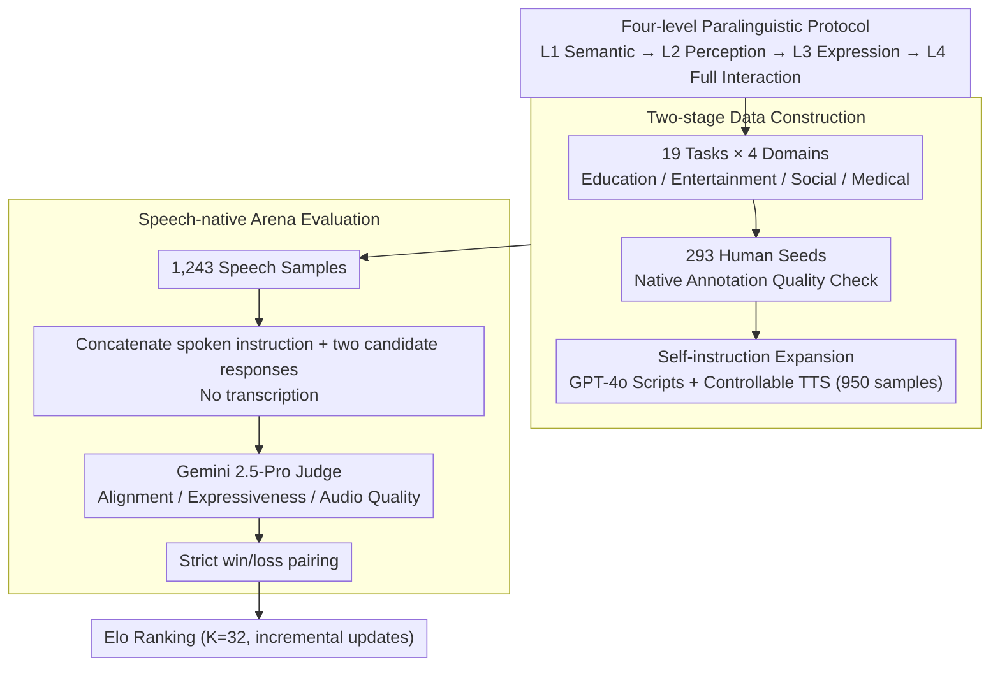

# S2S-Arena: Evaluating Paralinguistic Instruction Following in Speech-to-Speech Models

**Conference**: ACL2026  
**arXiv**: [2503.05085](https://arxiv.org/abs/2503.05085)  
**Code**: https://github.com/FreedomIntelligence/S2S-Arena  
**Area**: Speech Interaction / Speech-to-Speech Models / Evaluation Benchmark  
**Keywords**: Speech-to-Speech, Paralinguistic Information, Arena Evaluation, Elo, Instruction Following

## TL;DR
S2S-Arena proposes a benchmark to evaluate S2S models directly in the speech modality. Using a four-level paralinguistic interaction protocol, 1,243 speech samples, and 1,001 pairwise comparisons, it reveals significant performance gaps in current systems regarding complex tone, emotion, speaking style, and expressive control.

## Background & Motivation
**Background**: Driven by LLMs, speech-to-speech systems are evolving from ASR→LLM→TTS cascades toward unified speech interaction models. Representative systems include GPT-4o-realtime, Qwen2.5-Omni, GLM-4-Voice, Kimi-Audio, LLaMA-Omni, and Mini-Omni.

**Limitations of Prior Work**: Many speech benchmarks still convert model outputs to text for evaluation or focus solely on speech understanding tasks. This approach loses paralinguistic information such as prosody, emotion, speaker traits, and speaking style, which are crucial for natural, empathetic, and context-aware S2S interactions.

**Key Challenge**: Real-world speech interaction requires both semantic correctness and the ability for models to perceive input tone and express appropriate vocal attributes in the output. Text-based evaluation can measure semantics but fails to assess "whether it sounds human," "whether the tone is correct," and "whether the expression follows instructions."

**Goal**: The authors aim to establish a speech-native benchmark where S2S models undergo pairwise comparison at the speech input and output levels to systematically evaluate semantic understanding and paralinguistic expressiveness.

**Key Insight**: S2S-Arena designs a four-level interaction protocol that increases in difficulty from pure semantic instructions to full paralinguistic interaction. It expands data through human seeds combined with speech-native self-instruction and utilizes Gemini 2.5-Pro as an automated speech judge aligned with human judgment.

**Core Idea**: Upgrade S2S evaluation from "whether the transcribed text is correct" to "whether the speech interaction itself satisfies semantic and paralinguistic instructions," utilizing an arena Elo ranking for continuous model comparison.

## Method
The contribution of S2S-Arena is not a new model, but a speech-native evaluation system: defining difficulty-stratified task protocols, constructing paired speech samples, validating an automated judge aligned with humans, and ranking S2S systems through pairwise comparisons.

### Overall Architecture
The workflow follows two tracks: data and evaluation. For data, the authors organize 19 representative tasks across four domains (Education, Entertainment, Social, Medical) based on the four-level protocol. The process starts with human seeds (scripts, voice acting, and high-quality corpora), followed by self-instruction expansion using GPT-4o for scripts and controllable TTS (Doubao-TTS, AudioX, Parler-TTS) for synthesis, resulting in 1,243 speech samples. For evaluation, the system avoids transcription: spoken instructions and two candidate spoken responses are concatenated into audio and fed to the judge. The judge evaluates them across three dimensions: instruction alignment, paralinguistic expressiveness, and output audio quality, with win/loss results updated in the Elo rankings.

### Key Designs

**1. Four-level Paralinguistic Interaction Protocol: Segmenting Ambiguous "Speech Capability" into Locatable Capability Gradients**

Many models appear functional on simple semantic instructions, but bottlenecks are hidden in harder paralinguistic levels. The protocol breaks tasks into four tiers: L1 tests semantic instruction execution; L2 requires perceiving paralinguistic cues (age, emotion, style) from input speech to adjust the answer; L3 allows neutral input but requires outputting specific speeds, emotions, or styles; L4 requires both "understanding input paralinguistic cues" and "generating matching expressions." This gradient allows the benchmark to identify whether a model fails at semantic understanding, acoustic perception, expressive generation, or full interaction.

**2. Two-stage Data Construction: Balancing Human Quality with Automated Scale**

Complete human collection is too costly, while complete automated generation risks drifting in difficulty and paralinguistic attributes. Thus, data is split. The Seed section contains 293 human-vetted samples covering all 19 tasks, quality-checked by four native Chinese annotators. The Augment section uses few-shot self-instruction to generate 950 samples, expanding to over 100 task variations. To ensure no distortion in expansion, the authors performed manual verification on random samples, finding a 90% difficulty level consistency and 93% paralinguistic consistency, indicating the seed task structures were preserved.

**3. Speech-native Arena Evaluation: Replacing Missing Reference Answers with Relative Preference**

Speech generation quality often lacks a single "correct" answer, and metrics like BLEU or WER cannot measure human-likeness. Thus, the evaluation uses pairwise preference. All models start with an Elo of 1000, updated after each comparison using the standard Elo formula with $K=32$. Matches only record strict win/loss without ties. Pairing is not uniform; it favors combinations with medium rating gaps to avoid uninformative landslide victories or indistinguishable matches. The Elo framework naturally supports incremental updates for future models.

### Loss & Training
This paper does not train the evaluated models; the only "selection" required is the automated judge. The authors compared 19 human annotators against Gemini 2.5-Pro and Qwen2.5-Omni on the Seed set, finding that Gemini 2.5-Pro had higher alignment with humans, thus selecting it for large-scale augmentation evaluation.

## Key Experimental Results

### Main Results
First, the alignment between automated judges and humans was verified. Gemini 2.5-Pro significantly outperformed Qwen2.5-Omni, leading to its selection for large-scale ranking.

| Automated Judge | Cohen's kappa | Agreement | Note |
|-----------------|---------------|-----------|------|
| Gemini 2.5-Pro  | 0.6553        | 82.87%    | Highly consistent with humans |
| Qwen2.5-Omni    | 0.4667        | 73.15%    | Lower consistency |

The authors then conducted 1,001 pairwise comparisons across 10 S2S systems. Industrial models lead overall, while academic models show larger gaps in complex paralinguistic tasks.

| Model            | Elo    | Win Rate | W/L     | Matches | Observation |
|------------------|--------|----------|---------|---------|-------------|
| Qwen 2.5-Omni    | 1246.1 | 59.0%    | 134/93  | 227     | Highest overall Elo |
| GPT-4o-realtime  | 1239.2 | 65.7%    | 140/73  | 213     | Most wins, reliable semantics |
| Doubao           | 1231.9 | 67.9%    | 133/63  | 196     | Highest win rate, strong expressiveness |
| GLM-4-Voice      | 1148.2 | 58.3%    | 119/85  | 204     | Upper-middle tier |
| FunAudioLLM      | 1088.3 | 51.0%    | 128/123 | 251     | Strong in Ent./Social scenes |
| Kimi-Audio       | 1056.7 | 49.3%    | 142/146 | 288     | Middle tier |
| LLaMA-Omni       | 908.7  | 44.4%    | 68/85   | 153     | Strongest academic system vs industrial |
| Mini-Omni2       | 727.4  | 33.1%    | 59/119  | 178     | Insufficient complex expression |
| SpeechGPT        | 677.1  | 27.3%    | 42/112  | 154     | Lower tier |
| Mini-Omni        | 676.4  | 26.1%    | 36/102  | 138     | Lower tier |

### Ablation Study
The paper analyzes system capability differences across task categories and difficulty levels.

| Model            | Education | Entertainment | Medical | Social | Average | Observation |
|------------------|-----------|---------------|---------|--------|---------|-------------|
| GPT-4o-realtime  | 1230.2    | 1166.8        | 1124.4  | 1056.6 | 1144.5  | Strong in knowledge tasks |
| Doubao           | 1214.5    | 1144.6        | 1055.7  | 1133.0 | 1136.9  | Strong in conversational naturalness |
| Qwen 2.5-Omni    | 1096.7    | 1097.0        | 1056.0  | 1155.9 | 1101.4  | Highest in social scenarios |
| FunAudioLLM      | 999.3     | 1105.9        | 876.2   | 1123.3 | 1026.2  | Ent./Social better than Medical |
| LLaMA-Omni       | 922.3     | 1004.6        | 948.3   | 913.6  | 947.2   | Strong among academic models |

| Model            | L1     | L2     | L3     | L4     | Average | Structural Observation |
|------------------|--------|--------|--------|--------|---------|------------------------|
| GPT-4o-realtime  | 1064.4 | 1199.2 | 1241.7 | 1071.3 | 1144.2  | Strong in difficult expression |
| Doubao           | 1029.5 | 1163.7 | 1148.2 | 1205.8 | 1136.8  | Best in L4 full interaction |
| Qwen 2.5-Omni    | 1072.2 | 1109.1 | 1136.2 | 1123.0 | 1110.1  | Steady with flow matching |
| LLaMA-Omni       | 977.7  | 965.2  | 920.2  | 942.4  | 951.4   | L1 okay, L3/L4 lag behind |
| Mini-Omni        | 985.8  | 803.0  | 769.8  | 835.7  | 848.6   | Small backbones limit capability |

### Key Findings
- Industrial systems lead overall, but in different ways: Qwen 2.5-Omni has the highest Elo, GPT-4o-realtime has the most wins, and Doubao has the highest win rate and excels at L4.
- The gap between academic and industrial systems widens as difficulty increases. While L1 semantic gaps are modest, the difference can exceed 300 Elo in L3/L4 expressive tasks.
- Architecture matters significantly: strong backbones benefit semantic instructions, powerful encoders like Whisper-large aid paralinguistic perception, and flow-matching speech decoders are critical for expressive generation.

## Highlights & Insights
- This paper addresses a blind spot in S2S evaluation: speech models should not only answer correctly after transcription but also "say it in an appropriate way." This shift is crucial for next-gen voice assistants.
- The four-level protocol is highly diagnostic, distinguishing whether a model understands semantics, perceives emotion, controls output style, or manages full paralinguistic interaction.
- The Arena format is well-suited for open-ended speech output. Pairwise preference is closer to user experience than BLEU, WER, or text-LLM judges.
- Comparative analysis points out technical route differences: semantic capability, acoustic perception, and generative decoders each impact different levels, providing more informative insights than a flat leaderboard.

## Limitations & Future Work
- The scale of 1,243 samples is still small compared to real-world interaction space, and augmented data relies on synthetic speech, potentially favoring models suited to that distribution.
- Current work focuses on utterance-level interactions, lacking coverage for long-range persona consistency, long-term emotional changes, and multi-turn discourse coherence.
- Although the automated judge aligns well with humans, it may still harbor biases regarding model preferences, audio quality, or accents/languages, requiring continuous calibration.
- Speech evaluation involves privacy risks; though this study uses anonymized and controlled settings, future open benchmarks need clear licensing and safety boundaries.

## Related Work & Insights
- **vs Dynamic-SUPERB / AudioBench / MMAU**: These focus on speech understanding; S2S-Arena evaluates both understanding and paralinguistic expression in output.
- **vs VoiceBench / SD-Eval / Voxdialogue**: These are closer to dialogue evaluation but rely on text-based metrics; S2S-Arena compares directly in the speech modality.
- **vs Vstyle / AIR-Bench / Multivox**: These focus on style or speech generation, but S2S-Arena provides a systematic L1-L4 difficulty design and supports continuous ranking via Elo.
- **Insights for Model Dev**: Improving LLM backbones alone is insufficient; S2S systems require stronger speech encoders to capture paralinguistic signals and more controllable speech decoders for emotion, rhythm, and style.

## Rating
- Novelty: ⭐⭐⭐⭐☆ Specific focus on paralinguistic protocols and speech-native arena.
- Experimental Thoroughness: ⭐⭐⭐⭐☆ Good range of models and analysis, though sample scale is limited.
- Writing Quality: ⭐⭐⭐⭐☆ Clear structure and high information density.
- Value: ⭐⭐⭐⭐⭐ Highly valuable for shifting S2S evaluation from text correctness to interaction quality and human alignment.

<!-- RELATED:START -->

## Related Papers

- [\[ICLR 2026\] ParaS2S: Benchmarking and Aligning Spoken Language Models for Paralinguistic-Aware Speech-to-Speech Interaction](../../ICLR2026/audio_speech/paras2s_benchmarking_and_aligning_spoken_language_models_for_paralinguistic-awar.md)
- [\[ICML 2026\] CMI-RewardBench: Evaluating Music Reward Models with Compositional Multimodal Instruction](../../ICML2026/audio_speech/cmi-rewardbench_evaluating_music_reward_models_with_compositional_multimodal_ins.md)
- [\[ICLR 2026\] EchoMind: An Interrelated Multi-level Benchmark for Evaluating Empathetic Speech Language Models](../../ICLR2026/audio_speech/echomind_an_interrelated_multi-level_benchmark_for_evaluating_empathetic_speech_.md)
- [\[ACL 2026\] VAPO: End-to-end Slide-Enhanced Speech Recognition with Omni-modal Large Language Models](vapo_end-to-end_slide-enhanced_speech_recognition_with_omni-modal_large_language.md)
- [\[ACL 2026\] An Exploration of Mamba for Speech Self-Supervised Models](an_exploration_of_mamba_for_speech_self-supervised_models.md)

<!-- RELATED:END -->
