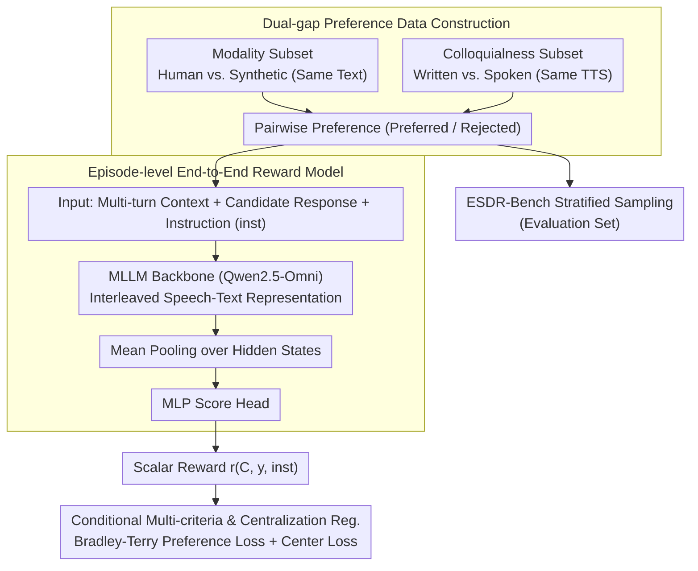

# SDiaReward: Modeling and Benchmarking Spoken Dialogue Rewards with Modality and Colloquialness

**Conference**: ACL2026  
**arXiv**: [2603.14889](https://arxiv.org/abs/2603.14889)  
**Code**: https://github.com/MM-Speech/SDiaReward/  
**Area**: Spoken Dialogue / Reward Model  
**Keywords**: Spoken Dialogue Evaluation, Preference Learning, Prosodic Naturalness, Colloquialness, Reward Model

## TL;DR
SDiaReward constructs a pairwise preference dataset and ESDR-Bench for multi-turn spoken dialogue, training an end-to-end speech reward model. This allows evaluation to transcend text semantics, simultaneously assessing the modality gap (prosody/emotion) and the colloquialness gap (natural spoken style).

## Background & Motivation
**Background**: End-to-end spoken dialogue systems are shifting from cascaded ASR+LLM+TTS architectures toward unified models that directly perceive and generate speech. Fields such as text dialogue and vision generation have extensively utilized reward models, RLHF, DPO, and preference learning to optimize behavior.

**Limitations of Prior Work**: Preferences in spoken dialogue are determined not only by textual content but also by prosody, emotion, pauses, speaking style, and turn-level coherence. Text-based reward models are blind to these signals; traditional automatic metrics and single-turn TTS evaluations fail to cover multi-turn interactions.

**Key Challenge**: Speech output must simultaneously satisfy semantic correctness, acoustic naturalness, conversational flow, and colloquial expression. General-purpose audio LLMs often prioritize semantics during zero-shot evaluation, recognizing textual style differences while failing to stably distinguish subtle prosody differences between human speech and high-quality synthetic speech.

**Goal**: The authors aim to establish an episode-level reward modeling framework that takes multi-turn speech episodes as input. By using pairwise preference supervision, they train a scalar reward model capable of evaluating modality-aware naturalness and colloquialness, supported by a reproducible benchmark.

**Key Insight**: The paper decomposes spoken dialogue evaluation into two distinct gaps: the modality gap, referring to paralinguistic information like prosody, emotion, and channel conditions; and the colloquialness gap, referring to the stylistic difference between written text and natural speech. Data construction is designed around these two gaps to create contrastive samples.

**Core Idea**: Training an end-to-end reward model using large-scale pairwise speech episode preference data, allowing the model to directly "hear" multi-turn contexts and candidate speech rather than evaluating discretized text transcripts.

## Method
SDiaReward formulates spoken dialogue evaluation as an end-to-end scalar scoring problem: instead of scoring a single utterance, it assigns a reward to a complete multi-turn context concatenated with a candidate final speech response, supported by a dual-gap preference dataset and a stratified ESDR-Bench.

### Overall Architecture
The model receives a multi-turn spoken dialogue context $\mathcal{C}$ and a candidate final response $y$, outputting a scalar $r_\theta(\mathcal{C}, y)$. Training is supervised using preference pairs, each containing a preferred episode and a rejected episode. Data sources include wild YouTube multi-party dialogues, MELD semi-natural acted dialogues, DailyTalk studio scripted speech, and LLM-rewritten dialogues in written vs. colloquial styles. For ESDR-Bench, the authors apply stratified sampling by source and metadata from the validation split to ensure balanced distribution. The dataset contains 13,356 pairs (11,630 training, 1,726 validation).

### Key Designs

**1. Dual-gap Preference Data Construction: Decoupling Naturalness and Style**

If text content or recording conditions are uncontrolled in preference pairs, models may learn shortcuts like "cleaner audio is better" instead of acoustic naturalness. The authors construct contrastive samples for two gaps. The modality-aware subset pairs human speech with synthetic speech (generated by SoulX-Podcast) using identical text, forcing the model to focus on paralinguistic differences like prosody and emotion. The colloquialness subset uses written dialogues rewritten into natural spoken versions (with fillers, fragmentation, etc.), both synthesized with the same TTS configuration to ensure the preference signal originates purely from style.

**2. Episode-level End-to-End Reward Model: Direct Perception of Multi-turn Speech**

Preference information in multi-turn speech is distributed across the context, response, and acoustic details. Relying on the final token or ASR transcripts is insufficient. The model employs a multimodal LLM backbone to project interleaved speech-text sequences into a joint space, extracting last-layer hidden states $\mathbf{H}=\{h_1,\ldots,h_L\}$. After comparing last-token, attention, and mean pooling, mean pooling was found to be the most stable for episode-level representation.

**3. Multi-criteria Conditioning and Center Regularization: Balancing Scales**

To handle both modality-aware and colloquialness criteria, a criterion-specific instruction is added to the input, making the reward $r_\theta(\mathcal{C}, y, inst)$. Training utilizes the Bradley-Terry preference objective. Since pairwise loss only constrains relative magnitude, domain differences across Wild, Semi-wild, and Scripted data can cause score offsets. A center loss is added to anchor the mean reward, improving calibration and training stability—crucial for downstream DPO/GRPO.

### Loss & Training
The primary loss is the Bradley-Terry preference loss: $\mathcal{L}_{pref}(\theta)=-\mathbb{E}[\log \sigma(r_\theta(\mathcal{C}^+,y^+)-r_\theta(\mathcal{C}^-,y^-))]$, requiring the reward of the preferred response to be higher than the rejected one, supplemented by center regularization to mitigate reward drift. The model is initialized from Qwen2.5-Omni with a linear score head. Audio is truncated or padded to 30 seconds.

## Key Experimental Results

### Main Results
The dataset covers four preference categories, with "Wild" data comprising the largest portion, though the benchmark uses stratified sampling to avoid dominance.

| Category | Train | Val | Total |
|----------|-------|-----|-------|
| Wild modality | 6,879 | 824 | 7,703 |
| Semi-Wild modality | 309 | 186 | 495 |
| Scripted modality | 2,192 | 466 | 2,658 |
| Colloquialness | 2,250 | 250 | 2,500 |
| Total | 11,630 | 1,726 | 13,356 |

On ESDR-Bench, SDiaReward-7B significantly outperforms general audio LLMs, specialized speech evaluators, and cascaded systems.

| Model | Modality Micro | Modality Macro | Colloq. Acc | Overall Micro | Overall Macro |
|-------|----------------|----------------|-------------|---------------|---------------|
| Gemini 2.5 Pro | 72.63 | 70.50 | 98.80 | 76.42 | 84.65 |
| GPT-4o Audio | 51.12 | 50.47 | 98.00 | 57.91 | 74.23 |
| Qwen 2.5 Omni 7B | 58.18 | 55.97 | 97.20 | 63.83 | 76.59 |
| SpeechJudge | 54.44 | 52.62 | 55.20 | 54.55 | 53.91 |
| AudioReasoner+Whisper+GPT-4o | 55.38 | 53.09 | 75.20 | 58.25 | 64.14 |
| SDiaReward 3B | 88.62 | 79.20 | 92.00 | 89.11 | 85.60 |
| SDiaReward 7B | 96.61 | 94.91 | 97.20 | 96.70 | 96.06 |

### Ablation Study
OOD TTS testing demonstrates that SDiaReward is not merely an artifact detector. While Wav2Vec2-DF dropped to 38.6% on CosyVoice 2, SDiaReward-7B maintained high accuracy across three unseen TTS engines.

| OOD Engine | Wav2Vec2-DF Acc | SDiaReward-3B Acc | SDiaReward-7B Acc | SDiaReward-7B rejected score |
|------------|-----------------|-------------------|-------------------|------------------------------|
| OpenAI TTS | 89.9% | 93.0% | 98.3% | -0.62 |
| CosyVoice 2 | 38.6% | 93.1% | 95.3% | -0.04 |
| FireRedTTS-2 | 94.5% | 72.7% | 90.9% | 0.29 |

Ablations on pooling and centralization show that mean pooling + center loss is the most stable configuration.

| Setting | Modality | Colloq. | Overall |
|---------|----------|---------|---------|
| 3B Last Hidden | 63.75 | 48.80 | 61.59 |
| 3B Attention | 87.94 | 93.60 | 88.76 |
| 3B Mean | 88.62 | 92.00 | 89.10 |
| 7B Last Hidden | 51.83 | 40.00 | 50.12 |
| 7B Attention | 70.60 | 55.20 | 68.37 |
| 7B Mean | 96.61 | 97.20 | 96.70 |
| 7B Mean w/o Center Loss | 95.05 | 97.20 | 95.37 |
| 7B Mean w/ Center Loss | 96.61 | 97.20 | 96.70 |

### Key Findings
- General audio judges are nearly saturated on colloquialness (e.g., Gemini 2.5 Pro at 98.80%) but perform poorly on modality micro (72.63%), indicating that while linguistic style is easy to judge, acoustic naturalness remains challenging.
- SDiaReward-7B achieves 96.61% modality micro accuracy, showing greater stability than the 3B model, which struggled on "Semi-wild" data (55.38%).
- Human verification yielded an 83.5%±4.3% weighted agreement on 75 stratified samples, with high-confidence samples reaching 88.3%.
- FireRedTTS-2 received a higher rejected score, suggesting the model recognizes its expressive quality rather than mechanically flagging it as synthetic, supporting "relative expressiveness evaluation."

## Highlights & Insights
- The paper accurately captures the essence of spoken dialogue rewards: it is a holistic experience involving turn-taking rhythm, emotion, pauses, and colloquial habits, not just "text + audio quality."
- The modality-aware pairing design effectively isolates paralinguistic naturalness by using identical text for human and synthetic speech.
- The use of identical TTS configurations for written vs. spoken versions in colloquialness pairing prevents audio quality from confounding style preferences.
- Center loss provides value beyond a 1.33% performance gain; it prevents reward scale drift across domains, which is vital for using the reward in DPO/GRPO generation training.

## Limitations & Future Work
- The current data is biased toward in-the-wild recordings; future work requires more high-quality acted speech and diverse synthesis engines to improve cross-domain robustness.
- Human verification was limited to 75 samples, which may not fully capture fine-grained subjective preferences or cultural differences.
- Reward models still exhibit domain-dependent offsets (e.g., lower absolute scores in Scripted data), suggesting the model learns intra-domain relative ranking rather than a global quality scale.
- Risk of "reward hacking" exists when applied to RL for speech generation, where the optimizer might exploit acoustic channels, tempo, or emotional intensity.

## Related Work & Insights
- **vs. SpeechJudge / SageLM**: These specialized evaluators focus on single-turn speech or TTS quality, whereas SDiaReward evaluates episode-level multi-turn dialogue preferences.
- **vs. WavReward / ParaS2S**: Earlier works often relied on handcrafted acoustic features; SDiaReward replaces brittle feature engineering with data-driven preference learning.
- **vs. Cascade Evaluator**: Cascade systems (e.g., AudioReasoner+Whisper+GPT-4o) handle colloquialness but fail on modality tasks because ASR removes prosodic and emotional nuances.
- **Insight**: Multi-modal reward models should control as many irrelevant variables as possible in preference pairs. Hard pairs using "same semantics, different modal realization" are effective for training perception-level rewards.

## Rating
- Novelty: ⭐⭐⭐⭐☆ Targeting modality and colloquialness gaps at the episode level is highly effective.
- Experimental Thoroughness: ⭐⭐⭐⭐⭐ Comprehensive results across OOD TTS, human verification, and ablations.
- Writing Quality: ⭐⭐⭐⭐☆ Clear structure; though some terms like "relative expressiveness" could be more formally defined.
- Value: ⭐⭐⭐⭐⭐ High utility for evaluating end-to-end spoken dialogue systems and subsequent RL alignment.

<!-- RELATED:START -->

## Related Papers

- [\[ACL 2026\] VoxMind: An End-to-End Agentic Spoken Dialogue System](voxmind_an_end-to-end_agentic_spoken_dialogue_system.md)
- [\[ICML 2026\] The Silent Thought: Modeling Internal Cognition in Full-Duplex Spoken Dialogue Models via Latent Reasoning](../../ICML2026/audio_speech/the_silent_thought_modeling_internal_cognition_in_full-duplex_spoken_dialogue_mo.md)
- [\[ACL 2026\] ZipVoice-Dialog: Non-Autoregressive Spoken Dialogue Generation with Flow Matching](zipvoice-dialog_non-autoregressive_spoken_dialogue_generation_with_flow_matching.md)
- [\[ICLR 2026\] ParaS2S: Benchmarking and Aligning Spoken Language Models for Paralinguistic-Aware Speech-to-Speech Interaction](../../ICLR2026/audio_speech/paras2s_benchmarking_and_aligning_spoken_language_models_for_paralinguistic-awar.md)
- [\[ICML 2025\] NTPP: Generative Speech Language Modeling for Dual-Channel Spoken Dialogue via Next-Token-Pair Prediction](../../ICML2025/audio_speech/ntpp_generative_speech_language_modeling_for_dual-channel_spoken_dialogue_via_ne.md)

<!-- RELATED:END -->
